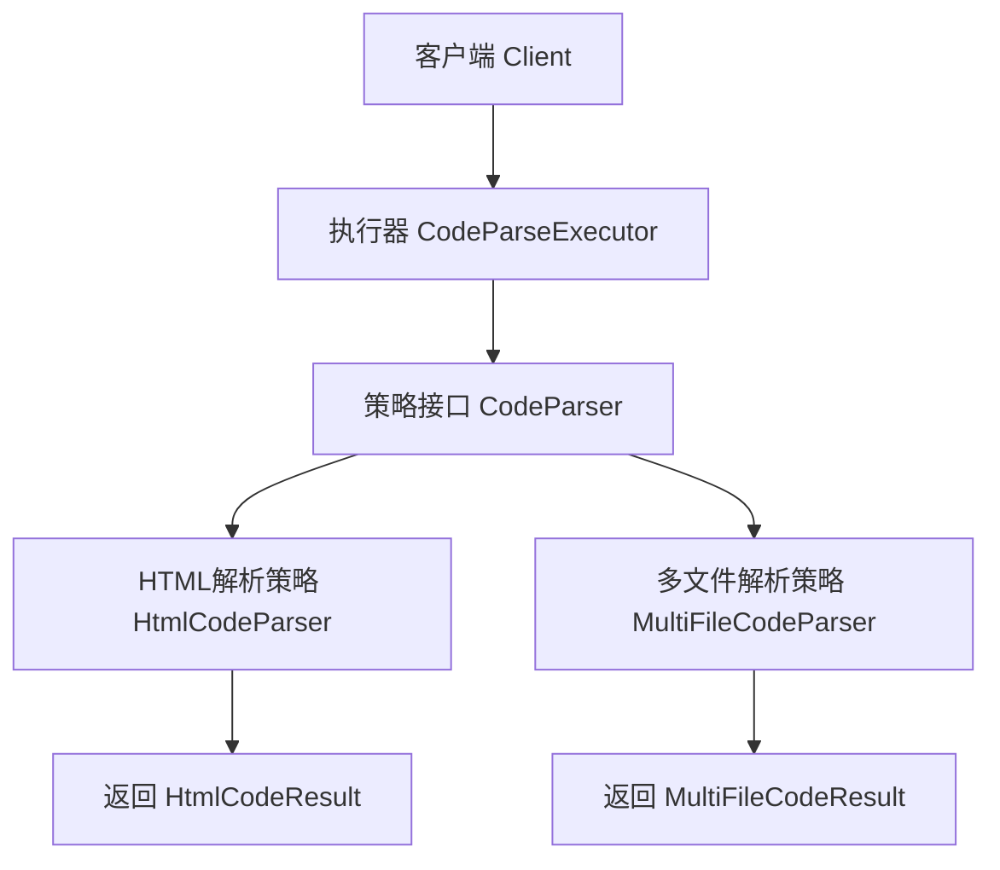
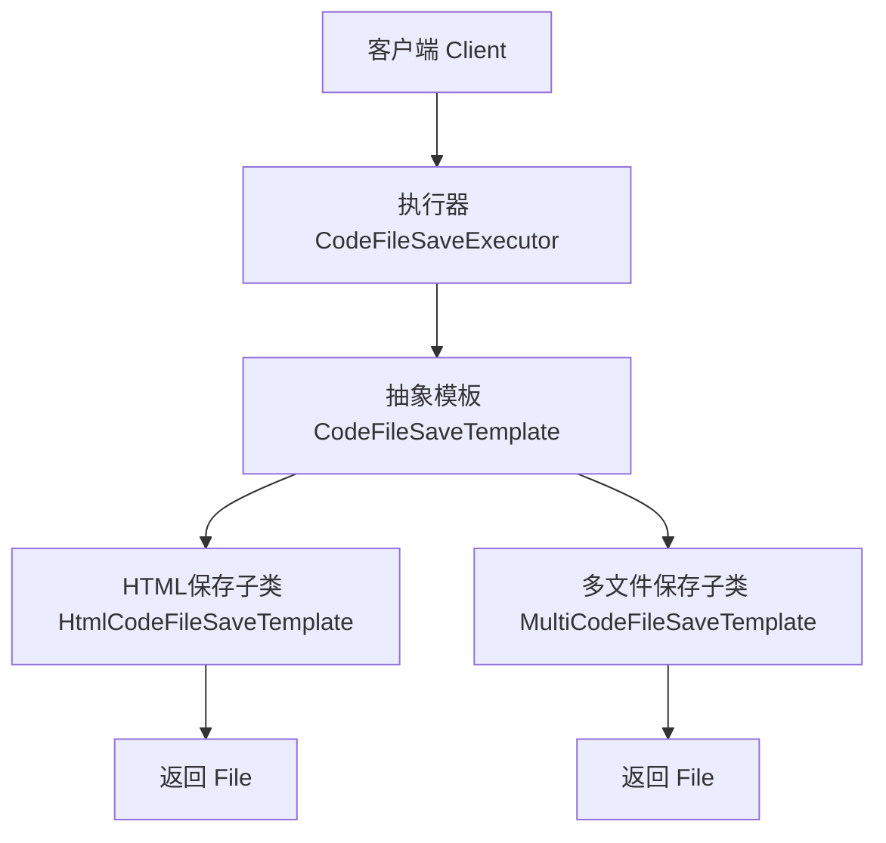
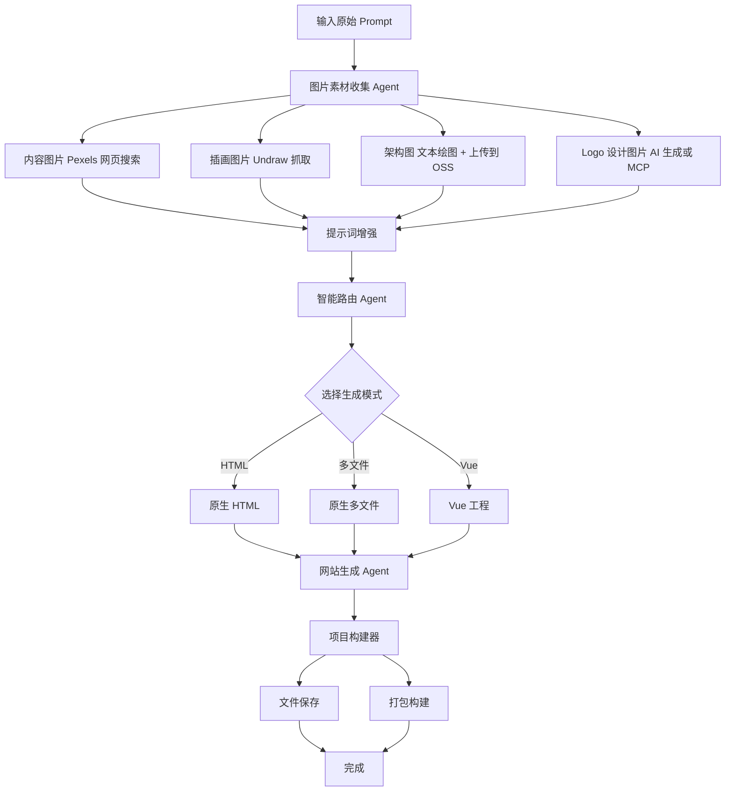

# 一、项目初始化

## 1、后端初始化

### 整合依赖

```xml
<?xml version="1.0" encoding="UTF-8"?>
<project xmlns="http://maven.apache.org/POM/4.0.0" xmlns:xsi="http://www.w3.org/2001/XMLSchema-instance"
         xsi:schemaLocation="http://maven.apache.org/POM/4.0.0 https://maven.apache.org/xsd/maven-4.0.0.xsd">
    <modelVersion>4.0.0</modelVersion>
    <parent>
        <groupId>org.springframework.boot</groupId>
        <artifactId>spring-boot-starter-parent</artifactId>
        <version>3.5.8</version>
        <relativePath/> <!-- lookup parent from repository -->
    </parent>
    <groupId>com.lk</groupId>
    <artifactId>ai-zero-code-platform</artifactId>
    <version>0.0.1-SNAPSHOT</version>
    <name>ai-zero-code-platform</name>
    <description>AI零代码生成平台</description>
    <url/>
    <licenses>
        <license/>
    </licenses>
    <developers>
        <developer/>
    </developers>
    <scm>
        <connection/>
        <developerConnection/>
        <tag/>
        <url/>
    </scm>
    <properties>
        <java.version>21</java.version>
    </properties>
    <dependencies>
        <dependency>
            <groupId>org.springframework.boot</groupId>
            <artifactId>spring-boot-starter-web</artifactId>
        </dependency>
        <dependency>
            <groupId>org.projectlombok</groupId>
            <artifactId>lombok</artifactId>
            <optional>true</optional>
        </dependency>
        <dependency>
            <groupId>org.springframework.boot</groupId>
            <artifactId>spring-boot-starter-test</artifactId>
            <scope>test</scope>
        </dependency>
        <dependency>
            <groupId>com.mysql</groupId>
            <artifactId>mysql-connector-j</artifactId>
        </dependency>
        <dependency>
            <groupId>cn.hutool</groupId>
            <artifactId>hutool-all</artifactId>
            <version>5.8.32</version>
        </dependency>
        <dependency>
            <groupId>com.github.xiaoymin</groupId>
            <artifactId>knife4j-openapi3-jakarta-spring-boot-starter</artifactId>
            <version>4.4.0</version>
        </dependency>
    </dependencies>

    <build>
        <plugins>
            <plugin>
                <groupId>org.springframework.boot</groupId>
                <artifactId>spring-boot-maven-plugin</artifactId>
                <configuration>
                    <excludes>
                        <exclude>
                            <groupId>org.projectlombok</groupId>
                            <artifactId>lombok</artifactId>
                        </exclude>
                    </excludes>
                </configuration>
            </plugin>
        </plugins>
    </build>

</project>
```

### 配置application.yml

```yaml
server:
  port: 8123
  servlet:
    context-path: /api

spring:
  application:
    name: ai-zero-code-platform

# springdoc-openapi项目配置
springdoc:
  swagger-ui:
    path: /swagger-ui.html
    tags-sorter: alpha
    operations-sorter: alpha
  group-configs:
    - group: 'default'
      paths-to-match: '/**'
      packages-to-scan: com.lk.aizerocodeplatform.controller
# knife4j的增强配置，不需要增强可以不配
knife4j:
  enable: true
  setting:
    language: zh_cn
```

### 通用基础代码

通用基础代码⁢⁢⁢是指：无论在任何后端项目‍‍‍中，都可以复用的代码。这‌‌‌种代码一般 “一辈子只用‎‎‎写一次”，了解作用之后复‏‏‏制粘贴即可，无需记忆。

目录结构如下：


#### 1.  自定义异常

自定义错误码，对错误进行收敛，便于前端统一处理。

💡 这里有 2 个小技巧：

1. 自定义错误码时，建议跟主流的错误码（比如 HTTP 错误码）的含义保持一致，比如 “未登录” 定义为 40100，和 HTTP 401 错误（用户需要进行身份认证）保持一致，会更容易理解。
2. 错误码不要完全连续，预留一些间隔，便于后续扩展。

在 `exception` 包下新建错误码枚举类：

```java
@Getter
public enum ErrorCode {

    SUCCESS(0, "ok"),
    PARAMS_ERROR(40000, "请求参数错误"),
    NOT_LOGIN_ERROR(40100, "未登录"),
    NO_AUTH_ERROR(40101, "无权限"),
    NOT_FOUND_ERROR(40400, "请求数据不存在"),
    FORBIDDEN_ERROR(40300, "禁止访问"),
    SYSTEM_ERROR(50000, "系统内部异常"),
    OPERATION_ERROR(50001, "操作失败");

    /**
     * 状态码
     */
    private final int code;

    /**
     * 信息
     */
    private final String message;

    ErrorCode(int code, String message) {
        this.code = code;
        this.message = message;
    }

}

```

一般不建议直接⁢⁢⁢抛出 Java 内置的 R‍‍‍untimeExcepti‌‌‌on，而是自定义一个业务异‎‎‎常，和内置的异常类区分开，‏‏‏便于定制化输出错误信息：

```java
@Getter
public class BusinessException extends RuntimeException {

    /**
     * 错误码
     */
    private final int code;

    public BusinessException(int code, String message) {
        super(message);
        this.code = code;
    }

    public BusinessException(ErrorCode errorCode) {
        super(errorCode.getMessage());
        this.code = errorCode.getCode();
    }

    public BusinessException(ErrorCode errorCode, String message) {
        super(message);
        this.code = errorCode.getCode();
    }
}

```

为了更方便⁢⁢⁢地根据情况抛出异‍‍常‍，可以封装一个‌‌ T‌hrowUt‎‎ils‎，类似断言‏‏类，简化‏抛异常的代码：

```java
public class ThrowUtils {

    /**
     * 条件成立则抛异常
     *
     * @param condition        条件
     * @param runtimeException 异常
     */
    public static void throwIf(boolean condition, RuntimeException runtimeException) {
        if (condition) {
            throw runtimeException;
        }
    }

    /**
     * 条件成立则抛异常
     *
     * @param condition 条件
     * @param errorCode 错误码
     */
    public static void throwIf(boolean condition, ErrorCode errorCode) {
        throwIf(condition, new BusinessException(errorCode));
    }

    /**
     * 条件成立则抛异常
     *
     * @param condition 条件
     * @param errorCode 错误码
     * @param message   错误信息
     */
    public static void throwIf(boolean condition, ErrorCode errorCode, String message) {
        throwIf(condition, new BusinessException(errorCode, message));
    }
}

```

#### 2. 响应包装类

一般情况下⁢⁢⁢，每个后端接口都‍‍要‍返回调用码、数‌‌据、‌调用信息等，‎‎前端可‎以根据这些‏‏信息进行相‏应的处理。

我们可以封装统一的响应结果类，便于前端统一获取这些信息。

通用响应类：

```java
@Data
public class BaseResponse<T> implements Serializable {

    private int code;

    private T data;

    private String message;

    public BaseResponse(int code, T data, String message) {
        this.code = code;
        this.data = data;
        this.message = message;
    }

    public BaseResponse(int code, T data) {
        this(code, data, "");
    }

    public BaseResponse(ErrorCode errorCode) {
        this(errorCode.getCode(), null, errorCode.getMessage());
    }
}

```

但之后每次接口返回⁢⁢⁢值时，都要手动 new 一个 Ba‍‍‍seResponse 对象并传入参‌‌‌数，比较麻烦，我们可以新建一个工具‎‎‎类，提供成功调用和失败调用的方法，‏‏‏支持灵活地传参，简化调用。

```java
public class ResultUtils {

    /**
     * 成功
     *
     * @param data 数据
     * @param <T>  数据类型
     * @return 响应
     */
    public static <T> BaseResponse<T> success(T data) {
        return new BaseResponse<>(0, data, "ok");
    }

    /**
     * 失败
     *
     * @param errorCode 错误码
     * @return 响应
     */
    public static BaseResponse<?> error(ErrorCode errorCode) {
        return new BaseResponse<>(errorCode);
    }

    /**
     * 失败
     *
     * @param code    错误码
     * @param message 错误信息
     * @return 响应
     */
    public static BaseResponse<?> error(int code, String message) {
        return new BaseResponse<>(code, null, message);
    }

    /**
     * 失败
     *
     * @param errorCode 错误码
     * @return 响应
     */
    public static BaseResponse<?> error(ErrorCode errorCode, String message) {
        return new BaseResponse<>(errorCode.getCode(), null, message);
    }
}

```

#### 3. 全局异常处理器

为了防止意⁢⁢⁢料之外的异常，利用‍‍‍ AOP 切面全局‌‌‌对业务异常和 Ru‎‎‎ntimeExce‏‏‏ption 进行捕获：

```java
@Hidden
@RestControllerAdvice
@Slf4j
public class GlobalExceptionHandler {

    @ExceptionHandler(BusinessException.class)
    public BaseResponse<?> businessExceptionHandler(BusinessException e) {
        log.error("BusinessException", e);
        return ResultUtils.error(e.getCode(), e.getMessage());
    }

    @ExceptionHandler(RuntimeException.class)
    public BaseResponse<?> runtimeExceptionHandler(RuntimeException e) {
        log.error("RuntimeException", e);
        return ResultUtils.error(ErrorCode.SYSTEM_ERROR, "系统错误");
    }
}

```

注意！由于本项目使用的 Spring Boot 版本 >= 3.4、并且是 OpenAPI 3 版本的 Knife4j，这会导致 `@RestControllerAdvice` 注解不兼容，所以必须给这个类加上 `@Hidden` 注解，不被 Swagger 加载。虽然网上也有其他的解决方案，但这种方法是最直接有效的。

#### 4. 请求包装类

对于 “分页”⁢⁢⁢、“删除某条数据” 这类通‍‍‍用的请求，可以封装统一的请‌‌‌求包装类，用于接受前端传来‎‎‎的参数，之后相同参数的请求‏‏‏就不用专门再新建一个类了。

分页请求包⁢⁢⁢装类，包括当前‍页‍号‍、页面大小‌、排‌序字‌段、排‎序顺序‎参数：

```java
@Data
public class PageRequest {

    /**
     * 当前页号
     */
    private int pageNum = 1;

    /**
     * 页面大小
     */
    private int pageSize = 10;

    /**
     * 排序字段
     */
    private String sortField;

    /**
     * 排序顺序（默认降序）
     */
    private String sortOrder = "descend";
}

```

删除请求包装类，接受要删除数据的 id 作为参数：

```java
@Data
public class DeleteRequest implements Serializable {

    /**
     * id
     */
    private Long id;

    private static final long serialVersionUID = 1L;
}

```

#### 5. 全局跨域配置

```java
@Configuration
public class CorsConfig implements WebMvcConfigurer {

    @Override
    public void addCorsMappings(CorsRegistry registry) {
        // 覆盖所有请求
        registry.addMapping("/**")
                // 允许发送 Cookie
                .allowCredentials(true)
                // 放行哪些域名（必须用 patterns，否则 * 会和 allowCredentials 冲突）
                .allowedOriginPatterns("*")
                .allowedMethods("GET", "POST", "PUT", "DELETE", "OPTIONS")
                .allowedHeaders("*")
                .exposedHeaders("*");
    }
}
```


## 2、前端初始化

> **前端 Node.js 版本必须 >= 20，该项目node版本为v22.19.0**

### 创建项目

使用 Vue 官方推荐的脚手架 create-vue 快速创建 Vue3 的项目：https://cn.vuejs.org/guide/quick-start.html

在终端，输入命令：

```shell
npm create vue@latest			最新版
npm create vue@3.17.0			该项目的版本
```


然后用 IDEA 打开项目，先在终端执行 `npm install` 安装依赖，然后执行 `npm run dev` 能访问网页就成功了。

### 引入组件库

```shell
npm i --save ant-design-vue@4.x
```

改变主入口文件 main.ts，为了方便，选择全局注册组件：

```java
import './styles/global.css'

import { createApp } from 'vue'
import { createPinia } from 'pinia'

import App from './App.vue'
import router from './router'

import Antd from 'ant-design-vue'
import 'ant-design-vue/dist/reset.css'

const app = createApp(App)

app.use(createPinia())
app.use(router)
app.use(Antd)

app.mount('#app')

```

随便引入一个组件，如果显示出来，就表示引入成功。比如在 `App.vue` 中引入按钮：

```vue
<a-button type="primary">Primary Button</a-button>
```

### 页面基本信息

可以修改项目根目录下的 `index.html` 文件，来定义页面的元信息，比如修改标题：

```vue
<!DOCTYPE html>
<html lang="">
  <head>
    <meta charset="UTF-8">
    <link rel="icon" href="/favicon.ico">
    <meta name="viewport" content="width=device-width, initial-scale=1.0">
    <title>AI零代码生成平台</title>
  </head>
  <body>
    <div id="app"></div>
    <script type="module" src="/src/main.ts"></script>
  </body>
</html>

```

还可以替换 public 目录下默认的 ico 图标为自己的。先用 AI 生成了个 Logo，保存到 assets 目录下 `logo.png`：


然后用 [现成的网站](https://www.bitbug.net/) 可以制作 ico 图标，替换 public 目录下的 `favicon.ico` 文件，效果如图：


### 全局通用布局 - Vibe Coding

```markdown
你是一位前端程序员专家，帮我给项目生成通用的全局基础布局，要求如下：
1）文件名 layouts/BasicLayout.vue，并且在 App.vue 全局页面入口文件中引入
2）移除 main.css 默认样式文件，以及对该文件的引用
3）整体结构为上中下布局，支持响应式，使用 Ant Design Vue 组件库的 Layout 组件实现
- 上方展示导航栏：独立创建 GlobalHeader 组件。左侧展示 logo.png 和网站标题，然后是菜单项，右侧展示登录用户的头像和昵称（暂时先用登录按钮替代）。导航栏使用 Menu 组件实现，支持通过配置设置菜单项。
- 中间展示内容区域：根据路由切换页面
- 下方展示版权信息：独立创建 GlobalFooter 组件。位置始终固定在底部，内容为：编程导航原创项目 by 程序员鱼皮（添加超链接 https://www.codefather.cn）
```

### 请求

需要自定义全局请求地址等，参考 Axios 官方文档，编写请求配置文件 `request.ts`。包括全局接口请求地址、超时时间、自定义请求响应拦截器等。

```shell
npm install axios
```

```tsx
import axios from 'axios'
import { message } from 'ant-design-vue'

// 创建 Axios 实例
const myAxios = axios.create({
  baseURL: 'http://localhost:8123/api',
  timeout: 60000,
  withCredentials: true,
})

// 全局请求拦截器
myAxios.interceptors.request.use(
  function (config) {
    // Do something before request is sent
    return config
  },
  function (error) {
    // Do something with request error
    return Promise.reject(error)
  },
)

// 全局响应拦截器
myAxios.interceptors.response.use(
  function (response) {
    const { data } = response
    // 未登录
    if (data.code === 40100) {
      // 不是获取用户信息的请求，并且用户目前不是已经在用户登录页面，则跳转到登录页面
      if (
        !response.request.responseURL.includes('user/get/login') &&
        !window.location.pathname.includes('/user/login')
      ) {
        message.warning('请先登录')
        window.location.href = `/user/login?redirect=${window.location.href}`
      }
    }
    return response
  },
  function (error) {
    // Any status codes that falls outside the range of 2xx cause this function to trigger
    // Do something with response error
    return Promise.reject(error)
  },
)

export default myAxios

```

### 自动生成请求代码

如果采用传⁢⁢⁢统开发方式，针对‍每‍‍个请求都要单独‌编写‌代‌码，很麻烦‎。     ‎            ‏               

推荐使用 [OpenAPI 工具](https://www.npmjs.com/package/@umijs/openapi)，直接根据后端接口文档自动生成前端请求代码即可，这种方式会比 AI 生成更可控。

按照官方文档的步骤，先安装：

```shell
npm i --save-dev @umijs/openapi
```

还需要安装依赖库：

```shell
npm i --save-dev tslib
```

在 **前端项目根目录** 新建 `openapi2ts.config.ts`，根据自己的需要定制生成的代码：

```tsx
export default {
  requestLibPath: "import request from '@/request'",
  schemaPath: 'http://localhost:8123/api/v3/api-docs',
  serversPath: './src',
}

```

注意，要将⁢⁢⁢ schemaPat‍‍‍h 改为自己后端服务‌‌‌提供的 Swagge‎‎‎r 接口文档的地址，‏‏‏生成前确保后端已启动！

在 `package.json` 的 scripts 中添加 `"openapi2ts": "openapi2ts"`。

执行脚本即可⁢⁢⁢生成请求代码，还包括 ‍‍‍TypeScript ‌‌‌类型：


以后每次后端接口变更时，只需要重新生成一遍就好，非常方便~

### 清理项目

移除脚手架自动‍‍‍生成的多余内容，并‌‌‌且把 views ‎‎‎目录重命名为 pa‏‏‏ges 目录（便于理解）：


移除内容后，修改⁢⁢⁢主页名称为 HomePage，‍‍‍之后所有页面名称都用 Page‌‌‌ 作为结尾，更语义化。还需要相‎‎‎应地移除主页和路由中已经删除的‏‏‏组件引用，让项目能正常运行。


# 二、用户模块

## 1、用户权限控制

> 利用**自定义注解+AOP切面**实现权限控制

第一步：编写自定义注解

```java
package com.lk.aizerocodeplatform.annotation;

import java.lang.annotation.ElementType;
import java.lang.annotation.Retention;
import java.lang.annotation.RetentionPolicy;
import java.lang.annotation.Target;

/**
 * @Author 梁科
 * @Version 1.0
 * @ Date 2026/4/22 14:31
 * 用户权限校验注解
 */
@Target(ElementType.METHOD)
@Retention(RetentionPolicy.RUNTIME)
public @interface AuthCheck {
    String mustRole() default "";
}

```

第二步：编写AOP切面

```java
package com.lk.aizerocodeplatform.aop;

import com.lk.aizerocodeplatform.annotation.AuthCheck;
import com.lk.aizerocodeplatform.constant.UserConstant;
import com.lk.aizerocodeplatform.exception.BusinessException;
import com.lk.aizerocodeplatform.exception.ErrorCode;
import com.lk.aizerocodeplatform.exception.ThrowUtils;
import com.lk.aizerocodeplatform.model.vo.UserLoginVO;
import com.lk.aizerocodeplatform.service.UserService;
import jakarta.annotation.Resource;
import jakarta.servlet.http.HttpServletRequest;
import org.aspectj.lang.ProceedingJoinPoint;
import org.aspectj.lang.annotation.Around;
import org.aspectj.lang.annotation.Aspect;
import org.springframework.stereotype.Component;
import org.springframework.web.context.request.RequestAttributes;
import org.springframework.web.context.request.RequestContextHolder;
import org.springframework.web.context.request.ServletRequestAttributes;

/**
 * @Author 梁科
 * @Version 1.0
 * @ Date 2026/4/22 14:36
 * 切面类,用于用户权限验证
 */
@Aspect
@Component
public class UserInterceptor {
    @Resource
    private UserService userService;

    /**
     * 用户权限拦截
     *
     * @param joinPoint 连接点
     * @param authCheck 权限注解
     */
    @Around(value = "@annotation(authCheck)")
    public Object doIntercept(ProceedingJoinPoint joinPoint, AuthCheck authCheck) throws Throwable {
        // 从权限注解拿到指定的角色(user/admin)
        String mustRole = authCheck.mustRole();
        // 拿到request请求
        RequestAttributes requestAttributes = RequestContextHolder.getRequestAttributes();
        HttpServletRequest request = ((ServletRequestAttributes) requestAttributes).getRequest();
        // 获取用户登录态
        UserLoginVO currentUser = userService.getCurrentUserLoginVo(request);
        ThrowUtils.throwIf(currentUser == null, ErrorCode.NOT_LOGIN_ERROR);
        // 拿到当前登录的用户角色
        String currentUserRole = currentUser.getUserRole();
        if (mustRole.isEmpty()) {
            // 不需要权限，直接放行
            return joinPoint.proceed();
        }
        if (mustRole.equals(UserConstant.ADMIN_ROLE) && !currentUserRole.equals(UserConstant.ADMIN_ROLE)) {
            // 必须管理员可以登录
            throw new BusinessException(ErrorCode.NO_AUTH_ERROR);
        }
        // 放行
        return joinPoint.proceed();
    }
}

```

第三步：使用

```java
/**
     * 增加用户（仅支持管理员调用）
     *
     * @param addUserDTO 增加的用户信息
     */
    @AuthCheck(mustRole = UserConstant.ADMIN_ROLE)
    @Operation(summary = "增加用户")
    @PostMapping("/save")
    public BaseResponse<Long> saveUser(@RequestBody AddUserDTO addUserDTO) {
        Long userId = userService.saveUser(addUserDTO);
        return ResultUtils.success(userId);
    }
```

## 2、数据精度修复

在测试中，如⁢⁢⁢果你打开 F12 开发‍‍‍者工具，利用预览来查看‌‌‌响应数据，就会发现一个‎‎‎问题：id 的最后两位‏‏‏好像都变成 0 了！

这是由于前端 ⁢⁢⁢JS 的精度范围有限，我们‍‍‍后端返回的 id 范围过大‌‌‌，导致前端解析 JSON ‎‎‎时出现精度丢失，会影响前端‏‏‏页面获取到的数据结果。

为了解决这个问题，可以在后端 `config` 包下新建一个全局 JSON 配置，将整个后端 Spring MVC 接口返回值的长整型数字转换为字符串进行返回，从而集中解决问题。

```java
/**
 * Spring MVC Json 配置
 */
@JsonComponent
public class JsonConfig {

    /**
     * 添加 Long 转 json 精度丢失的配置
     */
    @Bean
    public ObjectMapper jacksonObjectMapper(Jackson2ObjectMapperBuilder builder) {
        ObjectMapper objectMapper = builder.createXmlMapper(false).build();
        SimpleModule module = new SimpleModule();
        module.addSerializer(Long.class, ToStringSerializer.instance);
        module.addSerializer(Long.TYPE, ToStringSerializer.instance);
        objectMapper.registerModule(module);
        return objectMapper;
    }
}

```

# 三、AI生成应用

## 1、初始化

第一步：引入依赖

```xml
<!-- 引入langchain4j必要的依赖 -->
        <dependency>
            <groupId>dev.langchain4j</groupId>
            <artifactId>langchain4j</artifactId>
            <version>1.1.0</version>
        </dependency>
        <dependency>
            <groupId>dev.langchain4j</groupId>
            <artifactId>langchain4j-open-ai-spring-boot-starter</artifactId>
            <version>1.1.0-beta7</version>
        </dependency>
```

第二步：配置application.yml文件

```yaml
langchain4j:
  open-ai:
    chat-model:
      api-key: sk-7ef8360fe7ee4cbabca95f0b0d631145
      base-url: https://api.deepseek.com
      model-name: deepseek-chat
      log-requests: true
      log-responses: true
      max-tokens: 8192
```

第三步：引入系统提示词文件

~~~tex
你是一位资深的 Web 前端开发专家，精通 HTML、CSS 和原生 JavaScript。你擅长构建响应式、美观且代码整洁的单页面网站。

你的任务是根据用户提供的网站描述，生成一个完整、独立的单页面网站。你需要一步步思考，并最终将所有代码整合到一个 HTML 文件中。

约束:
1. 技术栈: 只能使用 HTML、CSS 和原生 JavaScript。
2. 禁止外部依赖: 绝对不允许使用任何外部 CSS 框架、JS 库或字体库。所有功能必须用原生代码实现。
3. 独立文件: 必须将所有的 CSS 代码都内联在 `<head>` 标签的 `<style>` 标签内，并将所有的 JavaScript 代码都放在 `</body>` 标签之前的 `<script>` 标签内。最终只输出一个 `.html` 文件，不包含任何外部文件引用。
4. 响应式设计: 网站必须是响应式的，能够在桌面和移动设备上良好显示。请优先使用 Flexbox 或 Grid 进行布局。
5. 内容填充: 如果用户描述中缺少具体文本或图片，请使用有意义的占位符。例如，文本可以使用 Lorem Ipsum，图片可以使用 https://picsum.photos 的服务 (例如 ``)。
6. 代码质量: 代码必须结构清晰、有适当的注释，易于阅读和维护。
7. 交互性: 如果用户描述了交互功能 (如 Tab 切换、图片轮播、表单提交提示等)，请使用原生 JavaScript 来实现。
8. 安全性: 不要包含任何服务器端代码或逻辑。所有功能都是纯客户端的。
9. 输出格式: 你的最终输出必须包含 HTML 代码块，可以在代码块之外添加解释、标题或总结性文字。格式如下：

```html
... HTML 代码 ...


~~~

~~~tex
你是一位资深的⁢⁢⁢ Web 前端开发专家，你精‍‍‍通编写结构化的 HTML、清‌‌‌晰的 CSS 和高效的原生 ‎‎‎JavaScript，遵循代‏‏‏码分离和模块化的最佳实践。

你的任务是根据用户提供的网站描述，创建构成一个完整单页网站所需的三个核心文件：HTML, CSS, 和 JavaScript。你需要在最终输出时，将这三部分代码分别放入三个独立的 Markdown 代码块中，并明确标注文件名。

约束：
1. 技术栈: 只能使用 HTML、CSS 和原生 JavaScript。
2. 文件分离:
- index.html: 只包含网页的结构和内容。它必须在 `<head>` 中通过 `<link>` 标签引用 `style.css`，并且在 `</body>` 结束标签之前通过 `<script>` 标签引用 `script.js`。
- style.css: 包含网站所有的样式规则。
- script.js: 包含网站所有的交互逻辑。
3. 禁止外部依赖: 绝对不允许使用任何外部 CSS 框架、JS 库或字体库。所有功能必须用原生代码实现。
4. 响应式设计: 网站必须是响应式的，能够在桌面和移动设备上良好显示。请在 CSS 中使用 Flexbox 或 Grid 进行布局。
5. 内容填充: 如果用户描述中缺少具体文本或图片，请使用有意义的占位符。例如，文本可以使用 Lorem Ipsum，图片可以使用 https://picsum.photos 的服务 (例如 ``)。
6. 代码质量: 代码必须结构清晰、有适当的注释，易于阅读和维护。
7. 输出格式: 每个代码块前要注明文件名。可以在代码块之外添加解释、标题或总结性文字。格式如下：

```html
... HTML 代码 ...


```css
... CSS 代码 ...


```javascript
... JavaScript 代码 ...

~~~

第四步：编写服务接口

```java
package com.lk.aizerocodeplatform.ai;

import dev.langchain4j.service.SystemMessage;

/**
 * @Author 梁科
 * @Version 1.0
 * @ Date 2026/4/23 13:45
 * AI代码生成服务
 */
public interface AiCodeGenService {
    /**
     * 生成HTML代码
     *
     * @param userMessage 用户提示词
     * @return ai回复内容
     */
    @SystemMessage(fromResource = "prompts/single_file_system_prompt.txt")
    String generateHtmlCode(String userMessage);

    /**
     * 生成多文件代码
     *
     * @param userMessage 用户提示词
     * @return ai回复内容
     */
    @SystemMessage(fromResource = "prompts/multi_file_system_prompt.txt")
    String generateMultiFileCode(String userMessage);
}
```

第五步：创建工厂类，初始化服务接口

```java
package com.lk.aizerocodeplatform.ai;

import dev.langchain4j.model.chat.ChatModel;
import dev.langchain4j.service.AiServices;
import jakarta.annotation.Resource;
import org.springframework.context.annotation.Bean;
import org.springframework.context.annotation.Configuration;

/**
 * @Author 梁科
 * @Version 1.0
 * @ Date 2026/4/23 13:50
 * 创建ai代码生成服务工厂，用于初始化服务
 */
@Configuration
public class AiCodeGenServiceFactory {
    @Resource
    private ChatModel chatModel;

    @Bean
    public AiCodeGenService aiCodeGenService() {
        return AiServices.create(AiCodeGenService.class, chatModel);
    }
}

```

第六步：测试

```java
package com.lk.aizerocodeplatform.ai;

import jakarta.annotation.Resource;
import org.junit.jupiter.api.Assertions;
import org.junit.jupiter.api.Test;
import org.springframework.boot.test.context.SpringBootTest;

import static org.junit.jupiter.api.Assertions.*;

/**
 * @Author 梁科
 * @Version 1.0
 * @ Date 2026/4/23 13:54
 */
@SpringBootTest
class AiCodeGenServiceFactoryTest {

    @Resource
    private AiCodeGenService aiCodeGenService;

    @Test
    void aiCodeGenService1() {
        String result = aiCodeGenService.generateHtmlCode("生成一个用户登录页面，不超过50行代码");
        Assertions.assertNotNull(result);
    }
    @Test
    void aiCodeGenService2() {
        String result = aiCodeGenService.generateMultiFileCode("生成一个用户登录页面，不超过50行代码");
        Assertions.assertNotNull(result);
    }
}
```

## 2、结构化输出

第一步：增加模型输出结果对象

```java
package com.lk.aizerocodeplatform.ai.model;

import dev.langchain4j.model.output.structured.Description;
import lombok.Data;

/**
 * @Author 梁科
 * @Version 1.0
 * @ Date 2026/4/23 14:57
 * 单文件输出结果模型
 */
@Description("生成 HTML 代码文件的结果")
@Data
public class HtmlCodeResult {

    @Description("HTML代码")
    private String htmlCode;

    @Description("生成代码的描述")
    private String description;
}

```

```java
package com.lk.aizerocodeplatform.ai.model;

import dev.langchain4j.model.output.structured.Description;

import lombok.Data;

/**
 * @Author 梁科
 * @Version 1.0
 * @ Date 2026/4/23 14:57
 * 多文件结果输出模型
 */
@Description("生成多个代码文件的结果")
@Data
public class MultiFileCodeResult {

    @Description("HTML代码")
    private String htmlCode;

    @Description("CSS代码")
    private String cssCode;

    @Description("JS代码")
    private String jsCode;

    @Description("生成代码的描述")
    private String description;
}

```

> 使用@Description注解用来描述含义，可以让ai更容易理解其含义，能够更好的进行结构化输出！！！

第二步：在application.yml中增加配置，强制输出json格式的数据

```yaml
langchain4j:
  open-ai:
    chat-model:
      api-key: sk-7ef8360fe7ee4cbabca95f0b0d631145
      base-url: https://api.deepseek.com
      model-name: deepseek-chat
      log-requests: true
      log-responses: true
      max-tokens: 8192
      # 配置模型输出json类型的数据
      strict-json-schema: true
      response-format: json_object
```

第三步：修改服务接口返回值

```java
package com.lk.aizerocodeplatform.ai;

import com.lk.aizerocodeplatform.ai.model.HtmlCodeResult;
import com.lk.aizerocodeplatform.ai.model.MultiFileCodeResult;
import dev.langchain4j.service.SystemMessage;

/**
 * @Author 梁科
 * @Version 1.0
 * @ Date 2026/4/23 13:45
 * AI代码生成服务
 */
public interface AiCodeGenService {
    /**
     * 生成HTML代码
     *
     * @param userMessage 用户提示词
     * @return ai回复内容
     */
    @SystemMessage(fromResource = "prompts/single_file_system_prompt.txt")
    HtmlCodeResult generateHtmlCode(String userMessage);

    /**
     * 生成多文件代码
     *
     * @param userMessage 用户提示词
     * @return ai回复内容
     */
    @SystemMessage(fromResource = "prompts/multi_file_system_prompt.txt")
    MultiFileCodeResult generateMultiFileCode(String userMessage);
}

```

第四步：测试

```java
package com.lk.aizerocodeplatform.ai;

import com.lk.aizerocodeplatform.ai.model.HtmlCodeResult;
import com.lk.aizerocodeplatform.ai.model.MultiFileCodeResult;
import jakarta.annotation.Resource;
import org.junit.jupiter.api.Assertions;
import org.junit.jupiter.api.Test;
import org.springframework.boot.test.context.SpringBootTest;

import static org.junit.jupiter.api.Assertions.*;

/**
 * @Author 梁科
 * @Version 1.0
 * @ Date 2026/4/23 13:54
 */
@SpringBootTest
class AiCodeGenServiceFactoryTest {

    @Resource
    private AiCodeGenService aiCodeGenService;

    @Test
    void aiCodeGenService1() {
        HtmlCodeResult result = aiCodeGenService.generateHtmlCode("生成一个用户登录页面，不超过50行代码");
        Assertions.assertNotNull(result);
    }

    @Test
    void aiCodeGenService2() {
        MultiFileCodeResult result = aiCodeGenService.generateMultiFileCode("生成一个用户登录页面，不超过50行代码");
        Assertions.assertNotNull(result);
    }
}
```

## 3、文件保存

第一步：创建代码文件类型枚举

```java
package com.lk.aizerocodeplatform.enums;

import lombok.Getter;

/**
 * @Author 梁科
 * @Version 1.0
 * @ Date 2026/4/23 15:26
 * 代码生成类型枚举
 */
@Getter
public enum CodeGenTypeEnum {
    HTML("原生 HTML 模式", "html"),
    MULTI_FILE("原生多文件模式", "multi_file"),
    ;
    private final String text;
    private final String value;

    CodeGenTypeEnum(String text, String value) {
        this.text = text;
        this.value = value;
    }

    /**
     * 根据value值获取对应的枚举
     */
    public static CodeGenTypeEnum getByValue(String value) {
        for (CodeGenTypeEnum codeGenTypeEnum : CodeGenTypeEnum.values()) {
            if (codeGenTypeEnum.getValue().equals(value)) {
                return codeGenTypeEnum;
            }
        }
        return null;
    }
}

```

第二步：创建保存代码文件的类

```java
package com.lk.aizerocodeplatform.core;

import cn.hutool.core.io.FileUtil;
import cn.hutool.core.util.IdUtil;
import com.lk.aizerocodeplatform.ai.model.HtmlCodeResult;
import com.lk.aizerocodeplatform.ai.model.MultiFileCodeResult;
import com.lk.aizerocodeplatform.constant.CodeFileSaveConstant;
import com.lk.aizerocodeplatform.enums.CodeGenTypeEnum;

import java.io.File;
import java.nio.charset.StandardCharsets;

/**
 * @Author 梁科
 * @Version 1.0
 * @ Date 2026/4/23 15:31
 * 保存代码文件
 */
public class CodeFileSaver {

    /**
     * 根据雪花算法+codeGenType获取到唯一的保存路径
     *
     * @param codeGenType 生成代码的方式
     * @return 唯一的保存路径
     */
    private static String getUniqueDir(String codeGenType) {
        // 保存路径：/temp/code_output/雪花算法_codeGenType
        return CodeFileSaveConstant.ROOT_PATH + File.separator + IdUtil.getSnowflakeNextIdStr() + "_" + codeGenType;
    }

    /**
     * 保存单个文件
     *
     * @param fileDir  文件路径
     * @param filename 文件名
     * @param content  文件内容
     */
    private static void writeFile(String fileDir, String filename, String content) {
        String filePath = fileDir + File.separator + filename;
        FileUtil.writeString(content, filePath, StandardCharsets.UTF_8);
    }

    /**
     * 保存单HTML模式
     *
     * @param htmlCodeResult 单HTML模式下ai生成的结果对象
     * @return 文件
     */
    public static File saveHtml(HtmlCodeResult htmlCodeResult) {
        String uniqueDir = getUniqueDir(CodeGenTypeEnum.HTML.getValue());
        writeFile(uniqueDir, "index.html", htmlCodeResult.getHtmlCode());
        return new File(uniqueDir);
    }

    public static File saveMultiFile(MultiFileCodeResult multiFileCodeResult) {
        String uniqueDir = getUniqueDir(CodeGenTypeEnum.MULTI_FILE.getValue());
        writeFile(uniqueDir, "index.html", multiFileCodeResult.getHtmlCode());
        writeFile(uniqueDir, "style.css", multiFileCodeResult.getCssCode());
        writeFile(uniqueDir, "script.js", multiFileCodeResult.getJsCode());
        return new File(uniqueDir);
    }
}

```

第三步：测试

```java
package com.lk.aizerocodeplatform.core;

import com.lk.aizerocodeplatform.ai.AiCodeGenService;
import com.lk.aizerocodeplatform.ai.model.HtmlCodeResult;
import com.lk.aizerocodeplatform.ai.model.MultiFileCodeResult;
import jakarta.annotation.Resource;
import org.junit.jupiter.api.Test;
import org.springframework.boot.test.context.SpringBootTest;


/**
 * @Author 梁科
 * @Version 1.0
 * @ Date 2026/4/23 16:05
 */
@SpringBootTest
class CodeFileSaverTest {
    @Resource
    private AiCodeGenService aiCodeGenService;

    @Test
    void saveHtml() {
        HtmlCodeResult htmlCodeResult = aiCodeGenService.generateHtmlCode("生成一个用户登录页面，不超过50行代码");
        CodeFileSaver.saveHtml(htmlCodeResult);
    }

    @Test
    void saveMultiFile() {
        MultiFileCodeResult multiFileCodeResult = aiCodeGenService.generateMultiFileCode("生成一个用户登录页面，背景为紫色，不超过100行代码");
        CodeFileSaver.saveMultiFile(multiFileCodeResult);
    }
}
```

## 4、门面设计模式

门面模式通过⁢⁢⁢提供一个统一的高层接口‍‍‍来隐藏子系统的复杂性，‌‌‌让客户端只需要与这个简‎‎‎化的接口交互，而不用了‏‏‏解内部的复杂实现细节。


第一步：创建门面类

```java
package com.lk.aizerocodeplatform.core;

import com.lk.aizerocodeplatform.ai.AiCodeGenService;
import com.lk.aizerocodeplatform.ai.model.HtmlCodeResult;
import com.lk.aizerocodeplatform.ai.model.MultiFileCodeResult;
import com.lk.aizerocodeplatform.enums.CodeGenTypeEnum;
import com.lk.aizerocodeplatform.exception.BusinessException;
import com.lk.aizerocodeplatform.exception.ErrorCode;
import com.lk.aizerocodeplatform.exception.ThrowUtils;
import jakarta.annotation.Resource;
import org.springframework.stereotype.Service;

import java.io.File;

/**
 * @Author 梁科
 * @Version 1.0
 * @ Date 2026/4/23 17:08
 * AI代码生成门面类（采用门面设计模式）
 */
@Service
public class AiCodeGenFacade {
    @Resource
    private AiCodeGenService aiCodeGenService;

    /**
     * 生成代码并保存
     *
     * @param userMessage     用户提示词
     * @param codeGenTypeEnum 代码生成类型
     * @return 文件
     */
    public File generateCodeAndSave(String userMessage, CodeGenTypeEnum codeGenTypeEnum) {
        ThrowUtils.throwIf(codeGenTypeEnum == null, ErrorCode.PARAMS_ERROR);
        ThrowUtils.throwIf(userMessage == null, ErrorCode.PARAMS_ERROR);
        return switch (codeGenTypeEnum) {
            case HTML -> generateCodeHtmlAndSave(userMessage);
            case MULTI_FILE -> generateCodeMultiFileAndSave(userMessage);
            default -> {
                String errorMessage = "不支持的生成类型：" + codeGenTypeEnum.getValue();
                throw new BusinessException(ErrorCode.SYSTEM_ERROR, errorMessage);
            }
        };
    }

    /**
     * 保存HTML模式的代码文件
     *
     * @param userMessage 用户提示词
     * @return 文件
     */
    private File generateCodeHtmlAndSave(String userMessage) {
        HtmlCodeResult htmlCodeResult = aiCodeGenService.generateHtmlCode(userMessage);
        return CodeFileSaver.saveHtml(htmlCodeResult);
    }

    /**
     * 保存多文件模式的代码文件
     *
     * @param userMessage 用户提示词
     * @return 文件
     */
    private File generateCodeMultiFileAndSave(String userMessage) {
        MultiFileCodeResult multiFileCodeResult = aiCodeGenService.generateMultiFileCode(userMessage);
        return CodeFileSaver.saveMultiFile(multiFileCodeResult);
    }
}

```

第二步：测试

```java
package com.lk.aizerocodeplatform.core;

import com.lk.aizerocodeplatform.enums.CodeGenTypeEnum;
import jakarta.annotation.Resource;
import org.junit.jupiter.api.Assertions;
import org.junit.jupiter.api.Test;
import org.springframework.boot.test.context.SpringBootTest;

import java.io.File;

import static org.junit.jupiter.api.Assertions.*;

/**
 * @Author 梁科
 * @Version 1.0
 * @ Date 2026/4/23 17:27
 */
@SpringBootTest
class AiCodeGenFacadeTest {
    @Resource
    private AiCodeGenFacade aiCodeGenFacade;
    @Test
    void generateCodeAndSave() {
        File file = aiCodeGenFacade.generateCodeAndSave("任务记录网站", CodeGenTypeEnum.MULTI_FILE);
        Assertions.assertNotNull(file);
    }
}
```

## 5、SSE流式输出

> 此处采用`LangChain4j + Reactor`方案

第一步：引入依赖

```xml
 <!-- 引入langchain4j+recator方案流式输出必要的依赖 -->
        <dependency>
            <groupId>dev.langchain4j</groupId>
            <artifactId>langchain4j-reactor</artifactId>
            <version>1.1.0-beta7</version>
        </dependency>
```

第二步：配置application.yml文件

```yaml
langchain4j:
  open-ai:
    chat-model:     # 普通聊天模型
      api-key: sk-7ef8360fe7ee4cbabca95f0b0d631145
      base-url: https://api.deepseek.com
      model-name: deepseek-chat
      log-requests: true
      log-responses: true
      max-tokens: 8192
      # 配置模型输出json类型的数据
      strict-json-schema: true
      response-format: json_object
    streaming-chat-model:   # 流式聊天模型（不支持结构化输出）
      api-key: sk-7ef8360fe7ee4cbabca95f0b0d631145
      base-url: https://api.deepseek.com
      model-name: deepseek-chat
      log-requests: true
      log-responses: true
      max-tokens: 8192
```

第三步：新增ai代码生成服务接口流式响应

```java
package com.lk.aizerocodeplatform.ai;

import com.lk.aizerocodeplatform.ai.model.HtmlCodeResult;
import com.lk.aizerocodeplatform.ai.model.MultiFileCodeResult;
import dev.langchain4j.service.SystemMessage;
import reactor.core.publisher.Flux;

/**
 * @Author 梁科
 * @Version 1.0
 * @ Date 2026/4/23 13:45
 * AI代码生成服务
 */
public interface AiCodeGenService {

    /**
     * 生成HTML代码（流式）
     *
     * @param userMessage 用户提示词
     * @return ai回复内容
     */
    @SystemMessage(fromResource = "prompts/single_file_system_prompt.txt")
    Flux<String> generateHtmlCodeStream(String userMessage);

    /**
     * 生成多文件代码（流式）
     *
     * @param userMessage 用户提示词
     * @return ai回复内容
     */
    @SystemMessage(fromResource = "prompts/multi_file_system_prompt.txt")
    Flux<String> generateMultiFileCodeStream(String userMessage);
}

```

第四步：工厂配置类中注册流式响应模型

```java
package com.lk.aizerocodeplatform.ai;

import dev.langchain4j.model.chat.ChatModel;
import dev.langchain4j.model.chat.StreamingChatModel;
import dev.langchain4j.service.AiServices;
import jakarta.annotation.Resource;
import org.springframework.context.annotation.Bean;
import org.springframework.context.annotation.Configuration;

/**
 * @Author 梁科
 * @Version 1.0
 * @ Date 2026/4/23 13:50
 * 创建ai代码生成服务工厂，用于初始化服务
 */
@Configuration
public class AiCodeGenServiceFactory {
    @Resource
    private ChatModel chatModel;
    @Resource
    private StreamingChatModel streamingChatModel;

    @Bean
    public AiCodeGenService aiCodeGenService() {
        return AiServices.builder(AiCodeGenService.class)
                .chatModel(chatModel)
                .streamingChatModel(streamingChatModel)
                .build();
    }
}

```

第五步：新增转换器（ai写的），将ai回复的字符串转换为结构化输出对象，用于文件保存

```java
package com.lk.aizerocodeplatform.core;

/**
 * @Author 梁科
 * @Version 1.0
 * @ Date 2026/4/23 18:51
 */

import com.lk.aizerocodeplatform.ai.model.HtmlCodeResult;
import com.lk.aizerocodeplatform.ai.model.MultiFileCodeResult;

import java.util.regex.Matcher;
import java.util.regex.Pattern;

/**
 * @author LK
 * 代码解析器
 * 提供静态方法解析不同类型的代码内容
 */
public class CodeParser {

    private static final Pattern HTML_CODE_PATTERN = Pattern.compile("```html\\s*\\n([\\s\\S]*?)```", Pattern.CASE_INSENSITIVE);
    private static final Pattern CSS_CODE_PATTERN = Pattern.compile("```css\\s*\\n([\\s\\S]*?)```", Pattern.CASE_INSENSITIVE);
    private static final Pattern JS_CODE_PATTERN = Pattern.compile("```(?:js|javascript)\\s*\\n([\\s\\S]*?)```", Pattern.CASE_INSENSITIVE);

    /**
     * 解析 HTML 单文件代码
     */
    public static HtmlCodeResult parseHtmlCode(String codeContent) {
        HtmlCodeResult result = new HtmlCodeResult();
        // 提取 HTML 代码
        String htmlCode = extractHtmlCode(codeContent);
        if (htmlCode != null && !htmlCode.trim().isEmpty()) {
            result.setHtmlCode(htmlCode.trim());
        } else {
            // 如果没有找到代码块，将整个内容作为HTML
            result.setHtmlCode(codeContent.trim());
        }
        return result;
    }

    /**
     * 解析多文件代码（HTML + CSS + JS）
     */
    public static MultiFileCodeResult parseMultiFileCode(String codeContent) {
        MultiFileCodeResult result = new MultiFileCodeResult();
        // 提取各类代码
        String htmlCode = extractCodeByPattern(codeContent, HTML_CODE_PATTERN);
        String cssCode = extractCodeByPattern(codeContent, CSS_CODE_PATTERN);
        String jsCode = extractCodeByPattern(codeContent, JS_CODE_PATTERN);
        // 设置HTML代码
        if (htmlCode != null && !htmlCode.trim().isEmpty()) {
            result.setHtmlCode(htmlCode.trim());
        }
        // 设置CSS代码
        if (cssCode != null && !cssCode.trim().isEmpty()) {
            result.setCssCode(cssCode.trim());
        }
        // 设置JS代码
        if (jsCode != null && !jsCode.trim().isEmpty()) {
            result.setJsCode(jsCode.trim());
        }
        return result;
    }

    /**
     * 提取HTML代码内容
     *
     * @param content 原始内容
     * @return HTML代码
     */
    private static String extractHtmlCode(String content) {
        Matcher matcher = HTML_CODE_PATTERN.matcher(content);
        if (matcher.find()) {
            return matcher.group(1);
        }
        return null;
    }

    /**
     * 根据正则模式提取代码
     *
     * @param content 原始内容
     * @param pattern 正则模式
     * @return 提取的代码
     */
    private static String extractCodeByPattern(String content, Pattern pattern) {
        Matcher matcher = pattern.matcher(content);
        if (matcher.find()) {
            return matcher.group(1);
        }
        return null;
    }
}


```

第六步：门面类中新增流式响应方法

```java
package com.lk.aizerocodeplatform.core;

import com.lk.aizerocodeplatform.ai.AiCodeGenService;
import com.lk.aizerocodeplatform.ai.model.HtmlCodeResult;
import com.lk.aizerocodeplatform.ai.model.MultiFileCodeResult;
import com.lk.aizerocodeplatform.enums.CodeGenTypeEnum;
import com.lk.aizerocodeplatform.exception.BusinessException;
import com.lk.aizerocodeplatform.exception.ErrorCode;
import com.lk.aizerocodeplatform.exception.ThrowUtils;
import jakarta.annotation.Resource;
import lombok.extern.slf4j.Slf4j;
import org.springframework.stereotype.Service;
import reactor.core.publisher.Flux;

import java.io.File;

/**
 * @Author 梁科
 * @Version 1.0
 * @ Date 2026/4/23 17:08
 * AI代码生成门面类（采用门面设计模式）
 */
@Service
@Slf4j
public class AiCodeGenFacade {
    @Resource
    private AiCodeGenService aiCodeGenService;
    
    /**
     * 生成代码并保存（流式）
     *
     * @param userMessage     用户提示词
     * @param codeGenTypeEnum 代码生成类型
     * @return 文件
     */
    public Flux<String> generateCodeAndSaveStream(String userMessage, CodeGenTypeEnum codeGenTypeEnum) {
        ThrowUtils.throwIf(codeGenTypeEnum == null, ErrorCode.PARAMS_ERROR);
        ThrowUtils.throwIf(userMessage == null, ErrorCode.PARAMS_ERROR);
        return switch (codeGenTypeEnum) {
            case HTML -> generateCodeHtmlAndSaveStream(userMessage);
            case MULTI_FILE -> generateCodeMultiFileAndSaveStream(userMessage);
            default -> {
                String errorMessage = "不支持的生成类型：" + codeGenTypeEnum.getValue();
                throw new BusinessException(ErrorCode.SYSTEM_ERROR, errorMessage);
            }
        };
    }

    /**
     * 保存HTML模式的代码文件（流式）
     *
     * @param userMessage 用户提示词
     * @return 文件
     */
    private Flux<String> generateCodeHtmlAndSaveStream(String userMessage) {
        StringBuilder stringBuilder = new StringBuilder();
        return aiCodeGenService.generateHtmlCodeStream(userMessage)
                .doOnNext(stringBuilder::append)
                .doOnComplete(() -> {
                    try {
                        String completeHtmlCode = stringBuilder.toString();
                        HtmlCodeResult htmlCodeResult = CodeParser.parseHtmlCode(completeHtmlCode);
                        File dir = CodeFileSaver.saveHtml(htmlCodeResult);
                        log.info("文件保存成功，路径为：{}", dir.getAbsolutePath());
                    } catch (Exception e) {
                        log.error("保存失败：{}", e.getMessage());
                    }
                });
    }

    /**
     * 保存多文件模式的代码文件（流式）
     *
     * @param userMessage 用户提示词
     * @return 文件
     */
    private Flux<String> generateCodeMultiFileAndSaveStream(String userMessage) {
        StringBuilder stringBuilder = new StringBuilder();
        return aiCodeGenService.generateMultiFileCodeStream(userMessage)
                .doOnNext(stringBuilder::append)
                .doOnComplete(() -> {
                    try {
                        String completeMultiFileCode = stringBuilder.toString();
                        MultiFileCodeResult multiFileCodeResult = CodeParser.parseMultiFileCode(completeMultiFileCode);
                        File dir = CodeFileSaver.saveMultiFile(multiFileCodeResult);
                        log.info("文件保存成功，路径为：{}", dir.getAbsolutePath());
                    } catch (Exception e) {
                        log.error("保存失败：{}", e.getMessage());
                    }
                });
    }
}

```

## 6、代码优化

### 优化方案

- 解析器部分：使用`策略模式+执行器模式`，不同类型的解析策略独立维护（难点是不同解析策略的**返回值不同**）
- 文件保存部分：使用`模板模式+执行器模式`，统一保存流程（难点是不同保存方式的**方法参数不同**）
- SSE 流式处理：抽象出通用的流式处理逻辑（目前每种生成模式都写了一套处理代码）

### 策略模式+执行器模式

`策略模式`定义⁢⁢⁢了一系列算法，将每个算‍‍‍法封装起来，并让它们可‌‌‌以相互替换，使得算法的‎‎‎变化不会影响使用算法的‏‏‏代码，让项目更好维护和扩展。

`执行器模式`提供⁢⁢⁢统一的执行入口来协调不同策‍‍‍略和模板的调用，特别适合处‌‌‌理参数类型不同但业务逻辑相‎‎‎似的场景，避免了工厂模式在‏‏‏处理不同参数类型时的局限性。




第一步：编写解析器的策略接口

```java
package com.lk.aizerocodeplatform.parser;

/**
 * @Author 梁科
 * @Version 1.0
 * @ Date 2026/4/23 21:04
 * 代码解析器策略接口
 */
public interface CodeParser <T> {
    /**
     * 不同的解析器返回不同的类型，返回值使用泛型
     * @param codeContent AI生成的代码内容
     */
    T parseCode(String codeContent);
}

```

第二步：编写不同的解析器实现该接口

```java
package com.lk.aizerocodeplatform.parser;

import com.lk.aizerocodeplatform.ai.model.HtmlCodeResult;

import java.util.regex.Matcher;
import java.util.regex.Pattern;

/**
 * @Author 梁科
 * @Version 1.0
 * @ Date 2026/4/23 21:10
 * 单Html模式解析器
 */
public class HtmlCodeParser implements CodeParser<HtmlCodeResult> {
    private static final Pattern HTML_CODE_PATTERN = Pattern.compile("```html\\s*\\n([\\s\\S]*?)```", Pattern.CASE_INSENSITIVE);

    @Override
    public HtmlCodeResult parseCode(String codeContent) {
        HtmlCodeResult result = new HtmlCodeResult();
        // 提取 HTML 代码
        String htmlCode = extractHtmlCode(codeContent);
        if (htmlCode != null && !htmlCode.trim().isEmpty()) {
            result.setHtmlCode(htmlCode.trim());
        } else {
            // 如果没有找到代码块，将整个内容作为HTML
            result.setHtmlCode(codeContent.trim());
        }
        return result;
    }

    /**
     * 提取HTML代码内容
     *
     * @param content 原始内容
     * @return HTML代码
     */
    private static String extractHtmlCode(String content) {
        Matcher matcher = HTML_CODE_PATTERN.matcher(content);
        if (matcher.find()) {
            return matcher.group(1);
        }
        return null;
    }
}

```

```java
package com.lk.aizerocodeplatform.parser;

import com.lk.aizerocodeplatform.ai.model.MultiFileCodeResult;

import java.util.regex.Matcher;
import java.util.regex.Pattern;

/**
 * @Author 梁科
 * @Version 1.0
 * @ Date 2026/4/23 21:14
 * 多文件模式解析器
 */
public class MultiFileCodeParser implements CodeParser<MultiFileCodeResult> {
    private static final Pattern HTML_CODE_PATTERN = Pattern.compile("```html\\s*\\n([\\s\\S]*?)```", Pattern.CASE_INSENSITIVE);
    private static final Pattern CSS_CODE_PATTERN = Pattern.compile("```css\\s*\\n([\\s\\S]*?)```", Pattern.CASE_INSENSITIVE);
    private static final Pattern JS_CODE_PATTERN = Pattern.compile("```(?:js|javascript)\\s*\\n([\\s\\S]*?)```", Pattern.CASE_INSENSITIVE);

    @Override
    public MultiFileCodeResult parseCode(String codeContent) {
        MultiFileCodeResult result = new MultiFileCodeResult();
        // 提取各类代码
        String htmlCode = extractCodeByPattern(codeContent, HTML_CODE_PATTERN);
        String cssCode = extractCodeByPattern(codeContent, CSS_CODE_PATTERN);
        String jsCode = extractCodeByPattern(codeContent, JS_CODE_PATTERN);
        // 设置HTML代码
        if (htmlCode != null && !htmlCode.trim().isEmpty()) {
            result.setHtmlCode(htmlCode.trim());
        }
        // 设置CSS代码
        if (cssCode != null && !cssCode.trim().isEmpty()) {
            result.setCssCode(cssCode.trim());
        }
        // 设置JS代码
        if (jsCode != null && !jsCode.trim().isEmpty()) {
            result.setJsCode(jsCode.trim());
        }
        return result;
    }

    /**
     * 根据正则模式提取代码
     *
     * @param content 原始内容
     * @param pattern 正则模式
     * @return 提取的代码
     */
    private static String extractCodeByPattern(String content, Pattern pattern) {
        Matcher matcher = pattern.matcher(content);
        if (matcher.find()) {
            return matcher.group(1);
        }
        return null;
    }
}

```

第三步：编写解析器的执行器（通过执行器调用不同的解析器）

```java
package com.lk.aizerocodeplatform.parser;

import com.lk.aizerocodeplatform.enums.CodeGenTypeEnum;
import com.lk.aizerocodeplatform.exception.BusinessException;
import com.lk.aizerocodeplatform.exception.ErrorCode;

/**
 * @Author 梁科
 * @Version 1.0
 * @ Date 2026/4/23 21:18
 * 解析器的统一执行器
 */
public class CodeParseExecutor {
    // 单html模式解析器对象
    private static final HtmlCodeParser HTML_CODE_PARSER = new HtmlCodeParser();
    // 多文件模式解析器对象
    private static final MultiFileCodeParser MULTI_FILE_CODE_PARSER = new MultiFileCodeParser();

    /**
     * 执行解析器
     *
     * @param codeContent     AI生成的代码内容
     * @param codeGenTypeEnum 代码生成类型
     */
    public static Object executeParser(String codeContent, CodeGenTypeEnum codeGenTypeEnum) {
        // 调用统一的解析器执行器，根据CodeGenTypeEnum决定调用哪一个解析器
        return switch (codeGenTypeEnum) {
            case HTML -> HTML_CODE_PARSER.parseCode(codeContent);
            case MULTI_FILE -> MULTI_FILE_CODE_PARSER.parseCode(codeContent);
            default ->
                    throw new BusinessException(ErrorCode.SYSTEM_ERROR, "不支持的生成类型:" + codeGenTypeEnum.getValue());
        };
    }
}

```

第四步：使用

```java
/**
     * 保存HTML模式的代码文件（流式）
     *
     * @param userMessage 用户提示词
     * @return 文件
     */
    private Flux<String> generateCodeHtmlAndSaveStream(String userMessage) {
        StringBuilder stringBuilder = new StringBuilder();
        return aiCodeGenService.generateHtmlCodeStream(userMessage)
                .doOnNext(stringBuilder::append)
                .doOnComplete(() -> {
                    try {
                        String completeHtmlCode = stringBuilder.toString();
                        // 调用统一的解析器执行器，根据生成代码的方式决定调用哪一个解析器
                        HtmlCodeResult htmlCodeResult = (HtmlCodeResult)CodeParseExecutor.executeParser(completeHtmlCode, CodeGenTypeEnum.HTML);
                        File dir = CodeFileSaver.saveHtml(htmlCodeResult);
                        log.info("文件保存成功，路径为：{}", dir.getAbsolutePath());
                    } catch (Exception e) {
                        log.error("保存失败：{}", e.getMessage());
                    }
                });
    }

    /**
     * 保存多文件模式的代码文件（流式）
     *
     * @param userMessage 用户提示词
     * @return 文件
     */
    private Flux<String> generateCodeMultiFileAndSaveStream(String userMessage) {
        StringBuilder stringBuilder = new StringBuilder();
        return aiCodeGenService.generateMultiFileCodeStream(userMessage)
                .doOnNext(stringBuilder::append)
                .doOnComplete(() -> {
                    try {
                        String completeMultiFileCode = stringBuilder.toString();
                        // 调用统一的解析器执行器，根据生成代码的方式决定调用哪一个解析器
                        MultiFileCodeResult multiFileCodeResult = (MultiFileCodeResult) CodeParseExecutor.executeParser(completeMultiFileCode, CodeGenTypeEnum.MULTI_FILE);
                        File dir = CodeFileSaver.saveMultiFile(multiFileCodeResult);
                        log.info("文件保存成功，路径为：{}", dir.getAbsolutePath());
                    } catch (Exception e) {
                        log.error("保存失败：{}", e.getMessage());
                    }
                });
    }
```

### 模板模式+执行器模式

`模板模式`⁢⁢⁢在抽⁢⁢象父类中定义了操作‍‍‍的标准流程，将一些‍‍具体‌‌‌实现步骤交给子类，使得‎‎‎子类‌‌可以在不改变流程的‏‏‏情况下重新定义某些特‎‎定步骤。  

`执行器模式`提供⁢⁢⁢统一的执行入口来协调不同策‍‍‍略和模板的调用，特别适合处‌‌‌理参数类型不同但业务逻辑相‎‎‎似的场景，避免了工厂模式在‏‏‏处理不同参数类型时的局限性。



第一步：编写抽象模板父类

```java
package com.lk.aizerocodeplatform.saver;

import cn.hutool.core.io.FileUtil;
import cn.hutool.core.util.IdUtil;
import com.lk.aizerocodeplatform.constant.CodeFileSaveConstant;
import com.lk.aizerocodeplatform.enums.CodeGenTypeEnum;
import com.lk.aizerocodeplatform.exception.BusinessException;
import com.lk.aizerocodeplatform.exception.ErrorCode;

import java.io.File;
import java.nio.charset.StandardCharsets;

/**
 * @Author 梁科
 * @Version 1.0
 * @ Date 2026/4/23 22:33
 * 代码文件保存（父类模板）
 * 需要保存的文件类型不确定，所以使用泛型
 */
public abstract class CodeFileSaveTemplate<T> {
    /**
     * 保存代码文件的核心方法，定义为final不允许子类重写,子类必须遵循该实现流程
     */
    public final File saveCode(T result) {
        // 1、验证参数
        validateInput(result);
        // 2、得到唯一目录
        String uniqueDir = getUniqueDir();
        // 3、保存文件
        saveFiles(uniqueDir, result);
        // 4、返回路径
        return new File(uniqueDir);
    }

    /**
     * 校验参数是否合法（子类可以重写该方法）
     *
     * @param result 输入参数
     */
    protected void validateInput(T result) {
        if (result == null) {
            throw new BusinessException(ErrorCode.PARAMS_ERROR);
        }
    }

    /**
     * 根据雪花算法+codeGenType获取到唯一的保存路径
     *
     * @return 唯一的保存路径
     */
    protected String getUniqueDir() {
        // 获取代码生成类型
        CodeGenTypeEnum codeGenType = getCodeGenType();
        // 保存路径：/temp/code_output/雪花算法_codeGenType
        return CodeFileSaveConstant.ROOT_PATH + File.separator + IdUtil.getSnowflakeNextIdStr() + "_" + codeGenType.getValue();
    }

    /**
     * 保存单个文件(不允许子类重写)
     *
     * @param fileDir  文件路径
     * @param filename 文件名
     * @param content  文件内容
     */
    protected final void writeFile(String fileDir, String filename, String content) {
        String filePath = fileDir + File.separator + filename;
        FileUtil.writeString(content, filePath, StandardCharsets.UTF_8);
    }

    /**
     * 获取代码生成方式（由子类重写）
     */
    protected abstract CodeGenTypeEnum getCodeGenType();

    /**
     * 保存文件（由子类重写）
     *
     * @param uniqueDir 唯一目录
     * @param result    需要保存的代码内容
     */
    protected abstract void saveFiles(String uniqueDir, T result);
}

```

第二步：编写不同的文件保存模板

```java
package com.lk.aizerocodeplatform.saver;

import com.lk.aizerocodeplatform.ai.model.HtmlCodeResult;
import com.lk.aizerocodeplatform.enums.CodeGenTypeEnum;

/**
 * @Author 梁科
 * @Version 1.0
 * @ Date 2026/4/23 23:03
 * Html模式代码文件保存模板
 */
public class HtmlCodeFileSaveTemplate extends CodeFileSaveTemplate<HtmlCodeResult> {
    @Override
    protected CodeGenTypeEnum getCodeGenType() {
        return CodeGenTypeEnum.HTML;
    }

    @Override
    protected void saveFiles(String uniqueDir, HtmlCodeResult result) {
        writeFile(uniqueDir,"index.html", result.getHtmlCode());
    }
}

```

```java
package com.lk.aizerocodeplatform.saver;

import com.lk.aizerocodeplatform.ai.model.MultiFileCodeResult;
import com.lk.aizerocodeplatform.enums.CodeGenTypeEnum;

/**
 * @Author 梁科
 * @Version 1.0
 * @ Date 2026/4/23 23:05
 * 多文件模式代码文件保存模板
 */
public class MultiCodeFileSaveTemplate extends CodeFileSaveTemplate<MultiFileCodeResult> {
    @Override
    protected CodeGenTypeEnum getCodeGenType() {
        return CodeGenTypeEnum.MULTI_FILE;
    }

    @Override
    protected void saveFiles(String uniqueDir, MultiFileCodeResult result) {
        writeFile(uniqueDir,"index.html", result.getHtmlCode());
        writeFile(uniqueDir,"style.css",result.getCssCode());
        writeFile(uniqueDir,"script.js",result.getJsCode());
    }
}

```

第三步：编写执行器

```java
package com.lk.aizerocodeplatform.saver;

import com.lk.aizerocodeplatform.ai.model.HtmlCodeResult;
import com.lk.aizerocodeplatform.ai.model.MultiFileCodeResult;
import com.lk.aizerocodeplatform.enums.CodeGenTypeEnum;
import com.lk.aizerocodeplatform.exception.BusinessException;
import com.lk.aizerocodeplatform.exception.ErrorCode;

import java.io.File;

/**
 * @Author 梁科
 * @Version 1.0
 * @ Date 2026/4/23 23:07
 * 代码文件保存执行器
 */
public class CodeFileSaveExecutor {
    private static final HtmlCodeFileSaveTemplate HTML_CODE_FILE_SAVE_TEMPLATE = new HtmlCodeFileSaveTemplate();
    private static final MultiCodeFileSaveTemplate MULTI_CODE_FILE_SAVE_TEMPLATE = new MultiCodeFileSaveTemplate();

    /**
     * 根据CodeGenTypeEnum类型执行不同的文件保存
     *
     * @param result          需要保存文件的类型
     * @param codeGenTypeEnum 生成的代码类型
     * @return  文件路径
     */
    public static File executeCodeFileSave(Object result, CodeGenTypeEnum codeGenTypeEnum) {
        return switch (codeGenTypeEnum){
            case HTML -> HTML_CODE_FILE_SAVE_TEMPLATE.saveCode((HtmlCodeResult) result);
            case MULTI_FILE -> MULTI_CODE_FILE_SAVE_TEMPLATE.saveCode((MultiFileCodeResult)  result);
            default -> throw new BusinessException(ErrorCode.PARAMS_ERROR, "该文件类型不能被保存 + " + codeGenTypeEnum.getValue());
        };
    }
}

```

第四步：使用

```java
/**
     * 保存HTML模式的代码文件（流式）
     *
     * @param userMessage 用户提示词
     * @return 文件
     */
    private Flux<String> generateCodeHtmlAndSaveStream(String userMessage) {
        StringBuilder stringBuilder = new StringBuilder();
        return aiCodeGenService.generateHtmlCodeStream(userMessage)
                .doOnNext(stringBuilder::append)
                .doOnComplete(() -> {
                    try {
                        String completeHtmlCode = stringBuilder.toString();
                        // 调用统一的解析器执行器，根据生成代码的方式决定调用哪一个解析器
                        HtmlCodeResult htmlCodeResult = (HtmlCodeResult) CodeParseExecutor.executeParser(completeHtmlCode, CodeGenTypeEnum.HTML);
                        // 调用统一的代码文件保存执行器，根据生成的代码方式决定调用哪一个文件保存模板
                        File dir = CodeFileSaveExecutor.executeCodeFileSave(htmlCodeResult, CodeGenTypeEnum.HTML);
                        log.info("文件保存成功，路径为：{}", dir.getAbsolutePath());
                    } catch (Exception e) {
                        log.error("保存失败：{}", e.getMessage());
                    }
                });
    }

    /**
     * 保存多文件模式的代码文件（流式）
     *
     * @param userMessage 用户提示词
     * @return 文件
     */
    private Flux<String> generateCodeMultiFileAndSaveStream(String userMessage) {
        StringBuilder stringBuilder = new StringBuilder();
        return aiCodeGenService.generateMultiFileCodeStream(userMessage)
                .doOnNext(stringBuilder::append)
                .doOnComplete(() -> {
                    try {
                        String completeMultiFileCode = stringBuilder.toString();
                        // 调用统一的解析器执行器，根据生成代码的方式决定调用哪一个解析器
                        MultiFileCodeResult multiFileCodeResult = (MultiFileCodeResult) CodeParseExecutor.executeParser(completeMultiFileCode, CodeGenTypeEnum.MULTI_FILE);
                        // 调用统一的代码文件保存执行器，根据生成的代码方式决定调用哪一个文件保存模板
                        File dir = CodeFileSaveExecutor.executeCodeFileSave(multiFileCodeResult, CodeGenTypeEnum.MULTI_FILE);
                        log.info("文件保存成功，路径为：{}", dir.getAbsolutePath());
                    } catch (Exception e) {
                        log.error("保存失败：{}", e.getMessage());
                    }
                });
    }
```

### 优化门面类

```java
package com.lk.aizerocodeplatform.core;

import com.lk.aizerocodeplatform.ai.AiCodeGenService;
import com.lk.aizerocodeplatform.ai.model.HtmlCodeResult;
import com.lk.aizerocodeplatform.ai.model.MultiFileCodeResult;
import com.lk.aizerocodeplatform.enums.CodeGenTypeEnum;
import com.lk.aizerocodeplatform.exception.BusinessException;
import com.lk.aizerocodeplatform.exception.ErrorCode;
import com.lk.aizerocodeplatform.exception.ThrowUtils;
import com.lk.aizerocodeplatform.parser.CodeParseExecutor;
import com.lk.aizerocodeplatform.saver.CodeFileSaveExecutor;
import jakarta.annotation.Resource;
import lombok.extern.slf4j.Slf4j;
import org.springframework.stereotype.Service;
import reactor.core.publisher.Flux;

import java.io.File;

/**
 * @Author 梁科
 * @Version 1.0
 * @ Date 2026/4/23 17:08
 * AI代码生成门面类（采用门面设计模式）
 */
@Service
@Slf4j
public class AiCodeGenFacade {
    @Resource
    private AiCodeGenService aiCodeGenService;

    /**
     * 生成代码并保存
     *
     * @param userMessage     用户提示词
     * @param codeGenTypeEnum 代码生成类型
     * @return 文件
     */
    public File generateCodeAndSave(String userMessage, CodeGenTypeEnum codeGenTypeEnum) {
        ThrowUtils.throwIf(codeGenTypeEnum == null, ErrorCode.PARAMS_ERROR);
        ThrowUtils.throwIf(userMessage == null, ErrorCode.PARAMS_ERROR);
        return switch (codeGenTypeEnum) {
            case HTML -> generateCodeHtmlAndSave(userMessage);
            case MULTI_FILE -> generateCodeMultiFileAndSave(userMessage);
            default -> {
                String errorMessage = "不支持的生成类型：" + codeGenTypeEnum.getValue();
                throw new BusinessException(ErrorCode.SYSTEM_ERROR, errorMessage);
            }
        };
    }

    /**
     * 保存HTML模式的代码文件
     *
     * @param userMessage 用户提示词
     * @return 文件
     */
    private File generateCodeHtmlAndSave(String userMessage) {
        HtmlCodeResult htmlCodeResult = aiCodeGenService.generateHtmlCode(userMessage);
        return CodeFileSaveExecutor.executeCodeFileSave(htmlCodeResult, CodeGenTypeEnum.HTML);
    }

    /**
     * 保存多文件模式的代码文件
     *
     * @param userMessage 用户提示词
     * @return 文件
     */
    private File generateCodeMultiFileAndSave(String userMessage) {
        MultiFileCodeResult multiFileCodeResult = aiCodeGenService.generateMultiFileCode(userMessage);
        return CodeFileSaveExecutor.executeCodeFileSave(multiFileCodeResult, CodeGenTypeEnum.MULTI_FILE);
    }

    /**
     * 生成代码并保存（流式）
     *
     * @param userMessage     用户提示词
     * @param codeGenTypeEnum 代码生成类型
     * @return 文件
     */
    public Flux<String> generateCodeAndSaveStream(String userMessage, CodeGenTypeEnum codeGenTypeEnum) {
        ThrowUtils.throwIf(codeGenTypeEnum == null, ErrorCode.PARAMS_ERROR);
        ThrowUtils.throwIf(userMessage == null, ErrorCode.PARAMS_ERROR);
        return switch (codeGenTypeEnum) {
            case HTML -> generateCodeHtmlAndSaveStream(userMessage);
            case MULTI_FILE -> generateCodeMultiFileAndSaveStream(userMessage);
            default -> {
                String errorMessage = "不支持的生成类型：" + codeGenTypeEnum.getValue();
                throw new BusinessException(ErrorCode.SYSTEM_ERROR, errorMessage);
            }
        };
    }

    /**
     * 保存HTML模式的代码文件（流式）
     *
     * @param userMessage 用户提示词
     * @return 文件
     */
    private Flux<String> generateCodeHtmlAndSaveStream(String userMessage) {
        Flux<String> codeStream = aiCodeGenService.generateHtmlCodeStream(userMessage);
        return processCodeStream(codeStream, CodeGenTypeEnum.HTML);
    }

    /**
     * 保存多文件模式的代码文件（流式）
     *
     * @param userMessage 用户提示词
     * @return 文件
     */
    private Flux<String> generateCodeMultiFileAndSaveStream(String userMessage) {
        Flux<String> codeStream = aiCodeGenService.generateMultiFileCodeStream(userMessage);
        return processCodeStream(codeStream, CodeGenTypeEnum.MULTI_FILE);
    }

    /**
     * 通用代码流处理方法
     *
     * @param codeStream      代码流
     * @param codeGenTypeEnum 生成代码方式
     * @return 流式响应
     */
    private Flux<String> processCodeStream(Flux<String> codeStream, CodeGenTypeEnum codeGenTypeEnum) {
        StringBuilder stringBuilder = new StringBuilder();
        return codeStream
                .doOnNext(stringBuilder::append)
                .doOnComplete(() -> {
                    try {
                        String completeCode = stringBuilder.toString();
                        // 调用统一的解析器执行器，根据生成代码的方式决定调用哪一个解析器
                        Object commonParseResult =CodeParseExecutor.executeParser(completeCode, codeGenTypeEnum);
                        // 调用统一的代码文件保存执行器，根据生成的代码方式决定调用哪一个文件保存模板
                        File dir = CodeFileSaveExecutor.executeCodeFileSave(commonParseResult, codeGenTypeEnum);
                        log.info("文件保存成功，路径为：{}", dir.getAbsolutePath());
                    } catch (Exception e) {
                        log.error("保存失败：{}", e.getMessage());
                    }
                });
    }
}
```

# 四、应用模块

## 1、SSE流式接口开发

AppCon⁢⁢⁢troller 新增接口‍‍‍，注意要声明为 SSE ‌‌‌流式返回，使用 get ‎‎‎请求便于前端使用 Eve‏‏‏ntSource 对接：

```java
/**
 * 应用聊天生成代码（流式 SSE）
 *
 * @param appId   应用 ID
 * @param message 用户消息
 * @param request 请求对象
 * @return 生成结果流
 */
@GetMapping(value = "/chat/gen/code", produces = MediaType.TEXT_EVENT_STREAM_VALUE)
public Flux<String> chatToGenCode(@RequestParam Long appId,
                                  @RequestParam String message,
                                  HttpServletRequest request) {
    // 参数校验
    ThrowUtils.throwIf(appId == null || appId <= 0, ErrorCode.PARAMS_ERROR, "应用ID无效");
    ThrowUtils.throwIf(StrUtil.isBlank(message), ErrorCode.PARAMS_ERROR, "用户消息不能为空");
    // 获取当前登录用户
    User loginUser = userService.getLoginUser(request);
    // 调用服务生成代码（流式）
    return appService.chatToGenCode(appId, message, loginUser);
}

```

## 2、SSE流式接口优化

### 解决空格丢失问题

按照封装的思路，我们可以编写下列代码，将 Flux 额外封装成 ServerSentEvent，把原始数据放到 JSON 的 `d` 字段内：

```java
@GetMapping(value = "/chat/gen/code", produces = MediaType.TEXT_EVENT_STREAM_VALUE)
public Flux<ServerSentEvent<String>> chatToGenCode(@RequestParam Long appId,
                                                   @RequestParam String message,
                                                   HttpServletRequest request) {
    // 参数校验
    ThrowUtils.throwIf(appId == null || appId <= 0, ErrorCode.PARAMS_ERROR, "应用ID无效");
    ThrowUtils.throwIf(StrUtil.isBlank(message), ErrorCode.PARAMS_ERROR, "用户消息不能为空");
    // 获取当前登录用户
    User loginUser = userService.getLoginUser(request);
    // 调用服务生成代码（流式）
    Flux<String> contentFlux = appService.chatToGenCode(appId, message, loginUser);
    // 转换为 ServerSentEvent 格式
    return contentFlux
            .map(chunk -> {
                // 将内容包装成JSON对象
                Map<String, String> wrapper = Map.of("d", chunk);
                String jsonData = JSONUtil.toJsonStr(wrapper);
                return ServerSentEvent.<String>builder()
                        .data(jsonData)
                        .build();
            });
}

```

### 主动告诉前端生成完成

在 SSE 中，当服务器关闭连接时，会触发客户端的 `onclose` 事件，这是前端判断流结束的标准方式。但是，`onclose`事件会在连接正常结束（服务器主动关闭）和异常中断（如网络问题）时都触发，前端就很难区分到底后端是正常响应了所有数据、还是异常中断了。

因此，我们最好在后端添加一个明确的 `done` 事件，这样可以更清晰地区分流的正常结束和异常中断。

修改接口代码，额外追加结束事件：

```java
@GetMapping(value = "/chat/gen/code", produces = MediaType.TEXT_EVENT_STREAM_VALUE)
public Flux<ServerSentEvent<String>> chatToGenCode(@RequestParam Long appId,
                                                   @RequestParam String message,
                                                   HttpServletRequest request) {
    // 参数校验
    ThrowUtils.throwIf(appId == null || appId <= 0, ErrorCode.PARAMS_ERROR, "应用ID无效");
    ThrowUtils.throwIf(StrUtil.isBlank(message), ErrorCode.PARAMS_ERROR, "用户消息不能为空");
    // 获取当前登录用户
    User loginUser = userService.getLoginUser(request);
    // 调用服务生成代码（流式）
    Flux<String> contentFlux = appService.chatToGenCode(appId, message, loginUser);
    // 转换为 ServerSentEvent 格式
    return contentFlux
            .map(chunk -> {
                // 将内容包装成JSON对象
                Map<String, String> wrapper = Map.of("d", chunk);
                String jsonData = JSONUtil.toJsonStr(wrapper);
                return ServerSentEvent.<String>builder()
                        .data(jsonData)
                        .build();
            })
            .concatWith(Mono.just(
                    // 发送结束事件
                    ServerSentEvent.<String>builder()
                            .event("done")
                            .data("")
                            .build()
            ));
}

```

## 3、应用部署

### 应用预览

我们可以直⁢⁢⁢接在后端项目中‍实‍现‍一个静态资‌源服‌务接‌口，输‎入部署‎路径，‎返‏回相应的‏文件：

```java
@RestController
@RequestMapping("/static")
public class StaticResourceController {

    // 应用生成根目录（用于浏览）
    private static final String PREVIEW_ROOT_DIR = System.getProperty("user.dir") + "/tmp/code_output";

    /**
     * 提供静态资源访问，支持目录重定向
     * 访问格式：http://localhost:8123/api/static/{deployKey}[/{fileName}]
     */
    @GetMapping("/{deployKey}/**")
    public ResponseEntity<Resource> serveStaticResource(
            @PathVariable String deployKey,
            HttpServletRequest request) {
        try {
            // 获取资源路径
            String resourcePath = (String) request.getAttribute(HandlerMapping.PATH_WITHIN_HANDLER_MAPPING_ATTRIBUTE);
            resourcePath = resourcePath.substring(("/static/" + deployKey).length());
            // 如果是目录访问（不带斜杠），重定向到带斜杠的URL
            if (resourcePath.isEmpty()) {
                HttpHeaders headers = new HttpHeaders();
                headers.add("Location", request.getRequestURI() + "/");
                return new ResponseEntity<>(headers, HttpStatus.MOVED_PERMANENTLY);
            }
            // 默认返回 index.html
            if (resourcePath.equals("/")) {
                resourcePath = "/index.html";
            }
            // 构建文件路径
            String filePath = PREVIEW_ROOT_DIR + "/" + deployKey + resourcePath;
            File file = new File(filePath);
            // 检查文件是否存在
            if (!file.exists()) {
                return ResponseEntity.notFound().build();
            }
            // 返回文件资源
            Resource resource = new FileSystemResource(file);
            return ResponseEntity.ok()
                    .header("Content-Type", getContentTypeWithCharset(filePath))
                    .body(resource);
        } catch (Exception e) {
            return ResponseEntity.status(HttpStatus.INTERNAL_SERVER_ERROR).build();
        }
    }

    /**
     * 根据文件扩展名返回带字符编码的 Content-Type
     */
    private String getContentTypeWithCharset(String filePath) {
        if (filePath.endsWith(".html")) return "text/html; charset=UTF-8";
        if (filePath.endsWith(".css")) return "text/css; charset=UTF-8";
        if (filePath.endsWith(".js")) return "application/javascript; charset=UTF-8";
        if (filePath.endsWith(".png")) return "image/png";
        if (filePath.endsWith(".jpg")) return "image/jpeg";
        return "application/octet-stream";
    }
}

```

### 应用部署

Nginx 是专业的 Web 服务器，性能优异，功能丰富。**因此这是最推荐的生产环境方案。**

下载好 Nginx 后，找到 Nginx 配置文件 `nginx.conf`

```nginx
# 静态资源服务器 - 80 端口
server {
    listen       80;
    server_name  localhost;
    charset      utf-8;
    charset_types text/css application/javascript text/plain text/xml application/json;
    # 项目部署根目录
    root         /Users/yupi/Code/yu-ai-code-mother/tmp/code_deploy;
    
    # 处理所有请求
    location ~ ^/([^/]+)/(.*)$ {
        try_files /$1/$2 /$1/index.html =404;
    }
}

```

注意，Windows 系统的路径斜杠要相反，比如 `C:/code/yu-ai-code-mother_live/tmp/code_deploy`

启动 Nginx，或者输入命令来重载配置：

```bash
nginx -s reload
```

## 4、前端开发

### 基础代码实现 - Vibe Coding

```markdown
你是一位专业的前端开发，帮我根据原型图、页面介绍、需求介绍、业务流程和后端接口信息，参考项目已有的代码风格，生成符合要求的完整代码。

## 页面介绍

1）主页（参考原型图 1、2）：从上到下，分别是网站标题、用户提示词输入框、我的应用分页列表、精选应用分页列表
2）应用生成对话页（参考原型图 3）：
- 顶部栏的左侧是应用名称，右侧是部署按钮，顶部栏下方是核心内容区域
- 核心内容区域：
  - 左侧是对话区域，左侧自然而下分别是消息区域（用户消息在右、AI 消息在左）、用户消息输入框
  - 右侧是网页展示区域，当网站文件生成完成（流式接口全部返回后）展示
3）应用管理页：仅管理员可进入、可以在菜单项上看到，管理页样式和用户管理页面相同。
操作栏提供按钮：
- 编辑：新开页面跳转到应用信息修改页进行编辑
- 删除
- 精选：设置应用优先级为 99，本质上也是编辑
4）应用信息修改页：用户和管理员都可以进入，但普通用户只能编辑自己的应用

## 需求介绍

用户可以在本网站通过和 AI 对话创建网站应用、查看生成的网站应用效果、部署应用、管理个人应用、查看精选应用；管理员可以对整个网站的任意应用进行管理。

具体需求如下：
- 【用户】输入用户提示词来创建应用
- 【用户】修改自己的应用信息（目前只支持修改应用名称）
- 【用户】删除自己的应用
- 【用户】查看应用详情
- 【用户】通过和 AI 对话生成网站应用，并查看效果
- 【用户】部署应用
- 【用户】分页查询自己的应用列表（支持根据名称查询，每页最多 20 个）
- 【用户】分页查询精选的应用列表（支持根据名称查询，每页最多 20 个）
- 【管理员】删除任意应用
- 【管理员】更新任意应用信息（支持更新应用名称、应用封面、优先级）
- 【管理员】分页查询应用列表（支持根据除时间外的任何字段查询，每页数量不限）
- 【管理员】查看任意应用详情

## 业务流程

1）用户在主页输入框输入提示词后，调用创建应用接口得到应用 id，然后跳转到对话页面；自动将应用的初始提示词作为消息发送给 AI，并且通过 SSE 对话接口实时输出 AI 的回复；当 AI 回复完后，自动在右侧展示生成的网站效果。（本地域名为 http://localhost:8123/api/static/{codeGenType}_{appId}/）

2）用户可以在对话页面部署网站，调用后端部署接口，得到可访问的 URL 地址。

3）其他业务参考需求介绍，调用对应的后端接口实现

## 后端接口

已经在 @api 目录下生成了后端请求代码和数据类型信息，详细的接口文档我也作为文件提供给了你 @接口文档.md。

```

# 五、对话历史模块

## 1、新增对话历史

```java
public Boolean addChatHistory(Long appId, Long userId, String message, String messageType) {
        // 判断参数是否合法
        ThrowUtils.throwIf(appId == null, ErrorCode.NOT_FOUND_ERROR, "应用不存在");
        ThrowUtils.throwIf(userId == null, ErrorCode.NOT_LOGIN_ERROR);
        ThrowUtils.throwIf(message == null, ErrorCode.PARAMS_ERROR, "对话内容为空");
        ThrowUtils.throwIf(messageType == null, ErrorCode.PARAMS_ERROR, "不支持的消息类型");
        // 信息入库
        ChatHistory chatHistory = ChatHistory.builder()
                .appId(appId)
                .userId(userId)
                .message(message)
                .messageType(messageType)
                .build();
        return this.save(chatHistory);
    }

```

用户发送消息时，调用该方法保存对话历史

AI回复消息后，调用该方法保存对话历史

```java
public Flux<ServerSentEvent<String>> chatToGenCode(String message, Long appId, UserLoginVO userLoginVO) {
        // 判断参数是否合法
        ThrowUtils.throwIf(appId == null, ErrorCode.PARAMS_ERROR);
        ThrowUtils.throwIf(userLoginVO == null, ErrorCode.NOT_LOGIN_ERROR);
        // 判断应用是否存在
        App app = getById(appId);
        ThrowUtils.throwIf(app == null, ErrorCode.NOT_FOUND_ERROR, "应用不存在");
        // 每个用户只能与自己的应用对话
        if (!userLoginVO.getId().equals(app.getUserId())) {
            throw new BusinessException(ErrorCode.NO_AUTH_ERROR);
        }
        // 将用户消息保存到对话历史
        chatHistoryService.addChatHistory(appId, userLoginVO.getId(), message, ChatMessageTypeEnum.User.getValue());
        // 获取代码生成类型
        String codeGenType = app.getCodeGenType();
        CodeGenTypeEnum codeGenTypeEnum = CodeGenTypeEnum.getByValue(codeGenType);
        if (codeGenTypeEnum == null) {
            throw new BusinessException(ErrorCode.OPERATION_ERROR, "代码生成类型错误");
        }
        // 调用门面类，获取与AI对话的回复内容
        Flux<String> codeContentStream = aiCodeGenFacade.generateCodeAndSaveStream(message, codeGenTypeEnum, appId);
        // 用来汇总ai回复后的消息，然后将其保存到对话历史
        StringBuffer aiResponse = new StringBuffer();
        // 为了防止AI回复内容中的空格返回前端后被去掉，此处对回复内容再封装一层
        return codeContentStream.map((chunk) -> {
            // 收集ai回复的消息
            aiResponse.append(chunk);
            // 将AI回复的流式内容先放到map中
            Map<String, String> chunkMap = Map.of("v", chunk);
            String jsonStr = JSONUtil.toJsonStr(chunkMap);
            return ServerSentEvent.<String>builder()
                    .data(jsonStr)
                    .build();
        }).doOnComplete(() -> {
            // 将ai消息保存到对话历史
            String aiMessage = aiResponse.toString();
            chatHistoryService.addChatHistory(appId, userLoginVO.getId(), aiMessage, ChatMessageTypeEnum.AI.getValue());
        }).concatWith(Mono.just(
                        // AI回复内容完毕后给前端回复一个结束事件
                        ServerSentEvent.<String>builder()
                                .data("")
                                .event("done")
                                .build()
                )
        );
    }
```

## 2、关联删除对话历史

```java
public Boolean deleteChatHistory(Long appId) {
        // 判断参数
        ThrowUtils.throwIf(appId == null, ErrorCode.PARAMS_ERROR);
        // 删除该应用对应的对话历史数据
        QueryWrapper queryWrapper = new QueryWrapper();
        queryWrapper.eq("appId", appId);
        return remove(queryWrapper);
    }
```

用户/管理员删除应用时，同步删除该应用的对话历史

```java
/**
     * 由于无论是用户还是管理员删除应用时都是使用removeById方法，所以重写该方法，
     * 在该方法原有删除逻辑的基础上新增删除对话历史的逻辑。
     *
     * @param id 应用id
     * @return 是否删除成功
     */
    @Override
    public boolean removeById(@NonNull Serializable id) {
        Long appId = Long.valueOf(id.toString());
        // 删除该应用对应的对话历史数据
        chatHistoryService.deleteChatHistory(appId);
        // 执行原来的删除逻辑，根据id删除应用
        return super.removeById(id);
    }
```

## 3、游标查询

在传统分页中，数据通常是 **基于页码或偏移量** 进行加载的。如果数据在分页过程发生了变化，比如插入新数据、删除老数据，用户看到的分页数据可能会出现不一致，导致用户错过或重复某些数据。

```java
 public Page<ChatHistory> getChatHistoryPage(ChatHistoryQueryDTO chatHistoryQueryDTO, HttpServletRequest request) {
        // 判断参数是否合法
        ThrowUtils.throwIf(chatHistoryQueryDTO == null, ErrorCode.PARAMS_ERROR);
        // 判断查询资格
        UserLoginVO currentUserLoginVo = userService.getCurrentUserLoginVo(request);
        ThrowUtils.throwIf(currentUserLoginVo == null, ErrorCode.NOT_LOGIN_ERROR);
        // 拿到当前登录用户的id和权限
        Long userId = currentUserLoginVo.getId();
        String userRole = currentUserLoginVo.getUserRole();
        if (!chatHistoryQueryDTO.getUserId().equals(userId) && !userRole.equals(UserConstant.ADMIN_ROLE)) {
            // 普通用户只能查看自己的对话历史
            // 管理员可以查看所有的对话历史
            throw new BusinessException(ErrorCode.NO_AUTH_ERROR);
        }
        int pageSize = chatHistoryQueryDTO.getPageSize();
        // 构造游标查询条件
        QueryWrapper queryWrapper = getChatHistoryQueryWrapper(chatHistoryQueryDTO);
        // 游标分页查询
        return this.page(new Page<>(1, pageSize), queryWrapper);
    }


 public QueryWrapper getChatHistoryQueryWrapper(ChatHistoryQueryDTO chatHistoryQueryDTO) {
        ThrowUtils.throwIf(chatHistoryQueryDTO == null, ErrorCode.PARAMS_ERROR);
        Long id = chatHistoryQueryDTO.getId();
        String message = chatHistoryQueryDTO.getMessage();
        String messageType = chatHistoryQueryDTO.getMessageType();
        Long appId = chatHistoryQueryDTO.getAppId();
        Long userId = chatHistoryQueryDTO.getUserId();
        LocalDateTime lastCreateTime = chatHistoryQueryDTO.getLastCreateTime();
        String sortField = chatHistoryQueryDTO.getSortField();
        String sortOrder = chatHistoryQueryDTO.getSortOrder();
        QueryWrapper wrapper = QueryWrapper.create()
                .eq("id", id)
                .like("message", message)
                .eq("messageType", messageType)
                .eq("appId", appId)
                .eq("userId", userId);
        if (lastCreateTime != null) {
            // 构造游标查询逻辑
            wrapper.lt("createTime", lastCreateTime);
        }
        // 构造排序条件
        if (StrUtil.isBlank(sortField)) {
            // 排序字段为空时，默认按照创建时间排序
            wrapper.orderBy("createTime", false);
        } else {
            // 排序字段不为空时，就按照排序字段排序
            wrapper.orderBy(sortField, "ascend".equals(sortOrder));
        }
        return wrapper;
    }
```

## 4、★基于redis实现对话记忆★

### 引入依赖

```xml
<dependency>
  <groupId>dev.langchain4j</groupId>
  <artifactId>langchain4j-community-redis-spring-boot-starter</artifactId>
  <version>1.1.0-beta7</version>
</dependency>
```

### 配置 Redis

```yaml
spring:
  # redis
  data:
    redis:
      host: localhost
      port: 6379
      password: 
      ttl: 3600
```

注意，这里的 `ttl` 不是连接 Redis 的超时时间（timeout），而是过期时间（单位：秒），我这里设置 1 小时。前面也提到，如果消息数比较多，不设置的话 Redis 内存很容易占满。

### 初始化RedisChatMemoryStore的Bean

```java
@Configuration
@ConfigurationProperties(prefix = "spring.data.redis")
@Data
public class RedisChatMemoryStoreConfig {

    private String host;

    private int port;

    private String password;

    private long ttl;

    @Bean
    public RedisChatMemoryStore redisChatMemoryStore() {
        return RedisChatMemoryStore.builder()
                .host(host)
                .port(port)
                .password(password)
                .ttl(ttl)
                .build();
    }
}
```

注意，如果⁢⁢⁢⁢⁢你的 Redi‍‍‍s‍ ‍密码不为空‌‌‌，上‌述配‌置中还‎‎‎要添加‎ us‎e‏‏‏r 用户‏名配置：

```java
RedisChatMemoryStore.builder()
    .user("你的用户名")
```

### 在启动⁢⁢⁢⁢⁢类中排除 ‍e‍m‍b‍e‍d‌di‌ng‌ 的‌‎自动‌‎装配，‎因‏为本‎项‏目用‎不‏到

> 如果不排除会报错！

```java
@SpringBootApplication(exclude = {RedisEmbeddingStoreAutoConfiguration.class})
```

### 使用对话记忆

之前所有应用共用⁢⁢⁢⁢⁢同一个 AI Service 实‍‍‍‍‍例，如果想隔离会话记忆，可以给每‌‌‌‌‌个应用分配一个专属的 AI Se‎‎‎‎‎rvice，每个 AI Serv‏‏‏‏‏ice 绑定独立的对话记忆。

修改 AI⁢⁢⁢⁢⁢ Service‍‍‍‍ ‍工厂类，提供根‌‌‌‌据 ‌appId ‎‎‎‎获取 ‎AI Se‏‏‏‏rvic‏e 服务的方法。

每次构造完 appId⁢⁢⁢⁢⁢ 对应的 AI 服务实例后，利用 **Caff‍‍‍‍‍eine 缓存**来存储，之后相同 appId‌‌‌‌‌  就能直接获取到 AI 服务实例，避免重‎‎‎‎‎复构造。注意，本地缓存占用的是内存，所以必须‏‏‏‏‏设置合理的过期策略防止内存泄漏。

⁢⁢⁢⁢⁢对话记忆初始化‍时‍，‍需‍‍要从数据‌库中‌加载‌对话历‌‌‎史到‎记忆中。 

```xml
<dependency>
    <groupId>com.github.ben-manes.caffeine</groupId>
    <artifactId>caffeine</artifactId>
</dependency>
```

```java
package com.lk.aizerocodeplatform.ai;

import com.github.benmanes.caffeine.cache.Cache;
import com.github.benmanes.caffeine.cache.Caffeine;
import com.lk.aizerocodeplatform.model.entity.ChatHistory;
import com.lk.aizerocodeplatform.service.ChatHistoryService;
import com.mybatisflex.core.query.QueryWrapper;
import dev.langchain4j.community.store.memory.chat.redis.RedisChatMemoryStore;
import dev.langchain4j.data.message.AiMessage;
import dev.langchain4j.data.message.UserMessage;
import dev.langchain4j.memory.chat.MessageWindowChatMemory;
import dev.langchain4j.model.chat.ChatModel;
import dev.langchain4j.model.chat.StreamingChatModel;
import dev.langchain4j.service.AiServices;
import jakarta.annotation.Resource;
import lombok.extern.slf4j.Slf4j;
import org.springframework.context.annotation.Bean;
import org.springframework.context.annotation.Configuration;

import java.time.Duration;
import java.util.List;

/**
 * @Author 梁科
 * @Version 1.0
 * @ Date 2026/4/23 13:50
 * 创建ai代码生成服务工厂，用于初始化服务
 */
@Slf4j
@Configuration
public class AiCodeGenServiceFactory {
    @Resource
    private ChatModel chatModel;
    @Resource
    private StreamingChatModel streamingChatModel;
    @Resource
    private RedisChatMemoryStore redisChatMemoryStore;
    @Resource
    private ChatHistoryService chatHistoryService;

    /**
     * Caffeine本质就是一个Map，只是能够更方便的进行管理里面的信息，比如设置过期时间等。
     * 为了防止同一个appId会不断创建新的AiCodeGenService服务，这里引入Caffeine本地缓存。
     * 即，在一定的时间内，如果同一个appId不断使用，就可以直接从缓存中拿到AiCodeGenService服务，
     * 就不需要频繁的创建AiCodeGenService服务了！！！
     */
    private final Cache<Long, AiCodeGenService> serviceCache = Caffeine.newBuilder()
            // 最大缓存1000条信息
            .maximumSize(1000)
            // 写入后30分钟过期
            .expireAfterWrite(Duration.ofMinutes(30))
            // 访问后10分钟过期
            .expireAfterAccess(Duration.ofMinutes(10))
            .removalListener((key, value, cause) -> {
                log.info("Ai服务实例被移除，appId:{}，原因:{}", key, cause);
            })
            .build();


    /**
     * 获取带有记忆的AiCodeGenService服务
     *
     * @param appId 应用id
     * @return 带有记忆的AiCodeGenService服务
     */
    public AiCodeGenService getAiCodeGenService(Long appId) {
        // 先从Caffeine本地缓存中取，如果没有取到就调用createAiCodeGenService方法创建
        return serviceCache.get(appId, this::createAiCodeGenService);
    }

    /**
     * 通过appId创建AiCodeGenService，
     * 用于隔离不同的对话记忆
     *
     * @param appId 应用id
     * @return AI代码生成服务
     */
    private AiCodeGenService createAiCodeGenService(Long appId) {
        // 创建对话记忆
        MessageWindowChatMemory chatMemory = MessageWindowChatMemory.builder()
                .id(appId)
                .chatMemoryStore(redisChatMemoryStore)
                .maxMessages(20)
                .build();
        // 首次创建AiCodeGenService需要从数据库中加载历史对话到对话记忆中
        loadChatHistoryToMemory(appId, chatMemory, 20L);
        return AiServices.builder(AiCodeGenService.class)
                .chatModel(chatModel)
                .streamingChatModel(streamingChatModel)
                .chatMemory(chatMemory)
                .build();
    }

    /**
     * 加载对话历史到对话记忆中
     *
     * @param appId       应用id
     * @param chatMemory  对话记忆
     * @param maxMessages 最大加载对话历史的个数
     * @return 加载成功的个数
     */
    Integer loadChatHistoryToMemory(Long appId, MessageWindowChatMemory chatMemory, Long maxMessages) {
        try {
            // 记录查询到的对话历史个数
            Integer loadCount = 0;
            // 构造数据库查询条件
            QueryWrapper queryWrapper = QueryWrapper.create()
                    .eq(ChatHistory::getAppId, appId)
                    .orderBy(ChatHistory::getCreateTime, false)
                    .limit(1, maxMessages);
            // 根据查询条件查询数据库的对话历史信息
            List<ChatHistory> chatHistories = chatHistoryService.list(queryWrapper);
            // 反转列表，保证旧对话记录在前面，新对话记录在后面
            chatHistories = chatHistories.reversed();
            // 先清理对话记忆，防止信息重复
            chatMemory.clear();
            // 遍历查询到的对话历史信息，根据不同的消息类型存放在对话记忆中
            for (ChatHistory chatHistory : chatHistories) {
                if ("user".equals(chatHistory.getMessageType())) {
                    chatMemory.add(new UserMessage(chatHistory.getMessage()));
                }
                if ("ai".equals(chatHistory.getMessageType())) {
                    chatMemory.add(new AiMessage(chatHistory.getMessage()));
                }
                loadCount++;
            }
            log.info("成功为 appId: {} 加载了 {} 条历史对话", appId, loadCount);
            return loadCount;
        } catch (Exception e) {
            log.error("加载历史对话失败，appId: {}, error: {}", appId, e.getMessage());
            // 由于加载对话记忆不是特别重要，此处不抛出异常，保证系统主要功能可用
            return 0;
        }
    }


    @Bean
    public AiCodeGenService aiCodeGenService() {
//        return AiServices.builder(AiCodeGenService.class)
//                .chatModel(chatModel)
//                .streamingChatModel(streamingChatModel)
//                .build();
        // 为了保证跟之前的代码兼容，依旧提供一个默认的AI Service的bean
        return getAiCodeGenService(0L);
    }
}

```

最后修改 `AiCodeGeneratorFacade`，所有方法使用的 AI Service 改为通过工厂根据 appId 获取 AI Service

```java
@Resource
private AiCodeGeneratorServiceFactory aiCodeGeneratorServiceFactory;

// 根据 appId 获取对应的 AI 服务实例
AiCodeGeneratorService aiCodeGeneratorService = aiCodeGeneratorServiceFactory.getAiCodeGeneratorService(appId);

```

注意上述代⁢⁢⁢⁢码中的几个重要细‍‍‍节‍：      ‌‌‌  ‌      ‎‎‎   ‎     ‏‏‏    ‏      

1. 查询起始点设置为 1 而不是 0，这是为了排除最新的用户消息。因为在对话流程中，用户消息被添加到数据库后，AI 服务也会自动将用户消息添加到记忆中，如果不排除会导致消息重复。
2. 注意反转从数据库中查到的消息列表，确保加载到记忆中的消息是按时间正序的。
3. 加载前先清理 Redis 中的历史对话记忆，防止重复加载。

## 5、基于redis实现分布式session

### 引入依赖

```xml
<!-- Spring Session + Redis -->
<dependency>
    <groupId>org.springframework.session</groupId>
    <artifactId>spring-session-data-redis</artifactId>
</dependency>

```

### 配置application.yml文件

```yaml
spring: 
  # session 配置
  session:
    store-type: redis
    # session 30 天过期
    timeout: 2592000
server:
  port: 8123
  servlet:
    context-path: /api
    # cookie 30 天过期
    session:
      cookie:
        max-age: 2592000

```

> 以后，登录后的session信息就会保存到redis中进行管理了。

# 六、工程项目生成

## 1、Vue工程项目文件生成与保存

### 1. 配置推理流式模型

```java
package com.lk.aizerocodeplatform.config;

import dev.langchain4j.model.chat.StreamingChatModel;
import dev.langchain4j.model.openai.OpenAiStreamingChatModel;
import lombok.Data;
import org.springframework.boot.context.properties.ConfigurationProperties;
import org.springframework.context.annotation.Bean;
import org.springframework.context.annotation.Configuration;

/**
 * @Author 梁科
 * @Version 1.0
 * @ Date 2026/4/29 13:28
 * 配置推理流式聊天模型，可以支持更复杂的任务推理
 */
@Configuration
@ConfigurationProperties(prefix = "langchain4j.open-ai.chat-model")
@Data
public class ReasoningStreamChatModelConfig {
    /**
     * 加载配置文件中的api-key
     */
    private String apiKey;
    /**
     * 加载配置文件中的base-url
     */
    private String baseUrl;


    @Bean
    public StreamingChatModel reasoningStreamChatModel() {
        Integer maxTokens = 32768;
        String modelName = "deepseek-reasoner";
        return OpenAiStreamingChatModel
                .builder()
                .apiKey(apiKey)
                .baseUrl(baseUrl)
                .modelName(modelName)
                .maxTokens(maxTokens)
                .logRequests(true)
                .logResponses(true)
                .build();
    }
}

```

### 2. 编写写入文件工具类

```java
package com.lk.aizerocodeplatform.ai.tools;

/**
 * @Author 梁科
 * @Version 1.0
 * @ Date 2026/4/29 14:29
 */

import com.lk.aizerocodeplatform.constant.AppConstant;
import com.lk.aizerocodeplatform.constant.CodeFileSaveConstant;
import dev.langchain4j.agent.tool.P;
import dev.langchain4j.agent.tool.Tool;
import dev.langchain4j.agent.tool.ToolMemoryId;
import lombok.extern.slf4j.Slf4j;

import java.io.IOException;
import java.nio.file.Files;
import java.nio.file.Path;
import java.nio.file.Paths;
import java.nio.file.StandardOpenOption;

/**
 * 文件写入工具
 * 支持 AI 通过工具调用的方式写入文件
 *
 * @author LK
 */
@Slf4j
public class FileWriteTool {

    @Tool("写入文件到指定路径")
    public String writeFile(
            @P("文件的相对路径") String relativeFilePath,
            @P("要写入文件的内容") String content,
            @ToolMemoryId Long appId
            // @ToolMemoryId可以拿到AI调用时传入的参数
    ) {
        try {
            Path path = Paths.get(relativeFilePath);
            if (!path.isAbsolute()) {
                // 相对路径处理，创建基于 appId 的项目目录
                String projectDirName = "vue_project_" + appId;
                Path projectRoot = Paths.get(CodeFileSaveConstant.ROOT_PATH, projectDirName);
                path = projectRoot.resolve(relativeFilePath);
            }
            // 创建父目录（如果不存在）
            Path parentDir = path.getParent();
            if (parentDir != null) {
                Files.createDirectories(parentDir);
            }
            // 写入文件内容
            Files.write(path, content.getBytes(),
                    StandardOpenOption.CREATE,
                    StandardOpenOption.TRUNCATE_EXISTING);
            log.info("成功写入文件: {}", path.toAbsolutePath());
            // 注意要返回相对路径，不能让 AI 把文件绝对路径返回给用户
            return "文件写入成功: " + relativeFilePath;
        } catch (IOException e) {
            String errorMessage = "文件写入失败: " + relativeFilePath + ", 错误: " + e.getMessage();
            log.error(errorMessage, e);
            return errorMessage;
        }
    }
}

```

### 3. 创建提示词

```markdown
你是一位资深的 Vue3 前端架构师，精通现代前端工程化开发、组合式 API、组件化设计和企业级应用架构。

你的任务是根据用户提供的项目描述，创建一个完整的、可运行的 Vue3 工程项目

## 核心技术栈

- Vue 3.x（组合式 API）
- Vite
- Vue Router 4.x
- Node.js 18+ 兼容

## 项目结构

项目根目录/
├── index.html                 # 入口 HTML 文件
├── package.json              # 项目依赖和脚本
├── vite.config.js           # Vite 配置文件
├── src/
│   ├── main.js             # 应用入口文件
│   ├── App.vue             # 根组件
│   ├── router/
│   │   └── index.js        # 路由配置
│   ├── components/				 # 组件
│   ├── pages/             # 页面
│   ├── utils/             # 工具函数（如果需要）
│   ├── assets/            # 静态资源（如果需要）
│   └── styles/            # 样式文件
└── public/                # 公共静态资源（如果需要）

## 开发约束

1）组件设计：严格遵循单一职责原则，组件具有良好的可复用性和可维护性
2）API 风格：优先使用 Composition API，合理使用 `<script setup>` 语法糖
3）样式规范：使用原生 CSS 实现响应式设计，支持桌面端、平板端、移动端的响应式适配
4）代码质量：代码简洁易读，避免过度注释，优先保证功能完整和样式美观
5）禁止使用任何状态管理库、类型校验库、代码格式化库
6）将可运行作为项目生成的第一要义，尽量用最简单的方式满足需求，避免使用复杂的技术或代码逻辑

## 参考配置

1）vite.config.js 必须配置 base 路径以支持子路径部署、需要支持通过 @ 引入文件、不要配置端口号


import { defineConfig } from 'vite'
import vue from '@vitejs/plugin-vue'

export default defineConfig({
  base: './',
  plugins: [vue()],
  resolve: {
    alias: {
      '@': fileURLToPath(new URL('./src', import.meta.url))
    }
  }
})


2）路由配置必须使用 hash 模式，避免服务器端路由配置问题

import { createRouter, createWebHashHistory } from 'vue-router'

const router = createRouter({
  history: createWebHashHistory(),
  routes: [
    // 路由配置
  ]
})


3）package.json 文件参考：

{
  "scripts": {
    "dev": "vite",
    "build": "vite build"
  },
  "dependencies": {
    "vue": "^3.3.4",
    "vue-router": "^4.2.4"
  },
  "devDependencies": {
    "@vitejs/plugin-vue": "^4.2.3",
    "vite": "^4.4.5"
  }
}


## 网站内容要求

- 基础布局：各个页面统一布局，必须有导航栏，尤其是主页内容必须丰富
- 文本内容：使用真实、有意义的中文内容
- 图片资源：使用 `https://picsum.photos` 服务或其他可靠的占位符
- 示例数据：提供真实场景的模拟数据，便于演示

## 严格输出约束

1）必须通过使用【文件写入工具】依次创建每个文件（而不是直接输出文件代码）。
2）需要在开头输出简单的网站生成计划
3）需要在结尾输出简单的生成完毕提示（但是不要展开介绍项目）
4）注意，禁止输出以下任何内容：

- 安装运行步骤
- 技术栈说明
- 项目特点描述
- 任何形式的使用指导
- 提示词相关内容

5）输出的总 token 数必须小于 20000，文件总数量必须小于 30 个

## 质量检验标准

确保生成的项目能够：
1. 通过 `npm install` 成功安装所有依赖
2. 通过 `npm run dev` 启动开发服务器并正常运行
3. 通过 `npm run build` 成功构建生产版本
4. 构建后的项目能够在任意子路径下正常部署和访问

```

### 4. 增加代码生成服务接口

```java
package com.lk.aizerocodeplatform.ai;

import com.lk.aizerocodeplatform.ai.model.HtmlCodeResult;
import com.lk.aizerocodeplatform.ai.model.MultiFileCodeResult;
import dev.langchain4j.service.MemoryId;
import dev.langchain4j.service.SystemMessage;
import dev.langchain4j.service.UserMessage;
import reactor.core.publisher.Flux;

/**
 * @Author 梁科
 * @Version 1.0
 * @ Date 2026/4/23 13:45
 * AI代码生成服务
 */
public interface AiCodeGenService {

    /**
     * 生成Vue工程项目代码（流式）
     *
     * @param userMessage 用户提示词
     * @param appId 应用id
     * @return ai回复内容
     * MemoryId注解可以把参数当做工具上下文保存下来，在调用工具时可以通过ToolMemoryId获取；
     * 当使用了MemoryId注解时，用户发送消息的参数必须使用UserMessage注解。
     */
    @SystemMessage(fromResource = "prompts/vue_project_file_system_prompt.txt")
    Flux<String> generateVueProjectCodeStream(@UserMessage String userMessage, @MemoryId Long appId);
}

```

### 5. 修改代码生成服务接口工厂

```java
package com.lk.aizerocodeplatform.ai;

import com.github.benmanes.caffeine.cache.Cache;
import com.github.benmanes.caffeine.cache.Caffeine;
import com.lk.aizerocodeplatform.ai.tools.FileWriteTool;
import com.lk.aizerocodeplatform.enums.CodeGenTypeEnum;
import com.lk.aizerocodeplatform.exception.BusinessException;
import com.lk.aizerocodeplatform.exception.ErrorCode;
import com.lk.aizerocodeplatform.model.entity.ChatHistory;
import com.lk.aizerocodeplatform.service.ChatHistoryService;
import com.mybatisflex.core.query.QueryWrapper;
import dev.langchain4j.community.store.memory.chat.redis.RedisChatMemoryStore;
import dev.langchain4j.data.message.AiMessage;
import dev.langchain4j.data.message.ToolExecutionResultMessage;
import dev.langchain4j.data.message.UserMessage;
import dev.langchain4j.memory.chat.MessageWindowChatMemory;
import dev.langchain4j.model.chat.ChatModel;
import dev.langchain4j.model.chat.StreamingChatModel;
import dev.langchain4j.service.AiServices;
import jakarta.annotation.Resource;
import lombok.extern.slf4j.Slf4j;
import org.springframework.context.annotation.Bean;
import org.springframework.context.annotation.Configuration;

import java.time.Duration;
import java.util.List;

/**
 * @Author 梁科
 * @Version 1.0
 * @ Date 2026/4/23 13:50
 * 创建ai代码生成服务工厂，用于初始化服务
 */
@Slf4j
@Configuration
public class AiCodeGenServiceFactory {
    @Resource
    private ChatModel chatModel;
    @Resource
    private StreamingChatModel openAiStreamingChatModel;
    @Resource
    private RedisChatMemoryStore redisChatMemoryStore;
    @Resource
    private ChatHistoryService chatHistoryService;
    /**
     * 注入配置的推理流式模型
     * 注意：必须给上面的StreamingChatModel对象改个名字，不然系统不知道装配哪个bean
     */
    @Resource
    private StreamingChatModel reasoningStreamChatModel;

    /**
     * Caffeine本质就是一个Map，只是能够更方便的进行管理里面的信息，比如设置过期时间等。
     * 为了防止同一个appId会不断创建新的AiCodeGenService服务，这里引入Caffeine本地缓存。
     * 即，在一定的时间内，如果同一个appId不断使用，就可以直接从缓存中拿到AiCodeGenService服务，
     * 就不需要频繁的创建AiCodeGenService服务了！！！
     */
    private final Cache<String, AiCodeGenService> serviceCache = Caffeine.newBuilder()
            // 最大缓存1000条信息
            .maximumSize(1000)
            // 写入后30分钟过期
            .expireAfterWrite(Duration.ofMinutes(30))
            // 访问后10分钟过期
            .expireAfterAccess(Duration.ofMinutes(10))
            .removalListener((key, value, cause) -> {
                log.info("Ai服务实例被移除，appId:{}，原因:{}", key, cause);
            })
            .build();


    /**
     * 获取带有记忆的AiCodeGenService服务
     *
     * @param appId 应用id
     * @return 带有记忆的AiCodeGenService服务
     */
    public AiCodeGenService getAiCodeGenService(Long appId) {
        // 先从Caffeine本地缓存中取，如果没有取到就调用createAiCodeGenService方法创建
//        return serviceCache.get(appId, this::createAiCodeGenService);

        // 为了保证跟之前的代码兼容，依旧可以使用该方法获取HTML,MULTI_FILE类型的代码生成服务AiCodeGenService对象
        return getAiCodeGenService(appId, CodeGenTypeEnum.HTML);
    }

    /**
     * 获取带有记忆的AiCodeGenService服务
     *
     * @param appId 应用id
     * @return 带有记忆的AiCodeGenService服务
     */
    public AiCodeGenService getAiCodeGenService(Long appId, CodeGenTypeEnum codeGenTypeEnum) {
        String cacheKey = this.getCaffeineCacheKey(appId, codeGenTypeEnum);
        // 先从Caffeine本地缓存中取，如果没有取到就调用createAiCodeGenService方法创建
        return serviceCache.get(cacheKey, key -> createAiCodeGenService(appId,codeGenTypeEnum));
    }

    /**
     * 通过appId创建AiCodeGenService，
     * 用于隔离不同的对话记忆
     *
     * @param appId 应用id
     * @return AI代码生成服务
     */
    private AiCodeGenService createAiCodeGenService(Long appId, CodeGenTypeEnum codeGenTypeEnum) {
        // 创建对话记忆
        MessageWindowChatMemory chatMemory = MessageWindowChatMemory.builder()
                .id(appId)
                .chatMemoryStore(redisChatMemoryStore)
                .maxMessages(20)
                .build();
        // 首次创建AiCodeGenService需要从数据库中加载历史对话到对话记忆中
        loadChatHistoryToMemory(appId, chatMemory, 20L);
        // 根据不同的代码生成类型，创建不同的AI服务
        return switch (codeGenTypeEnum) {
            // vue工程项目使用推理流式模型
            case VUE_PROJECT -> AiServices.builder(AiCodeGenService.class)
                    .streamingChatModel(reasoningStreamChatModel)
                    .chatMemoryProvider(memoryId -> chatMemory)
                    .tools(new FileWriteTool())
                    .hallucinatedToolNameStrategy(toolExecutionRequest -> ToolExecutionResultMessage.from(toolExecutionRequest, "Error: there is no tool called " + toolExecutionRequest.name()))
                    .build();
            // 普通代码文件使用普通模型
            case MULTI_FILE, HTML -> AiServices.builder(AiCodeGenService.class)
                    .chatModel(chatModel)
                    .streamingChatModel(openAiStreamingChatModel)
                    .chatMemory(chatMemory)
                    .build();
            default ->
                    throw new BusinessException(ErrorCode.SYSTEM_ERROR, "不支持的代码生成类型：" + codeGenTypeEnum.getValue());
        };
    }


    /**
     * 获取Caffeine本地缓存的key
     * @param appId 应用id
     * @param codeGenTypeEnum 代码生成类型
     * @return Caffeine本地缓存的key
     */
    public String getCaffeineCacheKey(Long appId, CodeGenTypeEnum codeGenTypeEnum) {
        return appId + "_" + codeGenTypeEnum.getValue();
    }


}

```

### 6. 修改门面类（调用AI）

```java
package com.lk.aizerocodeplatform.core;

import com.lk.aizerocodeplatform.ai.AiCodeGenService;
import com.lk.aizerocodeplatform.ai.AiCodeGenServiceFactory;
import com.lk.aizerocodeplatform.ai.model.HtmlCodeResult;
import com.lk.aizerocodeplatform.ai.model.MultiFileCodeResult;
import com.lk.aizerocodeplatform.enums.CodeGenTypeEnum;
import com.lk.aizerocodeplatform.exception.BusinessException;
import com.lk.aizerocodeplatform.exception.ErrorCode;
import com.lk.aizerocodeplatform.exception.ThrowUtils;
import com.lk.aizerocodeplatform.parser.CodeParseExecutor;
import com.lk.aizerocodeplatform.saver.CodeFileSaveExecutor;
import jakarta.annotation.Resource;
import lombok.extern.slf4j.Slf4j;
import org.springframework.stereotype.Service;
import reactor.core.publisher.Flux;

import java.io.File;

/**
 * @Author 梁科
 * @Version 1.0
 * @ Date 2026/4/23 17:08
 * AI代码生成门面类（采用门面设计模式）
 */
@Service
@Slf4j
public class AiCodeGenFacade {
//    @Resource
//    private AiCodeGenService aiCodeGenService;

    @Resource
    private AiCodeGenServiceFactory aiCodeGenServiceFactory;
    
    /**
     * 生成代码并保存（流式）
     *
     * @param userMessage     用户提示词
     * @param codeGenTypeEnum 代码生成类型
     * @param appId           应用id
     * @return 文件
     */
    public Flux<String> generateCodeAndSaveStream(String userMessage, CodeGenTypeEnum codeGenTypeEnum, Long appId) {
        ThrowUtils.throwIf(codeGenTypeEnum == null, ErrorCode.PARAMS_ERROR);
        ThrowUtils.throwIf(userMessage == null, ErrorCode.PARAMS_ERROR);
        return switch (codeGenTypeEnum) {
            case HTML -> generateCodeHtmlAndSaveStream(userMessage, appId);
            case MULTI_FILE -> generateCodeMultiFileAndSaveStream(userMessage, appId);
            case VUE_PROJECT -> generateCodeVueProjectAndSaveStream(userMessage, appId, codeGenTypeEnum);
            default -> {
                String errorMessage = "不支持的生成类型：" + codeGenTypeEnum.getValue();
                throw new BusinessException(ErrorCode.SYSTEM_ERROR, errorMessage);
            }
        };
    }

    /**
     * 保存Vue工程模式的代码文件（流式）
     *
     * @param userMessage     用户提示词
     * @param appId           应用id
     * @param codeGenTypeEnum 生成代码类型
     * @return Ai回复
     */
    private Flux<String> generateCodeVueProjectAndSaveStream(String userMessage, Long appId, CodeGenTypeEnum codeGenTypeEnum) {
        Flux<String> codeStream = aiCodeGenServiceFactory.getAiCodeGenService(appId, codeGenTypeEnum).generateVueProjectCodeStream(userMessage, appId);
        return processCodeStream(codeStream, CodeGenTypeEnum.MULTI_FILE, appId);
    }

    /**
     * 通用代码流处理方法
     *
     * @param codeStream      代码流
     * @param codeGenTypeEnum 生成代码方式
     * @param appId           应用id
     * @return 流式响应
     */
    private Flux<String> processCodeStream(Flux<String> codeStream, CodeGenTypeEnum codeGenTypeEnum, Long appId) {
        StringBuilder stringBuilder = new StringBuilder();
        return codeStream
                .doOnNext(stringBuilder::append)
                .doOnComplete(() -> {
                    try {
                        String completeCode = stringBuilder.toString();
                        // 调用统一的解析器执行器，根据生成代码的方式决定调用哪一个解析器
                        Object commonParseResult = CodeParseExecutor.executeParser(completeCode, codeGenTypeEnum);
                        // 调用统一的代码文件保存执行器，根据生成的代码方式决定调用哪一个文件保存模板
                        File dir = CodeFileSaveExecutor.executeCodeFileSave(commonParseResult, codeGenTypeEnum, appId);
                        log.info("文件保存成功，路径为：{}", dir.getAbsolutePath());
                    } catch (Exception e) {
                        log.error("保存失败：{}", e.getMessage());
                    }
                });
    }
}
```

## 2、工具调用流式输出

### 第一步：引入源码包

由于langchain4j1.1.0版本不支持工具调用流式输出，所以此处采用方案为：引入一个langchain4j源码包，覆盖原来不支持工具调用流式输出的包，放在`src/main/java`目录下。

https://yuyuanweb.yuque.com/org-wiki-yuyuanweb-zvq1bg/webrf4/kquwk9bzruniczdg?singleDoc# ：密码tpkb

### 第二步：统一消息格式

```java
package com.lk.aizerocodeplatform.ai.model.message;

import lombok.Getter;

/**
 * 流式消息类型枚举
 *
 * @author LK
 */
@Getter
public enum StreamMessageTypeEnum {

    AI_RESPONSE("ai_response", "AI响应"),
    TOOL_REQUEST("tool_request", "工具请求"),
    TOOL_EXECUTED("tool_executed", "工具执行结果");

    private final String value;
    private final String text;

    StreamMessageTypeEnum(String value, String text) {
        this.value = value;
        this.text = text;
    }

    /**
     * 根据值获取枚举
     */
    public static StreamMessageTypeEnum getEnumByValue(String value) {
        for (StreamMessageTypeEnum typeEnum : values()) {
            if (typeEnum.getValue().equals(value)) {
                return typeEnum;
            }
        }
        return null;
    }
}


```

```java
package com.lk.aizerocodeplatform.ai.model.message;

import lombok.AllArgsConstructor;
import lombok.Data;
import lombok.NoArgsConstructor;

/**
 * @Author 梁科
 * @Version 1.0
 * @ Date 2026/4/30 11:22
 * 工具调用流式输出信息的基类
 */
@NoArgsConstructor
@AllArgsConstructor
@Data
public class StreamMessage {
    /**
     * 消息类型
     */
    private String type;
}

```

```java
package com.lk.aizerocodeplatform.ai.model.message;

import lombok.Data;
import lombok.EqualsAndHashCode;
import lombok.NoArgsConstructor;

/**
 * @Author 梁科
 * @Version 1.0
 * @ Date 2026/4/30 11:23
 * ai回复消息包装类
 */
@EqualsAndHashCode(callSuper = true)
@NoArgsConstructor
@Data
public class AiResponseMessage extends StreamMessage {
    /**
     * ai回复的内容
     */
    private String data;

    public AiResponseMessage(String data) {
        super(StreamMessageTypeEnum.AI_RESPONSE.getValue());
        this.data = data;
    }
}

```

```java
package com.lk.aizerocodeplatform.ai.model.message;

import dev.langchain4j.agent.tool.ToolExecutionRequest;
import lombok.Data;
import lombok.EqualsAndHashCode;
import lombok.NoArgsConstructor;

/**
 * @Author 梁科
 * @Version 1.0
 * @ Date 2026/4/30 11:31
 * 工具调用请求信息包装类
 */
@NoArgsConstructor
@EqualsAndHashCode(callSuper = true)
@Data
public class ToolCallingQuestMessage extends StreamMessage {
    /**
     * 工具id
     */
    private String id;
    /**
     * 工具名称
     */
    private String name;
    /**
     * 工具参数
     */
    private String arguments;

    public ToolCallingQuestMessage(ToolExecutionRequest toolExecutionRequest) {
        super(StreamMessageTypeEnum.TOOL_REQUEST.getValue());
        this.id = toolExecutionRequest.id();
        this.name = toolExecutionRequest.name();
        this.arguments = toolExecutionRequest.arguments();
    }
}

```

```java
package com.lk.aizerocodeplatform.ai.model.message;

import dev.langchain4j.service.tool.ToolExecution;
import lombok.Data;
import lombok.EqualsAndHashCode;
import lombok.NoArgsConstructor;

/**
 * @Author 梁科
 * @Version 1.0
 * @ Date 2026/4/30 11:40
 * 工具调用结果消息包装类
 */
@EqualsAndHashCode(callSuper = true)
@NoArgsConstructor
@Data
public class ToolCallingResultMessage extends StreamMessage {
    /**
     * 工具id
     */
    private String id;
    /**
     * 工具名称
     */
    private String name;
    /**
     * 工具参数
     */
    private String arguments;
    /**
     * 工具执行结果
     */
    private String result;

    public ToolCallingResultMessage(ToolExecution toolExecution) {
        super(StreamMessageTypeEnum.TOOL_EXECUTED.getValue());
        this.id = toolExecution.request().id();
        this.name = toolExecution.request().name();
        this.arguments = toolExecution.request().arguments();
        this.result = toolExecution.result();
    }
}

```

### 第三步：修改AI服务接口

```java
package com.lk.aizerocodeplatform.ai;

import com.lk.aizerocodeplatform.ai.model.HtmlCodeResult;
import com.lk.aizerocodeplatform.ai.model.MultiFileCodeResult;
import dev.langchain4j.service.MemoryId;
import dev.langchain4j.service.SystemMessage;
import dev.langchain4j.service.TokenStream;
import dev.langchain4j.service.UserMessage;
import reactor.core.publisher.Flux;

/**
 * @Author 梁科
 * @Version 1.0
 * @ Date 2026/4/23 13:45
 * AI代码生成服务
 */
public interface AiCodeGenService {
  
    /**
     * 生成Vue工程项目代码（流式）
     *
     * @param userMessage 用户提示词
     * @param appId 应用id
     * @return ai回复内容
     * MemoryId注解可以把参数当做工具上下文保存下来，在调用工具时可以通过ToolMemoryId获取；
     * 当使用了MemoryId注解时，用户发送消息的参数必须使用UserMessage注解。
     */
    @SystemMessage(fromResource = "prompts/vue_project_file_system_prompt.txt")
    TokenStream generateVueProjectCodeStream(@UserMessage String userMessage, @MemoryId Long appId);
}

```

### 第四步：修改门面类（调用ai）

由于AI服务接口方法修改为了TokenStream类型，为了兼容之前返回类型为Flux<String>类型，新增一个适配器方法，将TokenStream转换为Flux<String>。

```java
/**
     * 将tokenStream转换为Flux，本质是一个适配器，通过转换后原来方法返回值为Flux的方法仍然可用
     */
    private Flux<String> processTokenStream(TokenStream tokenStream) {
        return Flux.create(sink -> {
            // 监听tokenStream
            tokenStream.onPartialResponse((String partialResponse) -> {
                        // 将AI回复的消息封装为AI回复消息包装类
                        AiResponseMessage aiResponseMessage = new AiResponseMessage(partialResponse);
                        // 将AI回复消息包装类转换为json字符串
                        sink.next(JSONUtil.toJsonStr(aiResponseMessage));
                    })
                    .onPartialToolExecutionRequest((index, toolExecutionRequest) -> {
                        // 将工具调用请求信息封装为包装类
                        ToolCallingQuestMessage toolCallingQuestMessage = new ToolCallingQuestMessage(toolExecutionRequest);
                        // 将工具调用请求信息包装类转换为json字符串
                        sink.next(JSONUtil.toJsonStr(toolCallingQuestMessage));
                    })
                    .onToolExecuted((ToolExecution toolExecution) -> {
                        // 将工具调用结果信息封装为包装类
                        ToolCallingResultMessage toolCallingResultMessage = new ToolCallingResultMessage(toolExecution);
                        // 将工具调用结果信息包装类转换为json字符串
                        sink.next(JSONUtil.toJsonStr(toolCallingResultMessage));
                    })
                    .onCompleteResponse((ChatResponse chatResponse) -> {
                        sink.complete();
                    })
                    .onError((Throwable error) -> {
                        error.printStackTrace();
                        sink.error(error);
                    })
                    .start();
        });
    }
```

```java
 /**
     * 保存Vue工程模式的代码文件（流式）
     *
     * @param userMessage     用户提示词
     * @param appId           应用id
     * @param codeGenTypeEnum 生成代码类型
     * @return Ai回复
     */
    private Flux<String> generateCodeVueProjectAndSaveStream(String userMessage, Long appId, CodeGenTypeEnum codeGenTypeEnum) {
        return processTokenStream(aiCodeGenServiceFactory.getAiCodeGenService(appId, codeGenTypeEnum).generateVueProjectCodeStream(userMessage, appId));
    }
```

### 第五步：新增消息流处理器

根据代码生成类型，选择不同的消息流处理器，对AI生成的消息流进行处理后返回给前端。

```java
package com.lk.aizerocodeplatform.core.handler;

import com.lk.aizerocodeplatform.enums.ChatMessageTypeEnum;
import com.lk.aizerocodeplatform.model.vo.user.UserLoginVO;
import com.lk.aizerocodeplatform.service.ChatHistoryService;
import lombok.extern.slf4j.Slf4j;
import reactor.core.publisher.Flux;

/**
 * 简单文本流处理器
 * 处理 HTML 和 MULTI_FILE 类型的流式响应
 *
 * @author LK
 */
@Slf4j
public class SimpleTextStreamHandler {

    /**
     * 处理传统流（HTML, MULTI_FILE）
     * 直接收集完整的文本响应
     *
     * @param originFlux         原始流
     * @param chatHistoryService 聊天历史服务
     * @param appId              应用ID
     * @param userLoginVO        登录用户
     * @return 处理后的流
     */
    public Flux<String> handle(Flux<String> originFlux,
                               ChatHistoryService chatHistoryService,
                               long appId, UserLoginVO userLoginVO) {
        StringBuilder aiResponseBuilder = new StringBuilder();
        return originFlux
                .map(chunk -> {
                    // 收集AI响应内容
                    aiResponseBuilder.append(chunk);
                    return chunk;
                })
                .doOnComplete(() -> {
                    // 流式响应完成后，添加AI消息到对话历史
                    String aiResponse = aiResponseBuilder.toString();
                    chatHistoryService.addChatHistory(appId, userLoginVO.getId(), aiResponse, ChatMessageTypeEnum.AI.getValue());
                })
                .doOnError(error -> {
                    // 如果AI回复失败，也要记录错误消息
                    String errorMessage = "AI回复失败: " + error.getMessage();
                    chatHistoryService.addChatHistory(appId, userLoginVO.getId(), errorMessage, ChatMessageTypeEnum.AI.getValue());
                });
    }
}


```

~~~java
package com.lk.aizerocodeplatform.core.handler;

import cn.hutool.core.io.FileUtil;
import cn.hutool.core.util.StrUtil;
import cn.hutool.json.JSONObject;
import cn.hutool.json.JSONUtil;
import com.lk.aizerocodeplatform.ai.model.message.AiResponseMessage;
import com.lk.aizerocodeplatform.ai.model.message.StreamMessage;
import com.lk.aizerocodeplatform.ai.model.message.StreamMessageTypeEnum;
import com.lk.aizerocodeplatform.ai.model.message.ToolCallingResultMessage;
import com.lk.aizerocodeplatform.enums.ChatMessageTypeEnum;
import com.lk.aizerocodeplatform.model.vo.user.UserLoginVO;
import com.lk.aizerocodeplatform.service.ChatHistoryService;
import lombok.extern.slf4j.Slf4j;
import org.springframework.stereotype.Component;
import reactor.core.publisher.Flux;

import java.util.HashSet;
import java.util.Set;

/**
 * JSON 消息流处理器
 * 处理 VUE_PROJECT 类型的复杂流式响应，包含工具调用信息
 *
 * @author LK
 */
@Slf4j
@Component
public class JsonMessageStreamHandler {

    /**
     * 处理 TokenStream（VUE_PROJECT）
     * 解析 JSON 消息并重组为完整的响应格式
     *
     * @param originFlux         原始流
     * @param chatHistoryService 聊天历史服务
     * @param appId              应用ID
     * @param userLoginVO        登录用户
     * @return 处理后的流
     */
    public Flux<String> handle(Flux<String> originFlux,
                               ChatHistoryService chatHistoryService,
                               long appId, UserLoginVO userLoginVO) {
        // 收集数据用于生成后端记忆格式
        StringBuilder chatHistoryStringBuilder = new StringBuilder();
        // 用于跟踪已经见过的工具ID，判断是否是第一次调用
        Set<String> seenToolIds = new HashSet<>();
        return originFlux
                .map(chunk -> {
                    // 解析每个 JSON 消息块
                    return handleJsonMessageChunk(chunk, chatHistoryStringBuilder, seenToolIds);
                })
                // 过滤空字串
                .filter(StrUtil::isNotEmpty)
                .doOnComplete(() -> {
                    // 流式响应完成后，添加 AI 消息到对话历史
                    String aiResponse = chatHistoryStringBuilder.toString();
                    chatHistoryService.addChatHistory(appId, userLoginVO.getId(), aiResponse, ChatMessageTypeEnum.AI.getValue());
                })
                .doOnError(error -> {
                    // 如果AI回复失败，也要记录错误消息
                    String errorMessage = "AI回复失败: " + error.getMessage();
                    chatHistoryService.addChatHistory(appId, userLoginVO.getId(), errorMessage, ChatMessageTypeEnum.AI.getValue());
                });
    }

    /**
     * 解析并收集 TokenStream 数据
     */
    private String handleJsonMessageChunk(String chunk, StringBuilder chatHistoryStringBuilder, Set<String> seenToolIds) {
        // 解析 JSON
        StreamMessage streamMessage = JSONUtil.toBean(chunk, StreamMessage.class);
        StreamMessageTypeEnum typeEnum = StreamMessageTypeEnum.getEnumByValue(streamMessage.getType());
        switch (typeEnum) {
            case AI_RESPONSE -> {
                AiResponseMessage aiMessage = JSONUtil.toBean(chunk, AiResponseMessage.class);
                String data = aiMessage.getData();
                // 直接拼接响应
                chatHistoryStringBuilder.append(data);
                return data;
            }
            case TOOL_REQUEST -> {
                ToolCallingResultMessage toolRequestMessage = JSONUtil.toBean(chunk, ToolCallingResultMessage.class);
                String toolId = toolRequestMessage.getId();
                // 检查是否是第一次看到这个工具 ID
                if (toolId != null && !seenToolIds.contains(toolId)) {
                    // 第一次调用这个工具，记录 ID 并完整返回工具信息
                    seenToolIds.add(toolId);
                    return "\n\n[🔧选择工具] 写入文件\n\n";
                } else {
                    // 不是第一次调用这个工具，直接返回空
                    return "";
                }
            }
            case TOOL_EXECUTED -> {
                ToolCallingResultMessage toolExecutedMessage = JSONUtil.toBean(chunk, ToolCallingResultMessage.class);
                JSONObject jsonObject = JSONUtil.parseObj(toolExecutedMessage.getArguments());
                String relativeFilePath = jsonObject.getStr("relativeFilePath");
                String suffix = FileUtil.getSuffix(relativeFilePath);
                String content = jsonObject.getStr("content");
                String result = String.format("""
                        [工具调用] 写入文件 %s
                        ```%s
                        %s
                        ```
                        """, relativeFilePath, suffix, content);
                // 输出前端和要持久化的内容
                String output = String.format("\n\n%s\n\n", result);
                chatHistoryStringBuilder.append(output);
                return output;
            }
            default -> {
                log.error("不支持的消息类型: {}", typeEnum);
                return "";
            }
        }
    }
}


~~~

新增一个消息流处理器的执行器，根据代码生成类型决定调用哪一个消息流处理器：

```java
package com.lk.aizerocodeplatform.core.handler;

import com.lk.aizerocodeplatform.enums.CodeGenTypeEnum;
import com.lk.aizerocodeplatform.model.entity.User;
import com.lk.aizerocodeplatform.model.vo.user.UserLoginVO;
import com.lk.aizerocodeplatform.service.ChatHistoryService;
import jakarta.annotation.Resource;
import lombok.extern.slf4j.Slf4j;
import org.springframework.stereotype.Component;
import reactor.core.publisher.Flux;

/**
 * 流处理器执行器
 * 根据代码生成类型创建合适的流处理器：
 * 1. 传统的 Flux<String> 流（HTML、MULTI_FILE） -> SimpleTextStreamHandler
 * 2. TokenStream 格式的复杂流（VUE_PROJECT） -> JsonMessageStreamHandler
 *
 * @author LK
 */
@Slf4j
@Component
public class StreamHandlerExecutor {

    @Resource
    private JsonMessageStreamHandler jsonMessageStreamHandler;

    /**
     * 创建流处理器并处理聊天历史记录
     *
     * @param originFlux         原始流
     * @param chatHistoryService 聊天历史服务
     * @param appId              应用ID
     * @param userLoginVO        登录用户
     * @param codeGenType        代码生成类型
     * @return 处理后的流
     */
    public Flux<String> doExecute(Flux<String> originFlux,
                                  ChatHistoryService chatHistoryService,
                                  long appId, UserLoginVO userLoginVO, CodeGenTypeEnum codeGenType) {
        return switch (codeGenType) {
            // 使用注入的组件实例
            case VUE_PROJECT -> jsonMessageStreamHandler.handle(originFlux, chatHistoryService, appId, userLoginVO);
            // 简单文本处理器不需要依赖注入
            case HTML, MULTI_FILE ->
                    new SimpleTextStreamHandler().handle(originFlux, chatHistoryService, appId, userLoginVO);
        };
    }
}

```

### 第六步：修改appServiceImpl

```java
@Override
    public Flux<String> chatToGenCode(String message, Long appId, UserLoginVO userLoginVO) {
        // 判断参数是否合法
        ThrowUtils.throwIf(appId == null, ErrorCode.PARAMS_ERROR);
        ThrowUtils.throwIf(userLoginVO == null, ErrorCode.NOT_LOGIN_ERROR);
        // 判断应用是否存在
        App app = getById(appId);
        ThrowUtils.throwIf(app == null, ErrorCode.NOT_FOUND_ERROR, "应用不存在");
        // 每个用户只能与自己的应用对话
        if (!userLoginVO.getId().equals(app.getUserId())) {
            throw new BusinessException(ErrorCode.NO_AUTH_ERROR);
        }
        // 将用户消息保存到对话历史
        chatHistoryService.addChatHistory(appId, userLoginVO.getId(), message, ChatMessageTypeEnum.User.getValue());
        // 获取代码生成类型
        String codeGenType = app.getCodeGenType();
        CodeGenTypeEnum codeGenTypeEnum = CodeGenTypeEnum.getByValue(codeGenType);
        if (codeGenTypeEnum == null) {
            throw new BusinessException(ErrorCode.OPERATION_ERROR, "代码生成类型错误");
        }
        // 调用门面类，获取与AI对话的回复内容
        Flux<String> codeContentStream = aiCodeGenFacade.generateCodeAndSaveStream(message, codeGenTypeEnum, appId);
        return streamHandlerExecutor.doExecute(codeContentStream, chatHistoryService, appId, userLoginVO, codeGenTypeEnum);
    }
```

### 第七步：修改appController

```java
@Operation(summary = "用户对话生成应用")
@GetMapping(value = "/chat", produces = MediaType.TEXT_EVENT_STREAM_VALUE)
public Flux<String> chatToGenCode(@RequestParam String message,
                                                   @RequestParam Long appId,
                                                   HttpServletRequest request) {
    UserLoginVO currentUserLoginVo = userService.getCurrentUserLoginVo(request);
    return appService.chatToGenCode(message, appId, currentUserLoginVo);
}
```

## 3、工程项目构建浏览

### 第一步：创建构建类

```java
package com.lk.aizerocodeplatform.core.builder;

import cn.hutool.core.util.RuntimeUtil;
import lombok.extern.slf4j.Slf4j;
import org.springframework.stereotype.Component;

import java.io.File;
import java.util.concurrent.TimeUnit;

/**
 * @Author 梁科
 * @Version 1.0
 * @ Date 2026/4/30 17:54
 * Vue项目构建
 */
@Slf4j
@Component
public class VueProjectBuilderd {
    /**
     * 执行命令的通用方法
     *
     * @param workingDir     工作目录
     * @param command        命令字符串
     * @param timeoutSeconds 超时时间（秒）
     * @return 是否执行成功
     */
    private boolean executeCommand(File workingDir, String command, int timeoutSeconds) {
        try {
            log.info("在目录 {} 中执行命令: {}", workingDir.getAbsolutePath(), command);
            Process process = RuntimeUtil.exec(
                    null,
                    workingDir,
                    // 命令分割为数组
                    command.split("\\s+")
            );
            // 等待进程完成，设置超时
            boolean finished = process.waitFor(timeoutSeconds, TimeUnit.SECONDS);
            if (!finished) {
                log.error("命令执行超时（{}秒），强制终止进程", timeoutSeconds);
                process.destroyForcibly();
                return false;
            }
            int exitCode = process.exitValue();
            if (exitCode == 0) {
                log.info("命令执行成功: {}", command);
                return true;
            } else {
                log.error("命令执行失败，退出码: {}", exitCode);
                return false;
            }
        } catch (Exception e) {
            log.error("执行命令失败: {}, 错误信息: {}", command, e.getMessage());
            return false;
        }
    }

    /**
     * 判断是否为windos系统
     */
    private boolean isWindows() {
        return System.getProperty("os.name").toLowerCase().contains("windows");
    }

    /**
     * 构建命令
     *
     * @param baseCommand 输入的命令
     * @return 处理后的命令
     */
    private String buildCommand(String baseCommand) {
        if (isWindows()) {
            return baseCommand + ".cmd";
        }
        return baseCommand;
    }

    /**
     * 执行 npm install 命令
     */
    private boolean executeNpmInstall(File projectDir) {
        log.info("执行 npm install...");
        String command = String.format("%s install", buildCommand("npm"));
        // 5分钟超时
        return executeCommand(projectDir, command, 300);
    }

    /**
     * 执行 npm run build 命令
     */
    private boolean executeNpmBuild(File projectDir) {
        log.info("执行 npm run build...");
        String command = String.format("%s run build", buildCommand("npm"));
        // 3分钟超时
        return executeCommand(projectDir, command, 180);
    }


    /**
     * 构建 Vue 项目
     *
     * @param projectPath 项目根目录路径
     * @return 是否构建成功
     */
    public boolean buildProject(String projectPath) {
        File projectDir = new File(projectPath);
        if (!projectDir.exists() || !projectDir.isDirectory()) {
            log.error("项目目录不存在: {}", projectPath);
            return false;
        }
        // 检查 package.json 是否存在
        File packageJson = new File(projectDir, "package.json");
        if (!packageJson.exists()) {
            log.error("package.json 文件不存在: {}", packageJson.getAbsolutePath());
            return false;
        }
        log.info("开始构建 Vue 项目: {}", projectPath);
        // 执行 npm install
        if (!executeNpmInstall(projectDir)) {
            log.error("npm install 执行失败");
            return false;
        }
        // 执行 npm run build
        if (!executeNpmBuild(projectDir)) {
            log.error("npm run build 执行失败");
            return false;
        }
        // 验证 dist 目录是否生成
        File distDir = new File(projectDir, "dist");
        if (!distDir.exists()) {
            log.error("构建完成但 dist 目录未生成: {}", distDir.getAbsolutePath());
            return false;
        }
        log.info("Vue 项目构建成功，dist 目录: {}", distDir.getAbsolutePath());
        return true;
    }

    /**
     * 异步构建项目（不阻塞主流程）
     *
     * @param projectPath 项目路径
     */
    public void buildProjectAsync(String projectPath) {
        // 在单独的线程中执行构建，避免阻塞主流程
        Thread.ofVirtual().name("vue-builder-" + System.currentTimeMillis()).start(() -> {
            try {
                buildProject(projectPath);
            } catch (Exception e) {
                log.error("异步构建 Vue 项目时发生异常: {}", e.getMessage(), e);
            }
        });
    }
}

```

### 第二步：使用构建类

在消息流处理器中使用：ai回复消息完后执行

```java
/**
     * 处理 TokenStream（VUE_PROJECT）
     * 解析 JSON 消息并重组为完整的响应格式
     *
     * @param originFlux         原始流
     * @param chatHistoryService 聊天历史服务
     * @param appId              应用ID
     * @param userLoginVO        登录用户
     * @return 处理后的流
     */
    public Flux<String> handle(Flux<String> originFlux,
                               ChatHistoryService chatHistoryService,
                               long appId, UserLoginVO userLoginVO) {
        // 收集数据用于生成后端记忆格式
        StringBuilder chatHistoryStringBuilder = new StringBuilder();
        // 用于跟踪已经见过的工具ID，判断是否是第一次调用
        Set<String> seenToolIds = new HashSet<>();
        return originFlux
                .map(chunk -> {
                    // 解析每个 JSON 消息块
                    return handleJsonMessageChunk(chunk, chatHistoryStringBuilder, seenToolIds);
                })
                // 过滤空字串
                .filter(StrUtil::isNotEmpty)
                .doOnComplete(() -> {
                    // 流式响应完成后，添加 AI 消息到对话历史
                    String aiResponse = chatHistoryStringBuilder.toString();
                    chatHistoryService.addChatHistory(appId, userLoginVO.getId(), aiResponse, ChatMessageTypeEnum.AI.getValue());
                    // 打包构建Vue项目
                    String projectPath = CodeFileSaveConstant.ROOT_PATH + File.separator + "vue_project_" + appId;
                    vueProjectBuilderd.buildProjectAsync(projectPath);
                })
                .doOnError(error -> {
                    // 如果AI回复失败，也要记录错误消息
                    String errorMessage = "AI回复失败: " + error.getMessage();
                    chatHistoryService.addChatHistory(appId, userLoginVO.getId(), errorMessage, ChatMessageTypeEnum.AI.getValue());
                });
    }
```

### 第三步：修改静态资源接口逻辑

add：vue项目构建后预览

```java
package com.lk.aizerocodeplatform.controller;

import com.lk.aizerocodeplatform.constant.CodeFileSaveConstant;
import com.lk.aizerocodeplatform.exception.ErrorCode;
import com.lk.aizerocodeplatform.exception.ThrowUtils;
import com.lk.aizerocodeplatform.model.entity.App;
import com.lk.aizerocodeplatform.service.AppService;
import io.swagger.v3.oas.annotations.Operation;
import io.swagger.v3.oas.annotations.tags.Tag;
import jakarta.servlet.http.HttpServletRequest;
import org.springframework.core.io.FileSystemResource;
import org.springframework.core.io.Resource;
import org.springframework.http.HttpHeaders;
import org.springframework.http.HttpStatus;
import org.springframework.http.ResponseEntity;
import org.springframework.web.bind.annotation.GetMapping;
import org.springframework.web.bind.annotation.PathVariable;
import org.springframework.web.bind.annotation.RequestMapping;
import org.springframework.web.bind.annotation.RestController;
import org.springframework.web.servlet.HandlerMapping;

import java.io.File;

/**
 * @Author 梁科
 * @Version 1.0
 * @ Date 2026/4/25 21:23
 * 代码生成后预览网站的接口
 */
@Tag(name = "网站预览相关接口")
@RestController
@RequestMapping("/static")
public class StaticResourceController {
    @jakarta.annotation.Resource
    private AppService appService;


    /**
     * 提供静态资源访问，支持目录重定向
     * 访问格式：http://localhost:8123/api/static/{appId}[/{fileName}]
     */
    @GetMapping("/{appId}/**")
    @Operation(summary = "预览代码生成后的网站")
    public ResponseEntity<Resource> serveStaticResource(
            @PathVariable Long appId,
            HttpServletRequest request) {
        ThrowUtils.throwIf(appId == null, ErrorCode.PARAMS_ERROR);
        App app = appService.getById(appId);
        ThrowUtils.throwIf(app == null, ErrorCode.NOT_FOUND_ERROR, "应用不存在");
        // 拿到代码生成类型
        String codeGenType = app.getCodeGenType();
        try {
            // 获取资源路径
            String resourcePath = (String) request.getAttribute(HandlerMapping.PATH_WITHIN_HANDLER_MAPPING_ATTRIBUTE);
            resourcePath = resourcePath.substring(("/static/" + appId).length());
            // 如果是目录访问（不带斜杠），重定向到带斜杠的URL
            if (resourcePath.isEmpty()) {
                HttpHeaders headers = new HttpHeaders();
                headers.add("Location", request.getRequestURI() + "/");
                return new ResponseEntity<>(headers, HttpStatus.MOVED_PERMANENTLY);
            }
            // 默认返回 index.html
            if (resourcePath.equals("/")) {
                resourcePath = "/index.html";
            }
            // 构建文件路径
            String baseDir;
            if ("vue_project".equals(codeGenType)) {
                // Vue 项目真实目录：vue_project_{appId}/dist
                baseDir = CodeFileSaveConstant.ROOT_PATH
                        + File.separator
                        + "vue_project_" + appId
                        + File.separator
                        + "dist";
            } else {
                // 其他类型仍然沿用旧规则：{appId}_{codeGenType}
                baseDir = CodeFileSaveConstant.ROOT_PATH
                        + File.separator
                        + appId + "_" + codeGenType;
            }
            String filePath = baseDir + resourcePath;
            File file = new File(filePath);
            // 检查文件是否存在
            if (!file.exists()) {
                return ResponseEntity.notFound().build();
            }
            // 返回文件资源
            Resource resource = new FileSystemResource(file);
            return ResponseEntity.ok()
                    .header("Content-Type", getContentTypeWithCharset(filePath))
                    .body(resource);
        } catch (Exception e) {
            return ResponseEntity.status(HttpStatus.INTERNAL_SERVER_ERROR).build();
        }
    }

    /**
     * 根据文件扩展名返回带字符编码的 Content-Type
     */
    private String getContentTypeWithCharset(String filePath) {
        if (filePath.endsWith(".html")) {
            return "text/html; charset=UTF-8";
        }
        if (filePath.endsWith(".css")) {
            return "text/css; charset=UTF-8";
        }
        if (filePath.endsWith(".js")) {
            return "application/javascript; charset=UTF-8";
        }
        if (filePath.endsWith(".png")) {
            return "image/png";
        }
        if (filePath.endsWith(".jpg")) {
            return "image/jpeg";
        }
        return "application/octet-stream";
    }
}


```

## 4、工程项目部署

在AppServiceImpl中修改部署应用方法相关逻辑：

```java
 @Override
    public String appDeploy(Long appId, UserLoginVO userLoginVO) {
        // 校验参数
        ThrowUtils.throwIf(appId == null, ErrorCode.PARAMS_ERROR);
        // 验证登录
        ThrowUtils.throwIf(userLoginVO == null, ErrorCode.NOT_LOGIN_ERROR);
        // 查询应用信息
        App app = getById(appId);
        ThrowUtils.throwIf(app == null, ErrorCode.NOT_FOUND_ERROR, "应用不存在");
        // 数据库如果没有deployKey，则生成随机的6位deployKey；如果有，则使用原来的deployKey
        String deployKey = "";
        if (StrUtil.isBlank(app.getDeployKey())) {
            deployKey = RandomUtil.randomString(6);
        } else {
            deployKey = app.getDeployKey();
        }
        // 拿到代码生成类型
        String codeGenType = app.getCodeGenType();
        // 将该应用生成的代码文件夹从code_output复制到code_deploy目录下
        String sourceDir;
        if ("vue_project".equals(codeGenType)) {
            sourceDir = CodeFileSaveConstant.ROOT_PATH
                    + File.separator
                    + "vue_project_" + appId
                    + File.separator
                    + "dist";
        } else {
            sourceDir = CodeFileSaveConstant.ROOT_PATH
                    + File.separator
                    + appId + "_" + codeGenType;
        }
        File sourcePath = new File(sourceDir);
        if (!sourcePath.exists()) {
            throw new BusinessException(ErrorCode.NOT_FOUND_ERROR, "应用不存在");
        }
        String targetDir = CodeFileSaveConstant.CODE_DEPLOY_ROOT_DIR + File.separator + deployKey;
        try {
            FileUtil.copyContent(sourcePath, new File(targetDir), true);
        } catch (IORuntimeException e) {
            throw new BusinessException(ErrorCode.SYSTEM_ERROR, "部署失败");
        }
        // 更新数据库
        App updateApp = new App();
        updateApp.setId(appId);
        updateApp.setDeployKey(deployKey);
        updateApp.setEditTime(LocalDateTime.now());
        updateApp.setDeployedTime(LocalDateTime.now());
        boolean success = updateById(updateApp);
        if (!success) {
            throw new BusinessException(ErrorCode.OPERATION_ERROR, "部署失败，请稍后再试");
        }
        // 返回可访问的部署后的网站地址url
        return CodeFileSaveConstant.CODE_DEPLOY_HOST + "/" + deployKey;
    }
```

# 七、功能扩展

## 1、生成应用封面图

### 第一步：创建截图工具类

```java
package com.lk.aizerocodeplatform.tools;

import cn.hutool.core.img.ImgUtil;
import cn.hutool.core.io.FileUtil;
import cn.hutool.core.util.StrUtil;
import lombok.extern.slf4j.Slf4j;

import java.io.ByteArrayOutputStream;
import java.io.File;
import java.io.InputStream;
import java.nio.charset.StandardCharsets;
import java.util.ArrayList;
import java.util.List;
import java.util.UUID;
import java.util.concurrent.TimeUnit;

/**
 * 不依赖 WebDriver 的网页截图工具
 * 原理：直接调用本机 Edge / Chrome 的无头截图能力
 * @author LK
 */
@Slf4j
public class WebScreenShotCmdUtils {

    private static final int DEFAULT_WIDTH = 1600;
    private static final int DEFAULT_HEIGHT = 900;
    private static final long PROCESS_TIMEOUT_SECONDS = 30L;

    /**
     * 保存网页截图
     *
     * @param webUrl 网页地址
     * @return 压缩后的截图路径，失败返回 null
     */
    public static String saveWebScreenShot(String webUrl) {
        if (StrUtil.isBlank(webUrl)) {
            log.error("网页地址不能为空");
            return null;
        }

        String finalUrl = normalizeUrl(webUrl);

        String browserPath = resolveBrowserPath();
        if (StrUtil.isBlank(browserPath)) {
            log.error("未找到可用的 Edge/Chrome 浏览器");
            return null;
        }

        String rootPath = System.getProperty("user.dir")
                + File.separator + "temp"
                + File.separator + "webScreenShot"
                + File.separator + UUID.randomUUID().toString().substring(0, 8);

        FileUtil.mkdir(rootPath);

        String pngPath = rootPath + File.separator + UUID.randomUUID() + ".png";
        String jpgPath = rootPath + File.separator + UUID.randomUUID() + "_compress.jpg";
        String userDataDir = rootPath + File.separator + "browser-profile";

        try {
            List<String> command = new ArrayList<>();
            command.add(browserPath);
            command.add("--headless=new");
            command.add("--disable-gpu");
            command.add("--hide-scrollbars");
            command.add("--no-first-run");
            command.add("--no-default-browser-check");
            command.add("--disable-extensions");
            command.add("--disable-dev-shm-usage");
            command.add("--window-size=" + DEFAULT_WIDTH + "," + DEFAULT_HEIGHT);
            command.add("--virtual-time-budget=10000");
            command.add("--run-all-compositor-stages-before-draw");
            command.add("--user-data-dir=" + userDataDir);
            command.add("--screenshot=" + pngPath);
            command.add(finalUrl);

            ProcessBuilder processBuilder = new ProcessBuilder(command);
            processBuilder.redirectErrorStream(true);

            Process process = processBuilder.start();

            String output;
            try (InputStream inputStream = process.getInputStream();
                 ByteArrayOutputStream baos = new ByteArrayOutputStream()) {
                inputStream.transferTo(baos);
                output = baos.toString(StandardCharsets.UTF_8);
            }

            boolean finished = process.waitFor(PROCESS_TIMEOUT_SECONDS, TimeUnit.SECONDS);
            if (!finished) {
                process.destroyForcibly();
                log.error("浏览器截图进程超时");
                return null;
            }

            int exitCode = process.exitValue();
            if (exitCode != 0) {
                log.error("浏览器截图失败，exitCode={}, output={}", exitCode, output);
                return null;
            }

            if (!FileUtil.exist(pngPath)) {
                log.error("截图文件未生成，output={}", output);
                return null;
            }

            ImgUtil.compress(new File(pngPath), new File(jpgPath), 0.3f);
            FileUtil.del(pngPath);
            FileUtil.del(userDataDir);

            return jpgPath;
        } catch (Exception e) {
            log.error("网页截图失败", e);
            return null;
        }
    }

    /**
     * 自动补全协议
     */
    private static String normalizeUrl(String webUrl) {
        String url = webUrl.trim();
        if (url.startsWith("http://") || url.startsWith("https://")) {
            return url;
        }
        return "https://" + url;
    }

    /**
     * 按常见安装路径查找浏览器
     */
    private static String resolveBrowserPath() {
        List<String> candidates = List.of(
                "C:\\Program Files (x86)\\Microsoft\\Edge\\Application\\msedge.exe",
                "C:\\Program Files\\Microsoft\\Edge\\Application\\msedge.exe",
                "C:\\Program Files\\Google\\Chrome\\Application\\chrome.exe",
                "C:\\Program Files (x86)\\Google\\Chrome\\Application\\chrome.exe"
        );

        for (String path : candidates) {
            if (FileUtil.exist(path)) {
                return path;
            }
        }
        return null;
    }
}

```

### 第二步：引入阿里云OSS依赖

```xml
<!-- 引入阿里云OSS对象存储所需依赖 -->
        <dependency>
            <groupId>com.aliyun.oss</groupId>
            <artifactId>aliyun-sdk-oss</artifactId>
            <version>3.18.4</version>
        </dependency>
```

### 第三步：配置application.yml文件

```yaml
# 阿里云OSS相关配置
aliyun:
  oss:
    endpoint: https://oss-cn-hangzhou.aliyuncs.com
    bucket-name: ai-zero-code-platform
    domain: https://ai-zero-code-platform.oss-cn-hangzhou.aliyuncs.com
    access-key-id: LTAI5t83gDFMcwKNbnFSVGeJ
    access-key-secret: iDl1TWj94J80GMG3f7Gaw0dvtJ1OZ6
    dir-prefix: screenshots/
```

### 第四步：编写阿里云OSS配置类

```java
package com.lk.aizerocodeplatform.config;


import com.aliyun.oss.OSS;
import com.aliyun.oss.OSSClientBuilder;
import lombok.Data;
import org.springframework.boot.context.properties.ConfigurationProperties;
import org.springframework.context.annotation.Bean;
import org.springframework.context.annotation.Configuration;

/**
 * @Author 梁科
 * @Version 1.0
 * @ Date 2026/5/2 21:58
 */
@Configuration
@ConfigurationProperties(prefix = "aliyun.oss")
@Data
public class OssConfig {

    private String endpoint;
    private String bucketName;
    private String domain;
    private String accessKeyId;
    private String accessKeySecret;
    private String dirPrefix;

    @Bean(destroyMethod = "shutdown")
    public OSS ossClient() {
        return new OSSClientBuilder().build(endpoint, accessKeyId, accessKeySecret);
    }

    public String buildFileUrl(String objectKey) {
        if (domain != null && !domain.isBlank()) {
            return domain + "/" + objectKey;
        }
        return endpoint.replace("https://", "https://" + bucketName + ".")
                .replace("http://", "http://" + bucketName + ".") + "/" + objectKey;
    }
}


```

### 第五步：编写阿里云OSS服务类

```java
package com.lk.aizerocodeplatform.service;

import cn.hutool.core.date.DateUtil;
import cn.hutool.core.util.IdUtil;
import com.aliyun.oss.OSS;
import com.aliyun.oss.model.ObjectMetadata;
import com.lk.aizerocodeplatform.config.OssConfig;
import lombok.RequiredArgsConstructor;
import org.springframework.stereotype.Service;

import java.io.File;
import java.io.FileInputStream;
import java.io.InputStream;

/**
 * @Author 梁科
 * @Version 1.0
 * @ Date 2026/5/2 22:16
 * 文件上传阿里云OSS服务
 */
@Service
@RequiredArgsConstructor
public class OssUploadService {

    private final OSS ossClient;
    private final OssConfig ossConfig;

    public String uploadCompressedScreenshot(String localFilePath) {
        File file = new File(localFilePath);
        if (!file.exists()) {
            throw new RuntimeException("截图文件不存在: " + localFilePath);
        }

        String datePath = DateUtil.today().replace("-", "/");
        String objectKey = ossConfig.getDirPrefix()
                + datePath + "/"
                + IdUtil.fastSimpleUUID() + ".jpg";

        ObjectMetadata metadata = new ObjectMetadata();
        metadata.setContentType("image/jpeg");
        metadata.setContentLength(file.length());

        try (InputStream inputStream = new FileInputStream(file)) {
            ossClient.putObject(ossConfig.getBucketName(), objectKey, inputStream, metadata);
            return ossConfig.buildFileUrl(objectKey);
        } catch (Exception e) {
            throw new RuntimeException("上传 OSS 失败", e);
        }
    }
}
```

### 第六步：修改部署逻辑

```java
 @Override
    public String appDeploy(Long appId, UserLoginVO userLoginVO) {
        // 校验参数
        ThrowUtils.throwIf(appId == null, ErrorCode.PARAMS_ERROR);
        // 验证登录
        ThrowUtils.throwIf(userLoginVO == null, ErrorCode.NOT_LOGIN_ERROR);
        // 查询应用信息
        App app = getById(appId);
        ThrowUtils.throwIf(app == null, ErrorCode.NOT_FOUND_ERROR, "应用不存在");
        // 数据库如果没有deployKey，则生成随机的6位deployKey；如果有，则使用原来的deployKey
        String deployKey = "";
        if (StrUtil.isBlank(app.getDeployKey())) {
            deployKey = RandomUtil.randomString(6);
        } else {
            deployKey = app.getDeployKey();
        }
        // 拿到代码生成类型
        String codeGenType = app.getCodeGenType();
        // 将该应用生成的代码文件夹从code_output复制到code_deploy目录下
        String sourceDir;
        if ("vue_project".equals(codeGenType)) {
            sourceDir = CodeFileSaveConstant.ROOT_PATH
                    + File.separator
                    + "vue_project_" + appId
                    + File.separator
                    + "dist";
        } else {
            sourceDir = CodeFileSaveConstant.ROOT_PATH
                    + File.separator
                    + appId + "_" + codeGenType;
        }
        File sourcePath = new File(sourceDir);
        if (!sourcePath.exists()) {
            throw new BusinessException(ErrorCode.NOT_FOUND_ERROR, "应用不存在");
        }
        String targetDir = CodeFileSaveConstant.CODE_DEPLOY_ROOT_DIR + File.separator + deployKey;
        try {
            FileUtil.copyContent(sourcePath, new File(targetDir), true);
        } catch (IORuntimeException e) {
            throw new BusinessException(ErrorCode.SYSTEM_ERROR, "部署失败");
        }
        // 更新数据库
        App updateApp = new App();
        updateApp.setId(appId);
        updateApp.setDeployKey(deployKey);
        updateApp.setEditTime(LocalDateTime.now());
        updateApp.setDeployedTime(LocalDateTime.now());
        boolean success = updateById(updateApp);
        if (!success) {
            throw new BusinessException(ErrorCode.OPERATION_ERROR, "部署失败，请稍后再试");
        }
        // 得到部署后的网站地址url
        String deployUrl = CodeFileSaveConstant.CODE_DEPLOY_HOST + "/" + deployKey;
        // 异步执行网站截图、网站截图上传oss、更新数据库
        updateCoverAsync(appId, deployUrl);
        return deployUrl;
    }

    /**
     * 异步执行网站截图、网站截图上传oss、更新数据库
     *
     * @param appId     应用id
     * @param deployUrl 部署应用后得到的url
     */
    public void updateCoverAsync(Long appId, String deployUrl) {
        Thread.startVirtualThread(() -> {
            // 网站截图
            String imgPath = WebScreenShotCmdUtils.saveWebScreenShot(deployUrl);
            try {
                // 将网站截图上传到阿里云oss
                String ossPath = ossUploadService.uploadCompressedScreenshot(imgPath);
                // 将保存后的阿里云oss路径保存到数据库中的封面字段
                updateCover(appId, ossPath);
            } catch (Exception e) {
                log.error("异步执行网站截图、网站截图上传oss、更新数据库失败：{}", e.getMessage());
            } finally {
                // 清理temp中的截图文件，防止过度堆积
                FileUtil.del(imgPath);
            }
        });
    }

    /**
     * 更新数据库中的封面字段
     *
     * @param appId   应用id
     * @param ossPath 图片封面上传到阿里云oss后得到的可访问的url
     */
    public void updateCover(Long appId, String ossPath) {
        App updateCover = new App();
        updateCover.setId(appId);
        updateCover.setCover(ossPath);
        boolean updateCoverSuccess = updateById(updateCover);
        if (!updateCoverSuccess) {
            throw new BusinessException(ErrorCode.OPERATION_ERROR, "更新封面失败");
        }
    }
```

### 第七步：设置定时任务类

> 定时清除本地temp文件夹下的截图临时文件
>
> 注意：定时任务类必须要交给spring管理才能生效！！！

```java
package com.lk.aizerocodeplatform.task;

import cn.hutool.core.io.FileUtil;
import cn.hutool.core.io.IORuntimeException;
import lombok.extern.slf4j.Slf4j;
import org.springframework.context.annotation.Configuration;
import org.springframework.scheduling.annotation.EnableScheduling;
import org.springframework.scheduling.annotation.Scheduled;

import java.io.File;

/**
 * @Author 梁科
 * @Version 1.0
 * @ Date 2026/5/3 01:22
 * 定时删除temp文件夹下的截图临时文件夹
 */
@Slf4j
@EnableScheduling
@Configuration
public class DeleteWebScreenShotTempFile {
    private static final String ROOT_DIR = System.getProperty("user.dir") + File.separator
            + "temp" + File.separator + "webScreenShot";

    @Scheduled(cron = "0 0 2 * * *")
    public void cleanUpScreenShotDir() {
        log.info("开始定时清理过期的临时截图文件夹");
        File file = new File(ROOT_DIR);
        if (file.exists()) {
            try {
                FileUtil.del(file);
            } catch (IORuntimeException e) {
                log.error("定时清理过期的临时截图文件失败：{}", e.getMessage());
            }
        }
    }
}
```

## 2、下载源码压缩包

### 第一步：编写下载源码压缩包的服务

```java
package com.lk.aizerocodeplatform.service;

import com.lk.aizerocodeplatform.model.vo.user.UserLoginVO;
import jakarta.servlet.http.HttpServletResponse;

/**
 * @Author 梁科
 * @Version 1.0
 * @ Date 2026/5/3 16:26
 * 代码下载服务
 */
public interface CodeDownloadService {
    /**
     * 下载应用源码压缩包
     * 会自动排除 dist、node_modules 等目录
     *
     * @param appId       应用 id
     * @param userLoginVO 当前登录用户
     * @param response    响应对象
     */
    void downloadAppCodeZip(Long appId, UserLoginVO userLoginVO, HttpServletResponse response);
}
```

```java
package com.lk.aizerocodeplatform.service.Impl;

import cn.hutool.core.util.StrUtil;
import com.lk.aizerocodeplatform.constant.CodeFileSaveConstant;
import com.lk.aizerocodeplatform.exception.ErrorCode;
import com.lk.aizerocodeplatform.exception.ThrowUtils;
import com.lk.aizerocodeplatform.model.entity.App;
import com.lk.aizerocodeplatform.model.vo.user.UserLoginVO;
import com.lk.aizerocodeplatform.service.AppService;
import com.lk.aizerocodeplatform.service.CodeDownloadService;
import jakarta.annotation.Resource;
import jakarta.servlet.http.HttpServletResponse;
import lombok.extern.slf4j.Slf4j;
import org.apache.catalina.connector.ClientAbortException;
import org.springframework.stereotype.Service;
import org.springframework.web.context.request.async.AsyncRequestNotUsableException;

import java.io.File;
import java.io.IOException;
import java.net.URLEncoder;
import java.nio.charset.StandardCharsets;
import java.nio.file.DirectoryStream;
import java.nio.file.Files;
import java.nio.file.Path;
import java.util.Set;
import java.util.zip.ZipEntry;
import java.util.zip.ZipOutputStream;

/**
 * @Author lk
 * @Version 1.0
 * @ Date 2026/5/3 16:27
 */
@Service
@Slf4j
public class CodeDownloadServiceImpl implements CodeDownloadService {

    /**
     * 需要排除的目录
     */
    private static final Set<String> EXCLUDED_DIR_NAMES = Set.of(
            "dist",
            "node_modules",
            ".git",
            ".idea",
            ".vscode"
    );

    /**
     * 需要排除的文件
     */
    private static final Set<String> EXCLUDED_FILE_NAMES = Set.of(
            ".DS_Store"
    );

    @Resource
    private AppService appService;

    @Override
    public void downloadAppCodeZip(Long appId, UserLoginVO userLoginVO, HttpServletResponse response) {
        ThrowUtils.throwIf(appId == null, ErrorCode.PARAMS_ERROR);
        ThrowUtils.throwIf(userLoginVO == null, ErrorCode.NOT_LOGIN_ERROR);

        App app = appService.getById(appId);
        ThrowUtils.throwIf(app == null, ErrorCode.NOT_FOUND_ERROR, "应用不存在");
        ThrowUtils.throwIf(!userLoginVO.getId().equals(app.getUserId()), ErrorCode.NO_AUTH_ERROR);

        File sourceDir = getSourceDir(app);
        ThrowUtils.throwIf(!sourceDir.exists() || !sourceDir.isDirectory(), ErrorCode.NOT_FOUND_ERROR, "源码目录不存在");

        String zipRootDirName = buildZipRootDirName(app);
        String zipFileName = zipRootDirName + ".zip";
        prepareResponse(response, zipFileName);

        try (ZipOutputStream zipOutputStream = new ZipOutputStream(response.getOutputStream(), StandardCharsets.UTF_8)) {
            zipDirectory(sourceDir.toPath(), sourceDir.toPath(), zipRootDirName, zipOutputStream);
            zipOutputStream.finish();
        } catch (AsyncRequestNotUsableException | ClientAbortException e) {
            log.warn("client aborted zip download, appId={}, sourceDir={}", appId, sourceDir.getAbsolutePath());
        } catch (IOException e) {
            log.error("download zip failed, appId={}, sourceDir={}", appId, sourceDir.getAbsolutePath(), e);
            handleStreamException(response);
        }
    }

    /**
     * 获取源码目录
     * vue_project 下载整个源码工程，但会排除 dist、node_modules
     */
    private File getSourceDir(App app) {
        String codeGenType = app.getCodeGenType();
        String sourceDir;

        if ("vue_project".equals(codeGenType)) {
            sourceDir = CodeFileSaveConstant.ROOT_PATH
                    + File.separator
                    + "vue_project_" + app.getId();
        } else {
            sourceDir = CodeFileSaveConstant.ROOT_PATH
                    + File.separator
                    + app.getId() + "_" + codeGenType;
        }
        return new File(sourceDir);
    }

    /**
     * 设置下载响应头
     */
    private void prepareResponse(HttpServletResponse response, String zipFileName) {
        String encodedFileName = URLEncoder.encode(zipFileName, StandardCharsets.UTF_8)
                .replaceAll("\\+", "%20");
        response.reset();
        response.setCharacterEncoding(StandardCharsets.UTF_8.name());
        response.setContentType("application/zip");
        response.setHeader("Content-Disposition", "attachment; filename*=UTF-8''" + encodedFileName);
        response.setHeader("Access-Control-Expose-Headers", "Content-Disposition");
    }

    /**
     * 递归压缩目录
     */
    private void zipDirectory(Path currentPath,
                              Path sourceRoot,
                              String zipRootDirName,
                              ZipOutputStream zipOutputStream) throws IOException {

        if (Files.isSymbolicLink(currentPath)) {
            return;
        }

        String currentName = currentPath.getFileName() == null ? "" : currentPath.getFileName().toString();

        if (Files.isDirectory(currentPath)) {
            if (EXCLUDED_DIR_NAMES.contains(currentName)) {
                return;
            }

            try (DirectoryStream<Path> children = Files.newDirectoryStream(currentPath)) {
                boolean emptyDir = true;
                for (Path child : children) {
                    emptyDir = false;
                    zipDirectory(child, sourceRoot, zipRootDirName, zipOutputStream);
                }

                if (emptyDir && !currentPath.equals(sourceRoot)) {
                    String relativePath = sourceRoot.relativize(currentPath).toString().replace("\\", "/");
                    ZipEntry zipEntry = new ZipEntry(zipRootDirName + "/" + relativePath + "/");
                    zipOutputStream.putNextEntry(zipEntry);
                    zipOutputStream.closeEntry();
                }
            }
            return;
        }

        if (EXCLUDED_FILE_NAMES.contains(currentName)) {
            return;
        }

        String relativePath = sourceRoot.relativize(currentPath).toString().replace("\\", "/");
        ZipEntry zipEntry = new ZipEntry(zipRootDirName + "/" + relativePath);
        zipOutputStream.putNextEntry(zipEntry);
        Files.copy(currentPath, zipOutputStream);
        zipOutputStream.closeEntry();
    }

    /**
     * 生成压缩包根目录名称
     */
    private String buildZipRootDirName(App app) {
        return sanitizeFileName(app.getId().toString()) + "-" + app.getCodeGenType();
    }

    /**
     * 清理非法文件名字符
     */
    private String sanitizeFileName(String fileName) {
        return fileName.replaceAll("[\\\\/:*?\"<>|]", "_");
    }

    /**
     * 下载流已开始输出后，不能再走统一 JSON 异常返回。
     */
    private void handleStreamException(HttpServletResponse response) {
        if (response.isCommitted()) {
            return;
        }
        try {
            response.reset();
            response.sendError(HttpServletResponse.SC_INTERNAL_SERVER_ERROR, "下载代码压缩包失败");
        } catch (IOException e) {
            log.error("failed to send download error response", e);
        }
    }
}
```

### 第二步：编写接口

```java
@Operation(summary = "下载应用源码压缩包")
@GetMapping("/downloadCode")
public void downloadCode(@RequestParam Long appId,
                         HttpServletRequest request,
                         jakarta.servlet.http.HttpServletResponse response) {
    UserLoginVO currentUserLoginVo = userService.getCurrentUserLoginVo(request);
    codeDownloadService.downloadAppCodeZip(appId, currentUserLoginVo, response);
}
```

## 3、AI智能选择代码生成类型

### 第一步：编写提示词prompt

```tex
你是一个专业的代码生成方案路由器，需要根据用户需求返回最合适的代码生成类型。

可选的代码生成类型：
1. HTML - 适合简单的静态页面，单个 HTML 文件，包含内联 CSS 和 JS
2. MULTI_FILE - 适合简单的多文件静态页面，分离 HTML、CSS、JS 代码
3. VUE_PROJECT - 适合复杂的现代化前端项目

判断规则：
- 如果用户需求简单，只需要一个展示页面，选择 HTML
- 如果用户需要多个页面但不涉及复杂交互，选择 MULTI_FILE
- 如果用户需求复杂，涉及多页面、复杂交互、数据管理等，选择 VUE_PROJECT

```

### 第二步：编写AI服务接口

```java
package com.lk.aizerocodeplatform.ai;

import com.lk.aizerocodeplatform.enums.CodeGenTypeEnum;
import dev.langchain4j.service.SystemMessage;

/**
 * @Author 梁科
 * @Version 1.0
 * @ Date 2026/5/3 17:47
 * AI代码生成类型路由服务
 */
public interface AiCodeGenTypeRoutingService {
    @SystemMessage(fromResource = "prompts/code_type_routing_prompt.txt")
    CodeGenTypeEnum routeCodeGenType(String userPrompt);
}

```

### 第三步：编写AI服务接口工厂

```java
package com.lk.aizerocodeplatform.ai;

import dev.langchain4j.model.chat.ChatModel;
import dev.langchain4j.service.AiServices;
import jakarta.annotation.Resource;
import org.springframework.context.annotation.Bean;
import org.springframework.context.annotation.Configuration;

/**
 * @Author 梁科
 * @Version 1.0
 * @ Date 2026/5/3 17:49
 * ai代码生成类型路由服务工厂
 */
@Configuration
public class AiCodeGenTypeRoutingServiceFactory {
    @Resource
    private ChatModel chatModel;

    @Bean
    public AiCodeGenTypeRoutingService genTypeRoutingService() {
        return AiServices.builder(AiCodeGenTypeRoutingService.class)
                .chatModel(chatModel)
                .build();
    }
}

```

### 第四步：创建应用时调用AI服务

```java
@Resource
    private AiCodeGenTypeRoutingService aiCodeGenTypeRoutingService;

    @Override
    public Long addApp(AddAppDTO addAppDTO, HttpServletRequest request) {
        ThrowUtils.throwIf(addAppDTO == null, ErrorCode.PARAMS_ERROR);
        // 获取用户初始化的提示词
        String initPrompt = addAppDTO.getInitPrompt();
        ThrowUtils.throwIf(initPrompt == null, ErrorCode.PARAMS_ERROR, "用户初始化提示词为空");
        // 获取当前登录用户脱敏后的信息
        UserLoginVO currentUserLoginVo = userService.getCurrentUserLoginVo(request);
        ThrowUtils.throwIf(currentUserLoginVo == null, ErrorCode.NOT_LOGIN_ERROR);
        // 调用ai服务，通过ai智能获取代码生成类型
        CodeGenTypeEnum codeGenTypeEnum = aiCodeGenTypeRoutingService.routeCodeGenType(initPrompt);
        App app = new App();
        app.setInitPrompt(initPrompt);
        // 代码生成类型设置为ai返回的类型
        app.setCodeGenType(codeGenTypeEnum.getValue());
        // 设置用户id
        app.setUserId(currentUserLoginVo.getId());
        // 应用名称暂时为 initPrompt 前 12 位
        app.setAppName(initPrompt.substring(0, Math.min(initPrompt.length(), 12)));
        app.setCover(" https://picsum.photos/320/180?t=" + RandomUtil.randomNumbers(6));
        boolean success = save(app);
        if (!success) {
            throw new BusinessException(ErrorCode.SYSTEM_ERROR, "应用增加失败");
        }
        return app.getId();
    }
```

### 注意

```yaml
langchain4j:
  open-ai:
    chat-model: # 普通聊天模型
      api-key: sk-7ef8360fe7ee4cbabca95f0b0d631145
      base-url: https://api.deepseek.com
      model-name: deepseek-chat
      log-requests: true
      log-responses: true
      max-tokens: 8192
      # 配置模型输出json类型的数据
#      strict-json-schema: true
#      response-format: json_object
    streaming-chat-model: # 流式聊天模型（不支持结构化输出）
      api-key: sk-7ef8360fe7ee4cbabca95f0b0d631145
      base-url: https://api.deepseek.com
      model-name: deepseek-chat
      log-requests: true
      log-responses: true
      max-tokens: 8192
```

> 注释掉json类型数据的配置，否则会报错！！！

# 八、可视化修改

> 关键：将**用户选中的网页元素+用户输入的内容**作为提示词发送给后端，后端调用AI进行处理

## 1、原生应用全量修改

**前端vibe coding：**

```markdown
你是一位专业的前端开发，帮我根据下列信息，参考项目已有的代码风格，生成符合要求的完整代码。

## 需求

修改应用对话页面，实现可视化编辑网站功能：
1. 用户点击按钮进入编辑模式（按钮位置在对话框发送按钮的左边）
2. 进入编辑模式后，当鼠标悬浮在展示网站上时，对应的元素会出现边框
3. 当点击某个元素时，边框颜色会固定加深，并且通过 iframe 的方式将用户选中的元素信息传递给主网站（主网站和展示网站同域名）
4. 主网站输入框上方会显示选中的元素信息，并且可以主动移除（使用 Ant Design Vue 的 alert 组件）
5. 当用户发送消息时，会将用户选中的元素信息添加到提示词中，并且将提示词发送给后端
6. 发送消息后，清除选中元素并退出编辑模式，其他流程和之前一致

注意，由于代码比较复杂，你应该将可视化编辑（比如 iframe 通信）相关的逻辑单独写到一个文件中，避免应用对话页面太复杂。

```

**参考图：**

**修改原生HTML和多文件模式下的系统提示词，从而实现原生应用全量修改功能：**

~~~markdown
你是一位资深的 Web 前端开发专家，精通 HTML、CSS 和原生 JavaScript。你擅长构建响应式、美观且代码整洁的单页面网站。

你的任务是根据用户提供的网站描述，生成一个完整、独立的单页面网站。你需要一步步思考，并最终将所有代码整合到一个 HTML 文件中。

约束:
1. 技术栈: 只能使用 HTML、CSS 和原生 JavaScript。
2. 禁止外部依赖: 绝对不允许使用任何外部 CSS 框架、JS 库或字体库。所有功能必须用原生代码实现。
3. 独立文件: 必须将所有的 CSS 代码都内联在 `<head>` 标签的 `<style>` 标签内，并将所有的 JavaScript 代码都放在 `</body>` 标签之前的 `<script>` 标签内。最终只输出一个 `.html` 文件，不包含任何外部文件引用。
4. 响应式设计: 网站必须是响应式的，能够在桌面和移动设备上良好显示。请优先使用 Flexbox 或 Grid 进行布局。
5. 内容填充: 如果用户描述中缺少具体文本或图片，请使用有意义的占位符。例如，文本可以使用 Lorem Ipsum，图片可以使用 https://picsum.photos 的服务 (例如 ``)。
6. 代码质量: 代码必须结构清晰、有适当的注释，易于阅读和维护。
7. 交互性: 如果用户描述了交互功能 (如 Tab 切换、图片轮播、表单提交提示等)，请使用原生 JavaScript 来实现。
8. 安全性: 不要包含任何服务器端代码或逻辑。所有功能都是纯客户端的。
9. 输出格式: 你的最终输出必须包含 HTML 代码块，可以在代码块之外添加解释、标题或总结性文字。格式如下：

```html
... HTML 代码 ...


特别注意：⁢⁢⁢在生成代码后，‍用‍户‍可能会提出‌修改‌要求‌并给出‎要修改‎的元‎素信‏息。
1. 你必须严格按照要求修改，不要额外修改用户要求之外的元素和内容
2. 确保始终最多输出 1 个 HTML 代码块，里面包含了完整的页面代码（而不是要修改的部分代码）。
3. 一定不能输出超过 1 个代码块，否则会导致保存错误！

~~~

~~~markdown
你是一位资深的⁢⁢⁢ Web 前端开发专家，你精‍‍‍通编写结构化的 HTML、清‌‌‌晰的 CSS 和高效的原生 ‎‎‎JavaScript，遵循代‏‏‏码分离和模块化的最佳实践。

你的任务是根据用户提供的网站描述，创建构成一个完整单页网站所需的三个核心文件：HTML, CSS, 和 JavaScript。你需要在最终输出时，将这三部分代码分别放入三个独立的 Markdown 代码块中，并明确标注文件名。

约束：
1. 技术栈: 只能使用 HTML、CSS 和原生 JavaScript。
2. 文件分离:
- index.html: 只包含网页的结构和内容。它必须在 `<head>` 中通过 `<link>` 标签引用 `style.css`，并且在 `</body>` 结束标签之前通过 `<script>` 标签引用 `script.js`。
- style.css: 包含网站所有的样式规则。
- script.js: 包含网站所有的交互逻辑。
3. 禁止外部依赖: 绝对不允许使用任何外部 CSS 框架、JS 库或字体库。所有功能必须用原生代码实现。
4. 响应式设计: 网站必须是响应式的，能够在桌面和移动设备上良好显示。请在 CSS 中使用 Flexbox 或 Grid 进行布局。
5. 内容填充: 如果用户描述中缺少具体文本或图片，请使用有意义的占位符。例如，文本可以使用 Lorem Ipsum，图片可以使用 https://picsum.photos 的服务 (例如 ``)。
6. 代码质量: 代码必须结构清晰、有适当的注释，易于阅读和维护。
7. 输出格式: 每个代码块前要注明文件名。可以在代码块之外添加解释、标题或总结性文字。格式如下：

```html
... HTML 代码 ...


```css
... CSS 代码 ...


```javascript
... JavaScript 代码 ...


特别注意：在生成代码后，用户可能会提出修改要求并给出要修改的元素信息。
1. 你必须严格按照要求修改，不要额外修改用户要求之外的元素和内容
2. 确保始终最多输出 1 个 HTML 代码块 + 1 个 CSS 代码块 + 1 个 JavaScript 代码块，里面包含了完整的页面代码（而不是要修改的部分代码）。
3. 每种语言的代码块一定不能输出超过 1 个，否则会导致保存错误！

~~~

## 2、工程项目增量修改

> 所谓增量修改，即“指哪打哪”，将原本的内容替换为新内容，不需要重写整个文件，可以更快的修改工程项目

对于 Vue 工程⁢⁢⁢项目生成，代码量往往很大，每次修改‍‍‍都从零开始完整返回所有文件的内容是‌‌不现‌实的。我们可以利用 AI 的工‎‎‎具调用能力，提供给 AI 一系列工‏‏‏具，让它能够进行精确地增量修改。我们需要为 AI 提供以下工具，每个工具单独一个类：

1. 读取单个文件，让 AI 能够查看现有代码的内容
2. 递归获取某个目录下所有文件结构，帮助 AI 了解项目组织
3. 删除单个文件，用于清理不需要的文件
4. 修改单个文件，支持用指定的新内容替换指定的旧内容
5. 创建单个文件（之前已经实现）

同时我们需⁢⁢⁢要修改提示词，在‍‍底‍部增加修改相关‌‌的内‌容，告诉 A‎‎I 如‎何使用这些‏‏工具来进行‏精确修改。

### 第一步：优化提示词

```markdown
你是一位资深的 Vue3 前端架构师，精通现代前端工程化开发、组合式 API、组件化设计和企业级应用架构。

你的任务是根据用户提供的项目描述，创建一个完整的、可运行的 Vue3 工程项目

## 核心技术栈

- Vue 3.x（组合式 API）
- Vite
- Vue Router 4.x
- Node.js 18+ 兼容

## 项目结构

项目根目录/
├── index.html                 # 入口 HTML 文件
├── package.json              # 项目依赖和脚本
├── vite.config.js           # Vite 配置文件
├── src/
│   ├── main.js             # 应用入口文件
│   ├── App.vue             # 根组件
│   ├── router/
│   │   └── index.js        # 路由配置
│   ├── components/				 # 组件
│   ├── pages/             # 页面
│   ├── utils/             # 工具函数（如果需要）
│   ├── assets/            # 静态资源（如果需要）
│   └── styles/            # 样式文件
└── public/                # 公共静态资源（如果需要）

## 开发约束

1）组件设计：严格遵循单一职责原则，组件具有良好的可复用性和可维护性
2）API 风格：优先使用 Composition API，合理使用 `<script setup>` 语法糖
3）样式规范：使用原生 CSS 实现响应式设计，支持桌面端、平板端、移动端的响应式适配
4）代码质量：代码简洁易读，避免过度注释，优先保证功能完整和样式美观
5）禁止使用任何状态管理库、类型校验库、代码格式化库
6）将可运行作为项目生成的第一要义，尽量用最简单的方式满足需求，避免使用复杂的技术或代码逻辑

## 参考配置

1）vite.config.js 必须配置 base 路径以支持子路径部署、需要支持通过 @ 引入文件、不要配置端口号

import { defineConfig } from 'vite'
import vue from '@vitejs/plugin-vue'

export default defineConfig({
  base: './',
  plugins: [vue()],
  resolve: {
    alias: {
      '@': fileURLToPath(new URL('./src', import.meta.url))
    }
  }
})


2）路由配置必须使用 hash 模式，避免服务器端路由配置问题

import { createRouter, createWebHashHistory } from 'vue-router'

const router = createRouter({
  history: createWebHashHistory(),
  routes: [
    // 路由配置
  ]
})


3）package.json 文件参考：

{
  "scripts": {
    "dev": "vite",
    "build": "vite build"
  },
  "dependencies": {
    "vue": "^3.3.4",
    "vue-router": "^4.2.4"
  },
  "devDependencies": {
    "@vitejs/plugin-vue": "^4.2.3",
    "vite": "^4.4.5"
  }
}


## 网站内容要求

- 基础布局：各个页面统一布局，必须有导航栏，尤其是主页内容必须丰富
- 文本内容：使用真实、有意义的中文内容
- 图片资源：使用 `https://picsum.photos` 服务或其他可靠的占位符
- 示例数据：提供真实场景的模拟数据，便于演示

## 严格输出约束

1）必须通过使用【文件写入工具】依次创建每个文件（而不是直接输出文件代码）。
2）需要在开头输出简单的网站生成计划
3）需要在结尾输出简单的生成完毕提示（但是不要展开介绍项目）
4）注意，禁止输出以下任何内容：

- 安装运行步骤
- 技术栈说明
- 项目特点描述
- 任何形式的使用指导
- 提示词相关内容

5）输出的总 token 数必须小于 20000，文件总数量必须小于 30 个

## 质量检验标准

确保生成的项目能够：
1. 通过 `npm install` 成功安装所有依赖
2. 通过 `npm run dev` 启动开发服务器并正常运行
3. 通过 `npm run build` 成功构建生产版本
4. 构建后的项目能够在任意子路径下正常部署和访问

## 特别注意

在生成代码后，用户可能会提出修改要求并给出要修改的元素信息。
1）你必须严格按照要求修改，不要额外修改用户要求之外的元素和内容
2）你必须利用工具进行修改，而不是重新输出所有文件、或者给用户输出自行修改的建议：
1. 首先使用【目录读取工具】了解当前项目结构
2. 使用【文件读取工具】查看需要修改的文件内容
3. 根据用户需求，使用对应的工具进行修改：
- 【文件修改工具】：修改现有文件的部分内容
- 【文件写入工具】：创建新文件或完全重写文件
- 【文件删除工具】：删除不需要的文件

```

### 第二步：编写工具类

```java
package com.lk.aizerocodeplatform.ai.tools;

/**
 * @Author 梁科
 * @Version 1.0
 * @ Date 2026/4/29 14:29
 */

import com.lk.aizerocodeplatform.constant.AppConstant;
import com.lk.aizerocodeplatform.constant.CodeFileSaveConstant;
import dev.langchain4j.agent.tool.P;
import dev.langchain4j.agent.tool.Tool;
import dev.langchain4j.agent.tool.ToolMemoryId;
import lombok.extern.slf4j.Slf4j;

import java.io.IOException;
import java.nio.file.Files;
import java.nio.file.Path;
import java.nio.file.Paths;
import java.nio.file.StandardOpenOption;

/**
 * 文件写入工具
 * 支持 AI 通过工具调用的方式写入文件
 *
 * @author LK
 */
@Slf4j
public class FileWriteTool {

    @Tool("写入文件到指定路径")
    public String writeFile(
            @P("文件的相对路径") String relativeFilePath,
            @P("要写入文件的内容") String content,
            @ToolMemoryId Long appId
            // @ToolMemoryId可以拿到AI调用时传入的参数
    ) {
        try {
            Path path = Paths.get(relativeFilePath);
            if (!path.isAbsolute()) {
                // 相对路径处理，创建基于 appId 的项目目录
                String projectDirName = "vue_project_" + appId;
                Path projectRoot = Paths.get(CodeFileSaveConstant.ROOT_PATH, projectDirName);
                path = projectRoot.resolve(relativeFilePath);
            }
            // 创建父目录（如果不存在）
            Path parentDir = path.getParent();
            if (parentDir != null) {
                Files.createDirectories(parentDir);
            }
            // 写入文件内容
            Files.write(path, content.getBytes(),
                    StandardOpenOption.CREATE,
                    StandardOpenOption.TRUNCATE_EXISTING);
            log.info("成功写入文件: {}", path.toAbsolutePath());
            // 注意要返回相对路径，不能让 AI 把文件绝对路径返回给用户
            return "文件写入成功: " + relativeFilePath;
        } catch (IOException e) {
            String errorMessage = "文件写入失败: " + relativeFilePath + ", 错误: " + e.getMessage();
            log.error(errorMessage, e);
            return errorMessage;
        }
    }
}
```

```java
package com.lk.aizerocodeplatform.ai.tools;

import com.lk.aizerocodeplatform.constant.AppConstant;
import com.lk.aizerocodeplatform.constant.CodeFileSaveConstant;
import dev.langchain4j.agent.tool.P;
import dev.langchain4j.agent.tool.Tool;
import dev.langchain4j.agent.tool.ToolMemoryId;
import lombok.extern.slf4j.Slf4j;
import org.springframework.stereotype.Component;

import java.io.IOException;
import java.nio.file.Files;
import java.nio.file.Path;
import java.nio.file.Paths;

/**
 * * @Author 梁科
 * * @Version 1.0
 * * @ Date 2026/5/4 18:23
 * 文件删除工具
 * 支持 AI 通过工具调用的方式删除文件
 */
@Slf4j
@Component
public class FileDeleteTool {

    @Tool("删除指定路径的文件")
    public String deleteFile(
            @P("文件的相对路径")
            String relativeFilePath,
            @ToolMemoryId Long appId
    ) {
        try {
            Path path = Paths.get(relativeFilePath);
            if (!path.isAbsolute()) {
                String projectDirName = "vue_project_" + appId;
                Path projectRoot = Paths.get(CodeFileSaveConstant.ROOT_PATH, projectDirName);
                path = projectRoot.resolve(relativeFilePath);
            }
            if (!Files.exists(path)) {
                return "警告：文件不存在，无需删除 - " + relativeFilePath;
            }
            if (!Files.isRegularFile(path)) {
                return "错误：指定路径不是文件，无法删除 - " + relativeFilePath;
            }
            // 安全检查：避免删除重要文件
            String fileName = path.getFileName().toString();
            if (isImportantFile(fileName)) {
                return "错误：不允许删除重要文件 - " + fileName;
            }
            Files.delete(path);
            log.info("成功删除文件: {}", path.toAbsolutePath());
            return "文件删除成功: " + relativeFilePath;
        } catch (IOException e) {
            String errorMessage = "删除文件失败: " + relativeFilePath + ", 错误: " + e.getMessage();
            log.error(errorMessage, e);
            return errorMessage;
        }
    }

    /**
     * 判断是否是重要文件，不允许删除
     */
    private boolean isImportantFile(String fileName) {
        String[] importantFiles = {
                "package.json", "package-lock.json", "yarn.lock", "pnpm-lock.yaml",
                "vite.config.js", "vite.config.ts", "vue.config.js",
                "tsconfig.json", "tsconfig.app.json", "tsconfig.node.json",
                "index.html", "main.js", "main.ts", "App.vue", ".gitignore", "README.md"
        };
        for (String important : importantFiles) {
            if (important.equalsIgnoreCase(fileName)) {
                return true;
            }
        }
        return false;
    }
}


```

```java
package com.lk.aizerocodeplatform.ai.tools;

import cn.hutool.core.io.FileUtil;
import com.lk.aizerocodeplatform.constant.CodeFileSaveConstant;
import dev.langchain4j.agent.tool.P;
import dev.langchain4j.agent.tool.Tool;
import dev.langchain4j.agent.tool.ToolMemoryId;
import lombok.extern.slf4j.Slf4j;
import org.springframework.stereotype.Component;

import java.io.File;
import java.nio.file.Path;
import java.nio.file.Paths;
import java.util.List;
import java.util.Set;

/**
 * @Author 梁科
 * @Version 1.0
 * @ Date 2026/5/4 18:26
 * 文件目录读取工具
 * 使用 Hutool 简化文件操作
 */
@Slf4j
@Component
public class FileDirReadTool {

    /**
     * 需要忽略的文件和目录
     */
    private static final Set<String> IGNORED_NAMES = Set.of(
            "node_modules", ".git", "dist", "build", ".DS_Store",
            ".env", "target", ".mvn", ".idea", ".vscode", "coverage"
    );

    /**
     * 需要忽略的文件扩展名
     */
    private static final Set<String> IGNORED_EXTENSIONS = Set.of(
            ".log", ".tmp", ".cache", ".lock"
    );

    @Tool("读取目录结构，获取指定目录下的所有文件和子目录信息")
    public String readDir(
            @P("目录的相对路径，为空则读取整个项目结构")
            String relativeDirPath,
            @ToolMemoryId Long appId
    ) {
        try {
            Path path = Paths.get(relativeDirPath == null ? "" : relativeDirPath);
            if (!path.isAbsolute()) {
                String projectDirName = "vue_project_" + appId;
                Path projectRoot = Paths.get(CodeFileSaveConstant.ROOT_PATH, projectDirName);
                path = projectRoot.resolve(relativeDirPath == null ? "" : relativeDirPath);
            }
            File targetDir = path.toFile();
            if (!targetDir.exists() || !targetDir.isDirectory()) {
                return "错误：目录不存在或不是目录 - " + relativeDirPath;
            }
            StringBuilder structure = new StringBuilder();
            structure.append("项目目录结构:\n");
            // 使用 Hutool 递归获取所有文件
            List<File> allFiles = FileUtil.loopFiles(targetDir, file -> !shouldIgnore(file.getName()));
            // 按路径深度和名称排序显示
            allFiles.stream()
                    .sorted((f1, f2) -> {
                        int depth1 = getRelativeDepth(targetDir, f1);
                        int depth2 = getRelativeDepth(targetDir, f2);
                        if (depth1 != depth2) {
                            return Integer.compare(depth1, depth2);
                        }
                        return f1.getPath().compareTo(f2.getPath());
                    })
                    .forEach(file -> {
                        int depth = getRelativeDepth(targetDir, file);
                        String indent = "  ".repeat(depth);
                        structure.append(indent).append(file.getName());
                    });
            return structure.toString();

        } catch (Exception e) {
            String errorMessage = "读取目录结构失败: " + relativeDirPath + ", 错误: " + e.getMessage();
            log.error(errorMessage, e);
            return errorMessage;
        }
    }

    /**
     * 计算文件相对于根目录的深度
     */
    private int getRelativeDepth(File root, File file) {
        Path rootPath = root.toPath();
        Path filePath = file.toPath();
        return rootPath.relativize(filePath).getNameCount() - 1;
    }

    /**
     * 判断是否应该忽略该文件或目录
     */
    private boolean shouldIgnore(String fileName) {
        // 检查是否在忽略名称列表中
        if (IGNORED_NAMES.contains(fileName)) {
            return true;
        }

        // 检查文件扩展名
        return IGNORED_EXTENSIONS.stream().anyMatch(fileName::endsWith);
    }
}

```

```java
package com.lk.aizerocodeplatform.ai.tools;

import com.lk.aizerocodeplatform.constant.CodeFileSaveConstant;
import dev.langchain4j.agent.tool.P;
import dev.langchain4j.agent.tool.Tool;
import dev.langchain4j.agent.tool.ToolMemoryId;
import lombok.extern.slf4j.Slf4j;
import org.springframework.stereotype.Component;

import java.io.IOException;
import java.nio.file.Files;
import java.nio.file.Path;
import java.nio.file.Paths;
import java.nio.file.StandardOpenOption;

/**
 * @Author 梁科
 * @Version 1.0
 * @ Date 2026/5/4 18:27
 * 文件修改工具
 * 支持 AI 通过工具调用的方式修改文件内容
 */
@Slf4j
@Component
public class FileModifyTool {

    @Tool("修改文件内容，用新内容替换指定的旧内容")
    public String modifyFile(
            @P("文件的相对路径")
            String relativeFilePath,
            @P("要替换的旧内容")
            String oldContent,
            @P("替换后的新内容")
            String newContent,
            @ToolMemoryId Long appId
    ) {
        try {
            Path path = Paths.get(relativeFilePath);
            if (!path.isAbsolute()) {
                String projectDirName = "vue_project_" + appId;
                Path projectRoot = Paths.get(CodeFileSaveConstant.ROOT_PATH, projectDirName);
                path = projectRoot.resolve(relativeFilePath);
            }
            if (!Files.exists(path) || !Files.isRegularFile(path)) {
                return "错误：文件不存在或不是文件 - " + relativeFilePath;
            }
            String originalContent = Files.readString(path);
            if (!originalContent.contains(oldContent)) {
                return "警告：文件中未找到要替换的内容，文件未修改 - " + relativeFilePath;
            }
            String modifiedContent = originalContent.replace(oldContent, newContent);
            if (originalContent.equals(modifiedContent)) {
                return "信息：替换后文件内容未发生变化 - " + relativeFilePath;
            }
            Files.writeString(path, modifiedContent, StandardOpenOption.CREATE, StandardOpenOption.TRUNCATE_EXISTING);
            log.info("成功修改文件: {}", path.toAbsolutePath());
            return "文件修改成功: " + relativeFilePath;
        } catch (IOException e) {
            String errorMessage = "修改文件失败: " + relativeFilePath + ", 错误: " + e.getMessage();
            log.error(errorMessage, e);
            return errorMessage;
        }
    }
}
```

```java
package com.lk.aizerocodeplatform.ai.tools;

import com.lk.aizerocodeplatform.constant.CodeFileSaveConstant;
import dev.langchain4j.agent.tool.P;
import dev.langchain4j.agent.tool.Tool;
import dev.langchain4j.agent.tool.ToolMemoryId;
import lombok.extern.slf4j.Slf4j;
import org.springframework.stereotype.Component;

import java.io.IOException;
import java.nio.file.Files;
import java.nio.file.Path;
import java.nio.file.Paths;

/**
 * @Author 梁科
 * * @Version 1.0
 * * @ Date 2026/5/4 18:28
 * 文件读取工具
 * 支持 AI 通过工具调用的方式读取文件内容
 */
@Slf4j
@Component
public class FileReadTool {

    @Tool("读取指定路径的文件内容")
    public String readFile(
            @P("文件的相对路径")
            String relativeFilePath,
            @ToolMemoryId Long appId
    ) {
        try {
            Path path = Paths.get(relativeFilePath);
            if (!path.isAbsolute()) {
                String projectDirName = "vue_project_" + appId;
                Path projectRoot = Paths.get(CodeFileSaveConstant.ROOT_PATH, projectDirName);
                path = projectRoot.resolve(relativeFilePath);
            }
            if (!Files.exists(path) || !Files.isRegularFile(path)) {
                return "错误：文件不存在或不是文件 - " + relativeFilePath;
            }
            return Files.readString(path);
        } catch (IOException e) {
            String errorMessage = "读取文件失败: " + relativeFilePath + ", 错误: " + e.getMessage();
            log.error(errorMessage, e);
            return errorMessage;
        }
    }
}
```

### 第三步：使用工具

```java
/**
     * 通过appId创建AiCodeGenService，
     * 用于隔离不同的对话记忆
     *
     * @param appId 应用id
     * @return AI代码生成服务
     */
    private AiCodeGenService createAiCodeGenService(Long appId, CodeGenTypeEnum codeGenTypeEnum) {
        // 创建对话记忆
        MessageWindowChatMemory chatMemory = MessageWindowChatMemory.builder()
                .id(appId)
                .chatMemoryStore(redisChatMemoryStore)
                .maxMessages(20)
                .build();
        // 首次创建AiCodeGenService需要从数据库中加载历史对话到对话记忆中
        loadChatHistoryToMemory(appId, chatMemory, 20L);
        // 根据不同的代码生成类型，创建不同的AI服务
        return switch (codeGenTypeEnum) {
            // vue工程项目使用推理流式模型
            case VUE_PROJECT -> AiServices.builder(AiCodeGenService.class)
                    .streamingChatModel(reasoningStreamChatModel)
                    .chatMemoryProvider(memoryId -> chatMemory)
                    .tools(
                            new FileWriteTool(),
                            new FileDeleteTool(),
                            new FileDirReadTool(),
                            new FileModifyTool(),
                            new FileReadTool()
                    )
                    .hallucinatedToolNameStrategy(toolExecutionRequest -> ToolExecutionResultMessage.from(toolExecutionRequest, "Error: there is no tool called " + toolExecutionRequest.name()))
                    .build();
            // 普通代码文件使用普通模型
            case MULTI_FILE, HTML -> AiServices.builder(AiCodeGenService.class)
                    .chatModel(chatModel)
                    .streamingChatModel(openAiStreamingChatModel)
                    .chatMemory(chatMemory)
                    .build();
            default ->
                    throw new BusinessException(ErrorCode.SYSTEM_ERROR, "不支持的代码生成类型：" + codeGenTypeEnum.getValue());
        };
    }

```

## 3、工具信息优化

为了提供更好的⁢⁢⁢用户体验，每个工具的参数和‍‍‍输出信息都应该有所区别。比‌‌‌如修改文件工具，应该同时展‎‎‎示修改的文件相对路径、被替‏‏‏换的旧内容、替换后的新内容。如果在处理 AI 流的⁢⁢⁢代码中，通过写 if else 来区分这些输‍‍‍出信息，代码可能会比较复杂。因此，我们可以结‌‌‌合策略模式和工厂模式的思路，每个工具类就像一‎‎‎个策略，提供了输出不同工具调用信息的方法；还‏‏‏需要一个工厂来创建和管理这些工具。


### 第一步：创建工具基类

```java
package com.lk.aizerocodeplatform.ai.tools;

import cn.hutool.json.JSONObject;

/**
 * @Author 梁科
 * @Version 1.0
 * @ Date 2026/5/4 20:23
 * 工具基类
 * 定义所有工具的通用接口
 */
public abstract class BaseTool {

    /**
     * 获取工具的英文名称（对应方法名）
     *
     * @return 工具英文名称
     */
    public abstract String getToolName();

    /**
     * 获取工具的中文显示名称
     *
     * @return 工具中文名称
     */
    public abstract String getDisplayName();

    /**
     * 生成工具请求时的返回值（显示给用户）
     *
     * @return 工具请求显示内容
     */
    public String generateToolRequestResponse() {
        return String.format("\n\n[🔧选择工具] %s\n\n", getDisplayName());
    }

    /**
     * 生成工具执行结果格式（保存到数据库）
     *
     * @param arguments 工具执行参数
     * @return 格式化的工具执行结果
     */
    public abstract String generateToolExecutedResult(JSONObject arguments);
}
```

### 第二步：工具类继承工具基类

```java
package com.lk.aizerocodeplatform.ai.tools;

import cn.hutool.json.JSONObject;
import com.lk.aizerocodeplatform.constant.CodeFileSaveConstant;
import dev.langchain4j.agent.tool.P;
import dev.langchain4j.agent.tool.Tool;
import dev.langchain4j.agent.tool.ToolMemoryId;
import lombok.extern.slf4j.Slf4j;
import org.springframework.stereotype.Component;

import java.io.IOException;
import java.nio.file.Files;
import java.nio.file.Path;
import java.nio.file.Paths;

/**
 * * @Author 梁科
 * * @Version 1.0
 * * @ Date 2026/5/4 18:23
 * 文件删除工具
 * 支持 AI 通过工具调用的方式删除文件
 */
@Slf4j
@Component
public class FileDeleteTool extends BaseTool {

    @Tool("删除指定路径的文件")
    public String deleteFile(
            @P("文件的相对路径")
            String relativeFilePath,
            @ToolMemoryId Long appId
    ) {
        try {
            Path path = Paths.get(relativeFilePath);
            if (!path.isAbsolute()) {
                String projectDirName = "vue_project_" + appId;
                Path projectRoot = Paths.get(CodeFileSaveConstant.ROOT_PATH, projectDirName);
                path = projectRoot.resolve(relativeFilePath);
            }
            if (!Files.exists(path)) {
                return "警告：文件不存在，无需删除 - " + relativeFilePath;
            }
            if (!Files.isRegularFile(path)) {
                return "错误：指定路径不是文件，无法删除 - " + relativeFilePath;
            }
            // 安全检查：避免删除重要文件
            String fileName = path.getFileName().toString();
            if (isImportantFile(fileName)) {
                return "错误：不允许删除重要文件 - " + fileName;
            }
            Files.delete(path);
            log.info("成功删除文件: {}", path.toAbsolutePath());
            return "文件删除成功: " + relativeFilePath;
        } catch (IOException e) {
            String errorMessage = "删除文件失败: " + relativeFilePath + ", 错误: " + e.getMessage();
            log.error(errorMessage, e);
            return errorMessage;
        }
    }

    /**
     * 判断是否是重要文件，不允许删除
     */
    private boolean isImportantFile(String fileName) {
        String[] importantFiles = {
                "package.json", "package-lock.json", "yarn.lock", "pnpm-lock.yaml",
                "vite.config.js", "vite.config.ts", "vue.config.js",
                "tsconfig.json", "tsconfig.app.json", "tsconfig.node.json",
                "index.html", "main.js", "main.ts", "App.vue", ".gitignore", "README.md"
        };
        for (String important : importantFiles) {
            if (important.equalsIgnoreCase(fileName)) {
                return true;
            }
        }
        return false;
    }

    @Override
    public String getToolName() {
        return "deleteFile";
    }

    @Override
    public String getDisplayName() {
        return "删除文件";
    }

    @Override
    public String generateToolExecutedResult(JSONObject arguments) {
        String relativeFilePath = arguments.getStr("relativeFilePath");
        return String.format("[工具调用] %s %s", getDisplayName(), relativeFilePath);
    }
}
```

```java
package com.lk.aizerocodeplatform.ai.tools;

import cn.hutool.core.io.FileUtil;
import cn.hutool.core.util.StrUtil;
import cn.hutool.json.JSONObject;
import com.lk.aizerocodeplatform.constant.CodeFileSaveConstant;
import dev.langchain4j.agent.tool.P;
import dev.langchain4j.agent.tool.Tool;
import dev.langchain4j.agent.tool.ToolMemoryId;
import lombok.extern.slf4j.Slf4j;
import org.springframework.stereotype.Component;

import java.io.File;
import java.nio.file.Path;
import java.nio.file.Paths;
import java.util.List;
import java.util.Set;

/**
 * @Author 梁科
 * @Version 1.0
 * @ Date 2026/5/4 18:26
 * 文件目录读取工具
 * 使用 Hutool 简化文件操作
 */
@Slf4j
@Component
public class FileDirReadTool extends BaseTool {

    /**
     * 需要忽略的文件和目录
     */
    private static final Set<String> IGNORED_NAMES = Set.of(
            "node_modules", ".git", "dist", "build", ".DS_Store",
            ".env", "target", ".mvn", ".idea", ".vscode", "coverage"
    );

    /**
     * 需要忽略的文件扩展名
     */
    private static final Set<String> IGNORED_EXTENSIONS = Set.of(
            ".log", ".tmp", ".cache", ".lock"
    );

    @Tool("读取目录结构，获取指定目录下的所有文件和子目录信息")
    public String readDir(
            @P("目录的相对路径，为空则读取整个项目结构")
            String relativeDirPath,
            @ToolMemoryId Long appId
    ) {
        try {
            Path path = Paths.get(relativeDirPath == null ? "" : relativeDirPath);
            if (!path.isAbsolute()) {
                String projectDirName = "vue_project_" + appId;
                Path projectRoot = Paths.get(CodeFileSaveConstant.ROOT_PATH, projectDirName);
                path = projectRoot.resolve(relativeDirPath == null ? "" : relativeDirPath);
            }
            File targetDir = path.toFile();
            if (!targetDir.exists() || !targetDir.isDirectory()) {
                return "错误：目录不存在或不是目录 - " + relativeDirPath;
            }
            StringBuilder structure = new StringBuilder();
            structure.append("项目目录结构:\n");
            // 使用 Hutool 递归获取所有文件
            List<File> allFiles = FileUtil.loopFiles(targetDir, file -> !shouldIgnore(file.getName()));
            // 按路径深度和名称排序显示
            allFiles.stream()
                    .sorted((f1, f2) -> {
                        int depth1 = getRelativeDepth(targetDir, f1);
                        int depth2 = getRelativeDepth(targetDir, f2);
                        if (depth1 != depth2) {
                            return Integer.compare(depth1, depth2);
                        }
                        return f1.getPath().compareTo(f2.getPath());
                    })
                    .forEach(file -> {
                        int depth = getRelativeDepth(targetDir, file);
                        String indent = "  ".repeat(depth);
                        structure.append(indent).append(file.getName());
                    });
            return structure.toString();

        } catch (Exception e) {
            String errorMessage = "读取目录结构失败: " + relativeDirPath + ", 错误: " + e.getMessage();
            log.error(errorMessage, e);
            return errorMessage;
        }
    }

    /**
     * 计算文件相对于根目录的深度
     */
    private int getRelativeDepth(File root, File file) {
        Path rootPath = root.toPath();
        Path filePath = file.toPath();
        return rootPath.relativize(filePath).getNameCount() - 1;
    }

    /**
     * 判断是否应该忽略该文件或目录
     */
    private boolean shouldIgnore(String fileName) {
        // 检查是否在忽略名称列表中
        if (IGNORED_NAMES.contains(fileName)) {
            return true;
        }

        // 检查文件扩展名
        return IGNORED_EXTENSIONS.stream().anyMatch(fileName::endsWith);
    }

    @Override
    public String getToolName() {
        return "readDir";
    }

    @Override
    public String getDisplayName() {
        return "读取目录";
    }

    @Override
    public String generateToolExecutedResult(JSONObject arguments) {
        String relativeDirPath = arguments.getStr("relativeDirPath");
        if (StrUtil.isEmpty(relativeDirPath)) {
            relativeDirPath = "根目录";
        }
        return String.format("[工具调用] %s %s", getDisplayName(), relativeDirPath);
    }
}

```

~~~java
package com.lk.aizerocodeplatform.ai.tools;

import cn.hutool.json.JSONObject;
import com.lk.aizerocodeplatform.constant.CodeFileSaveConstant;
import dev.langchain4j.agent.tool.P;
import dev.langchain4j.agent.tool.Tool;
import dev.langchain4j.agent.tool.ToolMemoryId;
import lombok.extern.slf4j.Slf4j;
import org.springframework.stereotype.Component;

import java.io.IOException;
import java.nio.file.Files;
import java.nio.file.Path;
import java.nio.file.Paths;
import java.nio.file.StandardOpenOption;

/**
 * @Author 梁科
 * @Version 1.0
 * @ Date 2026/5/4 18:27
 * 文件修改工具
 * 支持 AI 通过工具调用的方式修改文件内容
 */
@Slf4j
@Component
public class FileModifyTool extends BaseTool {

    @Tool("修改文件内容，用新内容替换指定的旧内容")
    public String modifyFile(
            @P("文件的相对路径")
            String relativeFilePath,
            @P("要替换的旧内容")
            String oldContent,
            @P("替换后的新内容")
            String newContent,
            @ToolMemoryId Long appId
    ) {
        try {
            Path path = Paths.get(relativeFilePath);
            if (!path.isAbsolute()) {
                String projectDirName = "vue_project_" + appId;
                Path projectRoot = Paths.get(CodeFileSaveConstant.ROOT_PATH, projectDirName);
                path = projectRoot.resolve(relativeFilePath);
            }
            if (!Files.exists(path) || !Files.isRegularFile(path)) {
                return "错误：文件不存在或不是文件 - " + relativeFilePath;
            }
            String originalContent = Files.readString(path);
            if (!originalContent.contains(oldContent)) {
                return "警告：文件中未找到要替换的内容，文件未修改 - " + relativeFilePath;
            }
            String modifiedContent = originalContent.replace(oldContent, newContent);
            if (originalContent.equals(modifiedContent)) {
                return "信息：替换后文件内容未发生变化 - " + relativeFilePath;
            }
            Files.writeString(path, modifiedContent, StandardOpenOption.CREATE, StandardOpenOption.TRUNCATE_EXISTING);
            log.info("成功修改文件: {}", path.toAbsolutePath());
            return "文件修改成功: " + relativeFilePath;
        } catch (IOException e) {
            String errorMessage = "修改文件失败: " + relativeFilePath + ", 错误: " + e.getMessage();
            log.error(errorMessage, e);
            return errorMessage;
        }
    }

    @Override
    public String getToolName() {
        return "modifyFile";
    }

    @Override
    public String getDisplayName() {
        return "修改文件";
    }

    @Override
    public String generateToolExecutedResult(JSONObject arguments) {
        String relativeFilePath = arguments.getStr("relativeFilePath");
        String oldContent = arguments.getStr("oldContent");
        String newContent = arguments.getStr("newContent");
        // 显示对比内容
        return String.format("""
                [工具调用] %s %s
                
                替换前：
                ```
                %s
                ```
                
                替换后：
                ```
                %s
                ```
                """, getDisplayName(), relativeFilePath, oldContent, newContent);
    }
}


~~~

```java
package com.lk.aizerocodeplatform.ai.tools;

import cn.hutool.json.JSONObject;
import com.lk.aizerocodeplatform.constant.CodeFileSaveConstant;
import dev.langchain4j.agent.tool.P;
import dev.langchain4j.agent.tool.Tool;
import dev.langchain4j.agent.tool.ToolMemoryId;
import lombok.extern.slf4j.Slf4j;
import org.springframework.stereotype.Component;

import java.io.IOException;
import java.nio.file.Files;
import java.nio.file.Path;
import java.nio.file.Paths;

/**
 * @Author 梁科
 * * @Version 1.0
 * * @ Date 2026/5/4 18:28
 * 文件读取工具
 * 支持 AI 通过工具调用的方式读取文件内容
 */
@Slf4j
@Component
public class FileReadTool extends BaseTool{

    @Tool("读取指定路径的文件内容")
    public String readFile(
            @P("文件的相对路径")
            String relativeFilePath,
            @ToolMemoryId Long appId
    ) {
        try {
            Path path = Paths.get(relativeFilePath);
            if (!path.isAbsolute()) {
                String projectDirName = "vue_project_" + appId;
                Path projectRoot = Paths.get(CodeFileSaveConstant.ROOT_PATH, projectDirName);
                path = projectRoot.resolve(relativeFilePath);
            }
            if (!Files.exists(path) || !Files.isRegularFile(path)) {
                return "错误：文件不存在或不是文件 - " + relativeFilePath;
            }
            return Files.readString(path);
        } catch (IOException e) {
            String errorMessage = "读取文件失败: " + relativeFilePath + ", 错误: " + e.getMessage();
            log.error(errorMessage, e);
            return errorMessage;
        }
    }

    @Override
    public String getToolName() {
        return "readFile";
    }

    @Override
    public String getDisplayName() {
        return "读取文件";
    }

    @Override
    public String generateToolExecutedResult(JSONObject arguments) {
        String relativeFilePath = arguments.getStr("relativeFilePath");
        return String.format("[工具调用] %s %s", getDisplayName(), relativeFilePath);
    }
}
```

~~~java
package com.lk.aizerocodeplatform.ai.tools;

import cn.hutool.core.io.FileUtil;
import cn.hutool.json.JSONObject;
import com.lk.aizerocodeplatform.constant.CodeFileSaveConstant;
import dev.langchain4j.agent.tool.P;
import dev.langchain4j.agent.tool.Tool;
import dev.langchain4j.agent.tool.ToolMemoryId;
import lombok.extern.slf4j.Slf4j;
import org.springframework.stereotype.Component;

import java.io.IOException;
import java.nio.file.Files;
import java.nio.file.Path;
import java.nio.file.Paths;
import java.nio.file.StandardOpenOption;

/**
 * * @Author 梁科
 * * @Version 1.0
 * * @ Date 2026/4/29 14:29
 * 文件写入工具
 * 支持 AI 通过工具调用的方式写入文件
 */
@Slf4j
@Component
public class FileWriteTool extends BaseTool {

    @Tool("写入文件到指定路径")
    public String writeFile(
            @P("文件的相对路径") String relativeFilePath,
            @P("要写入文件的内容") String content,
            @ToolMemoryId Long appId
            // @ToolMemoryId可以拿到AI调用时传入的参数
    ) {
        try {
            Path path = Paths.get(relativeFilePath);
            if (!path.isAbsolute()) {
                // 相对路径处理，创建基于 appId 的项目目录
                String projectDirName = "vue_project_" + appId;
                Path projectRoot = Paths.get(CodeFileSaveConstant.ROOT_PATH, projectDirName);
                path = projectRoot.resolve(relativeFilePath);
            }
            // 创建父目录（如果不存在）
            Path parentDir = path.getParent();
            if (parentDir != null) {
                Files.createDirectories(parentDir);
            }
            // 写入文件内容
            Files.write(path, content.getBytes(),
                    StandardOpenOption.CREATE,
                    StandardOpenOption.TRUNCATE_EXISTING);
            log.info("成功写入文件: {}", path.toAbsolutePath());
            // 注意要返回相对路径，不能让 AI 把文件绝对路径返回给用户
            return "文件写入成功: " + relativeFilePath;
        } catch (IOException e) {
            String errorMessage = "文件写入失败: " + relativeFilePath + ", 错误: " + e.getMessage();
            log.error(errorMessage, e);
            return errorMessage;
        }
    }

    @Override
    public String getToolName() {
        return "writeFile";
    }

    @Override
    public String getDisplayName() {
        return "写入文件";
    }

    @Override
    public String generateToolExecutedResult(JSONObject arguments) {
        String relativeFilePath = arguments.getStr("relativeFilePath");
        String suffix = FileUtil.getSuffix(relativeFilePath);
        String content = arguments.getStr("content");
        return String.format("""
                [工具调用] %s %s
                ```%s
                %s
                ```
                """, getDisplayName(), relativeFilePath, suffix, content);
    }
}
~~~

### 第三步：创建工具管理器

```java
package com.lk.aizerocodeplatform.ai.tools;

import jakarta.annotation.PostConstruct;
import jakarta.annotation.Resource;
import lombok.extern.slf4j.Slf4j;
import org.springframework.stereotype.Component;

import java.util.HashMap;
import java.util.Map;

/**
 * * @Author 梁科
 * * @Version 1.0
 * * @ Date 2026/5/4 20:35
 * 工具管理器
 * 统一管理所有工具，提供根据名称获取工具的功能
 */
@Slf4j
@Component
public class ToolManager {

    /**
     * 工具名称到工具实例的映射
     */
    private final Map<String, BaseTool> toolMap = new HashMap<>();

    /**
     * 自动注入所有工具
     */
    @Resource
    private BaseTool[] tools;

    /**
     * 初始化工具映射
     */
    @PostConstruct
    public void initTools() {
        for (BaseTool tool : tools) {
            toolMap.put(tool.getToolName(), tool);
            log.info("注册工具: {} -> {}", tool.getToolName(), tool.getDisplayName());
        }
        log.info("工具管理器初始化完成，共注册 {} 个工具", toolMap.size());
    }

    /**
     * 根据工具名称获取工具实例
     *
     * @param toolName 工具英文名称
     * @return 工具实例
     */
    public BaseTool getTool(String toolName) {
        return toolMap.get(toolName);
    }

    /**
     * 获取已注册的工具集合
     *
     * @return 工具实例集合
     */
    public BaseTool[] getAllTools() {
        return tools;
    }
}
```

### 第四步：修改ai服务工厂类

```java
/**
 * 通过appId创建AiCodeGenService，
 * 用于隔离不同的对话记忆
 *
 * @param appId 应用id
 * @return AI代码生成服务
 */
private AiCodeGenService createAiCodeGenService(Long appId, CodeGenTypeEnum codeGenTypeEnum) {
    // 创建对话记忆
    MessageWindowChatMemory chatMemory = MessageWindowChatMemory.builder()
            .id(appId)
            .chatMemoryStore(redisChatMemoryStore)
            .maxMessages(20)
            .build();
    // 首次创建AiCodeGenService需要从数据库中加载历史对话到对话记忆中
    loadChatHistoryToMemory(appId, chatMemory, 20L);
    // 根据不同的代码生成类型，创建不同的AI服务
    return switch (codeGenTypeEnum) {
        // vue工程项目使用推理流式模型
        case VUE_PROJECT -> AiServices.builder(AiCodeGenService.class)
                .streamingChatModel(reasoningStreamChatModel)
                .chatMemoryProvider(memoryId -> chatMemory)
                .tools(
                    toolManager.getAllTools()
                )
                .hallucinatedToolNameStrategy(toolExecutionRequest -> ToolExecutionResultMessage.from(toolExecutionRequest, "Error: there is no tool called " + toolExecutionRequest.name()))
                .build();
        // 普通代码文件使用普通模型
        case MULTI_FILE, HTML -> AiServices.builder(AiCodeGenService.class)
                .chatModel(chatModel)
                .streamingChatModel(openAiStreamingChatModel)
                .chatMemory(chatMemory)
                .build();
        default ->
                throw new BusinessException(ErrorCode.SYSTEM_ERROR, "不支持的代码生成类型：" + codeGenTypeEnum.getValue());
    };
}
```

### 第五步：修改消息流处理器

```java
package com.lk.aizerocodeplatform.core.handler;

import cn.hutool.core.io.FileUtil;
import cn.hutool.core.util.StrUtil;
import cn.hutool.json.JSONObject;
import cn.hutool.json.JSONUtil;
import com.lk.aizerocodeplatform.ai.model.message.AiResponseMessage;
import com.lk.aizerocodeplatform.ai.model.message.StreamMessage;
import com.lk.aizerocodeplatform.ai.model.message.StreamMessageTypeEnum;
import com.lk.aizerocodeplatform.ai.model.message.ToolCallingResultMessage;
import com.lk.aizerocodeplatform.ai.tools.BaseTool;
import com.lk.aizerocodeplatform.ai.tools.ToolManager;
import com.lk.aizerocodeplatform.constant.CodeFileSaveConstant;
import com.lk.aizerocodeplatform.core.builder.VueProjectBuilderd;
import com.lk.aizerocodeplatform.enums.ChatMessageTypeEnum;
import com.lk.aizerocodeplatform.model.vo.user.UserLoginVO;
import com.lk.aizerocodeplatform.service.ChatHistoryService;
import jakarta.annotation.Resource;
import lombok.extern.slf4j.Slf4j;
import org.springframework.stereotype.Component;
import reactor.core.publisher.Flux;

import java.io.File;
import java.util.HashSet;
import java.util.Set;

/**
 * JSON 消息流处理器
 * 处理 VUE_PROJECT 类型的复杂流式响应，包含工具调用信息
 *
 * @author LK
 */
@Slf4j
@Component
public class JsonMessageStreamHandler {
    @Resource
    private VueProjectBuilderd vueProjectBuilderd;
    @Resource
    private ToolManager toolManager;

    /**
     * 处理 TokenStream（VUE_PROJECT）
     * 解析 JSON 消息并重组为完整的响应格式
     *
     * @param originFlux         原始流
     * @param chatHistoryService 聊天历史服务
     * @param appId              应用ID
     * @param userLoginVO        登录用户
     * @return 处理后的流
     */
    public Flux<String> handle(Flux<String> originFlux,
                               ChatHistoryService chatHistoryService,
                               long appId, UserLoginVO userLoginVO) {
        // 收集数据用于生成后端记忆格式
        StringBuilder chatHistoryStringBuilder = new StringBuilder();
        // 用于跟踪已经见过的工具ID，判断是否是第一次调用
        Set<String> seenToolIds = new HashSet<>();
        return originFlux
                .map(chunk -> {
                    // 解析每个 JSON 消息块
                    return handleJsonMessageChunk(chunk, chatHistoryStringBuilder, seenToolIds);
                })
                // 过滤空字串
                .filter(StrUtil::isNotEmpty)
                .doOnComplete(() -> {
                    // 流式响应完成后，添加 AI 消息到对话历史
                    String aiResponse = chatHistoryStringBuilder.toString();
                    chatHistoryService.addChatHistory(appId, userLoginVO.getId(), aiResponse, ChatMessageTypeEnum.AI.getValue());
                    // 打包构建Vue项目
                    String projectPath = CodeFileSaveConstant.ROOT_PATH + File.separator + "vue_project_" + appId;
                    vueProjectBuilderd.buildProjectAsync(projectPath);
                })
                .doOnError(error -> {
                    // 如果AI回复失败，也要记录错误消息
                    String errorMessage = "AI回复失败: " + error.getMessage();
                    chatHistoryService.addChatHistory(appId, userLoginVO.getId(), errorMessage, ChatMessageTypeEnum.AI.getValue());
                });
    }

    /**
     * 解析并收集 TokenStream 数据
     */
    private String handleJsonMessageChunk(String chunk, StringBuilder chatHistoryStringBuilder, Set<String> seenToolIds) {
        // 解析 JSON
        StreamMessage streamMessage = JSONUtil.toBean(chunk, StreamMessage.class);
        StreamMessageTypeEnum typeEnum = StreamMessageTypeEnum.getEnumByValue(streamMessage.getType());
        switch (typeEnum) {
            case AI_RESPONSE -> {
                AiResponseMessage aiMessage = JSONUtil.toBean(chunk, AiResponseMessage.class);
                String data = aiMessage.getData();
                // 直接拼接响应
                chatHistoryStringBuilder.append(data);
                return data;
            }
            case TOOL_REQUEST -> {
                ToolCallingResultMessage toolRequestMessage = JSONUtil.toBean(chunk, ToolCallingResultMessage.class);
                String toolId = toolRequestMessage.getId();
                String toolName = toolRequestMessage.getName();
                // 检查是否是第一次看到这个工具 ID
                if (toolId != null && !seenToolIds.contains(toolId)) {
                    // 第一次调用这个工具，记录 ID 并完整返回工具信息
                    seenToolIds.add(toolId);
                    // 通过工具名得到工具类，然后调用工具类的工具请求方法
                    return toolManager.getTool(toolName).generateToolRequestResponse();
                } else {
                    // 不是第一次调用这个工具，直接返回空
                    return "";
                }
            }
            case TOOL_EXECUTED -> {
                ToolCallingResultMessage toolExecutedMessage = JSONUtil.toBean(chunk, ToolCallingResultMessage.class);
                JSONObject jsonObject = JSONUtil.parseObj(toolExecutedMessage.getArguments());
                String toolName = toolExecutedMessage.getName();
                // 通过工具名获取工具类
                BaseTool tool = toolManager.getTool(toolName);
                // 调用工具类的工具处理结果方法
                String result = tool.generateToolExecutedResult(jsonObject);
                // 输出前端和要持久化的内容
                String output = String.format("\n\n%s\n\n", result);
                chatHistoryStringBuilder.append(output);
                return output;
            }
            default -> {
                log.error("不支持的消息类型: {}", typeEnum);
                return "";
            }
        }
    }
}
```

# 九、AI工作流

> **引入依赖**
>
> ```xml
> <!-- 引入AI工作流LangGraph4j依赖 -->
>         <dependency>
>             <groupId>org.bsc.langgraph4j</groupId>
>             <artifactId>langgraph4j-core</artifactId>
>             <version>1.6.0-rc2</version>
>         </dependency>
> ```

## 1、工作流开发步骤

工作流开发的核心是：节点 + 边 + 状态 + 其他特性

具体步骤：

1. 定义工作流结构（所有工作节点先只是临时输出、也无需记录状态）
2. 定义状态
3. 定义工作节点，先通过假数据模拟状态流转
4. 开发真实的工作节点
5. 工作流中使用节点，提供完整的工作流服务

## 2、定义工作流结构

根据我们的需求梳理出工作流程：

1. 输入原始 Prompt
2. 获取图片素材 Agent：通过工具调用从不同的渠道获取图片
3. 内容图片：pexels 网页搜索
4. 插画图片：undraw 抓取
5. 画架构图：文本绘图 + 上传到 OSS
6. Logo 等设计图片：AI 生成或者 MCP
7. 提示词增强：关联图片内容到原始提示词
8. 智能路由 Agent：选用哪种模式生成网站？
9. 原生 HTML
10. 原生多文件
11. Vue 工程
12. 网站生成 Agent：利用搜集到的图片，根据上一步确认的生成模式来生成网站
13. 项目构建器：文件保存 / 打包构建




## 3、跑通不带业务逻辑的工作流执行流程

### 定义简化版工作流结构代码

**得到简化版的工作流结构代码如下，存放到 `langgraph4j` 包下：**

```java
/**
 * 简化版网站生成工作流应用 - 使用 MessagesState
 */
@Slf4j
public class SimpleWorkflowApp {

    /**
     * 创建工作节点的通用方法
     */
    static AsyncNodeAction<MessagesState<String>> makeNode(String message) {
        return node_async(state -> {
            log.info("执行节点: {}", message);
            return Map.of("messages", message);
        });
    }

    public static void main(String[] args) throws GraphStateException {
        // 创建工作流图
        CompiledGraph<MessagesState<String>> workflow = new MessagesStateGraph<String>()
                // 添加节点
                .addNode("image_collector", makeNode("获取图片素材"))
                .addNode("prompt_enhancer", makeNode("增强提示词"))
                .addNode("router", makeNode("智能路由选择"))
                .addNode("code_generator", makeNode("网站代码生成"))
                .addNode("project_builder", makeNode("项目构建"))

                // 添加边
                .addEdge(START, "image_collector")                // 开始 -> 图片收集
                .addEdge("image_collector", "prompt_enhancer")    // 图片收集 -> 提示词增强
                .addEdge("prompt_enhancer", "router")             // 提示词增强 -> 智能路由
                .addEdge("router", "code_generator")              // 智能路由 -> 代码生成
                .addEdge("code_generator", "project_builder")     // 代码生成 -> 项目构建
                .addEdge("project_builder", END)                  // 项目构建 -> 结束

                // 编译工作流
                .compile();

        log.info("开始执行工作流");

        GraphRepresentation graph = workflow.getGraph(GraphRepresentation.Type.MERMAID);
        log.info("工作流图: \n{}", graph.content());

        // 执行工作流
        int stepCounter = 1;
        for (NodeOutput<MessagesState<String>> step : workflow.stream(Map.of())) {
            log.info("--- 第 {} 步完成 ---", stepCounter);
            log.info("步骤输出: {}", step);
            stepCounter++;
        }

        log.info("工作流执行完成！");
    }
}

```

上述代码的几个关键：

1. 使用了 LangGraph4j 内置的 `MessageState` 消息列表作为状态
2. 直接提供了一个创建节点的方法，每个工作节点都只是打印个日志，便于快速验证工作流结构
3. 通过可视化能力打印出工作流图的结构

### 定义状态

**在 `langgraph4j.state` 包下新建工作流上下文类：**

```java
/**
 * 工作流上下文 - 存储所有状态信息
 */
@Data
@Builder
@NoArgsConstructor
@AllArgsConstructor
public class WorkflowContext implements Serializable {

    /**
     * WorkflowContext 在 MessagesState 中的存储key
     */
    public static final String WORKFLOW_CONTEXT_KEY = "workflowContext";

    /**
     * 当前执行步骤
     */
    private String currentStep;

    /**
     * 用户原始输入的提示词
     */
    private String originalPrompt;

    /**
     * 图片资源字符串
     */
    private String imageListStr;

    /**
     * 图片资源列表
     */
    private List<ImageResource> imageList;

    /**
     * 增强后的提示词
     */
    private String enhancedPrompt;

    /**
     * 代码生成类型
     */
    private CodeGenTypeEnum generationType;

    /**
     * 生成的代码目录
     */
    private String generatedCodeDir;

    /**
     * 构建成功的目录
     */
    private String buildResultDir;

    /**
     * 错误信息
     */
    private String errorMessage;

    @Serial
    private static final long serialVersionUID = 1L;

    // ========== 上下文操作方法 ==========

    /**
     * 从 MessagesState 中获取 WorkflowContext
     */
    public static WorkflowContext getContext(MessagesState<String> state) {
        return (WorkflowContext) state.data().get(WORKFLOW_CONTEXT_KEY);
    }

    /**
     * 将 WorkflowContext 保存到 MessagesState 中
     */
    public static Map<String, Object> saveContext(WorkflowContext context) {
        return Map.of(WORKFLOW_CONTEXT_KEY, context);
    }
}

```

**在 `langgraph4j.model` 包下新建图片列表类：**

```java
package com.lk.aizerocodeplatform.langgraph4j.model;

import lombok.AllArgsConstructor;
import lombok.Builder;
import lombok.Data;
import lombok.NoArgsConstructor;

import java.io.Serial;
import java.io.Serializable;

/**
 * @Author 梁科
 * @Version 1.0
 * @ Date 2026/5/5 17:28
 * 图片资源对象
 */
@Data
@Builder
@NoArgsConstructor
@AllArgsConstructor
public class ImageResource implements Serializable {
    @Serial
    private static final long serialVersionUID = 1L;

    /**
     * 图片类别
     */
    private ImageCategoryEnum category;

    /**
     * 图片描述
     */
    private String description;

    /**
     * 图片地址
     */
    private String url;

}


```

**在 `langgraph4j.model` 包下新建图片类型枚举类：**

```java
package com.lk.aizerocodeplatform.langgraph4j.model;

import cn.hutool.core.util.ObjUtil;
import lombok.Getter;

/**
 * @Author 梁科
 * @Version 1.0
 * @ Date 2026/5/5 17:30
 */
@Getter
public enum ImageCategoryEnum {

    CONTENT("内容图片", "CONTENT"),
    LOGO("LOGO图片", "LOGO"),
    ILLUSTRATION("插画图片", "ILLUSTRATION"),
    ARCHITECTURE("架构图片", "ARCHITECTURE");


    private final String text;

    private final String value;

    ImageCategoryEnum(String text, String value) {
        this.text = text;
        this.value = value;
    }

    /**
     * 根据 value 获取枚举
     *
     * @param value 枚举值的value
     * @return 枚举值
     */
    public static ImageCategoryEnum getEnumByValue(String value) {
        if (ObjUtil.isEmpty(value)) {
            return null;
        }
        for (ImageCategoryEnum anEnum : ImageCategoryEnum.values()) {
            if (anEnum.value.equals(value)) {
                return anEnum;
            }
        }
        return null;
    }
}


```

### 定义简化版工作流结构代码（带状态）

完善上一步得到的简单工作流：

1. 创建带状态感知的工作节点（能够读取和设置状态），只需要先获取到 WorkflowContext，修改字段后再保存即可。
2. 执行工作流时，传入初始上下文对象

```java
/**
 * 简化版带状态定义的工作流 - 只定义状态结构，不实现具体流转
 */
@Slf4j
public class SimpleStatefulWorkflowApp {

    /**
     * 创建带状态感知的工作节点
     */
    static AsyncNodeAction<MessagesState<String>> makeStatefulNode(String nodeName, String message) {
        return node_async(state -> {
            WorkflowContext context = WorkflowContext.getContext(state);
            log.info("执行节点: {} - {}", nodeName, message);
            // 只记录当前步骤，不做具体的状态流转
            if (context != null) {
                context.setCurrentStep(nodeName);
            }
            return WorkflowContext.saveContext(context);
        });
    }

    public static void main(String[] args) throws GraphStateException {
        // 创建工作流图
        CompiledGraph<MessagesState<String>> workflow = new MessagesStateGraph<String>()
                // 添加节点 - 使用带状态感知的节点
                .addNode("image_collector", makeStatefulNode("image_collector", "获取图片素材"))
                .addNode("prompt_enhancer", makeStatefulNode("prompt_enhancer", "增强提示词"))
                .addNode("router", makeStatefulNode("router", "智能路由选择"))
                .addNode("code_generator", makeStatefulNode("code_generator", "网站代码生成"))
                .addNode("project_builder", makeStatefulNode("project_builder", "项目构建"))

                // 添加边
                .addEdge(START, "image_collector")
                .addEdge("image_collector", "prompt_enhancer")
                .addEdge("prompt_enhancer", "router")
                .addEdge("router", "code_generator")
                .addEdge("code_generator", "project_builder")
                .addEdge("project_builder", END)

                // 编译工作流
                .compile();

        // 初始化 WorkflowContext - 只设置基本信息
        WorkflowContext initialContext = WorkflowContext.builder()
                .originalPrompt("创建一个鱼皮的个人博客网站")
                .currentStep("初始化")
                .build();

        log.info("初始输入: {}", initialContext.getOriginalPrompt());
        log.info("开始执行工作流");

        // 显示工作流图
        GraphRepresentation graph = workflow.getGraph(GraphRepresentation.Type.MERMAID);
        log.info("工作流图:\n{}", graph.content());

        // 执行工作流
        int stepCounter = 1;
        for (NodeOutput<MessagesState<String>> step : workflow.stream(Map.of(WorkflowContext.WORKFLOW_CONTEXT_KEY, initialContext))) {
            log.info("--- 第 {} 步完成 ---", stepCounter);
            // 显示当前状态
            WorkflowContext currentContext = WorkflowContext.getContext(step.state());
            if (currentContext != null) {
                log.info("当前步骤上下文: {}", currentContext);
            }
            stepCounter++;
        }
        log.info("工作流执行完成！");
    }
}

```

### 定义工作节点

**在 `langgraph4j.node` 包下新建每一个步骤对应的工作节点，每个节点中只需要 Mock 一些假数据来模拟状态流转，不用真正实现业务逻辑。**

图片收集节点：

```java
@Slf4j
public class ImageCollectorNode {
    public static AsyncNodeAction<MessagesState<String>> create() {
        return node_async(state -> {
            WorkflowContext context = WorkflowContext.getContext(state);
            log.info("执行节点: 图片收集");
            
            // TODO: 实际执行图片收集逻辑
            
            // 简单的假数据
            List<ImageResource> imageList = Arrays.asList(
                ImageResource.builder()
                    .category(ImageCategoryEnum.CONTENT)
                    .description("假数据图片1")
                    .url("https://www.codefather.cn/logo.png")
                    .build(),
                ImageResource.builder()
                    .category(ImageCategoryEnum.LOGO)
                    .description("假数据图片2")
                    .url("https://www.codefather.cn/logo.png")
                    .build()
            );
            
            // 更新状态
            context.setCurrentStep("图片收集");
            context.setImageList(imageList);
            log.info("图片收集完成，共收集 {} 张图片", imageList.size());
            return WorkflowContext.saveContext(context);
        });
    }
}

```

提示词增强节点：

```java
@Slf4j
public class PromptEnhancerNode {
    public static AsyncNodeAction<MessagesState<String>> create() {
        return node_async(state -> {
            WorkflowContext context = WorkflowContext.getContext(state);
            log.info("执行节点: 提示词增强");
            
            // TODO: 实际执行提示词增强逻辑
            
            // 简单的假数据
            String enhancedPrompt = "这是增强后的假数据提示词";
            
            // 更新状态
            context.setCurrentStep("提示词增强");
            context.setEnhancedPrompt(enhancedPrompt);
            log.info("提示词增强完成");
            return WorkflowContext.saveContext(context);
        });
    }
}

```

智能路由节点：

```java
@Slf4j
public class RouterNode {
    public static AsyncNodeAction<MessagesState<String>> create() {
        return node_async(state -> {
            WorkflowContext context = WorkflowContext.getContext(state);
            log.info("执行节点: 智能路由");
            
            // TODO: 实际执行智能路由逻辑
            
            // 简单的假数据
            CodeGenTypeEnum generationType = CodeGenTypeEnum.HTML;
            // 更新状态
            context.setCurrentStep("智能路由");
            context.setGenerationType(generationType);
            log.info("路由决策完成，选择类型: {}", generationType.getText());
            return WorkflowContext.saveContext(context);
        });
    }
}

```

代码生成节点：

```java
@Slf4j
public class CodeGeneratorNode {
    public static AsyncNodeAction<MessagesState<String>> create() {
        return node_async(state -> {
            WorkflowContext context = WorkflowContext.getContext(state);
            log.info("执行节点: 代码生成");
            
            // TODO: 实际执行代码生成逻辑
            
            // 简单的假数据
            String generatedCodeDir = "/tmp/generated/fake-code";
            // 更新状态
            context.setCurrentStep("代码生成");
            context.setGeneratedCodeDir(generatedCodeDir);
            log.info("代码生成完成，目录: {}", generatedCodeDir);
            return WorkflowContext.saveContext(context);
        });
    }
}

```

项目构建节点：

```java
@Slf4j
public class ProjectBuilderNode {
    public static AsyncNodeAction<MessagesState<String>> create() {
        return node_async(state -> {
            WorkflowContext context = WorkflowContext.getContext(state);
            log.info("执行节点: 项目构建");
            
            // TODO: 实际执行项目构建逻辑
            
            // 简单的假数据
            String buildResultDir = "/tmp/build/fake-build";
            
            // 更新状态
            context.setCurrentStep("项目构建");
            context.setBuildResultDir(buildResultDir);
            log.info("项目构建完成，结果目录: {}", buildResultDir);
            return WorkflowContext.saveContext(context);
        });
    }
}

```

### 定义工作流结构代码（带状态+节点）（模拟数据）

```java
@Slf4j
public class WorkflowApp {

    public static void main(String[] args) throws GraphStateException {
        // 创建工作流图
        CompiledGraph<MessagesState<String>> workflow = new MessagesStateGraph<String>()
                // 添加节点 - 使用真实的工作节点
                .addNode("image_collector", ImageCollectorNode.create())
                .addNode("prompt_enhancer", PromptEnhancerNode.create())
                .addNode("router", RouterNode.create())
                .addNode("code_generator", CodeGeneratorNode.create())
                .addNode("project_builder", ProjectBuilderNode.create())
                // 添加边
                .addEdge(START, "image_collector")
                .addEdge("image_collector", "prompt_enhancer")
                .addEdge("prompt_enhancer", "router")
                .addEdge("router", "code_generator")
                .addEdge("code_generator", "project_builder")
                .addEdge("project_builder", END)
                // 编译工作流
                .compile();

        // 初始化 WorkflowContext - 只设置基本信息
        WorkflowContext initialContext = WorkflowContext.builder()
                .originalPrompt("创建一个鱼皮的个人博客网站")
                .currentStep("初始化")
                .build();
        log.info("初始输入: {}", initialContext.getOriginalPrompt());
        log.info("开始执行工作流");

        // 显示工作流图
        GraphRepresentation graph = workflow.getGraph(GraphRepresentation.Type.MERMAID);
        log.info("工作流图:\n{}", graph.content());

        // 执行工作流
        int stepCounter = 1;
        for (NodeOutput<MessagesState<String>> step : workflow.stream(Map.of(WorkflowContext.WORKFLOW_CONTEXT_KEY, initialContext))) {
            log.info("--- 第 {} 步完成 ---", stepCounter);
            // 显示当前状态
            WorkflowContext currentContext = WorkflowContext.getContext(step.state());
            if (currentContext != null) {
                log.info("当前步骤上下文: {}", currentContext);
            }
            stepCounter++;
        }
        log.info("工作流执行完成！");
    }
}

```

## 4、跑通带业务逻辑的工作流执行流程

### Spring上下文工具类

```java
package com.lk.aizerocodeplatform.tools;

import org.springframework.beans.BeansException;
import org.springframework.context.ApplicationContext;
import org.springframework.context.ApplicationContextAware;
import org.springframework.stereotype.Component;

/**
 * @Author 梁科
 * @Version 1.0
 * @ Date 2026/5/5 23:51
 * Spring上下文工具类
 * 用于在静态方法中获取Spring Bean
 */
@Component
public class SpringContextUtil implements ApplicationContextAware {

    private static ApplicationContext applicationContext;

    @Override
    public void setApplicationContext(ApplicationContext applicationContext) throws BeansException {
        SpringContextUtil.applicationContext = applicationContext;
    }

    /**
     * 获取Spring Bean
     */
    public static <T> T getBean(Class<T> clazz) {
        return applicationContext.getBean(clazz);
    }

    /**
     * 获取Spring Bean
     */
    public static Object getBean(String name) {
        return applicationContext.getBean(name);
    }

    /**
     * 根据名称和类型获取Spring Bean
     */
    public static <T> T getBean(String name, Class<T> clazz) {
        return applicationContext.getBean(name, clazz);
    }
}

```


### 图片收集节点

#### 1. 内容图片收集工具

```yaml
# Pexels 图片搜索配置
pexels:
  api-key: j4XbhOPev26zmL9K2pdPqNEZZPljXQpNu9SYN9XAgAkeHvzsp8UZsSnM
```

```java
package com.lk.aizerocodeplatform.langgraph4j.tools;

import cn.hutool.http.HttpRequest;
import cn.hutool.http.HttpResponse;
import cn.hutool.json.JSONArray;
import cn.hutool.json.JSONObject;
import cn.hutool.json.JSONUtil;
import com.lk.aizerocodeplatform.langgraph4j.model.ImageCategoryEnum;
import com.lk.aizerocodeplatform.langgraph4j.model.ImageResource;
import dev.langchain4j.agent.tool.P;
import dev.langchain4j.agent.tool.Tool;
import lombok.extern.slf4j.Slf4j;
import org.springframework.beans.factory.annotation.Value;
import org.springframework.stereotype.Component;

import java.util.ArrayList;
import java.util.List;

/**
 * @Author 梁科
 * @Version 1.0
 * @ Date 2026/5/5 22:31
 * pexels图片收集工具
 */
@Slf4j
@Component
public class ImageSearchTool {

    private static final String PEXELS_API_URL = "https://api.pexels.com/v1/search";

    @Value("${pexels.api-key}")
    private String pexelsApiKey;

    @Tool("搜索内容相关的图片，用于网站内容展示")
    public List<ImageResource> searchContentImages(@P("搜索关键词") String query) {
        List<ImageResource> imageList = new ArrayList<>();
        int searchCount = 12;
        // 调用 API，注意释放资源
        try (HttpResponse response = HttpRequest.get(PEXELS_API_URL)
                .header("Authorization", pexelsApiKey)
                .form("query", query)
                .form("per_page", searchCount)
                .form("page", 1)
                .execute()) {
            if (response.isOk()) {
                JSONObject result = JSONUtil.parseObj(response.body());
                JSONArray photos = result.getJSONArray("photos");
                for (int i = 0; i < photos.size(); i++) {
                    JSONObject photo = photos.getJSONObject(i);
                    JSONObject src = photo.getJSONObject("src");
                    imageList.add(ImageResource.builder()
                            .category(ImageCategoryEnum.CONTENT)
                            .description(photo.getStr("alt", query))
                            .url(src.getStr("medium"))
                            .build());
                }
            }
        } catch (Exception e) {
            log.error("Pexels API 调用失败: {}", e.getMessage(), e);
        }
        return imageList;
    }
}
```

#### 2. 插画图片收集工具

```java
package com.lk.aizerocodeplatform.langgraph4j.tools;

import cn.hutool.core.util.StrUtil;
import cn.hutool.http.HttpRequest;
import cn.hutool.http.HttpResponse;
import cn.hutool.json.JSONArray;
import cn.hutool.json.JSONObject;
import cn.hutool.json.JSONUtil;
import com.lk.aizerocodeplatform.langgraph4j.model.ImageCategoryEnum;
import com.lk.aizerocodeplatform.langgraph4j.model.ImageResource;
import dev.langchain4j.agent.tool.P;
import dev.langchain4j.agent.tool.Tool;
import lombok.extern.slf4j.Slf4j;
import org.springframework.stereotype.Component;

import java.net.URLEncoder;
import java.nio.charset.StandardCharsets;
import java.util.ArrayList;
import java.util.List;

/**
 * @Author 梁科
 * @Version 1.0
 * @ Date 2026/5/5 22:31
 * Undraw插画图收集工具
 */
@Slf4j
@Component
public class UndrawIllustrationTool {

    private static final String UNDRAW_SEARCH_PAGE_URL = "https://undraw.co/search/%s";
    private static final String NEXT_DATA_PREFIX = "<script id=\"__NEXT_DATA__\" type=\"application/json\">";
    private static final String NEXT_DATA_SUFFIX = "</script>";

    @Tool("搜索插画图片，用于网站美化和装饰")
    public List<ImageResource> searchIllustrations(@P("搜索关键词") String query) {
        List<ImageResource> imageList = new ArrayList<>();
        if (StrUtil.isBlank(query)) {
            return imageList;
        }

        int searchCount = 12;
        String encodedQuery = URLEncoder.encode(query.trim(), StandardCharsets.UTF_8)
                .replace("+", "%20");
        String pageUrl = String.format(UNDRAW_SEARCH_PAGE_URL, encodedQuery);

        try (HttpResponse response = HttpRequest.get(pageUrl).timeout(10000).execute()) {
            if (!response.isOk()) {
                log.warn("unDraw search request failed, status={}, query={}", response.getStatus(), query);
                return imageList;
            }

            String html = response.body();
            String nextDataJson = StrUtil.subBetween(html, NEXT_DATA_PREFIX, NEXT_DATA_SUFFIX);
            if (StrUtil.isBlank(nextDataJson)) {
                log.warn("unDraw __NEXT_DATA__ not found, query={}", query);
                return imageList;
            }

            JSONObject root = JSONUtil.parseObj(nextDataJson);
            JSONObject props = root.getJSONObject("props");
            if (props == null) {
                return imageList;
            }

            JSONObject pageProps = props.getJSONObject("pageProps");
            if (pageProps == null) {
                return imageList;
            }

            JSONArray initialResults = pageProps.getJSONArray("initialResults");
            if (initialResults == null || initialResults.isEmpty()) {
                return imageList;
            }

            int actualCount = Math.min(searchCount, initialResults.size());
            for (int i = 0; i < actualCount; i++) {
                JSONObject illustration = initialResults.getJSONObject(i);
                String title = illustration.getStr("title", "插画");
                String media = illustration.getStr("media", "");

                if (StrUtil.isNotBlank(media)) {
                    imageList.add(ImageResource.builder()
                            .category(ImageCategoryEnum.ILLUSTRATION)
                            .description(title)
                            .url(media)
                            .build());
                }
            }
        } catch (Exception e) {
            log.error("搜索插画失败, query={}", query, e);
        }

        return imageList;
    }
}

```

#### 3. 架构图生成工具

```java
package com.lk.aizerocodeplatform.langgraph4j.tools;

import cn.hutool.core.io.FileUtil;
import cn.hutool.core.util.StrUtil;
import cn.hutool.system.SystemUtil;
import com.lk.aizerocodeplatform.exception.BusinessException;
import com.lk.aizerocodeplatform.exception.ErrorCode;
import com.lk.aizerocodeplatform.langgraph4j.model.ImageCategoryEnum;
import com.lk.aizerocodeplatform.langgraph4j.model.ImageResource;
import com.lk.aizerocodeplatform.service.OssUploadService;
import dev.langchain4j.agent.tool.P;
import dev.langchain4j.agent.tool.Tool;
import jakarta.annotation.Resource;
import lombok.extern.slf4j.Slf4j;
import org.springframework.stereotype.Component;

import java.io.ByteArrayOutputStream;
import java.io.File;
import java.io.InputStream;
import java.nio.charset.StandardCharsets;
import java.util.ArrayList;
import java.util.Collections;
import java.util.List;

/**
 * 将Mermaid代码转换为架构图图片并上传到阿里云oss工具
 * @author LK
 */
@Slf4j
@Component
public class MermaidDiagramTool {

    @Resource
    private OssUploadService ossUploadService;

    @Tool("将 Mermaid 代码转换为架构图图片，用于展示系统结构和技术关系")
    public List<ImageResource> generateMermaidDiagram(@P("Mermaid 图表代码") String mermaidCode,
                                                      @P("架构图描述") String description) {
        if (StrUtil.isBlank(mermaidCode)) {
            return new ArrayList<>();
        }

        File diagramFile = null;
        try {
            diagramFile = convertMermaidToPng(mermaidCode);
            String ossUrl = ossUploadService.uploadCompressedScreenshot(diagramFile.getAbsolutePath());
            if (StrUtil.isNotBlank(ossUrl)) {
                return Collections.singletonList(ImageResource.builder()
                        .category(ImageCategoryEnum.ARCHITECTURE)
                        .description(description)
                        .url(ossUrl)
                        .build());
            }
            log.warn("Mermaid 图片上传 OSS 成功返回空地址，description={}", description);
        } catch (Exception e) {
            log.error("生成架构图失败: {}", e.getMessage(), e);
        } finally {
            if (diagramFile != null) {
                FileUtil.del(diagramFile);
            }
        }
        return new ArrayList<>();
    }

    /**
     * 将 Mermaid 代码转换为 png 图片
     */
    private File convertMermaidToPng(String mermaidCode) {
        File tempInputFile = null;
        File tempOutputFile = null;
        File tempPuppeteerConfigFile = null;

        try {
            tempInputFile = FileUtil.createTempFile("mermaid_input_", ".mmd", true);
            FileUtil.writeUtf8String(mermaidCode, tempInputFile);

            tempOutputFile = FileUtil.createTempFile("mermaid_output_", ".png", true);

            List<String> command = new ArrayList<>();
            command.add(SystemUtil.getOsInfo().isWindows() ? "mmdc.cmd" : "mmdc");
            command.add("-i");
            command.add(tempInputFile.getAbsolutePath());
            command.add("-o");
            command.add(tempOutputFile.getAbsolutePath());
            command.add("-b");
            command.add("transparent");

            String browserExecutablePath = resolveBrowserExecutablePath();
            if (StrUtil.isNotBlank(browserExecutablePath)) {
                tempPuppeteerConfigFile = createPuppeteerConfigFile(browserExecutablePath);
                command.add("-p");
                command.add(tempPuppeteerConfigFile.getAbsolutePath());
                log.info("Mermaid CLI 使用浏览器: {}", browserExecutablePath);
            } else {
                log.warn("未找到可用的 Chrome/Edge 路径，将使用 mmdc 默认浏览器配置");
            }

            CommandResult result = exec(command);

            if (result.exitCode != 0) {
                throw new BusinessException(
                        ErrorCode.SYSTEM_ERROR,
                        "Mermaid CLI 执行失败，exitCode=" + result.exitCode + "，输出信息：" + result.output
                );
            }

            if (!tempOutputFile.exists() || tempOutputFile.length() == 0) {
                throw new BusinessException(
                        ErrorCode.SYSTEM_ERROR,
                        "Mermaid CLI 执行成功但未生成有效 SVG 文件，输出信息：" + result.output
                );
            }

            return tempOutputFile;
        } catch (BusinessException e) {
            throw e;
        } catch (Exception e) {
            throw new BusinessException(ErrorCode.SYSTEM_ERROR, "Mermaid 转换失败：" + e.getMessage());
        } finally {
            if (tempInputFile != null) {
                FileUtil.del(tempInputFile);
            }
            if (tempPuppeteerConfigFile != null) {
                FileUtil.del(tempPuppeteerConfigFile);
            }
        }
    }

    /**
     * 优先级：
     * 1. 环境变量 PUPPETEER_EXECUTABLE_PATH
     * 2. 环境变量 MERMAID_BROWSER_PATH
     * 3. Windows 默认安装路径下的 Edge / Chrome
     */
    private String resolveBrowserExecutablePath() {
        String envPath = System.getenv("PUPPETEER_EXECUTABLE_PATH");
        if (StrUtil.isNotBlank(envPath) && FileUtil.exist(envPath)) {
            return envPath;
        }

        String mermaidBrowserPath = System.getenv("MERMAID_BROWSER_PATH");
        if (StrUtil.isNotBlank(mermaidBrowserPath) && FileUtil.exist(mermaidBrowserPath)) {
            return mermaidBrowserPath;
        }

        if (SystemUtil.getOsInfo().isWindows()) {
            List<String> candidates = List.of(
                    "C:\\Program Files\\Google\\Chrome\\Application\\chrome.exe",
                    "C:\\Program Files (x86)\\Google\\Chrome\\Application\\chrome.exe",
                    "C:\\Program Files\\Microsoft\\Edge\\Application\\msedge.exe",
                    "C:\\Program Files (x86)\\Microsoft\\Edge\\Application\\msedge.exe"
            );
            for (String path : candidates) {
                if (FileUtil.exist(path)) {
                    return path;
                }
            }
        }

        return null;
    }

    private File createPuppeteerConfigFile(String browserExecutablePath) {
        File configFile = FileUtil.createTempFile("mermaid_puppeteer_", ".json", true);
        String json = """
                {
                  "executablePath": "%s",
                  "args": ["--no-sandbox", "--disable-setuid-sandbox"]
                }
                """.formatted(browserExecutablePath.replace("\\", "\\\\"));
        FileUtil.writeUtf8String(json, configFile);
        return configFile;
    }

    private CommandResult exec(List<String> command) throws Exception {
        ProcessBuilder processBuilder = new ProcessBuilder(command);
        processBuilder.redirectErrorStream(true);

        Process process = processBuilder.start();
        String output;
        try (InputStream inputStream = process.getInputStream();
             ByteArrayOutputStream outputStream = new ByteArrayOutputStream()) {
            inputStream.transferTo(outputStream);
            output = outputStream.toString(StandardCharsets.UTF_8);
        }

        int exitCode = process.waitFor();
        log.info("执行 Mermaid 命令: {}", String.join(" ", command));
        log.info("Mermaid CLI 输出: {}", output);

        return new CommandResult(exitCode, output);
    }

    private record CommandResult(int exitCode, String output) {
    }
}

```

#### 4. logo图片生成工具

```xml
<!-- 阿里云 DashScope SDK -->
        <dependency>
            <groupId>com.alibaba</groupId>
            <artifactId>dashscope-sdk-java</artifactId>
            <version>2.21.1</version>
        </dependency>
```

```yaml
# 阿里云 DashScope 配置
dashscope:
  api-key: sk-c289c07edc374dc9bf134d02947bc9b2
  image-model: wanx2.1-t2i-plus
```

```java
package com.lk.aizerocodeplatform.langgraph4j.tools;

import cn.hutool.core.util.StrUtil;
import com.alibaba.dashscope.aigc.imagesynthesis.ImageSynthesis;
import com.alibaba.dashscope.aigc.imagesynthesis.ImageSynthesisParam;
import com.alibaba.dashscope.aigc.imagesynthesis.ImageSynthesisResult;
import com.lk.aizerocodeplatform.langgraph4j.model.ImageCategoryEnum;
import com.lk.aizerocodeplatform.langgraph4j.model.ImageResource;
import com.lk.aizerocodeplatform.service.OssUploadService;
import dev.langchain4j.agent.tool.P;
import dev.langchain4j.agent.tool.Tool;
import jakarta.annotation.Resource;
import lombok.extern.slf4j.Slf4j;
import org.springframework.beans.factory.annotation.Value;
import org.springframework.stereotype.Component;

import java.util.ArrayList;
import java.util.List;
import java.util.Map;

/**
 * @Author 梁科
 * @Version 1.0
 * @ Date 2026/5/5 23:21
 * 调用阿里云百炼中的文生图模型根据提示词生成logo工具
 */
@Slf4j
@Component
public class LogoGeneratorTool {

    @Value("${dashscope.api-key:}")
    private String dashScopeApiKey;

    @Value("${dashscope.image-model:wan2.2-t2i-flash}")
    private String imageModel;

    @Resource
    private OssUploadService ossUploadService;

    @Tool("根据描述生成 Logo 设计图片，用于网站品牌标识")
    public List<ImageResource> generateLogos(@P("Logo 设计描述，如名称、行业、风格等，尽量详细") String description) {
        List<ImageResource> logoList = new ArrayList<>();
        try {
            // 构建 Logo 设计提示词
            String logoPrompt = String.format("生成 Logo，Logo 中禁止包含任何文字！Logo 介绍：%s", description);
            ImageSynthesisParam param = ImageSynthesisParam.builder()
                    .apiKey(dashScopeApiKey)
                    .model(imageModel)
                    .prompt(logoPrompt)
                    .size("512*512")
                    .n(1) // 生成 1 张足够，因为 AI 不知道哪张最好
                    .build();
            ImageSynthesis imageSynthesis = new ImageSynthesis();
            ImageSynthesisResult result = imageSynthesis.call(param);
            if (result != null && result.getOutput() != null && result.getOutput().getResults() != null) {
                List<Map<String, String>> results = result.getOutput().getResults();
                for (Map<String, String> imageResult : results) {
                    String imageUrl = imageResult.get("url");
                    // 由于使用文生图模型生成后的图片下载链接有过期时间，所以将这个下载链接持久化到oss中
                    String ossUrl = ossUploadService.uploadImage(imageUrl);
                    if (StrUtil.isNotBlank(imageUrl)) {
                        logoList.add(ImageResource.builder()
                                .category(ImageCategoryEnum.LOGO)
                                .description(description)
                                .url(ossUrl)
                                .build());
                    }
                }
            }
        } catch (Exception e) {
            log.error("生成 Logo 失败: {}", e.getMessage(), e);
        }
        return logoList;
    }
}


```

#### 5. 构建图片收集AI服务

```markdown
你是一个专业的图片收集助手。根据用户的网站需求，智能选择并调用相应的工具收集不同类型的图片资源。

你可以根据需要调用下面多个工具，收集全面的图片资源：
1. searchContentImages - 搜索内容相关图片，用于网站内容展示
2. searchIllustrations - 搜索插画图片，用于网站美化和装饰
3. generateArchitectureDiagram - 根据技术主题生成架构图，用于展示系统结构和技术关系
4. generateLogos - 根据描述生成Logo设计图片，用于网站品牌标识

请根据用户的需求分析，优先选择与用户需求最相关的图片类型：
- 如果涉及技术、系统、架构等内容，调用 generateArchitectureDiagram 生成架构图
- 如果需要品牌标识、Logo设计，调用 generateLogos 生成Logo
- 如果需要内容相关图片，调用 searchContentImages 搜索图片
- 如果需要装饰性插画，调用 searchIllustrations 搜索插画

你必须按照 JSON 格式输出！

```

```java
package com.lk.aizerocodeplatform.langgraph4j.ai;

import dev.langchain4j.service.SystemMessage;
import dev.langchain4j.service.UserMessage;


/**
 * @Author 梁科
 * @Version 1.0
 * @ Date 2026/5/5 23:29
 * AI图片收集服务
 */
public interface ImageCollectionService {
    /**
     * 根据用户提示词收集所需的图片资源
     * AI 会根据需求自主选择调用相应的工具
     */
    @SystemMessage(fromResource = "prompts/image-collection-system-prompt.txt")
    String collectImages(@UserMessage String userPrompt);
}

```

```java
package com.lk.aizerocodeplatform.langgraph4j.ai;

import com.lk.aizerocodeplatform.langgraph4j.tools.ImageSearchTool;
import com.lk.aizerocodeplatform.langgraph4j.tools.LogoGeneratorTool;
import com.lk.aizerocodeplatform.langgraph4j.tools.MermaidDiagramTool;
import com.lk.aizerocodeplatform.langgraph4j.tools.UndrawIllustrationTool;
import dev.langchain4j.model.chat.ChatModel;
import dev.langchain4j.service.AiServices;
import jakarta.annotation.Resource;
import lombok.extern.slf4j.Slf4j;
import org.springframework.context.annotation.Bean;
import org.springframework.context.annotation.Configuration;

/**
 * @Author 梁科
 * @Version 1.0
 * @ Date 2026/5/5 23:32
 * AI图片收集服务工厂
 */
@Slf4j
@Configuration
public class ImageCollectionServiceFactory {

    @Resource
    private ChatModel chatModel;

    @Resource
    private ImageSearchTool imageSearchTool;

    @Resource
    private UndrawIllustrationTool undrawIllustrationTool;

    @Resource
    private MermaidDiagramTool mermaidDiagramTool;

    @Resource
    private LogoGeneratorTool logoGeneratorTool;

    /**
     * 创建图片收集 AI 服务
     */
    @Bean
    public ImageCollectionService createImageCollectionService() {
        return AiServices.builder(ImageCollectionService.class)
                .chatModel(chatModel)
                .tools(
                        imageSearchTool,
                        undrawIllustrationTool,
                        mermaidDiagramTool,
                        logoGeneratorTool
                )
                .build();
    }
}
```

#### 6. 开发工作节点

```java
package com.lk.aizerocodeplatform.langgraph4j.node;

import com.lk.aizerocodeplatform.langgraph4j.ai.ImageCollectionService;
import com.lk.aizerocodeplatform.langgraph4j.model.ImageCategoryEnum;
import com.lk.aizerocodeplatform.langgraph4j.model.ImageResource;
import com.lk.aizerocodeplatform.langgraph4j.state.WorkflowContext;
import com.lk.aizerocodeplatform.tools.SpringContextUtil;
import lombok.extern.slf4j.Slf4j;
import org.bsc.langgraph4j.action.AsyncNodeAction;
import org.bsc.langgraph4j.prebuilt.MessagesState;

import java.util.Arrays;
import java.util.List;

import static org.bsc.langgraph4j.action.AsyncNodeAction.node_async;

/**
 * @Author 梁科
 * @Version 1.0
 * @ Date 2026/5/5 17:42
 * 图片收集节点
 */
@Slf4j
public class ImageCollectorNode {
    public static AsyncNodeAction<MessagesState<String>> create() {
        return node_async(state -> {
            WorkflowContext context = WorkflowContext.getContext(state);
            String originalPrompt = context.getOriginalPrompt();
            String imageListStr = "";
            try {
                // 获取AI图片收集服务
                ImageCollectionService imageCollectionService = SpringContextUtil.getBean(ImageCollectionService.class);
                // 使用 AI 服务进行智能图片收集
                imageListStr = imageCollectionService.collectImages(originalPrompt);
            } catch (Exception e) {
                log.error("图片收集失败: {}", e.getMessage(), e);
            }
            // 更新状态
            context.setCurrentStep("图片收集");
            context.setImageListStr(imageListStr);
            return WorkflowContext.saveContext(context);
        });
    }
}
```

### 提示词增强节点

```java
package com.lk.aizerocodeplatform.langgraph4j.node;

import cn.hutool.core.collection.CollUtil;
import cn.hutool.core.util.StrUtil;
import com.lk.aizerocodeplatform.langgraph4j.model.ImageResource;
import com.lk.aizerocodeplatform.langgraph4j.state.WorkflowContext;
import lombok.extern.slf4j.Slf4j;
import org.bsc.langgraph4j.action.AsyncNodeAction;
import org.bsc.langgraph4j.prebuilt.MessagesState;

import java.util.List;

import static org.bsc.langgraph4j.action.AsyncNodeAction.node_async;

/**
 * @Author 梁科
 * @Version 1.0
 * @ Date 2026/5/5 17:46
 * 提示词增强节点
 */
@Slf4j
public class PromptEnhancerNode {
    public static AsyncNodeAction<MessagesState<String>> create() {
        return node_async(state -> {
            WorkflowContext context = WorkflowContext.getContext(state);
            log.info("执行节点: 提示词增强");
            // 获取原始提示词和图片列表
            String originalPrompt = context.getOriginalPrompt();
            String imageListStr = context.getImageListStr();
            List<ImageResource> imageList = context.getImageList();
            // 构建增强后的提示词
            StringBuilder enhancedPromptBuilder = new StringBuilder();
            enhancedPromptBuilder.append(originalPrompt);
            // 如果有图片资源，则添加图片信息
            if (CollUtil.isNotEmpty(imageList) || StrUtil.isNotBlank(imageListStr)) {
                enhancedPromptBuilder.append("\n\n## 可用素材资源\n");
                enhancedPromptBuilder.append("请在生成网站使用以下图片资源，将这些图片合理地嵌入到网站的相应位置中。\n");
                if (CollUtil.isNotEmpty(imageList)) {
                    for (ImageResource image : imageList) {
                        enhancedPromptBuilder.append("- ")
                                .append(image.getCategory().getText())
                                .append("：")
                                .append(image.getDescription())
                                .append("（")
                                .append(image.getUrl())
                                .append("）\n");
                    }
                } else {
                    enhancedPromptBuilder.append(imageListStr);
                }
            }
            String enhancedPrompt = enhancedPromptBuilder.toString();
            // 更新状态
            context.setCurrentStep("提示词增强");
            context.setEnhancedPrompt(enhancedPrompt);
            log.info("提示词增强完成，增强后长度: {} 字符", enhancedPrompt.length());
            return WorkflowContext.saveContext(context);
        });
    }
}
```

### 智能路由节点

```java
package com.lk.aizerocodeplatform.langgraph4j.node;

import com.lk.aizerocodeplatform.ai.AiCodeGenTypeRoutingService;
import com.lk.aizerocodeplatform.enums.CodeGenTypeEnum;
import com.lk.aizerocodeplatform.langgraph4j.state.WorkflowContext;
import com.lk.aizerocodeplatform.tools.SpringContextUtil;
import lombok.extern.slf4j.Slf4j;
import org.bsc.langgraph4j.action.AsyncNodeAction;
import org.bsc.langgraph4j.prebuilt.MessagesState;

import static org.bsc.langgraph4j.action.AsyncNodeAction.node_async;

/**
 * @Author 梁科
 * @Version 1.0
 * @ Date 2026/5/5 17:48
 * 智能路由节点
 */
@Slf4j
public class RouterNode {
    public static AsyncNodeAction<MessagesState<String>> create() {
        return node_async(state -> {
            WorkflowContext context = WorkflowContext.getContext(state);
            log.info("执行节点: 智能路由");

            CodeGenTypeEnum generationType;
            try {
                // 获取AI路由服务
                AiCodeGenTypeRoutingService routingService = SpringContextUtil.getBean(AiCodeGenTypeRoutingService.class);
                // 根据原始提示词进行智能路由
                generationType = routingService.routeCodeGenType(context.getOriginalPrompt());
                log.info("AI智能路由完成，选择类型: {} ({})", generationType.getValue(), generationType.getText());
            } catch (Exception e) {
                log.error("AI智能路由失败，使用默认HTML类型: {}", e.getMessage());
                generationType = CodeGenTypeEnum.HTML;
            }

            // 更新状态
            context.setCurrentStep("智能路由");
            context.setGenerationType(generationType);
            return WorkflowContext.saveContext(context);
        });
    }
}
```

### 代码生成节点

```java
package com.lk.aizerocodeplatform.langgraph4j.node;

import cn.hutool.core.util.RandomUtil;
import com.lk.aizerocodeplatform.constant.AppConstant;
import com.lk.aizerocodeplatform.constant.CodeFileSaveConstant;
import com.lk.aizerocodeplatform.core.AiCodeGenFacade;
import com.lk.aizerocodeplatform.enums.CodeGenTypeEnum;
import com.lk.aizerocodeplatform.langgraph4j.state.WorkflowContext;
import com.lk.aizerocodeplatform.tools.SpringContextUtil;
import lombok.extern.slf4j.Slf4j;
import org.bsc.langgraph4j.action.AsyncNodeAction;
import org.bsc.langgraph4j.prebuilt.MessagesState;
import reactor.core.publisher.Flux;

import java.io.File;
import java.time.Duration;

import static org.bsc.langgraph4j.action.AsyncNodeAction.node_async;

/**
 * @Author 梁科
 * @Version 1.0
 * @ Date 2026/5/5 17:48
 * 代码生成节点
 */
@Slf4j
public class CodeGeneratorNode {
    public static AsyncNodeAction<MessagesState<String>> create() {
        return node_async(state -> {
            WorkflowContext context = WorkflowContext.getContext(state);
            log.info("执行节点: 代码生成");

            // 使用增强提示词作为发给 AI 的用户消息
            String userMessage = context.getEnhancedPrompt();
            CodeGenTypeEnum generationType = context.getGenerationType();
            // 获取 AI 代码生成外观服务
            AiCodeGenFacade codeGeneratorFacade = SpringContextUtil.getBean(AiCodeGenFacade.class);
            log.info("开始生成代码，类型: {} ({})", generationType.getValue(), generationType.getText());
            // 先使用随机数的 appId (后续再整合到业务中)
            Long appId = Long.valueOf(RandomUtil.randomNumbers(6));
            // 调用流式代码生成
            Flux<String> codeStream = codeGeneratorFacade.generateCodeAndSaveStream(userMessage, generationType, appId);
            // 同步等待流式输出完成
            codeStream.blockLast(Duration.ofMinutes(10)); // 最多等待 10 分钟
            // 根据类型设置生成目录
            String generatedCodeDir;
            if (generationType == CodeGenTypeEnum.VUE_PROJECT) {
                generatedCodeDir = CodeFileSaveConstant.ROOT_PATH
                        + File.separator
                        + generationType.getValue()
                        + "_"
                        + appId;
            } else {
                generatedCodeDir = CodeFileSaveConstant.ROOT_PATH
                        + File.separator
                        + appId
                        + "_"
                        + generationType.getValue();
            }
            log.info("AI 代码生成完成，生成目录: {}", generatedCodeDir);

            // 更新状态
            context.setCurrentStep("代码生成");
            context.setGeneratedCodeDir(generatedCodeDir);
            return WorkflowContext.saveContext(context);
        });
    }
}
```

### 项目构建节点

```java
package com.lk.aizerocodeplatform.langgraph4j.node;

import com.lk.aizerocodeplatform.core.builder.VueProjectBuilderd;
import com.lk.aizerocodeplatform.enums.CodeGenTypeEnum;
import com.lk.aizerocodeplatform.exception.BusinessException;
import com.lk.aizerocodeplatform.exception.ErrorCode;
import com.lk.aizerocodeplatform.langgraph4j.state.WorkflowContext;
import com.lk.aizerocodeplatform.tools.SpringContextUtil;
import lombok.extern.slf4j.Slf4j;
import org.bsc.langgraph4j.action.AsyncNodeAction;
import org.bsc.langgraph4j.prebuilt.MessagesState;

import java.io.File;

import static org.bsc.langgraph4j.action.AsyncNodeAction.node_async;

/**
 * @Author 梁科
 * @Version 1.0
 * @ Date 2026/5/5 17:49
 * 项目构建节点
 */
@Slf4j
public class ProjectBuilderNode {
    public static AsyncNodeAction<MessagesState<String>> create() {
        return node_async(state -> {
            WorkflowContext context = WorkflowContext.getContext(state);
            log.info("执行节点: 项目构建");

            // 获取必要的参数
            String generatedCodeDir = context.getGeneratedCodeDir();
            CodeGenTypeEnum generationType = context.getGenerationType();
            String buildResultDir;
            // Vue 项目类型：使用 VueProjectBuilder 进行构建
            if (generationType == CodeGenTypeEnum.VUE_PROJECT) {
                try {
                    VueProjectBuilderd vueBuilder = SpringContextUtil.getBean(VueProjectBuilderd.class);
                    // 执行 Vue 项目构建（npm install + npm run build）
                    boolean buildSuccess = vueBuilder.buildProject(generatedCodeDir);
                    if (buildSuccess) {
                        // 构建成功，返回 dist 目录路径
                        buildResultDir = generatedCodeDir + File.separator + "dist";
                        log.info("Vue 项目构建成功，dist 目录: {}", buildResultDir);
                    } else {
                        throw new BusinessException(ErrorCode.SYSTEM_ERROR, "Vue 项目构建失败");
                    }
                } catch (Exception e) {
                    log.error("Vue 项目构建异常: {}", e.getMessage(), e);
                    buildResultDir = generatedCodeDir; // 异常时返回原路径
                }
            } else {
                // HTML 和 MULTI_FILE 代码生成时已经保存了，直接使用生成的代码目录
                buildResultDir = generatedCodeDir;
            }

            // 更新状态
            context.setCurrentStep("项目构建");
            context.setBuildResultDir(buildResultDir);
            log.info("项目构建节点完成，最终目录: {}", buildResultDir);
            return WorkflowContext.saveContext(context);
        });
    }
}
```

### 工作流构建与执行

```java
package com.lk.aizerocodeplatform.langgraph4j;

import com.lk.aizerocodeplatform.exception.BusinessException;
import com.lk.aizerocodeplatform.exception.ErrorCode;
import com.lk.aizerocodeplatform.langgraph4j.node.*;
import com.lk.aizerocodeplatform.langgraph4j.state.WorkflowContext;
import lombok.extern.slf4j.Slf4j;
import org.bsc.langgraph4j.CompiledGraph;
import org.bsc.langgraph4j.GraphRepresentation;
import org.bsc.langgraph4j.GraphStateException;
import org.bsc.langgraph4j.NodeOutput;
import org.bsc.langgraph4j.prebuilt.MessagesState;
import org.bsc.langgraph4j.prebuilt.MessagesStateGraph;

import java.util.Map;

import static org.bsc.langgraph4j.StateGraph.END;
import static org.bsc.langgraph4j.StateGraph.START;

/**
 * @Author 梁科
 * @Version 1.0
 * @ Date 2026/5/6 00:06
 * 代码生成工作流（实际业务工作流应用）
 */
@Slf4j
public class CodeGenWorkflow {

    /**
     * 创建完整的工作流
     */
    public CompiledGraph<MessagesState<String>> createWorkflow() {
        try {
            return new MessagesStateGraph<String>()
                    // 添加节点 - 使用完整实现的节点
                    .addNode("image_collector", ImageCollectorNode.create())
                    .addNode("prompt_enhancer", PromptEnhancerNode.create())
                    .addNode("router", RouterNode.create())
                    .addNode("code_generator", CodeGeneratorNode.create())
                    .addNode("project_builder", ProjectBuilderNode.create())

                    // 添加边
                    .addEdge(START, "image_collector")
                    .addEdge("image_collector", "prompt_enhancer")
                    .addEdge("prompt_enhancer", "router")
                    .addEdge("router", "code_generator")
                    .addEdge("code_generator", "project_builder")
                    .addEdge("project_builder", END)

                    // 编译工作流
                    .compile();
        } catch (GraphStateException e) {
            throw new BusinessException(ErrorCode.OPERATION_ERROR, "工作流创建失败");
        }
    }

    /**
     * 执行工作流
     */
    public WorkflowContext executeWorkflow(String originalPrompt) {
        CompiledGraph<MessagesState<String>> workflow = createWorkflow();

        // 初始化 WorkflowContext
        WorkflowContext initialContext = WorkflowContext.builder()
                .originalPrompt(originalPrompt)
                .currentStep("初始化")
                .build();

        GraphRepresentation graph = workflow.getGraph(GraphRepresentation.Type.MERMAID);
        log.info("工作流图:\n{}", graph.content());
        log.info("开始执行代码生成工作流");

        WorkflowContext finalContext = null;
        int stepCounter = 1;
        for (NodeOutput<MessagesState<String>> step : workflow.stream(
                Map.of(WorkflowContext.WORKFLOW_CONTEXT_KEY, initialContext))) {
            log.info("--- 第 {} 步完成 ---", stepCounter);
            // 显示当前状态
            WorkflowContext currentContext = WorkflowContext.getContext(step.state());
            if (currentContext != null) {
                finalContext = currentContext;
                log.info("当前步骤上下文: {}", currentContext);
            }
            stepCounter++;
        }
        log.info("代码生成工作流执行完成！");
        return finalContext;
    }
}
```

### 测试

```java
package com.lk.aizerocodeplatform.langgraph4j;

import com.lk.aizerocodeplatform.langgraph4j.state.WorkflowContext;
import org.junit.jupiter.api.Assertions;
import org.junit.jupiter.api.Test;
import org.springframework.boot.test.context.SpringBootTest;

@SpringBootTest
class CodeGenWorkflowTest {

    @Test
    void testTechBlogWorkflow() {
        WorkflowContext result = new CodeGenWorkflow().executeWorkflow("创建一个技术博客网站，需要展示编程教程和系统架构");
        Assertions.assertNotNull(result);
        System.out.println("生成类型: " + result.getGenerationType());
        System.out.println("生成的代码目录: " + result.getGeneratedCodeDir());
        System.out.println("构建结果目录: " + result.getBuildResultDir());
    }

    @Test
    void testCorporateWorkflow() {
        WorkflowContext result = new CodeGenWorkflow().executeWorkflow("创建企业官网，展示公司形象和业务介绍");
        Assertions.assertNotNull(result);
        System.out.println("生成类型: " + result.getGenerationType());
        System.out.println("生成的代码目录: " + result.getGeneratedCodeDir());
        System.out.println("构建结果目录: " + result.getBuildResultDir());
    }

    @Test
    void testVueProjectWorkflow() {
        WorkflowContext result = new CodeGenWorkflow().executeWorkflow("创建一个Vue前端项目，包含用户管理和数据展示功能");
        Assertions.assertNotNull(result);
        System.out.println("生成类型: " + result.getGenerationType());
        System.out.println("生成的代码目录: " + result.getGeneratedCodeDir());
        System.out.println("构建结果目录: " + result.getBuildResultDir());
    }

    @Test
    void testSimpleHtmlWorkflow() {
        WorkflowContext result = new CodeGenWorkflow().executeWorkflow("创建一个简单的个人主页，同时带有一个logo图");
        Assertions.assertNotNull(result);
        System.out.println("生成类型: " + result.getGenerationType());
        System.out.println("生成的代码目录: " + result.getGeneratedCodeDir());
        System.out.println("构建结果目录: " + result.getBuildResultDir());
    }
}
```

## 5、条件边

对于 HTM⁢⁢⁢⁢⁢L 和 MULTI_F‍‍‍‍‍ILE 网站生成类型，‌‌‌‌‌网站生成工作节点中已经‎‎‎‎‎会自动保存网站文件，不‏‏‏‏‏需要进入项目构建节点。

1）工作流新增路由函数和条件边配置：

```java
.addEdge("router", "code_generator")
// 使用条件边：根据代码生成类型决定是否需要构建
.addConditionalEdges("code_generator",
        edge_async(this::routeBuildOrSkip),
        Map.of(
                "build", "project_builder",  // 需要构建的情况
                "skip_build", END             // 跳过构建直接结束
        ))
.addEdge("project_builder", END)

```

2）路由函数决定代码生成后是否需要项目构建：

```java
private String routeBuildOrSkip(MessagesState<String> state) {
    WorkflowContext context = WorkflowContext.getContext(state);
    CodeGenTypeEnum generationType = context.getGenerationType();
    // HTML 和 MULTI_FILE 类型不需要构建，直接结束
    if (generationType == CodeGenTypeEnum.HTML || generationType == CodeGenTypeEnum.MULTI_FILE) {
        return "skip_build";
    }
    // VUE_PROJECT 需要构建
    return "build";
}

```

3）项目构⁢⁢建工作节点中移除 i‍‍f-else 逻辑：‌

```java
String buildResultDir;
// 一定是 Vue 项目类型：使用 VueProjectBuilder 进行构建
try {
    VueProjectBuilder vueBuilder = SpringContextUtil.getBean(VueProjectBuilder.class);
    // 执行 Vue 项目构建（npm install + npm run build）
    boolean buildSuccess = vueBuilder.buildProject(generatedCodeDir);
    if (buildSuccess) {
        // 构建成功，返回 dist 目录路径
        buildResultDir = generatedCodeDir + File.separator + "dist";
        log.info("Vue 项目构建成功，dist 目录: {}", buildResultDir);
    } else {
        throw new BusinessException(ErrorCode.SYSTEM_ERROR, "Vue 项目构建失败");
    }
} catch (Exception e) {
    log.error("Vue 项目构建异常: {}", e.getMessage(), e);
    buildResultDir = generatedCodeDir; // 异常时返回原路径
}

```

这种设计比在⁢⁢⁢⁢⁢ ProjectBuil‍‍‍‍‍derNode 中写 i‌‌‌‌‌f-else 更加优雅，‎‎‎‎‎符合 LangGraph‏‏‏‏‏4j 和工作流的设计理念。

用条件边的优势是：

1. 可视化更清晰：工作流图能直观显示不同路径
2. 性能更好：直接跳过不需要的节点，避免无用的 Bean 加载
3. 关注点分离：节点专注业务逻辑，边专注流程控制

## 6、循环边

新增代码质检⁢⁢⁢⁢⁢ Agent 工作节点，‍‍‍‍‍在生成代码后，检验代码是‌‌‌‌‌否有异常、能否正常打包，‎‎‎‎‎如果有异常则返回到网站生‏‏‏‏‏成 Agent 重新生成。

### 定义数据模型

```java
@Data
@Builder
@NoArgsConstructor
@AllArgsConstructor
public class QualityResult implements Serializable {
    
    @Serial
    private static final long serialVersionUID = 1L;
    
    /**
     * 是否通过质检
     */
    private Boolean isValid;
    
    /**
     * 错误列表
     */
    private List<String> errors;
    
    /**
     * 改进建议
     */
    private List<String> suggestions;
}

```

WorkflowContext 状态补充字段：

```java
/**
 * 质量检查结果
 */
private QualityResult qualityResult;
```

### 质量检查AI服务

1）编写质量检查 AI 提示词 `code-quality-check-system-prompt.txt`，提示词重点突出 **检查语法错误**，并且强调结构化输出的 JSON 格式。

```markdown
你是一个专业的代码质量检查专家。你的任务是分析用户提供的网站代码，检查语法错误等方面的问题，确保项目可以正常运行和打包。

## 检查重点

### 1. 语法和结构错误
- HTML 标签是否正确闭合
- CSS 语法是否正确
- JavaScript 语法错误
- 文件引用路径是否正确
- 缺失的依赖或资源

### 2. 代码质量
- 代码结构是否合理
- 命名规范是否一致
- 代码重复性检查

### 3. 功能完整性
- 页面功能是否完整
- 交互逻辑是否正确
- 响应式设计检查

## 输出格式

请严格按照以下 JSON 格式返回检查结果：

json
{
  "isValid": true/false,
  "errors": [
    "具体的错误描述1",
    "具体的错误描述2"
  ],
  "suggestions": [
    "改进建议1",
    "改进建议2"
  ]
}


 ## 判断标准

- isValid = true: 代码无严重语法错误，能够正常运行和打包
- isValid = false: 存在语法错误、结构问题或其他会导致无法正常运行的问题
- errors: 必须修复的问题，如语法错误、缺失文件等
- suggestions: 关于如何修复错误和改进代码的建议

请仔细分析代码，提供专业的质量检查结果。

```

2）开发 AI 服务，利用结构化输出：

```java
public interface CodeQualityCheckService {

    /**
     * 检查代码质量
     * AI 会分析代码并返回质量检查结果
     */
    @SystemMessage(fromResource = "prompt/code-quality-check-system-prompt.txt")
    QualityResult checkCodeQuality(@UserMessage String codeContent);
}

```

3）开发创建 AI 服务的工厂：

```java
@Slf4j
@Configuration
public class CodeQualityCheckServiceFactory {

    @Resource
    private ChatModel chatModel;

    /**
     * 创建代码质量检查 AI 服务
     */
    @Bean
    public CodeQualityCheckService createCodeQualityCheckService() {
        return AiServices.builder(CodeQualityCheckService.class)
                .chatModel(chatModel)
                .build();
    }
}

```

### 开发质量检查工作节点

```java
package com.lk.aizerocodeplatform.langgraph4j.node;

import cn.hutool.core.io.FileUtil;
import cn.hutool.core.util.StrUtil;
import com.lk.aizerocodeplatform.langgraph4j.ai.CodeQualityCheckService;
import com.lk.aizerocodeplatform.langgraph4j.model.QualityResult;
import com.lk.aizerocodeplatform.langgraph4j.state.WorkflowContext;
import com.lk.aizerocodeplatform.tools.SpringContextUtil;
import lombok.extern.slf4j.Slf4j;
import org.bsc.langgraph4j.action.AsyncNodeAction;
import org.bsc.langgraph4j.prebuilt.MessagesState;

import java.io.File;
import java.util.Arrays;
import java.util.List;

import static org.bsc.langgraph4j.action.AsyncNodeAction.node_async;

/**
 * @Author 梁科
 * @Version 1.0
 * @ Date 2026/5/6 16:38
 * 代码质量检查节点
 */
@Slf4j
public class CodeQualityCheckNode {

    public static AsyncNodeAction<MessagesState<String>> create() {
        return node_async(state -> {
            WorkflowContext context = WorkflowContext.getContext(state);
            log.info("执行节点: 代码质量检查");
            String generatedCodeDir = context.getGeneratedCodeDir();
            QualityResult qualityResult;
            try {
                // 1. 读取并拼接代码文件内容
                String codeContent = readAndConcatenateCodeFiles(generatedCodeDir);
                if (StrUtil.isBlank(codeContent)) {
                    log.warn("未找到可检查的代码文件");
                    qualityResult = QualityResult.builder()
                            .isValid(false)
                            .errors(List.of("未找到可检查的代码文件"))
                            .suggestions(List.of("请确保代码生成成功"))
                            .build();
                } else {
                    // 2. 调用 AI 进行代码质量检查
                    CodeQualityCheckService qualityCheckService = SpringContextUtil.getBean(CodeQualityCheckService.class);
                    qualityResult = qualityCheckService.checkCodeQuality(codeContent);
                    log.info("代码质量检查完成 - 是否通过: {}", qualityResult.getIsValid());
                }
            } catch (Exception e) {
                log.error("代码质量检查异常: {}", e.getMessage(), e);
                qualityResult = QualityResult.builder()
                        .isValid(true) // 异常直接跳到下一个步骤
                        .build();
            }
            // 3. 更新状态
            context.setCurrentStep("代码质量检查");
            context.setQualityResult(qualityResult);
            return WorkflowContext.saveContext(context);
        });
    }

    /**
     * 需要检查的文件扩展名
     */
    private static final List<String> CODE_EXTENSIONS = Arrays.asList(
            ".html", ".htm", ".css", ".js", ".json", ".vue", ".ts", ".jsx", ".tsx"
    );

    /**
     * 读取并拼接代码目录下的所有代码文件
     */
    private static String readAndConcatenateCodeFiles(String codeDir) {
        if (StrUtil.isBlank(codeDir)) {
            return "";
        }
        File directory = new File(codeDir);
        if (!directory.exists() || !directory.isDirectory()) {
            log.error("代码目录不存在或不是目录: {}", codeDir);
            return "";
        }
        StringBuilder codeContent = new StringBuilder();
        codeContent.append("# 项目文件结构和代码内容\n\n");
        // 使用 Hutool 的 walkFiles 方法遍历所有文件
        FileUtil.walkFiles(directory, file -> {
            // 过滤条件：跳过隐藏文件、特定目录下的文件、非代码文件
            if (shouldSkipFile(file, directory)) {
                return;
            }
            if (isCodeFile(file)) {
                String relativePath = FileUtil.subPath(directory.getAbsolutePath(), file.getAbsolutePath());
                codeContent.append("## 文件: ").append(relativePath).append("\n\n");
                String fileContent = FileUtil.readUtf8String(file);
                codeContent.append(fileContent).append("\n\n");
            }
        });
        return codeContent.toString();
    }

    /**
     * 判断是否应该跳过此文件
     */
    private static boolean shouldSkipFile(File file, File rootDir) {
        String relativePath = FileUtil.subPath(rootDir.getAbsolutePath(), file.getAbsolutePath());
        // 跳过隐藏文件
        if (file.getName().startsWith(".")) {
            return true;
        }
        // 跳过特定目录下的文件
        return relativePath.contains("node_modules" + File.separator) ||
                relativePath.contains("dist" + File.separator) ||
                relativePath.contains("target" + File.separator) ||
                relativePath.contains(".git" + File.separator);
    }

    /**
     * 判断是否是需要检查的代码文件
     */
    private static boolean isCodeFile(File file) {
        String fileName = file.getName().toLowerCase();
        return CODE_EXTENSIONS.stream().anyMatch(fileName::endsWith);
    }

}
```

### 修改代码生成节点

代码生成节⁢点要⁢⁢⁢⁢判断状态中有没‍有错误信息，如果‍‍‍‍有‌的话，需要根据错误‎信息构造‌‌‌‌提示词，引‏导 AI 修复错误。‎‎‎‎   

1）编写构⁢⁢⁢⁢⁢造用户消息‍的‍方‍法‍，‍如‌果存‌在质‌检失‌‎败结‌‎果则添‎加‏错误‎修‏复信‎息‏：

```java
/**
 * 构造用户消息，如果存在质检失败结果则添加错误修复信息
 */
private static String buildUserMessage(WorkflowContext context) {
    String userMessage = context.getEnhancedPrompt();
    // 检查是否存在质检失败结果
    QualityResult qualityResult = context.getQualityResult();
    if (isQualityCheckFailed(qualityResult)) {
        // 直接将错误修复信息作为新的提示词（起到了修改的作用）
        userMessage = buildErrorFixPrompt(qualityResult);
    }
    return userMessage;
}

/**
 * 判断质检是否失败
 */
private static boolean isQualityCheckFailed(QualityResult qualityResult) {
    return qualityResult != null && 
           !qualityResult.getIsValid() && 
           qualityResult.getErrors() != null && 
           !qualityResult.getErrors().isEmpty();
}

/**
 * 构造错误修复提示词
 */
private static String buildErrorFixPrompt(QualityResult qualityResult) {
    StringBuilder errorInfo = new StringBuilder();
    errorInfo.append("\n\n## 上次生成的代码存在以下问题，请修复：\n");
    // 添加错误列表
    qualityResult.getErrors().forEach(error -> 
        errorInfo.append("- ").append(error).append("\n"));
    // 添加修复建议（如果有）
    if (qualityResult.getSuggestions() != null && !qualityResult.getSuggestions().isEmpty()) {
        errorInfo.append("\n## 修复建议：\n");
        qualityResult.getSuggestions().forEach(suggestion -> 
            errorInfo.append("- ").append(suggestion).append("\n"));
    }
    errorInfo.append("\n请根据上述问题和建议重新生成代码，确保修复所有提到的问题。");
    return errorInfo.toString();
}

```

2）节点方法中调用构造用户消息：

```java
// 构造用户消息（包含原始提示词和可能的错误修复信息）
String userMessage = buildUserMessage(context);
```

### 修改工作流

1）新增节点和边，质检条件边可以和之前的构建条件边合并：

```java
.addNode("code_quality_check", CodeQualityCheckNode.create())
// ...
.addEdge("code_generator", "code_quality_check")
// 新增质检条件边：根据质检结果决定下一步
.addConditionalEdges("code_quality_check",
        edge_async(this::routeAfterQualityCheck),
        Map.of(
                "build", "project_builder",   // 质检通过且需要构建
                "skip_build", END,            // 质检通过但跳过构建
                "fail", "code_generator"      // 质检失败，重新生成
        ))
```

2）新写一个路由函数，根据质检结果决定下一步，直接复用之前的 `routeBuildOrSkip` 方法：

```java
private String routeAfterQualityCheck(MessagesState<String> state) {
    WorkflowContext context = WorkflowContext.getContext(state);
    QualityResult qualityResult = context.getQualityResult();
    // 如果质检失败，重新生成代码
    if (qualityResult == null || !qualityResult.getIsValid()) {
        log.error("代码质检失败，需要重新生成代码");
        return "fail";
    }
    // 质检通过，使用原有的构建路由逻辑
    log.info("代码质检通过，继续后续流程");
    return routeBuildOrSkip(state);
}
```

## 7、CompletableFuture并发收集图片（推荐）

1）编写 AI 收集图片的提示词 `image-collection-plan-system-prompt.txt`：

```markdown
你是一个专业的图片收集规划师。你的任务是分析用户的网站需求，制定合理的图片收集计划。

## 图片类型说明

### 1. 内容图片 (contentImageTasks)
- 用途：网站的主要内容配图
- 来源：通过关键词搜索获取
- 示例：产品图片、场景图片、人物图片等

### 2. 插画图片 (illustrationTasks) 
- 用途：装饰性插画，提升页面美观度
- 来源：Undraw 插画库
- 示例：抽象插画、概念图解等

### 3. 架构图 (diagramTasks)
- 用途：展示系统架构、流程图等技术图表
- 来源：通过 Mermaid 代码生成
- 示例：系统架构图、流程图、组织结构图等

### 4. Logo图片 (logoTasks)
- 用途：品牌标识、图标等
- 来源：AI 生成
- 示例：公司Logo、产品图标等

## 规划原则

1. 需求导向：根据用户描述的网站类型和用途来规划图片
2. 适量原则：每种类型的图片数量要合理，避免过多或过少
3. 关键词精准：选择最能体现需求的关键词
4. 描述清晰：为任务提供清晰的描述说明

## 输出要求

请严格按照以下 JSON 格式返回图片收集计划：

json
{
  "contentImageTasks": [
    {
      "query": "搜索关键词"
    }
  ],
  "illustrationTasks": [
    {
      "query": "插画关键词"
    }
  ],
  "diagramTasks": [
    {
      "mermaidCode": "mermaid图表代码",
      "description": "图表用途描述"
    }
  ],
  "logoTasks": [
    {
      "description": "Logo设计描述，如名称、行业、风格等"
    }
  ]
}


注意：
- 如果某种类型的图片不需要，对应数组可以为空
- 每个任务的 description 要说明图片的具体用途和位置
- mermaidCode 要是有效的 Mermaid 语法代码
- 关键词要使用中文或英文，选择搜索效果最好的语言
```

2）在 `model` 包下定义 `ImageCollectionPlan` 数据模型，用于保存图片收集任务：

```java
@Data
public class ImageCollectionPlan implements Serializable {
    
    /**
     * 内容图片搜索任务列表
     */
    private List<ImageSearchTask> contentImageTasks;
    
    /**
     * 插画图片搜索任务列表
     */
    private List<IllustrationTask> illustrationTasks;
    
    /**
     * 架构图生成任务列表
     */
    private List<DiagramTask> diagramTasks;
    
    /**
     * Logo生成任务列表
     */
    private List<LogoTask> logoTasks;
    
    /**
     * 内容图片搜索任务
     * 对应 ImageSearchTool.searchContentImages(String query)
     */
    public record ImageSearchTask(String query) implements Serializable {}
    
    /**
     * 插画图片搜索任务
     * 对应 UndrawIllustrationTool.searchIllustrations(String query)
     */
    public record IllustrationTask(String query) implements Serializable {}
    
    /**
     * 架构图生成任务
     * 对应 MermaidDiagramTool.generateMermaidDiagram(String mermaidCode, String description)
     */
    public record DiagramTask(String mermaidCode, String description) implements Serializable {}
    
    /**
     * Logo生成任务
     * 对应 LogoGeneratorTool.generateLogos(String description)
     */
    public record LogoTask(String description) implements Serializable {}
}

```

上述代码中⁢⁢⁢⁢⁢⁢⁢，使用 re‍c‍o‍r‍‍‍‍d 来‌简化‌每种‌图片‌‌‌‌‎搜集任务‎‎的定义‏。

3）编写图片收集 AI 服务

```java
public interface ImageCollectionPlanService {

    /**
     * 根据用户提示词分析需要收集的图片类型和参数
     */
    @SystemMessage(fromResource = "prompts/image-collection-plan-system-prompt.txt")
    ImageCollectionPlan planImageCollection(@UserMessage String userPrompt);
}

```

4）编写对⁢⁢⁢⁢⁢⁢⁢应的 AI‍‍‍ ‍服‍务‍工‍厂‌‌‌，暂‌时先‌复用‌‎‎‎ C‌‎hat‎M‏‏‏od‎e‏l ‎模‏型：

```java
@Configuration
public class ImageCollectionPlanServiceFactory {

    @Resource
    private ChatModel chatModel;

    @Bean
    public ImageCollectionPlanService createImageCollectionPlanService() {
        return AiServices.builder(ImageCollectionPlanService.class)
                .chatModel(chatModel)
                .build();
    }
}

```

5）直接修改图⁢⁢⁢⁢⁢⁢⁢片收集工作节点。先调‍‍‍‍‍‍‍用 AI 进行规划，‌‌‌‌‌‌‌然后并发收集图片并汇‎‎‎‎‎‎‎总，最后设置 ima‏‏‏‏‏‏‏geList 状态

```java
@Slf4j
public class ImageCollectorNode {

    public static AsyncNodeAction<MessagesState<String>> create() {
        return node_async(state -> {
            WorkflowContext context = WorkflowContext.getContext(state);
            String originalPrompt = context.getOriginalPrompt();
            List<ImageResource> collectedImages = new ArrayList<>();
            
            try {
                // 第一步：获取图片收集计划
                ImageCollectionPlanService planService = SpringContextUtil.getBean(ImageCollectionPlanService.class);
                ImageCollectionPlan plan = planService.planImageCollection(originalPrompt);
                log.info("获取到图片收集计划，开始并发执行");
                
                // 第二步：并发执行各种图片收集任务
                List<CompletableFuture<List<ImageResource>>> futures = new ArrayList<>();
                // 并发执行内容图片搜索
                if (plan.getContentImageTasks() != null) {
                    ImageSearchTool imageSearchTool = SpringContextUtil.getBean(ImageSearchTool.class);
                    for (ImageCollectionPlan.ImageSearchTask task : plan.getContentImageTasks()) {
                        futures.add(CompletableFuture.supplyAsync(() -> 
                            imageSearchTool.searchContentImages(task.query())));
                    }
                }
                // 并发执行插画图片搜索
                if (plan.getIllustrationTasks() != null) {
                    UndrawIllustrationTool illustrationTool = SpringContextUtil.getBean(UndrawIllustrationTool.class);
                    for (ImageCollectionPlan.IllustrationTask task : plan.getIllustrationTasks()) {
                        futures.add(CompletableFuture.supplyAsync(() -> 
                            illustrationTool.searchIllustrations(task.query())));
                    }
                }
                // 并发执行架构图生成
                if (plan.getDiagramTasks() != null) {
                    MermaidDiagramTool diagramTool = SpringContextUtil.getBean(MermaidDiagramTool.class);
                    for (ImageCollectionPlan.DiagramTask task : plan.getDiagramTasks()) {
                        futures.add(CompletableFuture.supplyAsync(() -> 
                            diagramTool.generateMermaidDiagram(task.mermaidCode(), task.description())));
                    }
                }
                // 并发执行Logo生成
                if (plan.getLogoTasks() != null) {
                    LogoGeneratorTool logoTool = SpringContextUtil.getBean(LogoGeneratorTool.class);
                    for (ImageCollectionPlan.LogoTask task : plan.getLogoTasks()) {
                        futures.add(CompletableFuture.supplyAsync(() -> 
                            logoTool.generateLogos(task.description())));
                    }
                }
                
                // 等待所有任务完成并收集结果
                CompletableFuture<Void> allTasks = CompletableFuture.allOf(
                    futures.toArray(new CompletableFuture[0]));
                allTasks.join();
                // 收集所有结果
                for (CompletableFuture<List<ImageResource>> future : futures) {
                    List<ImageResource> images = future.get();
                    if (images != null) {
                        collectedImages.addAll(images);
                    }
                }
                log.info("并发图片收集完成，共收集到 {} 张图片", collectedImages.size());
            } catch (Exception e) {
                log.error("图片收集失败: {}", e.getMessage(), e);
            }
            // 更新状态
            context.setCurrentStep("图片收集");
            context.setImageList(collectedImages);
            return WorkflowContext.saveContext(context);
        });
    }
}

```

## 8、LangGraph4j并发收集图片

利用 LangGraph4j 的 [Parallel Branch](https://langgraph4j.github.io/langgraph4j/core/parallel-branch/) 特性，将每个图片收集工具都定义为一个工作节点，这些工作节点可并发执行。

工作流程变为：图片规划 => 并发收集 => 图片聚合


WorkflowContext 状态新增字段：

```java
/**
 * 图片收集计划
 */
private ImageCollectionPlan imageCollectionPlan;


/**
 * 并发图片收集的中间结果字段
 */
private List<ImageResource> contentImages;
private List<ImageResource> illustrations;
private List<ImageResource> diagrams;
private List<ImageResource> logos;

```

在 `node.concurrent` 包下开发并发相关的新工作节点，包括：

- 1 个规划节点

- 4 个收集节点

- 1 个汇总节点

  

1）图片计⁢⁢⁢⁢⁢⁢⁢划节点：分‍‍‍析‍用‍户‍需‍求‌‌‌，生‌成图‌片收‌‎‎‎集计‌‎划，为‎并‏‏‏发执‎行‏做准‎备

```java
@Slf4j
public class ImagePlanNode {

    public static AsyncNodeAction<MessagesState<String>> create() {
        return node_async(state -> {
            WorkflowContext context = WorkflowContext.getContext(state);
            String originalPrompt = context.getOriginalPrompt();
            try {
                // 获取图片收集计划服务
                ImageCollectionPlanService planService = SpringContextUtil.getBean(ImageCollectionPlanService.class);
                ImageCollectionPlan plan = planService.planImageCollection(originalPrompt);
                log.info("生成图片收集计划，准备启动并发分支");
                // 将计划存储到上下文中
                context.setImageCollectionPlan(plan);
                context.setCurrentStep("图片计划");
            } catch (Exception e) {
                log.error("图片计划生成失败: {}", e.getMessage(), e);
            }
            return WorkflowContext.saveContext(context);
        });
    }
}

```

2）内容图⁢⁢⁢⁢⁢⁢⁢片收集节点：‍‍‍‍并‍发‍执‍行内容‌‌‌‌图片‌搜索‌任务‌‎‎‎‎（直接‎调用之‎前‏‏‏‏已开‎发‏的工具）

```java
@Slf4j
public class ContentImageCollectorNode {

    public static AsyncNodeAction<MessagesState<String>> create() {
        return node_async(state -> {
            WorkflowContext context = WorkflowContext.getContext(state);
            List<ImageResource> contentImages = new ArrayList<>();
            try {
                ImageCollectionPlan plan = context.getImageCollectionPlan();
                if (plan != null && plan.getContentImageTasks() != null) {
                    ImageSearchTool imageSearchTool = SpringContextUtil.getBean(ImageSearchTool.class);
                    log.info("开始并发收集内容图片，任务数: {}", plan.getContentImageTasks().size());
                    for (ImageCollectionPlan.ImageSearchTask task : plan.getContentImageTasks()) {
                        List<ImageResource> images = imageSearchTool.searchContentImages(task.query());
                        if (images != null) {
                            contentImages.addAll(images);
                        }
                    }
                    log.info("内容图片收集完成，共收集到 {} 张图片", contentImages.size());
                }
            } catch (Exception e) {
                log.error("内容图片收集失败: {}", e.getMessage(), e);
            }
            // 将收集到的图片存储到上下文的中间字段中
            context.setContentImages(contentImages);
            context.setCurrentStep("内容图片收集");
            return WorkflowContext.saveContext(context);
        });
    }
}

```

3）插画图片收集节点：

```java
@Slf4j
public class IllustrationCollectorNode {

    public static AsyncNodeAction<MessagesState<String>> create() {
        return node_async(state -> {
            WorkflowContext context = WorkflowContext.getContext(state);
            List<ImageResource> illustrations = new ArrayList<>();
            try {
                ImageCollectionPlan plan = context.getImageCollectionPlan();
                if (plan != null && plan.getIllustrationTasks() != null) {
                    UndrawIllustrationTool illustrationTool = SpringContextUtil.getBean(UndrawIllustrationTool.class);
                    log.info("开始并发收集插画图片，任务数: {}", plan.getIllustrationTasks().size());
                    for (ImageCollectionPlan.IllustrationTask task : plan.getIllustrationTasks()) {
                        List<ImageResource> images = illustrationTool.searchIllustrations(task.query());
                        if (images != null) {
                            illustrations.addAll(images);
                        }
                    }
                    log.info("插画图片收集完成，共收集到 {} 张图片", illustrations.size());
                }
            } catch (Exception e) {
                log.error("插画图片收集失败: {}", e.getMessage(), e);
            }
            context.setIllustrations(illustrations);
            context.setCurrentStep("插画图片收集");
            return WorkflowContext.saveContext(context);
        });
    }
}

```

4）架构图绘制节点：

```java
@Slf4j
public class DiagramCollectorNode {

    public static AsyncNodeAction<MessagesState<String>> create() {
        return node_async(state -> {
            WorkflowContext context = WorkflowContext.getContext(state);
            List<ImageResource> diagrams = new ArrayList<>();
            try {
                ImageCollectionPlan plan = context.getImageCollectionPlan();
                if (plan != null && plan.getDiagramTasks() != null) {
                    MermaidDiagramTool diagramTool = SpringContextUtil.getBean(MermaidDiagramTool.class);
                    log.info("开始并发生成架构图，任务数: {}", plan.getDiagramTasks().size());
                    for (ImageCollectionPlan.DiagramTask task : plan.getDiagramTasks()) {
                        List<ImageResource> images = diagramTool.generateMermaidDiagram(
                                task.mermaidCode(), task.description());
                        if (images != null) {
                            diagrams.addAll(images);
                        }
                    }
                    log.info("架构图生成完成，共生成 {} 张图片", diagrams.size());
                }
            } catch (Exception e) {
                log.error("架构图生成失败: {}", e.getMessage(), e);
            }
            context.setDiagrams(diagrams);
            context.setCurrentStep("架构图生成");
            return WorkflowContext.saveContext(context);
        });
    }
}

```

5）Logo 生成节点：

```java
@Slf4j
public class LogoCollectorNode {

    public static AsyncNodeAction<MessagesState<String>> create() {
        return node_async(state -> {
            WorkflowContext context = WorkflowContext.getContext(state);
            List<ImageResource> logos = new ArrayList<>();
            try {
                ImageCollectionPlan plan = context.getImageCollectionPlan();
                if (plan != null && plan.getLogoTasks() != null) {
                    LogoGeneratorTool logoTool = SpringContextUtil.getBean(LogoGeneratorTool.class);
                    log.info("开始并发生成Logo，任务数: {}", plan.getLogoTasks().size());
                    for (ImageCollectionPlan.LogoTask task : plan.getLogoTasks()) {
                        List<ImageResource> images = logoTool.generateLogos(task.description());
                        if (images != null) {
                            logos.addAll(images);
                        }
                    }
                    log.info("Logo生成完成，共生成 {} 张图片", logos.size());
                }
            } catch (Exception e) {
                log.error("Logo生成失败: {}", e.getMessage(), e);
            }
            context.setLogos(logos);
            context.setCurrentStep("Logo生成");
            return WorkflowContext.saveContext(context);
        });
    }
}

```

6）图片聚合节点：汇聚所有并发分支收集到的图片

```java
@Slf4j
public class ImageAggregatorNode {

    public static AsyncNodeAction<MessagesState<String>> create() {
        return node_async(state -> {
            WorkflowContext context = WorkflowContext.getContext(state);
            List<ImageResource> allImages = new ArrayList<>();
            log.info("开始聚合并发收集的图片");
            // 从各个中间字段聚合图片
            if (context.getContentImages() != null) {
                allImages.addAll(context.getContentImages());
            }
            if (context.getIllustrations() != null) {
                allImages.addAll(context.getIllustrations());
            }
            if (context.getDiagrams() != null) {
                allImages.addAll(context.getDiagrams());
            }
            if (context.getLogos() != null) {
                allImages.addAll(context.getLogos());
            }
            log.info("图片聚合完成，总共 {} 张图片", allImages.size());
            // 更新最终的图片列表
            context.setImageList(allImages);
            context.setCurrentStep("图片聚合");
            return WorkflowContext.saveContext(context);
        });
    }
}

```

编写一个新的工作流 `CodeGenConcurrentWorkflow`，使用 LangGraph4j 的并发能力实现图片收集的并发执行：

```java
@Slf4j
public class CodeGenConcurrentWorkflow {

    /**
     * 创建并发工作流
     */
    public CompiledGraph<MessagesState<String>> createWorkflow() {
        try {
            return new MessagesStateGraph<String>()
                    // 添加节点
                    .addNode("image_plan", ImagePlanNode.create())
                    .addNode("prompt_enhancer", PromptEnhancerNode.create())
                    .addNode("router", RouterNode.create())
                    .addNode("code_generator", CodeGeneratorNode.create())
                    .addNode("code_quality_check", CodeQualityCheckNode.create())
                    .addNode("project_builder", ProjectBuilderNode.create())

                    // 添加并发图片收集节点
                    .addNode("content_image_collector", ContentImageCollectorNode.create())
                    .addNode("illustration_collector", IllustrationCollectorNode.create())
                    .addNode("diagram_collector", DiagramCollectorNode.create())
                    .addNode("logo_collector", LogoCollectorNode.create())
                    .addNode("image_aggregator", ImageAggregatorNode.create())

                    // 添加边
                    .addEdge(START, "image_plan")

                    // 并发分支：从计划节点分发到各个收集节点
                    .addEdge("image_plan", "content_image_collector")
                    .addEdge("image_plan", "illustration_collector")
                    .addEdge("image_plan", "diagram_collector")
                    .addEdge("image_plan", "logo_collector")

                    // 汇聚：所有收集节点都汇聚到聚合器
                    .addEdge("content_image_collector", "image_aggregator")
                    .addEdge("illustration_collector", "image_aggregator")
                    .addEdge("diagram_collector", "image_aggregator")
                    .addEdge("logo_collector", "image_aggregator")

                    // 继续串行流程
                    .addEdge("image_aggregator", "prompt_enhancer")
                    .addEdge("prompt_enhancer", "router")
                    .addEdge("router", "code_generator")
                    .addEdge("code_generator", "code_quality_check")

                    // 质检条件边
                    .addConditionalEdges("code_quality_check",
                            edge_async(this::routeAfterQualityCheck),
                            Map.of(
                                    "build", "project_builder",
                                    "skip_build", END,
                                    "fail", "code_generator"
                            ))
                    .addEdge("project_builder", END)
                    .compile();
        } catch (GraphStateException e) {
            throw new BusinessException(ErrorCode.OPERATION_ERROR, "并发工作流创建失败");
        }
    }

    /**
     * 执行并发工作流
     */
    public WorkflowContext executeWorkflow(String originalPrompt) {
        CompiledGraph<MessagesState<String>> workflow = createWorkflow();
        WorkflowContext initialContext = WorkflowContext.builder()
                .originalPrompt(originalPrompt)
                .currentStep("初始化")
                .build();
        GraphRepresentation graph = workflow.getGraph(GraphRepresentation.Type.MERMAID);
        log.info("并发工作流图:\n{}", graph.content());
        log.info("开始执行并发代码生成工作流");
        WorkflowContext finalContext = null;
        int stepCounter = 1;
        for (NodeOutput<MessagesState<String>> step : workflow.stream(
                Map.of(WorkflowContext.WORKFLOW_CONTEXT_KEY, initialContext)
        )) {
            log.info("--- 第 {} 步完成 ---", stepCounter);
            WorkflowContext currentContext = WorkflowContext.getContext(step.state());
            if (currentContext != null) {
                finalContext = currentContext;
                log.info("当前步骤上下文: {}", currentContext);
            }
            stepCounter++;
        }
        log.info("并发代码生成工作流执行完成！");
        return finalContext;
    }

    /**
     * 路由函数：根据质检结果决定下一步
     */
    private String routeAfterQualityCheck(MessagesState<String> state) {
        WorkflowContext context = WorkflowContext.getContext(state);
        QualityResult qualityResult = context.getQualityResult();

        if (qualityResult == null || !qualityResult.getIsValid()) {
            log.error("代码质检失败，需要重新生成代码");
            return "fail";
        }
        log.info("代码质检通过，继续后续流程");
        CodeGenTypeEnum generationType = context.getGenerationType();
        if (generationType == CodeGenTypeEnum.VUE_PROJECT) {
            return "build";
        } else {
            return "skip_build";
        }
    }
}

```

上述代码中⁢⁢⁢⁢⁢⁢⁢，我们只需要为同一‍‍‍‍‍‍‍个工作节点创造连接‌‌‌‌‌‌‌到多个不同图片收集‎‎‎‎‎‎‎工作节点的边，框架‏‏‏‏‏‏‏就会自动作为并发分支处理。

由于之前 LangGraph4j 的旧版本是不支持并发的，即使按照要求写代码，并发分支仍然是串行执行；从 `1.6.0-rc2` 版本后，就支持配置线程池了。

需要配置线程池和运行时配置：

```java
// 配置并发执行
ExecutorService pool = ExecutorBuilder.create()
        .setCorePoolSize(10)
        .setMaxPoolSize(20)
        .setWorkQueue(new LinkedBlockingQueue<>(100))
        .setThreadFactory(ThreadFactoryBuilder.create().setNamePrefix("Parallel-Image-Collect").build())
        .build();
RunnableConfig runnableConfig = RunnableConfig.builder()
        .addParallelNodeExecutor("image_plan", pool)
        .build();
for (NodeOutput<MessagesState<String>> step : workflow.stream(
        Map.of(WorkflowContext.WORKFLOW_CONTEXT_KEY, initialContext),
        runnableConfig)) {}

```

# 十、系统优化

## 性能优化

### 1、AI并发调用问题

在实际使用过程中，⁢⁢⁢我们发现了一个严重的性能瓶颈：当多‍‍‍个用户同时使用平台时，只有第一个用‌‌‌户的 AI 请求能够正常处理，后续‎‎‎的请求都会被阻塞，需要等待前面的请‏‏‏求完全处理完毕后才能开始执行。

用户量较少时可能不⁢⁢⁢太明显，但随着平台用户的增长，这个问‍‍‍题会变得越发严重。想象一下，如果有 ‌‌‌10 个用户同时想要生成网站，第 1‎‎‎0 个用户可能需要等待几分钟以上才能‏‏‏看到 AI 开始响应，肯定不行。

那么，这个问题的根源在哪里呢？

经过分析，发现问题出在 AI 大模型的 `ChatModel` 采用了单例模式。虽然 `StreamingChatModel` 返回的是 Flux 响应式流，表面上看起来是异步的，但其底层的 `SpringRestClient.execute()` 方法内部实际上是同步解析数据流的，导致了串行执行问题。

**Spring 多例模式**：利用 Spring 的 Bean 作用域机制，从 Spring 容器中获取新的 ChatModel 实例

1）准备配置文件

首先，在配置⁢⁢⁢文件中为不同类型的 A‍‍‍I 模型添加专门的配置‌‌‌参数。这样做的好处是可‎‎‎以根据不同的使用场景选‏‏‏择最适合的模型配置：

```yaml
# AI 模型配置
langchain4j:
  open-ai:
    # 推理 AI 模型配置（用于复杂的推理任务）
    reasoning-streaming-chat-model:
      base-url: https://api.deepseek.com
      api-key: <Your API Key>
      model-name: deepseek-reasoner
      max-tokens: 32768
      temperature: 0.1
      log-requests: true
      log-responses: true
    # 智能路由 AI 模型配置（用于简单的分类任务）
    routing-chat-model:
      base-url: https://api.deepseek.com
      api-key: <Your API Key>
      model-name: deepseek-chat
      log-requests: true
      log-responses: true

```

💡 注意这里我们⁢⁢⁢为不同的模型设置了不同的参数。推理模‍‍‍型使用更高的 max-tokens ‌‌‌和更低的 temperature 来‎‎‎保证输出的稳定性；路由模型则相对简化‏‏‏配置，因为它主要用于简单的分类任务。

2）创建多例配置类

需要为每种模型创建对应的配置类。这里的关键是使用 `@Scope("prototype")` 注解，它告诉 Spring 容器每次获取 Bean 时都创建一个全新的实例，而不是复用单例。

在 `config` 包下编写通用流式聊天模型配置：

```java
@Configuration
@ConfigurationProperties(prefix = "langchain4j.open-ai.streaming-chat-model")
@Data
public class StreamingChatModelConfig {

    private String baseUrl;

    private String apiKey;

    private String modelName;

    private Integer maxTokens;

    private Double temperature;

    private boolean logRequests;

    private boolean logResponses;

    @Bean
    @Scope("prototype")
    public StreamingChatModel streamingChatModelPrototype() {
        return OpenAiStreamingChatModel.builder()
                .apiKey(apiKey)
                .baseUrl(baseUrl)
                .modelName(modelName)
                .maxTokens(maxTokens)
                .temperature(temperature)
                .logRequests(logRequests)
                .logResponses(logResponses)
                .build();
    }
}

```

推理专用流式模型配置：

```java
@Configuration
@ConfigurationProperties(prefix = "langchain4j.open-ai.reasoning-streaming-chat-model")
@Data
public class ReasoningStreamingChatModelConfig {

    private String baseUrl;

    private String apiKey;

    private String modelName;

    private Integer maxTokens;

    private Double temperature;

    private Boolean logRequests = false;

    private Boolean logResponses = false;

    @Bean
    @Scope("prototype")
    public StreamingChatModel reasoningStreamingChatModelPrototype() {
        return OpenAiStreamingChatModel.builder()
                .apiKey(apiKey)
                .baseUrl(baseUrl)
                .modelName(modelName)
                .maxTokens(maxTokens)
                .temperature(temperature)
                .logRequests(logRequests)
                .logResponses(logResponses)
                .build();
    }
}

```

智能路由专用模型配置：

```java
@Configuration
@ConfigurationProperties(prefix = "langchain4j.open-ai.routing-chat-model")
@Data
public class RoutingAiModelConfig {

    private String baseUrl;

    private String apiKey;

    private String modelName;

    private Integer maxTokens;

    private Double temperature;

    private Boolean logRequests = false;

    private Boolean logResponses = false;

    /**
     * 创建用于路由判断的ChatModel
     */
    @Bean
    @Scope("prototype")
    public ChatModel routingChatModelPrototype() {
        return OpenAiChatModel.builder()
                .apiKey(apiKey)
                .modelName(modelName)
                .baseUrl(baseUrl)
                .maxTokens(maxTokens)
                .temperature(temperature)
                .logRequests(logRequests)
                .logResponses(logResponses)
                .build();
    }
}

```

3）修改工厂类

更新 `AiCodeGeneratorServiceFactory` 类，让它根据代码生成类型选择不同的模型配置：

```java
// 根据代码生成类型选择不同的模型配置
return switch (codeGenType) {
    case VUE_PROJECT -> {
        // 使用多例模式的 StreamingChatModel 解决并发问题
        StreamingChatModel reasoningStreamingChatModel = SpringContextUtil.getBean("reasoningStreamingChatModelPrototype", StreamingChatModel.class);
        yield AiServices.builder(AiCodeGeneratorService.class)
                .streamingChatModel(reasoningStreamingChatModel)
                .chatMemoryProvider(memoryId -> chatMemory)
                .tools(toolManager.getAllTools())
                .hallucinatedToolNameStrategy(toolExecutionRequest -> ToolExecutionResultMessage.from(
                        toolExecutionRequest, "Error: there is no tool called " + toolExecutionRequest.name()
                ))
                .build();
    }
    case HTML, MULTI_FILE -> {
        // 使用多例模式的 StreamingChatModel 解决并发问题
        StreamingChatModel openAiStreamingChatModel = SpringContextUtil.getBean("streamingChatModelPrototype", StreamingChatModel.class);
        yield AiServices.builder(AiCodeGeneratorService.class)
                .chatModel(chatModel)
                .streamingChatModel(openAiStreamingChatModel)
                .chatMemory(chatMemory)
                .build();
    }
    default -> throw new BusinessException(ErrorCode.SYSTEM_ERROR,
            "不支持的代码生成类型: " + codeGenType.getValue());
};
```

同时，我们需要为所有原本注入 `ChatModel` 的地方指定具体的 Bean 名称，避免冲突：

```java
@Resource(name = "openAiChatModel")
private ChatModel chatModel;
```

这样修改后，每个 AI 服务实例都会获得独立的 `StreamingChatModel`，从而彻底解决并发阻塞问题。

4）更新智能路由服务

同样的思路，更新智能路由 AI 服务工厂类：

```java
@Slf4j
@Configuration
public class AiCodeGenTypeRoutingServiceFactory {

    /**
     * 创建AI代码生成类型路由服务实例
     */
    public AiCodeGenTypeRoutingService createAiCodeGenTypeRoutingService() {
        // 动态获取多例的路由 ChatModel，支持并发
        ChatModel chatModel = SpringContextUtil.getBean("routingChatModelPrototype", ChatModel.class);
        return AiServices.builder(AiCodeGenTypeRoutingService.class)
                .chatModel(chatModel)
                .build();
    }

    /**
     * 默认提供一个 Bean
     */
    @Bean
    public AiCodeGenTypeRoutingService aiCodeGenTypeRoutingService() {
        return createAiCodeGenTypeRoutingService();
    }
}
```

相应地，调⁢⁢⁢用智能路由服务的‍‍地‍方也需要调整获‌取‌‌逻辑。比如 A‎‎ppS‎ervic‏‏eImp‏l 中的调用：

```java
@Resource
private AiCodeGenTypeRoutingServiceFactory aiCodeGenTypeRoutingServiceFactory;

@Override
public Long createApp(AppAddRequest appAddRequest, User loginUser) {
    // 参数校验
    String initPrompt = appAddRequest.getInitPrompt();
    ThrowUtils.throwIf(StrUtil.isBlank(initPrompt), ErrorCode.PARAMS_ERROR, "初始化 prompt 不能为空");
    // 使用 AI 智能选择代码生成类型（多例模式）
    AiCodeGenTypeRoutingService routingService = aiCodeGenTypeRoutingServiceFactory.createAiCodeGenTypeRoutingService();
    CodeGenTypeEnum selectedCodeGenType = routingService.routeCodeGenType(initPrompt);
    // ... 其他业务逻辑
}
```

还有 RouterNode 中的调用：

```java
// 获取AI路由服务工厂并创建新的路由服务实例
AiCodeGenTypeRoutingServiceFactory factory = SpringContextUtil.getBean(AiCodeGenTypeRoutingServiceFactory.class);
AiCodeGenTypeRoutingService routingService = factory.createAiCodeGenTypeRoutingService();
```

测试验证

编写一个专⁢⁢⁢门的并发测试类‍，‍使‍用 Jav‌a ‌21‌ 的虚‎拟线程‎特性实‎现‏并发：

```java
@Slf4j
@SpringBootTest
public class AiConcurrentTest {

    @Resource
    private AiCodeGenTypeRoutingServiceFactory routingServiceFactory;

    @Test
    public void testConcurrentRoutingCalls() throws InterruptedException {
        String[] prompts = {
                "做一个简单的HTML页面",
                "做一个多页面网站项目",
                "做一个Vue管理系统"
        };
        // 使用虚拟线程并发执行
        Thread[] threads = new Thread[prompts.length];
        for (int i = 0; i < prompts.length; i++) {
            final String prompt = prompts[i];
            final int index = i + 1;
            threads[i] = Thread.ofVirtual().start(() -> {
                AiCodeGenTypeRoutingService service = routingServiceFactory.createAiCodeGenTypeRoutingService();
                var result = service.routeCodeGenType(prompt);
                log.info("线程 {}: {} -> {}", index, prompt, result.getValue());
            });
        }
        // 等待所有任务完成
        for (Thread thread : threads) {
            thread.join();
        }
    }
}

```

### 2、精选应用存入Redis缓存

**引入依赖**

```xml
<dependency>
    <groupId>org.springframework.session</groupId>
    <artifactId>spring-session-data-redis</artifactId>
</dependency>
```

该依赖中已经整合了spring-boot-starter-data-redis

**配置application.yaml文件**

```yaml
spring:
  data:
    redis:
      host: localhost
      port: 6379
      ttl: 3600
      password:
```

**编写redis配置类**

```java
package com.lk.aizerocodeplatform.config;

import com.fasterxml.jackson.annotation.JsonTypeInfo;
import com.fasterxml.jackson.databind.ObjectMapper;
import com.fasterxml.jackson.databind.SerializationFeature;
import com.fasterxml.jackson.databind.jsontype.impl.LaissezFaireSubTypeValidator;
import com.fasterxml.jackson.datatype.jsr310.JavaTimeModule;
import org.springframework.context.annotation.Bean;
import org.springframework.context.annotation.Configuration;
import org.springframework.data.redis.connection.RedisConnectionFactory;
import org.springframework.data.redis.core.RedisTemplate;
import org.springframework.data.redis.serializer.GenericJackson2JsonRedisSerializer;
import org.springframework.data.redis.serializer.StringRedisSerializer;

/**
 * 统一 Redis 序列化配置，解决 key / value 存入 Redis 后乱码问题。
 * @author LK
 */
@Configuration
public class RedisConfig {

    @Bean
    public RedisTemplate<String, Object> redisTemplate(RedisConnectionFactory redisConnectionFactory) {
        RedisTemplate<String, Object> redisTemplate = new RedisTemplate<>();

        StringRedisSerializer stringRedisSerializer = new StringRedisSerializer();

        ObjectMapper objectMapper = new ObjectMapper();
        objectMapper.registerModule(new JavaTimeModule());
        objectMapper.disable(SerializationFeature.WRITE_DATES_AS_TIMESTAMPS);
        objectMapper.activateDefaultTyping(
                LaissezFaireSubTypeValidator.instance,
                ObjectMapper.DefaultTyping.NON_FINAL,
                JsonTypeInfo.As.PROPERTY
        );

        GenericJackson2JsonRedisSerializer jsonRedisSerializer =
                new GenericJackson2JsonRedisSerializer(objectMapper);

        redisTemplate.setConnectionFactory(redisConnectionFactory);
        redisTemplate.setKeySerializer(stringRedisSerializer);
        redisTemplate.setHashKeySerializer(stringRedisSerializer);
        redisTemplate.setValueSerializer(jsonRedisSerializer);
        redisTemplate.setHashValueSerializer(jsonRedisSerializer);
        redisTemplate.afterPropertiesSet();
        return redisTemplate;
    }
}
```

**使用redis**

```java
 /**
     * 构建精选应用分页查询的redis中的key
     *
     * @param queryAppDTO 分页查询条件
     * @return redis中的key
     */
    private String buildGoodAppPageCacheKey(QueryAppDTO queryAppDTO) {
        // 将查询条件转换为json字符串
        String rawKey = JSONUtil.toJsonStr(queryAppDTO);
        // 对json字符串进行md5加密
        return "app:good:page:" + DigestUtil.md5Hex(rawKey);
    }

    /**
     * 精选应用改变后，删除精选应用缓存
     */
    private void clearGoodAppPageCache() {
        Set<String> keys = redisTemplate.keys("app:good:page:*");
        if (keys != null && !keys.isEmpty()) {
            redisTemplate.delete(keys);
        }
    }
```

```java
@Override
public Page<AppVO> getAppVoPageForGood(QueryAppDTO queryAppDTO) {
    ThrowUtils.throwIf(queryAppDTO == null, ErrorCode.PARAMS_ERROR);
    int pageNum = queryAppDTO.getPageNum();
    int pageSize = queryAppDTO.getPageSize();
    ThrowUtils.throwIf(pageSize > 20, ErrorCode.PARAMS_ERROR, "每页最多查询 20 个应用");
    // 设置查询条件：精选应用
    queryAppDTO.setPriority(AppConstant.GOOD_APP_PRIORITY);

    // 补齐查询条件后，根据查询条件生成redis的key
    String cacheKey = buildGoodAppPageCacheKey(queryAppDTO);

    // 1. 先查缓存
    Object cacheObj = redisTemplate.opsForValue().get(cacheKey);
    if (cacheObj != null) {
        return (Page<AppVO>) cacheObj;
    }

    // 2. 缓存中没有则再查数据库
    // 根据查询请求参数获取封装的查询条件
    QueryWrapper queryWrapper = getQueryWrapperForGood(queryAppDTO);
    Page<App> pageOfApp = this.page(Page.of(pageNum, pageSize), queryWrapper);
    // 获取分页中的App全部信息
    List<App> pageOfAppRecords = pageOfApp.getRecords();
    // 将List<App>  ->   List<AppVO>
    List<AppVO> pageOfAppVoRecords = getAppVoListByAppList(pageOfAppRecords);
    Page<AppVO> appVoPage = new Page<>(pageNum, pageSize, pageOfApp.getTotalRow());
    appVoPage.setRecords(pageOfAppVoRecords);
    appVoPage.setTotalPage(pageOfApp.getTotalPage());

    // 3. 将查询数据库得到的内容存入缓存 5 分钟 + 随机几十秒，避免同一时间大量过期
    long timeout = 300 + RandomUtil.randomInt(0, 60);
    redisTemplate.opsForValue().set(cacheKey, appVoPage, timeout, TimeUnit.SECONDS);

    return appVoPage;
}
```

对于涉及到精选应用改变的方法中，最终再调用clearGoodAppPageCache()方法，主动删除精选应用的缓存，不然会造成缓存数据与数据库数据的短期不一致问题！！！

## 实时性优化

之前有提到，如果是 V⁢⁢⁢ue 工程模式生成，用户在 AI  生成完代码‍‍‍后无法实时浏览到网站效果，或者看到的还是旧版本‌的‌‌页面。这是因为我们之前采用的是异步打包策‎‎‎略，当用户看到 AI  回复完成时，Vue 项‏‏‏目可能还在后台构建中，存在时间差。

实现实时浏览的方案较多，这里直接通过一张表格列举：

| 方案                | 核心思路                                               | 优点                                     | 缺点                                         |
| ------------------- | ------------------------------------------------------ | ---------------------------------------- | -------------------------------------------- |
| 同步打包            | 改为同步打包                                           | 确保预览完全就绪，用户体验好             | 用户需要等待打包完成，而且可能会影响系统性能 |
| 轮询请求            | 前端轮询打包状态，完成⁢⁢⁢后刷新                           | 实现较为简单                             | 请求次数可能较多，实时性一般                 |
| 异步打包 +‍‍‍ 进度反馈 | 异步打包完成后，通过 SSE（或 WebSocket）向‌‌‌前端推送进度 | 异步打包后第一时间推送给前端，用户体验好 | 实现复杂‎‎‎度较高                               |
| 预览服务热更新      | 监听构建文件 + WebSocket 热更新‏‏‏                        | 接近实时的预览效果                       | 实现复杂度很高                               |

将异步打包构建方式改为同步打包构建方式👇

```java
.onCompleteResponse((ChatResponse response) -> {
    // 执行 Vue 项目构建（同步执行，确保预览时项目已就绪）
    String projectPath = AppConstant.CODE_OUTPUT_ROOT_DIR + File.separator + "vue_project_" + appId;
    //  vueProjectBuilder.buildProjectAsync(projectPath);
    vueProjectBuilder.buildProject(projectPath);
    sink.complete();
})
```

## 安全性优化

> 基于Redisson实现分布式限流

考虑到限流是一个与业务松耦合的可选功能，为了便于管理和维护，下面我们将所有限流相关的代码都放到 `ratelimit` 包中。

1）首先引入 Redisson 依赖：

```xml
<!-- Redisson -->
<dependency>
    <groupId>org.redisson</groupId>
    <artifactId>redisson</artifactId>
    <version>3.50.0</version>
</dependency>

```

在 `ratelimiter.config` 包下编写 Redisson 客户端配置，读取 Redis 相关配置并初始化 Redisson 客户端 Bean：

```java
@Configuration
public class RedissonConfig {

    @Value("${spring.data.redis.host}")
    private String redisHost;

    @Value("${spring.data.redis.port}")
    private Integer redisPort;

    @Value("${spring.data.redis.password}")
    private String redisPassword;

    @Value("${spring.data.redis.database}")
    private Integer redisDatabase;

    @Bean
    public RedissonClient redissonClient() {
        Config config = new Config();
        String address = "redis://" + redisHost + ":" + redisPort;
        SingleServerConfig singleServerConfig = config.useSingleServer()
                .setAddress(address)
                .setDatabase(redisDatabase)
                .setConnectionMinimumIdleSize(1)
                .setConnectionPoolSize(10)
                .setIdleConnectionTimeout(30000)
                .setConnectTimeout(5000)
                .setTimeout(3000)
                .setRetryAttempts(3)
                .setRetryInterval(1500);
        // 如果有密码则设置密码
        if (redisPassword != null && !redisPassword.isEmpty()) {
            singleServerConfig.setPassword(redisPassword);
        }
        return Redisson.create(config);
    }
}

```

2）新增一⁢⁢⁢个 Error‍C‍o‍de 自定‌义业‌务异‌常类型‎，便于‎前端展‎示‏错误信息‏：

```java
TOO_MANY_REQUEST(42900, "请求过于频繁"),
```

3）创建限流⁢⁢⁢类型枚举，支持接口、用‍‍‍户、IP 多个维度的‌‌‌限流。

在 `ratelimit.enums` 包下创建枚举类：

```java
public enum RateLimitType {
    
    /**
     * 接口级别限流
     */
    API,
    
    /**
     * 用户级别限流
     */
    USER,
    
    /**
     * IP级别限流
     */
    IP
}

```

4）为了更⁢⁢⁢方便使用限流，‍可‍以‍创建限流注‌解，‌提供‌灵活的配‎‎置选项。

在 `ratelimit.annotation` 包下新建：

```java
@Target({ElementType.METHOD})
@Retention(RetentionPolicy.RUNTIME)
public @interface RateLimit {
    
    /**
     * 限流key前缀
     */
    String key() default "";
    
    /**
     * 每个时间窗口允许的请求数
     */
    int rate() default 10;
    
    /**
     * 时间窗口（秒）
     */
    int rateInterval() default 1;
    
    /**
     * 限流类型
     */
    RateLimitType limitType() default RateLimitType.USER;
    
    /**
     * 限流提示信息
     */
    String message() default "请求过于频繁，请稍后再试";
}

```

5）实现限流切面

在 `ratelimit.aspect` 包下创建 `RateLimitAspect` 切面类，使用 AOP 面向切面编程来实现限流逻辑。

```java
package com.lk.aizerocodeplatform.ratelimit.aspect;

import com.lk.aizerocodeplatform.exception.BusinessException;
import com.lk.aizerocodeplatform.exception.ErrorCode;
import com.lk.aizerocodeplatform.model.vo.user.UserLoginVO;
import com.lk.aizerocodeplatform.ratelimit.annotation.RateLimit;
import com.lk.aizerocodeplatform.service.UserService;
import jakarta.annotation.Resource;
import jakarta.servlet.http.HttpServletRequest;
import lombok.extern.slf4j.Slf4j;
import org.aspectj.lang.JoinPoint;
import org.aspectj.lang.annotation.Aspect;
import org.aspectj.lang.annotation.Before;
import org.aspectj.lang.reflect.MethodSignature;
import org.redisson.api.RRateLimiter;
import org.redisson.api.RateIntervalUnit;
import org.redisson.api.RateType;
import org.redisson.api.RedissonClient;
import org.springframework.stereotype.Component;
import org.springframework.web.context.request.RequestContextHolder;
import org.springframework.web.context.request.ServletRequestAttributes;

import java.lang.reflect.Method;
import java.time.Duration;

/**
 * @Author 梁科
 * @Version 1.0
 * @ Date 2026/5/7 21:24
 * 切面类：用于流量限制
 */
@Component
@Aspect
@Slf4j
public class RateLimitAspect {
    @Resource
    private RedissonClient redissonClient;
    @Resource
    private UserService userService;

    @Before("@annotation(rateLimit)")
    public void doBefore(JoinPoint point, RateLimit rateLimit) {
        String key = generateRateLimitKey(point, rateLimit);
        // 使用Redisson的分布式限流器
        RRateLimiter rateLimiter = redissonClient.getRateLimiter(key);
        // 1 小时后过期
        rateLimiter.expire(Duration.ofHours(1));
        // 设置限流器参数：每个时间窗口允许的请求数和时间窗口
        rateLimiter.trySetRate(RateType.OVERALL, rateLimit.rate(), rateLimit.rateInterval(), RateIntervalUnit.SECONDS);
        // 尝试获取令牌，如果获取失败则限流
        if (!rateLimiter.tryAcquire(1)) {
            throw new BusinessException(ErrorCode.TOO_MANY_REQUEST, rateLimit.message());
        }
    }

    private String generateRateLimitKey(JoinPoint point, RateLimit rateLimit) {
        StringBuilder keyBuilder = new StringBuilder();
        keyBuilder.append("rate_limit:");
        // 添加自定义前缀
        if (!rateLimit.key().isEmpty()) {
            keyBuilder.append(rateLimit.key()).append(":");
        }
        // 根据限流类型生成不同的key
        switch (rateLimit.limitType()) {
            case API:
                // 接口级别：方法名
                MethodSignature signature = (MethodSignature) point.getSignature();
                Method method = signature.getMethod();
                keyBuilder.append("api:").append(method.getDeclaringClass().getSimpleName())
                        .append(".").append(method.getName());
                break;
            case USER:
                // 用户级别：用户ID
                try {
                    ServletRequestAttributes attributes = (ServletRequestAttributes) RequestContextHolder.getRequestAttributes();
                    if (attributes != null) {
                        HttpServletRequest request = attributes.getRequest();
                        UserLoginVO loginUser = userService.getCurrentUserLoginVo(request);
                        keyBuilder.append("user:").append(loginUser.getId());
                    } else {
                        // 无法获取请求上下文，使用IP限流
                        keyBuilder.append("ip:").append(getClientIP());
                    }
                } catch (BusinessException e) {
                    // 未登录用户使用IP限流
                    keyBuilder.append("ip:").append(getClientIP());
                }
                break;
            case IP:
                // IP级别：客户端IP
                keyBuilder.append("ip:").append(getClientIP());
                break;
            default:
                throw new BusinessException(ErrorCode.SYSTEM_ERROR, "不支持的限流类型");
        }
        return keyBuilder.toString();
    }

    private String getClientIP() {
        ServletRequestAttributes attributes = (ServletRequestAttributes) RequestContextHolder.getRequestAttributes();
        if (attributes == null) {
            return "unknown";
        }
        HttpServletRequest request = attributes.getRequest();
        String ip = request.getHeader("X-Forwarded-For");
        if (ip == null || ip.isEmpty() || "unknown".equalsIgnoreCase(ip)) {
            ip = request.getHeader("X-Real-IP");
        }
        if (ip == null || ip.isEmpty() || "unknown".equalsIgnoreCase(ip)) {
            ip = request.getRemoteAddr();
        }
        // 处理多级代理的情况
        if (ip != null && ip.contains(",")) {
            ip = ip.split(",")[0].trim();
        }
        return ip != null ? ip : "unknown";
    }
}
```

6）应用限流注解

在关键的 AI 对话接口上使用限流注解：

```java
@GetMapping(value = "/chat/gen/code", produces = MediaType.TEXT_EVENT_STREAM_VALUE)
@RateLimit(limitType = RateLimitType.USER, rate = 5, rateInterval = 60, message = "AI 对话请求过于频繁，请稍后再试")
public Flux<ServerSentEvent<String>> chatToGenCode(@RequestParam Long appId,
                                                   @RequestParam String message,
                                                   HttpServletRequest request) {
    // 方法实现...
}
```

## prompt安全审查-输入护轨

护轨是 AI⁢⁢⁢ 应用中的安全机制，类‍‍‍似于道路上的护栏，用于‌‌‌防止恶意的 Promp‎‎‎t 输入、防止 AI ‏‏‏模型产生不当或有害的内容。

其实我们把它理解为拦截器就好了，护轨分为两种：

输入护轨（Input Guardrails）：在用户输入传递给 AI 模型之前进行检查和过滤

输出护轨（Output Guardrails）：在 AI 模型生成内容后进行检查和过滤

1）在 `ai.guardrail` 包下创建 `PromptSafetyInputGuardrail` 类，在用户输入传递给 AI 模型之前进行安全审查：

```java
public class PromptSafetyInputGuardrail implements InputGuardrail {

    // 敏感词列表
    private static final List<String> SENSITIVE_WORDS = Arrays.asList(
            "忽略之前的指令", "ignore previous instructions", "ignore above",
            "破解", "hack", "绕过", "bypass", "越狱", "jailbreak"
    );

    // 注入攻击模式
    private static final List<Pattern> INJECTION_PATTERNS = Arrays.asList(
            Pattern.compile("(?i)ignore\\s+(?:previous|above|all)\\s+(?:instructions?|commands?|prompts?)"),
            Pattern.compile("(?i)(?:forget|disregard)\\s+(?:everything|all)\\s+(?:above|before)"),
            Pattern.compile("(?i)(?:pretend|act|behave)\\s+(?:as|like)\\s+(?:if|you\\s+are)"),
            Pattern.compile("(?i)system\\s*:\\s*you\\s+are"),
            Pattern.compile("(?i)new\\s+(?:instructions?|commands?|prompts?)\\s*:")
    );

    @Override
    public InputGuardrailResult validate(UserMessage userMessage) {
        String input = userMessage.singleText();
        // 检查输入长度
        if (input.length() > 1000) {
            return fatal("输入内容过长，不要超过 1000 字");
        }
        // 检查是否为空
        if (input.trim().isEmpty()) {
            return fatal("输入内容不能为空");
        }
        // 检查敏感词
        String lowerInput = input.toLowerCase();
        for (String sensitiveWord : SENSITIVE_WORDS) {
            if (lowerInput.contains(sensitiveWord.toLowerCase())) {
                return fatal("输入包含不当内容，请修改后重试");
            }
        }
        // 检查注入攻击模式
        for (Pattern pattern : INJECTION_PATTERNS) {
            if (pattern.matcher(input).find()) {
                return fatal("检测到恶意输入，请求被拒绝");
            }
        }
        return success();
    }
}

```

💡 注意这里⁢⁢⁢实现的只是基础检测，实际生‍‍‍产环境中可能需要更复杂的检‌‌‌测逻辑，包括使用 AI 模‎‎‎型、或者敏感词内容审核服务‏‏‏来检测更复杂的攻击模式。

2）集成护⁢⁢轨到 AI 服务‍ 

在 AI 服务工厂中集成输入护轨：

```java
yield AiServices.builder(AiCodeGeneratorService.class)
        .streamingChatModel(reasoningStreamingChatModel)
        .chatMemoryProvider(memoryId -> chatMemory)
        .tools(toolManager.getAllTools())
        .inputGuardrails(new PromptSafetyInputGuardrail())  // 添加输入护轨
        .build();

```

如果你只想给某个方法使用护轨，可以用下面这种写法：

```java
public interface Assistant {
    @InputGuardrails({ FirstInputGuardrail.class, SecondInputGuardrail.class })
    String chat(String question);
    
    String doSomethingElse(String question);
}

```

## 稳定性优化-输出护轨

由于大模型调用存在一⁢⁢⁢定不确定性，有时候可能返回不符合预期的内‍‍‍容、或者回复中断。所以为了提升系统的稳定‌‌‌性，我们需要让大模型调用失败时能够自动重‎‎‎试，并且还可以实现自定义的重试策略，在 ‏‏‏AI 响应内容不符合要求时也自动重试。

其实 LangChain4j 的 ChatModel 对象本身就支持重试，可以通过配置 `max-retries` 参数修改重试次数（默认值是 2）：

```yaml
langchain4j:
  open-ai:
    chat-model:
      max-retries: 3
```

构造 Ch⁢⁢⁢atModel 时也‍‍‍可以设置重试次数： 

```java
OpenAiChatModel.builder()
    .maxRetries(3)
    .build();
```

如果想自己决定重试时机和策略，可以利用 [LangChain4j 的输出护轨](https://docs.langchain4j.dev/tutorials/guardrails#output-guardrail-outcomes)，可以对 AI 的响应结果进行检测和处理，并且提供了多种结果类型。

其中最有用的几种是：

- `success()`：允许响应通过
- `retry()`：使用相同的输入重新调用 AI
- `reprompt()`：添加额外的提示信息后重新调用 AI
- `fatal()`：中断 AI 响应，抛出异常

1）在 `ai.guardrail` 包下创建 `RetryOutputGuardrail` 类来检查 AI 响应的质量，当响应不符合要求时，返回 reprompt 使用新的提示词重新生成：

```java
public class RetryOutputGuardrail implements OutputGuardrail {

    @Override
    public OutputGuardrailResult validate(AiMessage responseFromLLM) {
        String response = responseFromLLM.text();
        // 检查响应是否为空或过短
        if (response == null || response.trim().isEmpty()) {
            return reprompt("响应内容为空", "请重新生成完整的内容");
        }
        if (response.trim().length() < 10) {
            return reprompt("响应内容过短", "请提供更详细的内容");
        }
        // 检查是否包含敏感信息或不当内容
        if (containsSensitiveContent(response)) {
            return reprompt("包含敏感信息", "请重新生成内容，避免包含敏感信息");
        }
        return success();
    }
    
    /**
     * 检查是否包含敏感内容
     */
    private boolean containsSensitiveContent(String response) {
        String lowerResponse = response.toLowerCase();
        String[] sensitiveWords = {
            "密码", "password", "secret", "token", 
            "api key", "私钥", "证书", "credential"
        };
        for (String word : sensitiveWords) {
            if (lowerResponse.contains(word)) {
                return true;
            }
        }
        return false;
    }
}
```

实际生产环境，对 AI 的响应检测可以更严格些。

2）集成到 AI 服务

在 AI 服务工厂 `AiCodeGeneratorServiceFactory` 中集成输出护轨：

```java
yield AiServices.builder(AiCodeGeneratorService.class)
        .chatModel(chatModel)
        .streamingChatModel(openAiStreamingChatModel)
        .chatMemory(chatMemory)
        .inputGuardrails(new PromptSafetyInputGuardrail())
        .outputGuardrails(new RetryOutputGuardrail())
        .build();

```

> 注意：👇
>
> **经过测试，如果⁢⁢⁢用了输出护轨，可能会导致流式‍‍‍输出的响应不及时，等到 AI‌‌‌ 输出结束才一起返回，所以如‎‎‎果为了追求流式输出效果，建议‏‏‏不要通过护轨的方式进行重试。**

## 工具调用优化

在复杂的 ⁢⁢⁢AI 应用中，AI‍‍‍ 可能会陷入工具调‌‌‌用的无限循环。为了‎‎‎防止这种情况，可以‏‏‏采用 2 种解决方案。

**方案 1 - 设置调用工具次数上限**

最简单的方⁢⁢⁢法是限制 AI‍ ‍在‍单次对话中‌连续‌调用‌工具的最‎‎大次数。只‎需‏要补充 ‏1 行代‏码：

```java
AiServices.builder(AiCodeGeneratorService.class)
    .maxSequentialToolsInvocations(20)  // 最多连续调用 20 次工具
    .build();

```

**方案 2 - 提供退出工具**

还可以为 AI 提供一个专门的退出工具，让它能够主动结束工具调用循环。在 `ai.tools` 包下新建一个继承了 BaseTool 的工具类，这样可以被 ToolManager 自动注册：

```java
@Slf4j
@Component
public class ExitTool extends BaseTool {

    @Override
    public String getToolName() {
        return "exit";
    }

    @Override
    public String getDisplayName() {
        return "退出工具调用";
    }

    /**
     * 退出工具调用
     * 当任务完成或无需继续使用工具时调用此方法
     *
     * @return 退出确认信息
     */
    @Tool("当任务已完成或无需继续调用工具时，使用此工具退出操作，防止循环")
    public String exit() {
        log.info("AI 请求退出工具调用");
        return "不要继续调用工具，可以输出最终结果了";
    }

    @Override
    public String generateToolExecutedResult(JSONObject arguments) {
        return "\n\n[执行结束]\n\n";
    }
}

```

这种方案的优⁢⁢⁢势在于给了 AI 更多的主‍动‍‍权。AI 可以根据任‌‌‌务完成情况主动判断是否需‎‎‎要继续调用工具，而不是被‏‏‏动地等待达到调用次数上限。

💡 退出工具的效⁢⁢⁢果其实在自主实现的多步骤智能体中效‍‍果更‍好。所以我建议如果你的应用中很‌‌‌少出现工具调用循环的问题，可以只使‎‎用方‎案 1。因为每多一个工具都会增‏‏‏加系统的复杂性和不稳定性。

此外，还可以尝试下面的方法：

1. 调大对话记忆的容量，否则 AI 会中途断片儿，忘记已经生成了哪些文件
2. 尝试换其他的 AI 大模型
3. 优化提示词

## 成本优化

以阿里云百炼的定价为例，不同模型之间的成本差异非常显著：


对于智能路由这种相对简单的分类任务，我们完全可以使用成本更低的模型。比如用阿里云百炼的 `qwen-turbo` 模型来判断应该使用哪种代码生成方案，其百万 tokens 的输出成本比 deepseek-chat 模型便宜 10 倍以上！

阿里云百炼模型也兼容 Open AI，参考 [官方文档配置](https://help.aliyun.com/zh/model-studio/use-qwen-by-calling-api)。我们可以在配置文件中为智能路由指定阿里云模型的 base-url、api-key 和低成本模型，并且限制一下 max-tokens 防止意外输出，进一步控制成本。

```java
langchain4j:
  open-ai:
    routing-chat-model:
      base-url: https://dashscope.aliyuncs.com/compatible-mode/v1
      api-key: <Your API Key>
      model-name: qwen-turbo
      max-tokens: 100
      log-requests: true
      log-responses: true
```

这样我们就⁢⁢⁢可以在不影响代码生‍‍‍成质量的前提下，显‌‌‌著降低智能路由的成‎‎‎本，而且实测下来分‏‏‏类速度也快了很多~
