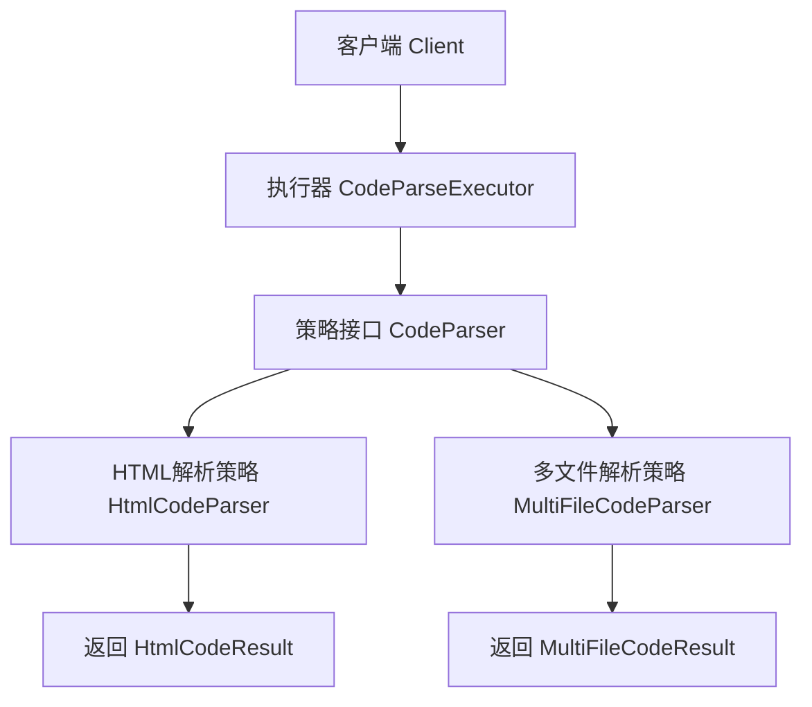
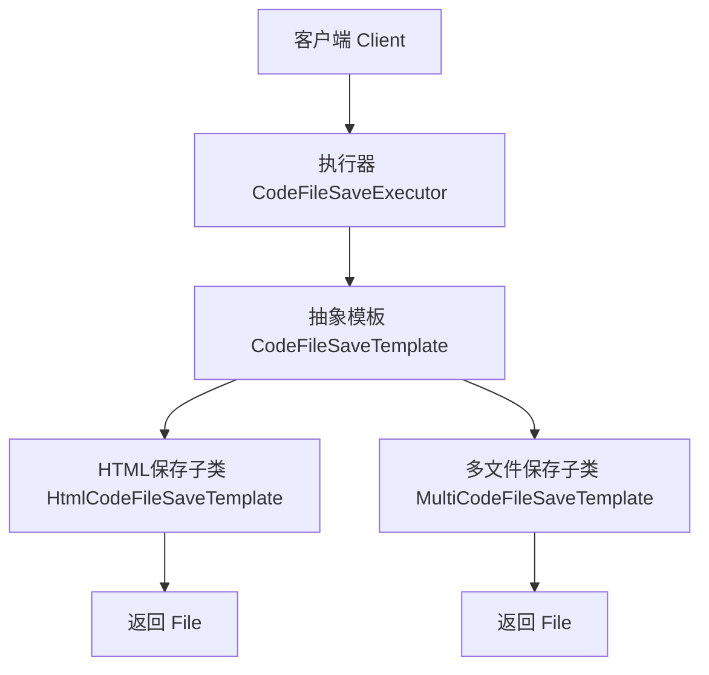

# 一、项目初始化

## 1、后端初始化

### 整合依赖

```xml
<?xml version="1.0" encoding="UTF-8"?>
<project xmlns="http://maven.apache.org/POM/4.0.0" xmlns:xsi="http://www.w3.org/2001/XMLSchema-instance"
         xsi:schemaLocation="http://maven.apache.org/POM/4.0.0 https://maven.apache.org/xsd/maven-4.0.0.xsd">
    <modelVersion>4.0.0</modelVersion>
    <parent>
        <groupId>org.springframework.boot</groupId>
        <artifactId>spring-boot-starter-parent</artifactId>
        <version>3.5.8</version>
        <relativePath/> <!-- lookup parent from repository -->
    </parent>
    <groupId>com.lk</groupId>
    <artifactId>ai-zero-code-platform</artifactId>
    <version>0.0.1-SNAPSHOT</version>
    <name>ai-zero-code-platform</name>
    <description>AI零代码生成平台</description>
    <url/>
    <licenses>
        <license/>
    </licenses>
    <developers>
        <developer/>
    </developers>
    <scm>
        <connection/>
        <developerConnection/>
        <tag/>
        <url/>
    </scm>
    <properties>
        <java.version>21</java.version>
    </properties>
    <dependencies>
        <dependency>
            <groupId>org.springframework.boot</groupId>
            <artifactId>spring-boot-starter-web</artifactId>
        </dependency>
        <dependency>
            <groupId>org.projectlombok</groupId>
            <artifactId>lombok</artifactId>
            <optional>true</optional>
        </dependency>
        <dependency>
            <groupId>org.springframework.boot</groupId>
            <artifactId>spring-boot-starter-test</artifactId>
            <scope>test</scope>
        </dependency>
        <dependency>
            <groupId>com.mysql</groupId>
            <artifactId>mysql-connector-j</artifactId>
        </dependency>
        <dependency>
            <groupId>cn.hutool</groupId>
            <artifactId>hutool-all</artifactId>
            <version>5.8.32</version>
        </dependency>
        <dependency>
            <groupId>com.github.xiaoymin</groupId>
            <artifactId>knife4j-openapi3-jakarta-spring-boot-starter</artifactId>
            <version>4.4.0</version>
        </dependency>
    </dependencies>

    <build>
        <plugins>
            <plugin>
                <groupId>org.springframework.boot</groupId>
                <artifactId>spring-boot-maven-plugin</artifactId>
                <configuration>
                    <excludes>
                        <exclude>
                            <groupId>org.projectlombok</groupId>
                            <artifactId>lombok</artifactId>
                        </exclude>
                    </excludes>
                </configuration>
            </plugin>
        </plugins>
    </build>

</project>
```

### 配置application.yml

```yaml
server:
  port: 8123
  servlet:
    context-path: /api

spring:
  application:
    name: ai-zero-code-platform

# springdoc-openapi项目配置
springdoc:
  swagger-ui:
    path: /swagger-ui.html
    tags-sorter: alpha
    operations-sorter: alpha
  group-configs:
    - group: 'default'
      paths-to-match: '/**'
      packages-to-scan: com.lk.aizerocodeplatform.controller
# knife4j的增强配置，不需要增强可以不配
knife4j:
  enable: true
  setting:
    language: zh_cn
```

### 通用基础代码

通用基础代码⁢⁢⁢是指：无论在任何后端项目‍‍‍中，都可以复用的代码。这‌‌‌种代码一般 “一辈子只用‎‎‎写一次”，了解作用之后复‏‏‏制粘贴即可，无需记忆。

目录结构如下：


#### 1.  自定义异常

自定义错误码，对错误进行收敛，便于前端统一处理。

💡 这里有 2 个小技巧：

1. 自定义错误码时，建议跟主流的错误码（比如 HTTP 错误码）的含义保持一致，比如 “未登录” 定义为 40100，和 HTTP 401 错误（用户需要进行身份认证）保持一致，会更容易理解。
2. 错误码不要完全连续，预留一些间隔，便于后续扩展。

在 `exception` 包下新建错误码枚举类：

```java
@Getter
public enum ErrorCode {

    SUCCESS(0, "ok"),
    PARAMS_ERROR(40000, "请求参数错误"),
    NOT_LOGIN_ERROR(40100, "未登录"),
    NO_AUTH_ERROR(40101, "无权限"),
    NOT_FOUND_ERROR(40400, "请求数据不存在"),
    FORBIDDEN_ERROR(40300, "禁止访问"),
    SYSTEM_ERROR(50000, "系统内部异常"),
    OPERATION_ERROR(50001, "操作失败");

    /**
     * 状态码
     */
    private final int code;

    /**
     * 信息
     */
    private final String message;

    ErrorCode(int code, String message) {
        this.code = code;
        this.message = message;
    }

}

```

一般不建议直接⁢⁢⁢抛出 Java 内置的 R‍‍‍untimeExcepti‌‌‌on，而是自定义一个业务异‎‎‎常，和内置的异常类区分开，‏‏‏便于定制化输出错误信息：

```java
@Getter
public class BusinessException extends RuntimeException {

    /**
     * 错误码
     */
    private final int code;

    public BusinessException(int code, String message) {
        super(message);
        this.code = code;
    }

    public BusinessException(ErrorCode errorCode) {
        super(errorCode.getMessage());
        this.code = errorCode.getCode();
    }

    public BusinessException(ErrorCode errorCode, String message) {
        super(message);
        this.code = errorCode.getCode();
    }
}

```

为了更方便⁢⁢⁢地根据情况抛出异‍‍常‍，可以封装一个‌‌ T‌hrowUt‎‎ils‎，类似断言‏‏类，简化‏抛异常的代码：

```java
public class ThrowUtils {

    /**
     * 条件成立则抛异常
     *
     * @param condition        条件
     * @param runtimeException 异常
     */
    public static void throwIf(boolean condition, RuntimeException runtimeException) {
        if (condition) {
            throw runtimeException;
        }
    }

    /**
     * 条件成立则抛异常
     *
     * @param condition 条件
     * @param errorCode 错误码
     */
    public static void throwIf(boolean condition, ErrorCode errorCode) {
        throwIf(condition, new BusinessException(errorCode));
    }

    /**
     * 条件成立则抛异常
     *
     * @param condition 条件
     * @param errorCode 错误码
     * @param message   错误信息
     */
    public static void throwIf(boolean condition, ErrorCode errorCode, String message) {
        throwIf(condition, new BusinessException(errorCode, message));
    }
}

```

#### 2. 响应包装类

一般情况下⁢⁢⁢，每个后端接口都‍‍要‍返回调用码、数‌‌据、‌调用信息等，‎‎前端可‎以根据这些‏‏信息进行相‏应的处理。

我们可以封装统一的响应结果类，便于前端统一获取这些信息。

通用响应类：

```java
@Data
public class BaseResponse<T> implements Serializable {

    private int code;

    private T data;

    private String message;

    public BaseResponse(int code, T data, String message) {
        this.code = code;
        this.data = data;
        this.message = message;
    }

    public BaseResponse(int code, T data) {
        this(code, data, "");
    }

    public BaseResponse(ErrorCode errorCode) {
        this(errorCode.getCode(), null, errorCode.getMessage());
    }
}

```

但之后每次接口返回⁢⁢⁢值时，都要手动 new 一个 Ba‍‍‍seResponse 对象并传入参‌‌‌数，比较麻烦，我们可以新建一个工具‎‎‎类，提供成功调用和失败调用的方法，‏‏‏支持灵活地传参，简化调用。

```java
public class ResultUtils {

    /**
     * 成功
     *
     * @param data 数据
     * @param <T>  数据类型
     * @return 响应
     */
    public static <T> BaseResponse<T> success(T data) {
        return new BaseResponse<>(0, data, "ok");
    }

    /**
     * 失败
     *
     * @param errorCode 错误码
     * @return 响应
     */
    public static BaseResponse<?> error(ErrorCode errorCode) {
        return new BaseResponse<>(errorCode);
    }

    /**
     * 失败
     *
     * @param code    错误码
     * @param message 错误信息
     * @return 响应
     */
    public static BaseResponse<?> error(int code, String message) {
        return new BaseResponse<>(code, null, message);
    }

    /**
     * 失败
     *
     * @param errorCode 错误码
     * @return 响应
     */
    public static BaseResponse<?> error(ErrorCode errorCode, String message) {
        return new BaseResponse<>(errorCode.getCode(), null, message);
    }
}

```

#### 3. 全局异常处理器

为了防止意⁢⁢⁢料之外的异常，利用‍‍‍ AOP 切面全局‌‌‌对业务异常和 Ru‎‎‎ntimeExce‏‏‏ption 进行捕获：

```java
@Hidden
@RestControllerAdvice
@Slf4j
public class GlobalExceptionHandler {

    @ExceptionHandler(BusinessException.class)
    public BaseResponse<?> businessExceptionHandler(BusinessException e) {
        log.error("BusinessException", e);
        return ResultUtils.error(e.getCode(), e.getMessage());
    }

    @ExceptionHandler(RuntimeException.class)
    public BaseResponse<?> runtimeExceptionHandler(RuntimeException e) {
        log.error("RuntimeException", e);
        return ResultUtils.error(ErrorCode.SYSTEM_ERROR, "系统错误");
    }
}

```

注意！由于本项目使用的 Spring Boot 版本 >= 3.4、并且是 OpenAPI 3 版本的 Knife4j，这会导致 `@RestControllerAdvice` 注解不兼容，所以必须给这个类加上 `@Hidden` 注解，不被 Swagger 加载。虽然网上也有其他的解决方案，但这种方法是最直接有效的。

#### 4. 请求包装类

对于 “分页”⁢⁢⁢、“删除某条数据” 这类通‍‍‍用的请求，可以封装统一的请‌‌‌求包装类，用于接受前端传来‎‎‎的参数，之后相同参数的请求‏‏‏就不用专门再新建一个类了。

分页请求包⁢⁢⁢装类，包括当前‍页‍号‍、页面大小‌、排‌序字‌段、排‎序顺序‎参数：

```java
@Data
public class PageRequest {

    /**
     * 当前页号
     */
    private int pageNum = 1;

    /**
     * 页面大小
     */
    private int pageSize = 10;

    /**
     * 排序字段
     */
    private String sortField;

    /**
     * 排序顺序（默认降序）
     */
    private String sortOrder = "descend";
}

```

删除请求包装类，接受要删除数据的 id 作为参数：

```java
@Data
public class DeleteRequest implements Serializable {

    /**
     * id
     */
    private Long id;

    private static final long serialVersionUID = 1L;
}

```

#### 5. 全局跨域配置

```java
@Configuration
public class CorsConfig implements WebMvcConfigurer {

    @Override
    public void addCorsMappings(CorsRegistry registry) {
        // 覆盖所有请求
        registry.addMapping("/**")
                // 允许发送 Cookie
                .allowCredentials(true)
                // 放行哪些域名（必须用 patterns，否则 * 会和 allowCredentials 冲突）
                .allowedOriginPatterns("*")
                .allowedMethods("GET", "POST", "PUT", "DELETE", "OPTIONS")
                .allowedHeaders("*")
                .exposedHeaders("*");
    }
}
```


## 2、前端初始化

> **前端 Node.js 版本必须 >= 20，该项目node版本为v22.19.0**

### 创建项目

使用 Vue 官方推荐的脚手架 create-vue 快速创建 Vue3 的项目：https://cn.vuejs.org/guide/quick-start.html

在终端，输入命令：

```shell
npm create vue@latest			最新版
npm create vue@3.17.0			该项目的版本
```


然后用 IDEA 打开项目，先在终端执行 `npm install` 安装依赖，然后执行 `npm run dev` 能访问网页就成功了。

### 引入组件库

```shell
npm i --save ant-design-vue@4.x
```

改变主入口文件 main.ts，为了方便，选择全局注册组件：

```java
import './styles/global.css'

import { createApp } from 'vue'
import { createPinia } from 'pinia'

import App from './App.vue'
import router from './router'

import Antd from 'ant-design-vue'
import 'ant-design-vue/dist/reset.css'

const app = createApp(App)

app.use(createPinia())
app.use(router)
app.use(Antd)

app.mount('#app')

```

随便引入一个组件，如果显示出来，就表示引入成功。比如在 `App.vue` 中引入按钮：

```vue
<a-button type="primary">Primary Button</a-button>
```

### 页面基本信息

可以修改项目根目录下的 `index.html` 文件，来定义页面的元信息，比如修改标题：

```vue
<!DOCTYPE html>
<html lang="">
  <head>
    <meta charset="UTF-8">
    <link rel="icon" href="/favicon.ico">
    <meta name="viewport" content="width=device-width, initial-scale=1.0">
    <title>AI零代码生成平台</title>
  </head>
  <body>
    <div id="app"></div>
    <script type="module" src="/src/main.ts"></script>
  </body>
</html>

```

还可以替换 public 目录下默认的 ico 图标为自己的。先用 AI 生成了个 Logo，保存到 assets 目录下 `logo.png`：


然后用 [现成的网站](https://www.bitbug.net/) 可以制作 ico 图标，替换 public 目录下的 `favicon.ico` 文件，效果如图：


### 全局通用布局 - Vibe Coding

```markdown
你是一位前端程序员专家，帮我给项目生成通用的全局基础布局，要求如下：
1）文件名 layouts/BasicLayout.vue，并且在 App.vue 全局页面入口文件中引入
2）移除 main.css 默认样式文件，以及对该文件的引用
3）整体结构为上中下布局，支持响应式，使用 Ant Design Vue 组件库的 Layout 组件实现
- 上方展示导航栏：独立创建 GlobalHeader 组件。左侧展示 logo.png 和网站标题，然后是菜单项，右侧展示登录用户的头像和昵称（暂时先用登录按钮替代）。导航栏使用 Menu 组件实现，支持通过配置设置菜单项。
- 中间展示内容区域：根据路由切换页面
- 下方展示版权信息：独立创建 GlobalFooter 组件。位置始终固定在底部，内容为：编程导航原创项目 by 程序员鱼皮（添加超链接 https://www.codefather.cn）
```

### 请求

需要自定义全局请求地址等，参考 Axios 官方文档，编写请求配置文件 `request.ts`。包括全局接口请求地址、超时时间、自定义请求响应拦截器等。

```shell
npm install axios
```

```tsx
import axios from 'axios'
import { message } from 'ant-design-vue'

// 创建 Axios 实例
const myAxios = axios.create({
  baseURL: 'http://localhost:8123/api',
  timeout: 60000,
  withCredentials: true,
})

// 全局请求拦截器
myAxios.interceptors.request.use(
  function (config) {
    // Do something before request is sent
    return config
  },
  function (error) {
    // Do something with request error
    return Promise.reject(error)
  },
)

// 全局响应拦截器
myAxios.interceptors.response.use(
  function (response) {
    const { data } = response
    // 未登录
    if (data.code === 40100) {
      // 不是获取用户信息的请求，并且用户目前不是已经在用户登录页面，则跳转到登录页面
      if (
        !response.request.responseURL.includes('user/get/login') &&
        !window.location.pathname.includes('/user/login')
      ) {
        message.warning('请先登录')
        window.location.href = `/user/login?redirect=${window.location.href}`
      }
    }
    return response
  },
  function (error) {
    // Any status codes that falls outside the range of 2xx cause this function to trigger
    // Do something with response error
    return Promise.reject(error)
  },
)

export default myAxios

```

### 自动生成请求代码

如果采用传⁢⁢⁢统开发方式，针对‍每‍‍个请求都要单独‌编写‌代‌码，很麻烦‎。     ‎            ‏               

推荐使用 [OpenAPI 工具](https://www.npmjs.com/package/@umijs/openapi)，直接根据后端接口文档自动生成前端请求代码即可，这种方式会比 AI 生成更可控。

按照官方文档的步骤，先安装：

```shell
npm i --save-dev @umijs/openapi
```

还需要安装依赖库：

```shell
npm i --save-dev tslib
```

在 **前端项目根目录** 新建 `openapi2ts.config.ts`，根据自己的需要定制生成的代码：

```tsx
export default {
  requestLibPath: "import request from '@/request'",
  schemaPath: 'http://localhost:8123/api/v3/api-docs',
  serversPath: './src',
}

```

注意，要将⁢⁢⁢ schemaPat‍‍‍h 改为自己后端服务‌‌‌提供的 Swagge‎‎‎r 接口文档的地址，‏‏‏生成前确保后端已启动！

在 `package.json` 的 scripts 中添加 `"openapi2ts": "openapi2ts"`。

执行脚本即可⁢⁢⁢生成请求代码，还包括 ‍‍‍TypeScript ‌‌‌类型：


以后每次后端接口变更时，只需要重新生成一遍就好，非常方便~

### 清理项目

移除脚手架自动‍‍‍生成的多余内容，并‌‌‌且把 views ‎‎‎目录重命名为 pa‏‏‏ges 目录（便于理解）：


移除内容后，修改⁢⁢⁢主页名称为 HomePage，‍‍‍之后所有页面名称都用 Page‌‌‌ 作为结尾，更语义化。还需要相‎‎‎应地移除主页和路由中已经删除的‏‏‏组件引用，让项目能正常运行。


# 二、用户模块

## 1、用户权限控制

> 利用**自定义注解+AOP切面**实现权限控制

第一步：编写自定义注解

```java
package com.lk.aizerocodeplatform.annotation;

import java.lang.annotation.ElementType;
import java.lang.annotation.Retention;
import java.lang.annotation.RetentionPolicy;
import java.lang.annotation.Target;

/**
 * @Author 梁科
 * @Version 1.0
 * @ Date 2026/4/22 14:31
 * 用户权限校验注解
 */
@Target(ElementType.METHOD)
@Retention(RetentionPolicy.RUNTIME)
public @interface AuthCheck {
    String mustRole() default "";
}

```

第二步：编写AOP切面

```java
package com.lk.aizerocodeplatform.aop;

import com.lk.aizerocodeplatform.annotation.AuthCheck;
import com.lk.aizerocodeplatform.constant.UserConstant;
import com.lk.aizerocodeplatform.exception.BusinessException;
import com.lk.aizerocodeplatform.exception.ErrorCode;
import com.lk.aizerocodeplatform.exception.ThrowUtils;
import com.lk.aizerocodeplatform.model.vo.UserLoginVO;
import com.lk.aizerocodeplatform.service.UserService;
import jakarta.annotation.Resource;
import jakarta.servlet.http.HttpServletRequest;
import org.aspectj.lang.ProceedingJoinPoint;
import org.aspectj.lang.annotation.Around;
import org.aspectj.lang.annotation.Aspect;
import org.springframework.stereotype.Component;
import org.springframework.web.context.request.RequestAttributes;
import org.springframework.web.context.request.RequestContextHolder;
import org.springframework.web.context.request.ServletRequestAttributes;

/**
 * @Author 梁科
 * @Version 1.0
 * @ Date 2026/4/22 14:36
 * 切面类,用于用户权限验证
 */
@Aspect
@Component
public class UserInterceptor {
    @Resource
    private UserService userService;

    /**
     * 用户权限拦截
     *
     * @param joinPoint 连接点
     * @param authCheck 权限注解
     */
    @Around(value = "@annotation(authCheck)")
    public Object doIntercept(ProceedingJoinPoint joinPoint, AuthCheck authCheck) throws Throwable {
        // 从权限注解拿到指定的角色(user/admin)
        String mustRole = authCheck.mustRole();
        // 拿到request请求
        RequestAttributes requestAttributes = RequestContextHolder.getRequestAttributes();
        HttpServletRequest request = ((ServletRequestAttributes) requestAttributes).getRequest();
        // 获取用户登录态
        UserLoginVO currentUser = userService.getCurrentUserLoginVo(request);
        ThrowUtils.throwIf(currentUser == null, ErrorCode.NOT_LOGIN_ERROR);
        // 拿到当前登录的用户角色
        String currentUserRole = currentUser.getUserRole();
        if (mustRole.isEmpty()) {
            // 不需要权限，直接放行
            return joinPoint.proceed();
        }
        if (mustRole.equals(UserConstant.ADMIN_ROLE) && !currentUserRole.equals(UserConstant.ADMIN_ROLE)) {
            // 必须管理员可以登录
            throw new BusinessException(ErrorCode.NO_AUTH_ERROR);
        }
        // 放行
        return joinPoint.proceed();
    }
}

```

第三步：使用

```java
/**
     * 增加用户（仅支持管理员调用）
     *
     * @param addUserDTO 增加的用户信息
     */
    @AuthCheck(mustRole = UserConstant.ADMIN_ROLE)
    @Operation(summary = "增加用户")
    @PostMapping("/save")
    public BaseResponse<Long> saveUser(@RequestBody AddUserDTO addUserDTO) {
        Long userId = userService.saveUser(addUserDTO);
        return ResultUtils.success(userId);
    }
```

## 2、数据精度修复

在测试中，如⁢⁢⁢果你打开 F12 开发‍‍‍者工具，利用预览来查看‌‌‌响应数据，就会发现一个‎‎‎问题：id 的最后两位‏‏‏好像都变成 0 了！

这是由于前端 ⁢⁢⁢JS 的精度范围有限，我们‍‍‍后端返回的 id 范围过大‌‌‌，导致前端解析 JSON ‎‎‎时出现精度丢失，会影响前端‏‏‏页面获取到的数据结果。

为了解决这个问题，可以在后端 `config` 包下新建一个全局 JSON 配置，将整个后端 Spring MVC 接口返回值的长整型数字转换为字符串进行返回，从而集中解决问题。

```java
/**
 * Spring MVC Json 配置
 */
@JsonComponent
public class JsonConfig {

    /**
     * 添加 Long 转 json 精度丢失的配置
     */
    @Bean
    public ObjectMapper jacksonObjectMapper(Jackson2ObjectMapperBuilder builder) {
        ObjectMapper objectMapper = builder.createXmlMapper(false).build();
        SimpleModule module = new SimpleModule();
        module.addSerializer(Long.class, ToStringSerializer.instance);
        module.addSerializer(Long.TYPE, ToStringSerializer.instance);
        objectMapper.registerModule(module);
        return objectMapper;
    }
}

```

# 三、AI生成应用

## 1、初始化

第一步：引入依赖

```xml
<!-- 引入langchain4j必要的依赖 -->
        <dependency>
            <groupId>dev.langchain4j</groupId>
            <artifactId>langchain4j</artifactId>
            <version>1.1.0</version>
        </dependency>
        <dependency>
            <groupId>dev.langchain4j</groupId>
            <artifactId>langchain4j-open-ai-spring-boot-starter</artifactId>
            <version>1.1.0-beta7</version>
        </dependency>
```

第二步：配置application.yml文件

```yaml
langchain4j:
  open-ai:
    chat-model:
      api-key: sk-7ef8360fe7ee4cbabca95f0b0d631145
      base-url: https://api.deepseek.com
      model-name: deepseek-chat
      log-requests: true
      log-responses: true
      max-tokens: 8192
```

第三步：引入系统提示词文件

~~~tex
你是一位资深的 Web 前端开发专家，精通 HTML、CSS 和原生 JavaScript。你擅长构建响应式、美观且代码整洁的单页面网站。

你的任务是根据用户提供的网站描述，生成一个完整、独立的单页面网站。你需要一步步思考，并最终将所有代码整合到一个 HTML 文件中。

约束:
1. 技术栈: 只能使用 HTML、CSS 和原生 JavaScript。
2. 禁止外部依赖: 绝对不允许使用任何外部 CSS 框架、JS 库或字体库。所有功能必须用原生代码实现。
3. 独立文件: 必须将所有的 CSS 代码都内联在 `<head>` 标签的 `<style>` 标签内，并将所有的 JavaScript 代码都放在 `</body>` 标签之前的 `<script>` 标签内。最终只输出一个 `.html` 文件，不包含任何外部文件引用。
4. 响应式设计: 网站必须是响应式的，能够在桌面和移动设备上良好显示。请优先使用 Flexbox 或 Grid 进行布局。
5. 内容填充: 如果用户描述中缺少具体文本或图片，请使用有意义的占位符。例如，文本可以使用 Lorem Ipsum，图片可以使用 https://picsum.photos 的服务 (例如 ``)。
6. 代码质量: 代码必须结构清晰、有适当的注释，易于阅读和维护。
7. 交互性: 如果用户描述了交互功能 (如 Tab 切换、图片轮播、表单提交提示等)，请使用原生 JavaScript 来实现。
8. 安全性: 不要包含任何服务器端代码或逻辑。所有功能都是纯客户端的。
9. 输出格式: 你的最终输出必须包含 HTML 代码块，可以在代码块之外添加解释、标题或总结性文字。格式如下：

```html
... HTML 代码 ...


~~~

~~~tex
你是一位资深的⁢⁢⁢ Web 前端开发专家，你精‍‍‍通编写结构化的 HTML、清‌‌‌晰的 CSS 和高效的原生 ‎‎‎JavaScript，遵循代‏‏‏码分离和模块化的最佳实践。

你的任务是根据用户提供的网站描述，创建构成一个完整单页网站所需的三个核心文件：HTML, CSS, 和 JavaScript。你需要在最终输出时，将这三部分代码分别放入三个独立的 Markdown 代码块中，并明确标注文件名。

约束：
1. 技术栈: 只能使用 HTML、CSS 和原生 JavaScript。
2. 文件分离:
- index.html: 只包含网页的结构和内容。它必须在 `<head>` 中通过 `<link>` 标签引用 `style.css`，并且在 `</body>` 结束标签之前通过 `<script>` 标签引用 `script.js`。
- style.css: 包含网站所有的样式规则。
- script.js: 包含网站所有的交互逻辑。
3. 禁止外部依赖: 绝对不允许使用任何外部 CSS 框架、JS 库或字体库。所有功能必须用原生代码实现。
4. 响应式设计: 网站必须是响应式的，能够在桌面和移动设备上良好显示。请在 CSS 中使用 Flexbox 或 Grid 进行布局。
5. 内容填充: 如果用户描述中缺少具体文本或图片，请使用有意义的占位符。例如，文本可以使用 Lorem Ipsum，图片可以使用 https://picsum.photos 的服务 (例如 ``)。
6. 代码质量: 代码必须结构清晰、有适当的注释，易于阅读和维护。
7. 输出格式: 每个代码块前要注明文件名。可以在代码块之外添加解释、标题或总结性文字。格式如下：

```html
... HTML 代码 ...


```css
... CSS 代码 ...


```javascript
... JavaScript 代码 ...

~~~

第四步：编写服务接口

```java
package com.lk.aizerocodeplatform.ai;

import dev.langchain4j.service.SystemMessage;

/**
 * @Author 梁科
 * @Version 1.0
 * @ Date 2026/4/23 13:45
 * AI代码生成服务
 */
public interface AiCodeGenService {
    /**
     * 生成HTML代码
     *
     * @param userMessage 用户提示词
     * @return ai回复内容
     */
    @SystemMessage(fromResource = "prompts/single_file_system_prompt.txt")
    String generateHtmlCode(String userMessage);

    /**
     * 生成多文件代码
     *
     * @param userMessage 用户提示词
     * @return ai回复内容
     */
    @SystemMessage(fromResource = "prompts/multi_file_system_prompt.txt")
    String generateMultiFileCode(String userMessage);
}
```

第五步：创建工厂类，初始化服务接口

```java
package com.lk.aizerocodeplatform.ai;

import dev.langchain4j.model.chat.ChatModel;
import dev.langchain4j.service.AiServices;
import jakarta.annotation.Resource;
import org.springframework.context.annotation.Bean;
import org.springframework.context.annotation.Configuration;

/**
 * @Author 梁科
 * @Version 1.0
 * @ Date 2026/4/23 13:50
 * 创建ai代码生成服务工厂，用于初始化服务
 */
@Configuration
public class AiCodeGenServiceFactory {
    @Resource
    private ChatModel chatModel;

    @Bean
    public AiCodeGenService aiCodeGenService() {
        return AiServices.create(AiCodeGenService.class, chatModel);
    }
}

```

第六步：测试

```java
package com.lk.aizerocodeplatform.ai;

import jakarta.annotation.Resource;
import org.junit.jupiter.api.Assertions;
import org.junit.jupiter.api.Test;
import org.springframework.boot.test.context.SpringBootTest;

import static org.junit.jupiter.api.Assertions.*;

/**
 * @Author 梁科
 * @Version 1.0
 * @ Date 2026/4/23 13:54
 */
@SpringBootTest
class AiCodeGenServiceFactoryTest {

    @Resource
    private AiCodeGenService aiCodeGenService;

    @Test
    void aiCodeGenService1() {
        String result = aiCodeGenService.generateHtmlCode("生成一个用户登录页面，不超过50行代码");
        Assertions.assertNotNull(result);
    }
    @Test
    void aiCodeGenService2() {
        String result = aiCodeGenService.generateMultiFileCode("生成一个用户登录页面，不超过50行代码");
        Assertions.assertNotNull(result);
    }
}
```

## 2、结构化输出

第一步：增加模型输出结果对象

```java
package com.lk.aizerocodeplatform.ai.model;

import dev.langchain4j.model.output.structured.Description;
import lombok.Data;

/**
 * @Author 梁科
 * @Version 1.0
 * @ Date 2026/4/23 14:57
 * 单文件输出结果模型
 */
@Description("生成 HTML 代码文件的结果")
@Data
public class HtmlCodeResult {

    @Description("HTML代码")
    private String htmlCode;

    @Description("生成代码的描述")
    private String description;
}

```

```java
package com.lk.aizerocodeplatform.ai.model;

import dev.langchain4j.model.output.structured.Description;

import lombok.Data;

/**
 * @Author 梁科
 * @Version 1.0
 * @ Date 2026/4/23 14:57
 * 多文件结果输出模型
 */
@Description("生成多个代码文件的结果")
@Data
public class MultiFileCodeResult {

    @Description("HTML代码")
    private String htmlCode;

    @Description("CSS代码")
    private String cssCode;

    @Description("JS代码")
    private String jsCode;

    @Description("生成代码的描述")
    private String description;
}

```

> 使用@Description注解用来描述含义，可以让ai更容易理解其含义，能够更好的进行结构化输出！！！

第二步：在application.yml中增加配置，强制输出json格式的数据

```yaml
langchain4j:
  open-ai:
    chat-model:
      api-key: sk-7ef8360fe7ee4cbabca95f0b0d631145
      base-url: https://api.deepseek.com
      model-name: deepseek-chat
      log-requests: true
      log-responses: true
      max-tokens: 8192
      # 配置模型输出json类型的数据
      strict-json-schema: true
      response-format: json_object
```

第三步：修改服务接口返回值

```java
package com.lk.aizerocodeplatform.ai;

import com.lk.aizerocodeplatform.ai.model.HtmlCodeResult;
import com.lk.aizerocodeplatform.ai.model.MultiFileCodeResult;
import dev.langchain4j.service.SystemMessage;

/**
 * @Author 梁科
 * @Version 1.0
 * @ Date 2026/4/23 13:45
 * AI代码生成服务
 */
public interface AiCodeGenService {
    /**
     * 生成HTML代码
     *
     * @param userMessage 用户提示词
     * @return ai回复内容
     */
    @SystemMessage(fromResource = "prompts/single_file_system_prompt.txt")
    HtmlCodeResult generateHtmlCode(String userMessage);

    /**
     * 生成多文件代码
     *
     * @param userMessage 用户提示词
     * @return ai回复内容
     */
    @SystemMessage(fromResource = "prompts/multi_file_system_prompt.txt")
    MultiFileCodeResult generateMultiFileCode(String userMessage);
}

```

第四步：测试

```java
package com.lk.aizerocodeplatform.ai;

import com.lk.aizerocodeplatform.ai.model.HtmlCodeResult;
import com.lk.aizerocodeplatform.ai.model.MultiFileCodeResult;
import jakarta.annotation.Resource;
import org.junit.jupiter.api.Assertions;
import org.junit.jupiter.api.Test;
import org.springframework.boot.test.context.SpringBootTest;

import static org.junit.jupiter.api.Assertions.*;

/**
 * @Author 梁科
 * @Version 1.0
 * @ Date 2026/4/23 13:54
 */
@SpringBootTest
class AiCodeGenServiceFactoryTest {

    @Resource
    private AiCodeGenService aiCodeGenService;

    @Test
    void aiCodeGenService1() {
        HtmlCodeResult result = aiCodeGenService.generateHtmlCode("生成一个用户登录页面，不超过50行代码");
        Assertions.assertNotNull(result);
    }

    @Test
    void aiCodeGenService2() {
        MultiFileCodeResult result = aiCodeGenService.generateMultiFileCode("生成一个用户登录页面，不超过50行代码");
        Assertions.assertNotNull(result);
    }
}
```

## 3、文件保存

第一步：创建代码文件类型枚举

```java
package com.lk.aizerocodeplatform.enums;

import lombok.Getter;

/**
 * @Author 梁科
 * @Version 1.0
 * @ Date 2026/4/23 15:26
 * 代码生成类型枚举
 */
@Getter
public enum CodeGenTypeEnum {
    HTML("原生 HTML 模式", "html"),
    MULTI_FILE("原生多文件模式", "multi_file"),
    ;
    private final String text;
    private final String value;

    CodeGenTypeEnum(String text, String value) {
        this.text = text;
        this.value = value;
    }

    /**
     * 根据value值获取对应的枚举
     */
    public static CodeGenTypeEnum getByValue(String value) {
        for (CodeGenTypeEnum codeGenTypeEnum : CodeGenTypeEnum.values()) {
            if (codeGenTypeEnum.getValue().equals(value)) {
                return codeGenTypeEnum;
            }
        }
        return null;
    }
}

```

第二步：创建保存代码文件的类

```java
package com.lk.aizerocodeplatform.core;

import cn.hutool.core.io.FileUtil;
import cn.hutool.core.util.IdUtil;
import com.lk.aizerocodeplatform.ai.model.HtmlCodeResult;
import com.lk.aizerocodeplatform.ai.model.MultiFileCodeResult;
import com.lk.aizerocodeplatform.constant.CodeFileSaveConstant;
import com.lk.aizerocodeplatform.enums.CodeGenTypeEnum;

import java.io.File;
import java.nio.charset.StandardCharsets;

/**
 * @Author 梁科
 * @Version 1.0
 * @ Date 2026/4/23 15:31
 * 保存代码文件
 */
public class CodeFileSaver {

    /**
     * 根据雪花算法+codeGenType获取到唯一的保存路径
     *
     * @param codeGenType 生成代码的方式
     * @return 唯一的保存路径
     */
    private static String getUniqueDir(String codeGenType) {
        // 保存路径：/temp/code_output/雪花算法_codeGenType
        return CodeFileSaveConstant.ROOT_PATH + File.separator + IdUtil.getSnowflakeNextIdStr() + "_" + codeGenType;
    }

    /**
     * 保存单个文件
     *
     * @param fileDir  文件路径
     * @param filename 文件名
     * @param content  文件内容
     */
    private static void writeFile(String fileDir, String filename, String content) {
        String filePath = fileDir + File.separator + filename;
        FileUtil.writeString(content, filePath, StandardCharsets.UTF_8);
    }

    /**
     * 保存单HTML模式
     *
     * @param htmlCodeResult 单HTML模式下ai生成的结果对象
     * @return 文件
     */
    public static File saveHtml(HtmlCodeResult htmlCodeResult) {
        String uniqueDir = getUniqueDir(CodeGenTypeEnum.HTML.getValue());
        writeFile(uniqueDir, "index.html", htmlCodeResult.getHtmlCode());
        return new File(uniqueDir);
    }

    public static File saveMultiFile(MultiFileCodeResult multiFileCodeResult) {
        String uniqueDir = getUniqueDir(CodeGenTypeEnum.MULTI_FILE.getValue());
        writeFile(uniqueDir, "index.html", multiFileCodeResult.getHtmlCode());
        writeFile(uniqueDir, "style.css", multiFileCodeResult.getCssCode());
        writeFile(uniqueDir, "script.js", multiFileCodeResult.getJsCode());
        return new File(uniqueDir);
    }
}

```

第三步：测试

```java
package com.lk.aizerocodeplatform.core;

import com.lk.aizerocodeplatform.ai.AiCodeGenService;
import com.lk.aizerocodeplatform.ai.model.HtmlCodeResult;
import com.lk.aizerocodeplatform.ai.model.MultiFileCodeResult;
import jakarta.annotation.Resource;
import org.junit.jupiter.api.Test;
import org.springframework.boot.test.context.SpringBootTest;


/**
 * @Author 梁科
 * @Version 1.0
 * @ Date 2026/4/23 16:05
 */
@SpringBootTest
class CodeFileSaverTest {
    @Resource
    private AiCodeGenService aiCodeGenService;

    @Test
    void saveHtml() {
        HtmlCodeResult htmlCodeResult = aiCodeGenService.generateHtmlCode("生成一个用户登录页面，不超过50行代码");
        CodeFileSaver.saveHtml(htmlCodeResult);
    }

    @Test
    void saveMultiFile() {
        MultiFileCodeResult multiFileCodeResult = aiCodeGenService.generateMultiFileCode("生成一个用户登录页面，背景为紫色，不超过100行代码");
        CodeFileSaver.saveMultiFile(multiFileCodeResult);
    }
}
```

## 4、门面设计模式

门面模式通过⁢⁢⁢提供一个统一的高层接口‍‍‍来隐藏子系统的复杂性，‌‌‌让客户端只需要与这个简‎‎‎化的接口交互，而不用了‏‏‏解内部的复杂实现细节。


第一步：创建门面类

```java
package com.lk.aizerocodeplatform.core;

import com.lk.aizerocodeplatform.ai.AiCodeGenService;
import com.lk.aizerocodeplatform.ai.model.HtmlCodeResult;
import com.lk.aizerocodeplatform.ai.model.MultiFileCodeResult;
import com.lk.aizerocodeplatform.enums.CodeGenTypeEnum;
import com.lk.aizerocodeplatform.exception.BusinessException;
import com.lk.aizerocodeplatform.exception.ErrorCode;
import com.lk.aizerocodeplatform.exception.ThrowUtils;
import jakarta.annotation.Resource;
import org.springframework.stereotype.Service;

import java.io.File;

/**
 * @Author 梁科
 * @Version 1.0
 * @ Date 2026/4/23 17:08
 * AI代码生成门面类（采用门面设计模式）
 */
@Service
public class AiCodeGenFacade {
    @Resource
    private AiCodeGenService aiCodeGenService;

    /**
     * 生成代码并保存
     *
     * @param userMessage     用户提示词
     * @param codeGenTypeEnum 代码生成类型
     * @return 文件
     */
    public File generateCodeAndSave(String userMessage, CodeGenTypeEnum codeGenTypeEnum) {
        ThrowUtils.throwIf(codeGenTypeEnum == null, ErrorCode.PARAMS_ERROR);
        ThrowUtils.throwIf(userMessage == null, ErrorCode.PARAMS_ERROR);
        return switch (codeGenTypeEnum) {
            case HTML -> generateCodeHtmlAndSave(userMessage);
            case MULTI_FILE -> generateCodeMultiFileAndSave(userMessage);
            default -> {
                String errorMessage = "不支持的生成类型：" + codeGenTypeEnum.getValue();
                throw new BusinessException(ErrorCode.SYSTEM_ERROR, errorMessage);
            }
        };
    }

    /**
     * 保存HTML模式的代码文件
     *
     * @param userMessage 用户提示词
     * @return 文件
     */
    private File generateCodeHtmlAndSave(String userMessage) {
        HtmlCodeResult htmlCodeResult = aiCodeGenService.generateHtmlCode(userMessage);
        return CodeFileSaver.saveHtml(htmlCodeResult);
    }

    /**
     * 保存多文件模式的代码文件
     *
     * @param userMessage 用户提示词
     * @return 文件
     */
    private File generateCodeMultiFileAndSave(String userMessage) {
        MultiFileCodeResult multiFileCodeResult = aiCodeGenService.generateMultiFileCode(userMessage);
        return CodeFileSaver.saveMultiFile(multiFileCodeResult);
    }
}

```

第二步：测试

```java
package com.lk.aizerocodeplatform.core;

import com.lk.aizerocodeplatform.enums.CodeGenTypeEnum;
import jakarta.annotation.Resource;
import org.junit.jupiter.api.Assertions;
import org.junit.jupiter.api.Test;
import org.springframework.boot.test.context.SpringBootTest;

import java.io.File;

import static org.junit.jupiter.api.Assertions.*;

/**
 * @Author 梁科
 * @Version 1.0
 * @ Date 2026/4/23 17:27
 */
@SpringBootTest
class AiCodeGenFacadeTest {
    @Resource
    private AiCodeGenFacade aiCodeGenFacade;
    @Test
    void generateCodeAndSave() {
        File file = aiCodeGenFacade.generateCodeAndSave("任务记录网站", CodeGenTypeEnum.MULTI_FILE);
        Assertions.assertNotNull(file);
    }
}
```

## 5、SSE流式输出

> 此处采用`LangChain4j + Reactor`方案

第一步：引入依赖

```xml
 <!-- 引入langchain4j+recator方案流式输出必要的依赖 -->
        <dependency>
            <groupId>dev.langchain4j</groupId>
            <artifactId>langchain4j-reactor</artifactId>
            <version>1.1.0-beta7</version>
        </dependency>
```

第二步：配置application.yml文件

```yaml
langchain4j:
  open-ai:
    chat-model:     # 普通聊天模型
      api-key: sk-7ef8360fe7ee4cbabca95f0b0d631145
      base-url: https://api.deepseek.com
      model-name: deepseek-chat
      log-requests: true
      log-responses: true
      max-tokens: 8192
      # 配置模型输出json类型的数据
      strict-json-schema: true
      response-format: json_object
    streaming-chat-model:   # 流式聊天模型（不支持结构化输出）
      api-key: sk-7ef8360fe7ee4cbabca95f0b0d631145
      base-url: https://api.deepseek.com
      model-name: deepseek-chat
      log-requests: true
      log-responses: true
      max-tokens: 8192
```

第三步：新增ai代码生成服务接口流式响应

```java
package com.lk.aizerocodeplatform.ai;

import com.lk.aizerocodeplatform.ai.model.HtmlCodeResult;
import com.lk.aizerocodeplatform.ai.model.MultiFileCodeResult;
import dev.langchain4j.service.SystemMessage;
import reactor.core.publisher.Flux;

/**
 * @Author 梁科
 * @Version 1.0
 * @ Date 2026/4/23 13:45
 * AI代码生成服务
 */
public interface AiCodeGenService {

    /**
     * 生成HTML代码（流式）
     *
     * @param userMessage 用户提示词
     * @return ai回复内容
     */
    @SystemMessage(fromResource = "prompts/single_file_system_prompt.txt")
    Flux<String> generateHtmlCodeStream(String userMessage);

    /**
     * 生成多文件代码（流式）
     *
     * @param userMessage 用户提示词
     * @return ai回复内容
     */
    @SystemMessage(fromResource = "prompts/multi_file_system_prompt.txt")
    Flux<String> generateMultiFileCodeStream(String userMessage);
}

```

第四步：工厂配置类中注册流式响应模型

```java
package com.lk.aizerocodeplatform.ai;

import dev.langchain4j.model.chat.ChatModel;
import dev.langchain4j.model.chat.StreamingChatModel;
import dev.langchain4j.service.AiServices;
import jakarta.annotation.Resource;
import org.springframework.context.annotation.Bean;
import org.springframework.context.annotation.Configuration;

/**
 * @Author 梁科
 * @Version 1.0
 * @ Date 2026/4/23 13:50
 * 创建ai代码生成服务工厂，用于初始化服务
 */
@Configuration
public class AiCodeGenServiceFactory {
    @Resource
    private ChatModel chatModel;
    @Resource
    private StreamingChatModel streamingChatModel;

    @Bean
    public AiCodeGenService aiCodeGenService() {
        return AiServices.builder(AiCodeGenService.class)
                .chatModel(chatModel)
                .streamingChatModel(streamingChatModel)
                .build();
    }
}

```

第五步：新增转换器（ai写的），将ai回复的字符串转换为结构化输出对象，用于文件保存

```java
package com.lk.aizerocodeplatform.core;

/**
 * @Author 梁科
 * @Version 1.0
 * @ Date 2026/4/23 18:51
 */

import com.lk.aizerocodeplatform.ai.model.HtmlCodeResult;
import com.lk.aizerocodeplatform.ai.model.MultiFileCodeResult;

import java.util.regex.Matcher;
import java.util.regex.Pattern;

/**
 * @author LK
 * 代码解析器
 * 提供静态方法解析不同类型的代码内容
 */
public class CodeParser {

    private static final Pattern HTML_CODE_PATTERN = Pattern.compile("```html\\s*\\n([\\s\\S]*?)```", Pattern.CASE_INSENSITIVE);
    private static final Pattern CSS_CODE_PATTERN = Pattern.compile("```css\\s*\\n([\\s\\S]*?)```", Pattern.CASE_INSENSITIVE);
    private static final Pattern JS_CODE_PATTERN = Pattern.compile("```(?:js|javascript)\\s*\\n([\\s\\S]*?)```", Pattern.CASE_INSENSITIVE);

    /**
     * 解析 HTML 单文件代码
     */
    public static HtmlCodeResult parseHtmlCode(String codeContent) {
        HtmlCodeResult result = new HtmlCodeResult();
        // 提取 HTML 代码
        String htmlCode = extractHtmlCode(codeContent);
        if (htmlCode != null && !htmlCode.trim().isEmpty()) {
            result.setHtmlCode(htmlCode.trim());
        } else {
            // 如果没有找到代码块，将整个内容作为HTML
            result.setHtmlCode(codeContent.trim());
        }
        return result;
    }

    /**
     * 解析多文件代码（HTML + CSS + JS）
     */
    public static MultiFileCodeResult parseMultiFileCode(String codeContent) {
        MultiFileCodeResult result = new MultiFileCodeResult();
        // 提取各类代码
        String htmlCode = extractCodeByPattern(codeContent, HTML_CODE_PATTERN);
        String cssCode = extractCodeByPattern(codeContent, CSS_CODE_PATTERN);
        String jsCode = extractCodeByPattern(codeContent, JS_CODE_PATTERN);
        // 设置HTML代码
        if (htmlCode != null && !htmlCode.trim().isEmpty()) {
            result.setHtmlCode(htmlCode.trim());
        }
        // 设置CSS代码
        if (cssCode != null && !cssCode.trim().isEmpty()) {
            result.setCssCode(cssCode.trim());
        }
        // 设置JS代码
        if (jsCode != null && !jsCode.trim().isEmpty()) {
            result.setJsCode(jsCode.trim());
        }
        return result;
    }

    /**
     * 提取HTML代码内容
     *
     * @param content 原始内容
     * @return HTML代码
     */
    private static String extractHtmlCode(String content) {
        Matcher matcher = HTML_CODE_PATTERN.matcher(content);
        if (matcher.find()) {
            return matcher.group(1);
        }
        return null;
    }

    /**
     * 根据正则模式提取代码
     *
     * @param content 原始内容
     * @param pattern 正则模式
     * @return 提取的代码
     */
    private static String extractCodeByPattern(String content, Pattern pattern) {
        Matcher matcher = pattern.matcher(content);
        if (matcher.find()) {
            return matcher.group(1);
        }
        return null;
    }
}


```

第六步：门面类中新增流式响应方法

```java
package com.lk.aizerocodeplatform.core;

import com.lk.aizerocodeplatform.ai.AiCodeGenService;
import com.lk.aizerocodeplatform.ai.model.HtmlCodeResult;
import com.lk.aizerocodeplatform.ai.model.MultiFileCodeResult;
import com.lk.aizerocodeplatform.enums.CodeGenTypeEnum;
import com.lk.aizerocodeplatform.exception.BusinessException;
import com.lk.aizerocodeplatform.exception.ErrorCode;
import com.lk.aizerocodeplatform.exception.ThrowUtils;
import jakarta.annotation.Resource;
import lombok.extern.slf4j.Slf4j;
import org.springframework.stereotype.Service;
import reactor.core.publisher.Flux;

import java.io.File;

/**
 * @Author 梁科
 * @Version 1.0
 * @ Date 2026/4/23 17:08
 * AI代码生成门面类（采用门面设计模式）
 */
@Service
@Slf4j
public class AiCodeGenFacade {
    @Resource
    private AiCodeGenService aiCodeGenService;
    
    /**
     * 生成代码并保存（流式）
     *
     * @param userMessage     用户提示词
     * @param codeGenTypeEnum 代码生成类型
     * @return 文件
     */
    public Flux<String> generateCodeAndSaveStream(String userMessage, CodeGenTypeEnum codeGenTypeEnum) {
        ThrowUtils.throwIf(codeGenTypeEnum == null, ErrorCode.PARAMS_ERROR);
        ThrowUtils.throwIf(userMessage == null, ErrorCode.PARAMS_ERROR);
        return switch (codeGenTypeEnum) {
            case HTML -> generateCodeHtmlAndSaveStream(userMessage);
            case MULTI_FILE -> generateCodeMultiFileAndSaveStream(userMessage);
            default -> {
                String errorMessage = "不支持的生成类型：" + codeGenTypeEnum.getValue();
                throw new BusinessException(ErrorCode.SYSTEM_ERROR, errorMessage);
            }
        };
    }

    /**
     * 保存HTML模式的代码文件（流式）
     *
     * @param userMessage 用户提示词
     * @return 文件
     */
    private Flux<String> generateCodeHtmlAndSaveStream(String userMessage) {
        StringBuilder stringBuilder = new StringBuilder();
        return aiCodeGenService.generateHtmlCodeStream(userMessage)
                .doOnNext(stringBuilder::append)
                .doOnComplete(() -> {
                    try {
                        String completeHtmlCode = stringBuilder.toString();
                        HtmlCodeResult htmlCodeResult = CodeParser.parseHtmlCode(completeHtmlCode);
                        File dir = CodeFileSaver.saveHtml(htmlCodeResult);
                        log.info("文件保存成功，路径为：{}", dir.getAbsolutePath());
                    } catch (Exception e) {
                        log.error("保存失败：{}", e.getMessage());
                    }
                });
    }

    /**
     * 保存多文件模式的代码文件（流式）
     *
     * @param userMessage 用户提示词
     * @return 文件
     */
    private Flux<String> generateCodeMultiFileAndSaveStream(String userMessage) {
        StringBuilder stringBuilder = new StringBuilder();
        return aiCodeGenService.generateMultiFileCodeStream(userMessage)
                .doOnNext(stringBuilder::append)
                .doOnComplete(() -> {
                    try {
                        String completeMultiFileCode = stringBuilder.toString();
                        MultiFileCodeResult multiFileCodeResult = CodeParser.parseMultiFileCode(completeMultiFileCode);
                        File dir = CodeFileSaver.saveMultiFile(multiFileCodeResult);
                        log.info("文件保存成功，路径为：{}", dir.getAbsolutePath());
                    } catch (Exception e) {
                        log.error("保存失败：{}", e.getMessage());
                    }
                });
    }
}

```

## 6、代码优化

### 优化方案

- 解析器部分：使用`策略模式+执行器模式`，不同类型的解析策略独立维护（难点是不同解析策略的**返回值不同**）
- 文件保存部分：使用`模板模式+执行器模式`，统一保存流程（难点是不同保存方式的**方法参数不同**）
- SSE 流式处理：抽象出通用的流式处理逻辑（目前每种生成模式都写了一套处理代码）

### 策略模式+执行器模式

`策略模式`定义⁢⁢⁢了一系列算法，将每个算‍‍‍法封装起来，并让它们可‌‌‌以相互替换，使得算法的‎‎‎变化不会影响使用算法的‏‏‏代码，让项目更好维护和扩展。

`执行器模式`提供⁢⁢⁢统一的执行入口来协调不同策‍‍‍略和模板的调用，特别适合处‌‌‌理参数类型不同但业务逻辑相‎‎‎似的场景，避免了工厂模式在‏‏‏处理不同参数类型时的局限性。




第一步：编写解析器的策略接口

```java
package com.lk.aizerocodeplatform.parser;

/**
 * @Author 梁科
 * @Version 1.0
 * @ Date 2026/4/23 21:04
 * 代码解析器策略接口
 */
public interface CodeParser <T> {
    /**
     * 不同的解析器返回不同的类型，返回值使用泛型
     * @param codeContent AI生成的代码内容
     */
    T parseCode(String codeContent);
}

```

第二步：编写不同的解析器实现该接口

```java
package com.lk.aizerocodeplatform.parser;

import com.lk.aizerocodeplatform.ai.model.HtmlCodeResult;

import java.util.regex.Matcher;
import java.util.regex.Pattern;

/**
 * @Author 梁科
 * @Version 1.0
 * @ Date 2026/4/23 21:10
 * 单Html模式解析器
 */
public class HtmlCodeParser implements CodeParser<HtmlCodeResult> {
    private static final Pattern HTML_CODE_PATTERN = Pattern.compile("```html\\s*\\n([\\s\\S]*?)```", Pattern.CASE_INSENSITIVE);

    @Override
    public HtmlCodeResult parseCode(String codeContent) {
        HtmlCodeResult result = new HtmlCodeResult();
        // 提取 HTML 代码
        String htmlCode = extractHtmlCode(codeContent);
        if (htmlCode != null && !htmlCode.trim().isEmpty()) {
            result.setHtmlCode(htmlCode.trim());
        } else {
            // 如果没有找到代码块，将整个内容作为HTML
            result.setHtmlCode(codeContent.trim());
        }
        return result;
    }

    /**
     * 提取HTML代码内容
     *
     * @param content 原始内容
     * @return HTML代码
     */
    private static String extractHtmlCode(String content) {
        Matcher matcher = HTML_CODE_PATTERN.matcher(content);
        if (matcher.find()) {
            return matcher.group(1);
        }
        return null;
    }
}

```

```java
package com.lk.aizerocodeplatform.parser;

import com.lk.aizerocodeplatform.ai.model.MultiFileCodeResult;

import java.util.regex.Matcher;
import java.util.regex.Pattern;

/**
 * @Author 梁科
 * @Version 1.0
 * @ Date 2026/4/23 21:14
 * 多文件模式解析器
 */
public class MultiFileCodeParser implements CodeParser<MultiFileCodeResult> {
    private static final Pattern HTML_CODE_PATTERN = Pattern.compile("```html\\s*\\n([\\s\\S]*?)```", Pattern.CASE_INSENSITIVE);
    private static final Pattern CSS_CODE_PATTERN = Pattern.compile("```css\\s*\\n([\\s\\S]*?)```", Pattern.CASE_INSENSITIVE);
    private static final Pattern JS_CODE_PATTERN = Pattern.compile("```(?:js|javascript)\\s*\\n([\\s\\S]*?)```", Pattern.CASE_INSENSITIVE);

    @Override
    public MultiFileCodeResult parseCode(String codeContent) {
        MultiFileCodeResult result = new MultiFileCodeResult();
        // 提取各类代码
        String htmlCode = extractCodeByPattern(codeContent, HTML_CODE_PATTERN);
        String cssCode = extractCodeByPattern(codeContent, CSS_CODE_PATTERN);
        String jsCode = extractCodeByPattern(codeContent, JS_CODE_PATTERN);
        // 设置HTML代码
        if (htmlCode != null && !htmlCode.trim().isEmpty()) {
            result.setHtmlCode(htmlCode.trim());
        }
        // 设置CSS代码
        if (cssCode != null && !cssCode.trim().isEmpty()) {
            result.setCssCode(cssCode.trim());
        }
        // 设置JS代码
        if (jsCode != null && !jsCode.trim().isEmpty()) {
            result.setJsCode(jsCode.trim());
        }
        return result;
    }

    /**
     * 根据正则模式提取代码
     *
     * @param content 原始内容
     * @param pattern 正则模式
     * @return 提取的代码
     */
    private static String extractCodeByPattern(String content, Pattern pattern) {
        Matcher matcher = pattern.matcher(content);
        if (matcher.find()) {
            return matcher.group(1);
        }
        return null;
    }
}

```

第三步：编写解析器的执行器（通过执行器调用不同的解析器）

```java
package com.lk.aizerocodeplatform.parser;

import com.lk.aizerocodeplatform.enums.CodeGenTypeEnum;
import com.lk.aizerocodeplatform.exception.BusinessException;
import com.lk.aizerocodeplatform.exception.ErrorCode;

/**
 * @Author 梁科
 * @Version 1.0
 * @ Date 2026/4/23 21:18
 * 解析器的统一执行器
 */
public class CodeParseExecutor {
    // 单html模式解析器对象
    private static final HtmlCodeParser HTML_CODE_PARSER = new HtmlCodeParser();
    // 多文件模式解析器对象
    private static final MultiFileCodeParser MULTI_FILE_CODE_PARSER = new MultiFileCodeParser();

    /**
     * 执行解析器
     *
     * @param codeContent     AI生成的代码内容
     * @param codeGenTypeEnum 代码生成类型
     */
    public static Object executeParser(String codeContent, CodeGenTypeEnum codeGenTypeEnum) {
        // 调用统一的解析器执行器，根据CodeGenTypeEnum决定调用哪一个解析器
        return switch (codeGenTypeEnum) {
            case HTML -> HTML_CODE_PARSER.parseCode(codeContent);
            case MULTI_FILE -> MULTI_FILE_CODE_PARSER.parseCode(codeContent);
            default ->
                    throw new BusinessException(ErrorCode.SYSTEM_ERROR, "不支持的生成类型:" + codeGenTypeEnum.getValue());
        };
    }
}

```

第四步：使用

```java
/**
     * 保存HTML模式的代码文件（流式）
     *
     * @param userMessage 用户提示词
     * @return 文件
     */
    private Flux<String> generateCodeHtmlAndSaveStream(String userMessage) {
        StringBuilder stringBuilder = new StringBuilder();
        return aiCodeGenService.generateHtmlCodeStream(userMessage)
                .doOnNext(stringBuilder::append)
                .doOnComplete(() -> {
                    try {
                        String completeHtmlCode = stringBuilder.toString();
                        // 调用统一的解析器执行器，根据生成代码的方式决定调用哪一个解析器
                        HtmlCodeResult htmlCodeResult = (HtmlCodeResult)CodeParseExecutor.executeParser(completeHtmlCode, CodeGenTypeEnum.HTML);
                        File dir = CodeFileSaver.saveHtml(htmlCodeResult);
                        log.info("文件保存成功，路径为：{}", dir.getAbsolutePath());
                    } catch (Exception e) {
                        log.error("保存失败：{}", e.getMessage());
                    }
                });
    }

    /**
     * 保存多文件模式的代码文件（流式）
     *
     * @param userMessage 用户提示词
     * @return 文件
     */
    private Flux<String> generateCodeMultiFileAndSaveStream(String userMessage) {
        StringBuilder stringBuilder = new StringBuilder();
        return aiCodeGenService.generateMultiFileCodeStream(userMessage)
                .doOnNext(stringBuilder::append)
                .doOnComplete(() -> {
                    try {
                        String completeMultiFileCode = stringBuilder.toString();
                        // 调用统一的解析器执行器，根据生成代码的方式决定调用哪一个解析器
                        MultiFileCodeResult multiFileCodeResult = (MultiFileCodeResult) CodeParseExecutor.executeParser(completeMultiFileCode, CodeGenTypeEnum.MULTI_FILE);
                        File dir = CodeFileSaver.saveMultiFile(multiFileCodeResult);
                        log.info("文件保存成功，路径为：{}", dir.getAbsolutePath());
                    } catch (Exception e) {
                        log.error("保存失败：{}", e.getMessage());
                    }
                });
    }
```

### 模板模式+执行器模式

`模板模式`⁢⁢⁢在抽⁢⁢象父类中定义了操作‍‍‍的标准流程，将一些‍‍具体‌‌‌实现步骤交给子类，使得‎‎‎子类‌‌可以在不改变流程的‏‏‏情况下重新定义某些特‎‎定步骤。  

`执行器模式`提供⁢⁢⁢统一的执行入口来协调不同策‍‍‍略和模板的调用，特别适合处‌‌‌理参数类型不同但业务逻辑相‎‎‎似的场景，避免了工厂模式在‏‏‏处理不同参数类型时的局限性。



第一步：编写抽象模板父类

```java
package com.lk.aizerocodeplatform.saver;

import cn.hutool.core.io.FileUtil;
import cn.hutool.core.util.IdUtil;
import com.lk.aizerocodeplatform.constant.CodeFileSaveConstant;
import com.lk.aizerocodeplatform.enums.CodeGenTypeEnum;
import com.lk.aizerocodeplatform.exception.BusinessException;
import com.lk.aizerocodeplatform.exception.ErrorCode;

import java.io.File;
import java.nio.charset.StandardCharsets;

/**
 * @Author 梁科
 * @Version 1.0
 * @ Date 2026/4/23 22:33
 * 代码文件保存（父类模板）
 * 需要保存的文件类型不确定，所以使用泛型
 */
public abstract class CodeFileSaveTemplate<T> {
    /**
     * 保存代码文件的核心方法，定义为final不允许子类重写,子类必须遵循该实现流程
     */
    public final File saveCode(T result) {
        // 1、验证参数
        validateInput(result);
        // 2、得到唯一目录
        String uniqueDir = getUniqueDir();
        // 3、保存文件
        saveFiles(uniqueDir, result);
        // 4、返回路径
        return new File(uniqueDir);
    }

    /**
     * 校验参数是否合法（子类可以重写该方法）
     *
     * @param result 输入参数
     */
    protected void validateInput(T result) {
        if (result == null) {
            throw new BusinessException(ErrorCode.PARAMS_ERROR);
        }
    }

    /**
     * 根据雪花算法+codeGenType获取到唯一的保存路径
     *
     * @return 唯一的保存路径
     */
    protected String getUniqueDir() {
        // 获取代码生成类型
        CodeGenTypeEnum codeGenType = getCodeGenType();
        // 保存路径：/temp/code_output/雪花算法_codeGenType
        return CodeFileSaveConstant.ROOT_PATH + File.separator + IdUtil.getSnowflakeNextIdStr() + "_" + codeGenType.getValue();
    }

    /**
     * 保存单个文件(不允许子类重写)
     *
     * @param fileDir  文件路径
     * @param filename 文件名
     * @param content  文件内容
     */
    protected final void writeFile(String fileDir, String filename, String content) {
        String filePath = fileDir + File.separator + filename;
        FileUtil.writeString(content, filePath, StandardCharsets.UTF_8);
    }

    /**
     * 获取代码生成方式（由子类重写）
     */
    protected abstract CodeGenTypeEnum getCodeGenType();

    /**
     * 保存文件（由子类重写）
     *
     * @param uniqueDir 唯一目录
     * @param result    需要保存的代码内容
     */
    protected abstract void saveFiles(String uniqueDir, T result);
}

```

第二步：编写不同的文件保存模板

```java
package com.lk.aizerocodeplatform.saver;

import com.lk.aizerocodeplatform.ai.model.HtmlCodeResult;
import com.lk.aizerocodeplatform.enums.CodeGenTypeEnum;

/**
 * @Author 梁科
 * @Version 1.0
 * @ Date 2026/4/23 23:03
 * Html模式代码文件保存模板
 */
public class HtmlCodeFileSaveTemplate extends CodeFileSaveTemplate<HtmlCodeResult> {
    @Override
    protected CodeGenTypeEnum getCodeGenType() {
        return CodeGenTypeEnum.HTML;
    }

    @Override
    protected void saveFiles(String uniqueDir, HtmlCodeResult result) {
        writeFile(uniqueDir,"index.html", result.getHtmlCode());
    }
}

```

```java
package com.lk.aizerocodeplatform.saver;

import com.lk.aizerocodeplatform.ai.model.MultiFileCodeResult;
import com.lk.aizerocodeplatform.enums.CodeGenTypeEnum;

/**
 * @Author 梁科
 * @Version 1.0
 * @ Date 2026/4/23 23:05
 * 多文件模式代码文件保存模板
 */
public class MultiCodeFileSaveTemplate extends CodeFileSaveTemplate<MultiFileCodeResult> {
    @Override
    protected CodeGenTypeEnum getCodeGenType() {
        return CodeGenTypeEnum.MULTI_FILE;
    }

    @Override
    protected void saveFiles(String uniqueDir, MultiFileCodeResult result) {
        writeFile(uniqueDir,"index.html", result.getHtmlCode());
        writeFile(uniqueDir,"style.css",result.getCssCode());
        writeFile(uniqueDir,"script.js",result.getJsCode());
    }
}

```

第三步：编写执行器

```java
package com.lk.aizerocodeplatform.saver;

import com.lk.aizerocodeplatform.ai.model.HtmlCodeResult;
import com.lk.aizerocodeplatform.ai.model.MultiFileCodeResult;
import com.lk.aizerocodeplatform.enums.CodeGenTypeEnum;
import com.lk.aizerocodeplatform.exception.BusinessException;
import com.lk.aizerocodeplatform.exception.ErrorCode;

import java.io.File;

/**
 * @Author 梁科
 * @Version 1.0
 * @ Date 2026/4/23 23:07
 * 代码文件保存执行器
 */
public class CodeFileSaveExecutor {
    private static final HtmlCodeFileSaveTemplate HTML_CODE_FILE_SAVE_TEMPLATE = new HtmlCodeFileSaveTemplate();
    private static final MultiCodeFileSaveTemplate MULTI_CODE_FILE_SAVE_TEMPLATE = new MultiCodeFileSaveTemplate();

    /**
     * 根据CodeGenTypeEnum类型执行不同的文件保存
     *
     * @param result          需要保存文件的类型
     * @param codeGenTypeEnum 生成的代码类型
     * @return  文件路径
     */
    public static File executeCodeFileSave(Object result, CodeGenTypeEnum codeGenTypeEnum) {
        return switch (codeGenTypeEnum){
            case HTML -> HTML_CODE_FILE_SAVE_TEMPLATE.saveCode((HtmlCodeResult) result);
            case MULTI_FILE -> MULTI_CODE_FILE_SAVE_TEMPLATE.saveCode((MultiFileCodeResult)  result);
            default -> throw new BusinessException(ErrorCode.PARAMS_ERROR, "该文件类型不能被保存 + " + codeGenTypeEnum.getValue());
        };
    }
}

```

第四步：使用

```java
/**
     * 保存HTML模式的代码文件（流式）
     *
     * @param userMessage 用户提示词
     * @return 文件
     */
    private Flux<String> generateCodeHtmlAndSaveStream(String userMessage) {
        StringBuilder stringBuilder = new StringBuilder();
        return aiCodeGenService.generateHtmlCodeStream(userMessage)
                .doOnNext(stringBuilder::append)
                .doOnComplete(() -> {
                    try {
                        String completeHtmlCode = stringBuilder.toString();
                        // 调用统一的解析器执行器，根据生成代码的方式决定调用哪一个解析器
                        HtmlCodeResult htmlCodeResult = (HtmlCodeResult) CodeParseExecutor.executeParser(completeHtmlCode, CodeGenTypeEnum.HTML);
                        // 调用统一的代码文件保存执行器，根据生成的代码方式决定调用哪一个文件保存模板
                        File dir = CodeFileSaveExecutor.executeCodeFileSave(htmlCodeResult, CodeGenTypeEnum.HTML);
                        log.info("文件保存成功，路径为：{}", dir.getAbsolutePath());
                    } catch (Exception e) {
                        log.error("保存失败：{}", e.getMessage());
                    }
                });
    }

    /**
     * 保存多文件模式的代码文件（流式）
     *
     * @param userMessage 用户提示词
     * @return 文件
     */
    private Flux<String> generateCodeMultiFileAndSaveStream(String userMessage) {
        StringBuilder stringBuilder = new StringBuilder();
        return aiCodeGenService.generateMultiFileCodeStream(userMessage)
                .doOnNext(stringBuilder::append)
                .doOnComplete(() -> {
                    try {
                        String completeMultiFileCode = stringBuilder.toString();
                        // 调用统一的解析器执行器，根据生成代码的方式决定调用哪一个解析器
                        MultiFileCodeResult multiFileCodeResult = (MultiFileCodeResult) CodeParseExecutor.executeParser(completeMultiFileCode, CodeGenTypeEnum.MULTI_FILE);
                        // 调用统一的代码文件保存执行器，根据生成的代码方式决定调用哪一个文件保存模板
                        File dir = CodeFileSaveExecutor.executeCodeFileSave(multiFileCodeResult, CodeGenTypeEnum.MULTI_FILE);
                        log.info("文件保存成功，路径为：{}", dir.getAbsolutePath());
                    } catch (Exception e) {
                        log.error("保存失败：{}", e.getMessage());
                    }
                });
    }
```

### 优化门面类

```java
package com.lk.aizerocodeplatform.core;

import com.lk.aizerocodeplatform.ai.AiCodeGenService;
import com.lk.aizerocodeplatform.ai.model.HtmlCodeResult;
import com.lk.aizerocodeplatform.ai.model.MultiFileCodeResult;
import com.lk.aizerocodeplatform.enums.CodeGenTypeEnum;
import com.lk.aizerocodeplatform.exception.BusinessException;
import com.lk.aizerocodeplatform.exception.ErrorCode;
import com.lk.aizerocodeplatform.exception.ThrowUtils;
import com.lk.aizerocodeplatform.parser.CodeParseExecutor;
import com.lk.aizerocodeplatform.saver.CodeFileSaveExecutor;
import jakarta.annotation.Resource;
import lombok.extern.slf4j.Slf4j;
import org.springframework.stereotype.Service;
import reactor.core.publisher.Flux;

import java.io.File;

/**
 * @Author 梁科
 * @Version 1.0
 * @ Date 2026/4/23 17:08
 * AI代码生成门面类（采用门面设计模式）
 */
@Service
@Slf4j
public class AiCodeGenFacade {
    @Resource
    private AiCodeGenService aiCodeGenService;

    /**
     * 生成代码并保存
     *
     * @param userMessage     用户提示词
     * @param codeGenTypeEnum 代码生成类型
     * @return 文件
     */
    public File generateCodeAndSave(String userMessage, CodeGenTypeEnum codeGenTypeEnum) {
        ThrowUtils.throwIf(codeGenTypeEnum == null, ErrorCode.PARAMS_ERROR);
        ThrowUtils.throwIf(userMessage == null, ErrorCode.PARAMS_ERROR);
        return switch (codeGenTypeEnum) {
            case HTML -> generateCodeHtmlAndSave(userMessage);
            case MULTI_FILE -> generateCodeMultiFileAndSave(userMessage);
            default -> {
                String errorMessage = "不支持的生成类型：" + codeGenTypeEnum.getValue();
                throw new BusinessException(ErrorCode.SYSTEM_ERROR, errorMessage);
            }
        };
    }

    /**
     * 保存HTML模式的代码文件
     *
     * @param userMessage 用户提示词
     * @return 文件
     */
    private File generateCodeHtmlAndSave(String userMessage) {
        HtmlCodeResult htmlCodeResult = aiCodeGenService.generateHtmlCode(userMessage);
        return CodeFileSaveExecutor.executeCodeFileSave(htmlCodeResult, CodeGenTypeEnum.HTML);
    }

    /**
     * 保存多文件模式的代码文件
     *
     * @param userMessage 用户提示词
     * @return 文件
     */
    private File generateCodeMultiFileAndSave(String userMessage) {
        MultiFileCodeResult multiFileCodeResult = aiCodeGenService.generateMultiFileCode(userMessage);
        return CodeFileSaveExecutor.executeCodeFileSave(multiFileCodeResult, CodeGenTypeEnum.MULTI_FILE);
    }

    /**
     * 生成代码并保存（流式）
     *
     * @param userMessage     用户提示词
     * @param codeGenTypeEnum 代码生成类型
     * @return 文件
     */
    public Flux<String> generateCodeAndSaveStream(String userMessage, CodeGenTypeEnum codeGenTypeEnum) {
        ThrowUtils.throwIf(codeGenTypeEnum == null, ErrorCode.PARAMS_ERROR);
        ThrowUtils.throwIf(userMessage == null, ErrorCode.PARAMS_ERROR);
        return switch (codeGenTypeEnum) {
            case HTML -> generateCodeHtmlAndSaveStream(userMessage);
            case MULTI_FILE -> generateCodeMultiFileAndSaveStream(userMessage);
            default -> {
                String errorMessage = "不支持的生成类型：" + codeGenTypeEnum.getValue();
                throw new BusinessException(ErrorCode.SYSTEM_ERROR, errorMessage);
            }
        };
    }

    /**
     * 保存HTML模式的代码文件（流式）
     *
     * @param userMessage 用户提示词
     * @return 文件
     */
    private Flux<String> generateCodeHtmlAndSaveStream(String userMessage) {
        Flux<String> codeStream = aiCodeGenService.generateHtmlCodeStream(userMessage);
        return processCodeStream(codeStream, CodeGenTypeEnum.HTML);
    }

    /**
     * 保存多文件模式的代码文件（流式）
     *
     * @param userMessage 用户提示词
     * @return 文件
     */
    private Flux<String> generateCodeMultiFileAndSaveStream(String userMessage) {
        Flux<String> codeStream = aiCodeGenService.generateMultiFileCodeStream(userMessage);
        return processCodeStream(codeStream, CodeGenTypeEnum.MULTI_FILE);
    }

    /**
     * 通用代码流处理方法
     *
     * @param codeStream      代码流
     * @param codeGenTypeEnum 生成代码方式
     * @return 流式响应
     */
    private Flux<String> processCodeStream(Flux<String> codeStream, CodeGenTypeEnum codeGenTypeEnum) {
        StringBuilder stringBuilder = new StringBuilder();
        return codeStream
                .doOnNext(stringBuilder::append)
                .doOnComplete(() -> {
                    try {
                        String completeCode = stringBuilder.toString();
                        // 调用统一的解析器执行器，根据生成代码的方式决定调用哪一个解析器
                        Object commonParseResult =CodeParseExecutor.executeParser(completeCode, codeGenTypeEnum);
                        // 调用统一的代码文件保存执行器，根据生成的代码方式决定调用哪一个文件保存模板
                        File dir = CodeFileSaveExecutor.executeCodeFileSave(commonParseResult, codeGenTypeEnum);
                        log.info("文件保存成功，路径为：{}", dir.getAbsolutePath());
                    } catch (Exception e) {
                        log.error("保存失败：{}", e.getMessage());
                    }
                });
    }
}
```

# 四、应用模块

## 1、SSE流式接口开发

AppCon⁢⁢⁢troller 新增接口‍‍‍，注意要声明为 SSE ‌‌‌流式返回，使用 get ‎‎‎请求便于前端使用 Eve‏‏‏ntSource 对接：

```java
/**
 * 应用聊天生成代码（流式 SSE）
 *
 * @param appId   应用 ID
 * @param message 用户消息
 * @param request 请求对象
 * @return 生成结果流
 */
@GetMapping(value = "/chat/gen/code", produces = MediaType.TEXT_EVENT_STREAM_VALUE)
public Flux<String> chatToGenCode(@RequestParam Long appId,
                                  @RequestParam String message,
                                  HttpServletRequest request) {
    // 参数校验
    ThrowUtils.throwIf(appId == null || appId <= 0, ErrorCode.PARAMS_ERROR, "应用ID无效");
    ThrowUtils.throwIf(StrUtil.isBlank(message), ErrorCode.PARAMS_ERROR, "用户消息不能为空");
    // 获取当前登录用户
    User loginUser = userService.getLoginUser(request);
    // 调用服务生成代码（流式）
    return appService.chatToGenCode(appId, message, loginUser);
}

```

## 2、SSE流式接口优化

### 解决空格丢失问题

按照封装的思路，我们可以编写下列代码，将 Flux 额外封装成 ServerSentEvent，把原始数据放到 JSON 的 `d` 字段内：

```java
@GetMapping(value = "/chat/gen/code", produces = MediaType.TEXT_EVENT_STREAM_VALUE)
public Flux<ServerSentEvent<String>> chatToGenCode(@RequestParam Long appId,
                                                   @RequestParam String message,
                                                   HttpServletRequest request) {
    // 参数校验
    ThrowUtils.throwIf(appId == null || appId <= 0, ErrorCode.PARAMS_ERROR, "应用ID无效");
    ThrowUtils.throwIf(StrUtil.isBlank(message), ErrorCode.PARAMS_ERROR, "用户消息不能为空");
    // 获取当前登录用户
    User loginUser = userService.getLoginUser(request);
    // 调用服务生成代码（流式）
    Flux<String> contentFlux = appService.chatToGenCode(appId, message, loginUser);
    // 转换为 ServerSentEvent 格式
    return contentFlux
            .map(chunk -> {
                // 将内容包装成JSON对象
                Map<String, String> wrapper = Map.of("d", chunk);
                String jsonData = JSONUtil.toJsonStr(wrapper);
                return ServerSentEvent.<String>builder()
                        .data(jsonData)
                        .build();
            });
}

```

### 主动告诉前端生成完成

在 SSE 中，当服务器关闭连接时，会触发客户端的 `onclose` 事件，这是前端判断流结束的标准方式。但是，`onclose`事件会在连接正常结束（服务器主动关闭）和异常中断（如网络问题）时都触发，前端就很难区分到底后端是正常响应了所有数据、还是异常中断了。

因此，我们最好在后端添加一个明确的 `done` 事件，这样可以更清晰地区分流的正常结束和异常中断。

修改接口代码，额外追加结束事件：

```java
@GetMapping(value = "/chat/gen/code", produces = MediaType.TEXT_EVENT_STREAM_VALUE)
public Flux<ServerSentEvent<String>> chatToGenCode(@RequestParam Long appId,
                                                   @RequestParam String message,
                                                   HttpServletRequest request) {
    // 参数校验
    ThrowUtils.throwIf(appId == null || appId <= 0, ErrorCode.PARAMS_ERROR, "应用ID无效");
    ThrowUtils.throwIf(StrUtil.isBlank(message), ErrorCode.PARAMS_ERROR, "用户消息不能为空");
    // 获取当前登录用户
    User loginUser = userService.getLoginUser(request);
    // 调用服务生成代码（流式）
    Flux<String> contentFlux = appService.chatToGenCode(appId, message, loginUser);
    // 转换为 ServerSentEvent 格式
    return contentFlux
            .map(chunk -> {
                // 将内容包装成JSON对象
                Map<String, String> wrapper = Map.of("d", chunk);
                String jsonData = JSONUtil.toJsonStr(wrapper);
                return ServerSentEvent.<String>builder()
                        .data(jsonData)
                        .build();
            })
            .concatWith(Mono.just(
                    // 发送结束事件
                    ServerSentEvent.<String>builder()
                            .event("done")
                            .data("")
                            .build()
            ));
}

```

## 3、应用部署

### 应用预览

我们可以直⁢⁢⁢接在后端项目中‍实‍现‍一个静态资‌源服‌务接‌口，输‎入部署‎路径，‎返‏回相应的‏文件：

```java
@RestController
@RequestMapping("/static")
public class StaticResourceController {

    // 应用生成根目录（用于浏览）
    private static final String PREVIEW_ROOT_DIR = System.getProperty("user.dir") + "/tmp/code_output";

    /**
     * 提供静态资源访问，支持目录重定向
     * 访问格式：http://localhost:8123/api/static/{deployKey}[/{fileName}]
     */
    @GetMapping("/{deployKey}/**")
    public ResponseEntity<Resource> serveStaticResource(
            @PathVariable String deployKey,
            HttpServletRequest request) {
        try {
            // 获取资源路径
            String resourcePath = (String) request.getAttribute(HandlerMapping.PATH_WITHIN_HANDLER_MAPPING_ATTRIBUTE);
            resourcePath = resourcePath.substring(("/static/" + deployKey).length());
            // 如果是目录访问（不带斜杠），重定向到带斜杠的URL
            if (resourcePath.isEmpty()) {
                HttpHeaders headers = new HttpHeaders();
                headers.add("Location", request.getRequestURI() + "/");
                return new ResponseEntity<>(headers, HttpStatus.MOVED_PERMANENTLY);
            }
            // 默认返回 index.html
            if (resourcePath.equals("/")) {
                resourcePath = "/index.html";
            }
            // 构建文件路径
            String filePath = PREVIEW_ROOT_DIR + "/" + deployKey + resourcePath;
            File file = new File(filePath);
            // 检查文件是否存在
            if (!file.exists()) {
                return ResponseEntity.notFound().build();
            }
            // 返回文件资源
            Resource resource = new FileSystemResource(file);
            return ResponseEntity.ok()
                    .header("Content-Type", getContentTypeWithCharset(filePath))
                    .body(resource);
        } catch (Exception e) {
            return ResponseEntity.status(HttpStatus.INTERNAL_SERVER_ERROR).build();
        }
    }

    /**
     * 根据文件扩展名返回带字符编码的 Content-Type
     */
    private String getContentTypeWithCharset(String filePath) {
        if (filePath.endsWith(".html")) return "text/html; charset=UTF-8";
        if (filePath.endsWith(".css")) return "text/css; charset=UTF-8";
        if (filePath.endsWith(".js")) return "application/javascript; charset=UTF-8";
        if (filePath.endsWith(".png")) return "image/png";
        if (filePath.endsWith(".jpg")) return "image/jpeg";
        return "application/octet-stream";
    }
}

```

### 应用部署

Nginx 是专业的 Web 服务器，性能优异，功能丰富。**因此这是最推荐的生产环境方案。**

下载好 Nginx 后，找到 Nginx 配置文件 `nginx.conf`

```nginx
# 静态资源服务器 - 80 端口
server {
    listen       80;
    server_name  localhost;
    charset      utf-8;
    charset_types text/css application/javascript text/plain text/xml application/json;
    # 项目部署根目录
    root         /Users/yupi/Code/yu-ai-code-mother/tmp/code_deploy;
    
    # 处理所有请求
    location ~ ^/([^/]+)/(.*)$ {
        try_files /$1/$2 /$1/index.html =404;
    }
}

```

注意，Windows 系统的路径斜杠要相反，比如 `C:/code/yu-ai-code-mother_live/tmp/code_deploy`

启动 Nginx，或者输入命令来重载配置：

```bash
nginx -s reload
```

## 4、前端开发

### 基础代码实现 - Vibe Coding

```markdown
你是一位专业的前端开发，帮我根据原型图、页面介绍、需求介绍、业务流程和后端接口信息，参考项目已有的代码风格，生成符合要求的完整代码。

## 页面介绍

1）主页（参考原型图 1、2）：从上到下，分别是网站标题、用户提示词输入框、我的应用分页列表、精选应用分页列表
2）应用生成对话页（参考原型图 3）：
- 顶部栏的左侧是应用名称，右侧是部署按钮，顶部栏下方是核心内容区域
- 核心内容区域：
  - 左侧是对话区域，左侧自然而下分别是消息区域（用户消息在右、AI 消息在左）、用户消息输入框
  - 右侧是网页展示区域，当网站文件生成完成（流式接口全部返回后）展示
3）应用管理页：仅管理员可进入、可以在菜单项上看到，管理页样式和用户管理页面相同。
操作栏提供按钮：
- 编辑：新开页面跳转到应用信息修改页进行编辑
- 删除
- 精选：设置应用优先级为 99，本质上也是编辑
4）应用信息修改页：用户和管理员都可以进入，但普通用户只能编辑自己的应用

## 需求介绍

用户可以在本网站通过和 AI 对话创建网站应用、查看生成的网站应用效果、部署应用、管理个人应用、查看精选应用；管理员可以对整个网站的任意应用进行管理。

具体需求如下：
- 【用户】输入用户提示词来创建应用
- 【用户】修改自己的应用信息（目前只支持修改应用名称）
- 【用户】删除自己的应用
- 【用户】查看应用详情
- 【用户】通过和 AI 对话生成网站应用，并查看效果
- 【用户】部署应用
- 【用户】分页查询自己的应用列表（支持根据名称查询，每页最多 20 个）
- 【用户】分页查询精选的应用列表（支持根据名称查询，每页最多 20 个）
- 【管理员】删除任意应用
- 【管理员】更新任意应用信息（支持更新应用名称、应用封面、优先级）
- 【管理员】分页查询应用列表（支持根据除时间外的任何字段查询，每页数量不限）
- 【管理员】查看任意应用详情

## 业务流程

1）用户在主页输入框输入提示词后，调用创建应用接口得到应用 id，然后跳转到对话页面；自动将应用的初始提示词作为消息发送给 AI，并且通过 SSE 对话接口实时输出 AI 的回复；当 AI 回复完后，自动在右侧展示生成的网站效果。（本地域名为 http://localhost:8123/api/static/{codeGenType}_{appId}/）

2）用户可以在对话页面部署网站，调用后端部署接口，得到可访问的 URL 地址。

3）其他业务参考需求介绍，调用对应的后端接口实现

## 后端接口

已经在 @api 目录下生成了后端请求代码和数据类型信息，详细的接口文档我也作为文件提供给了你 @接口文档.md。

```

# 五、对话历史模块

