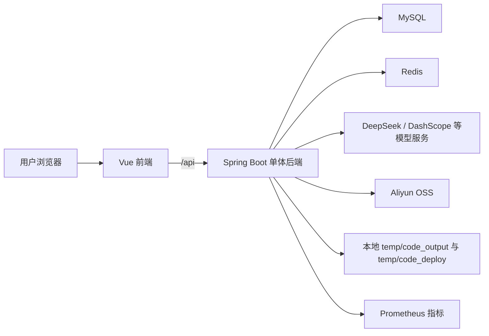
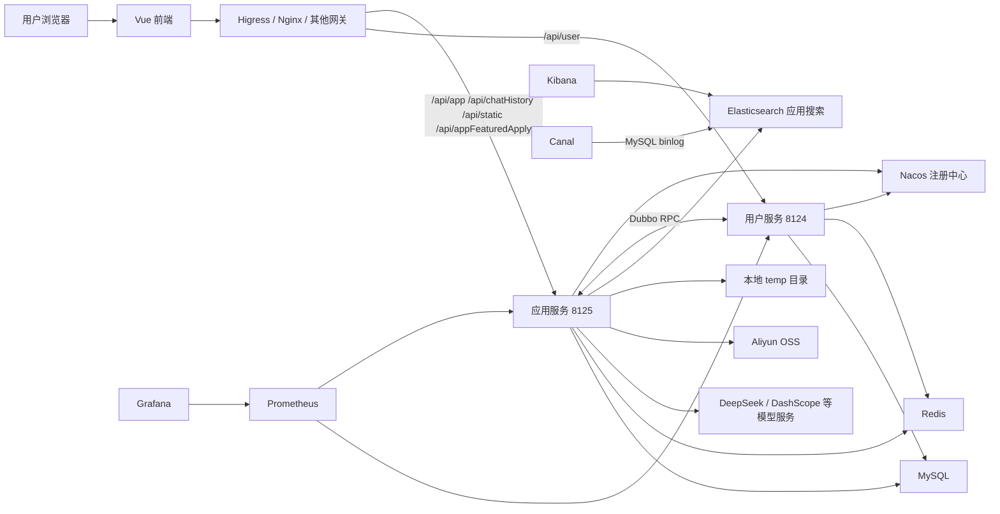
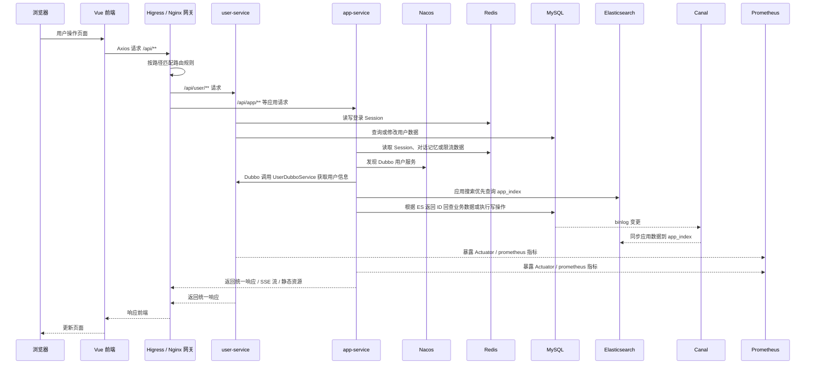
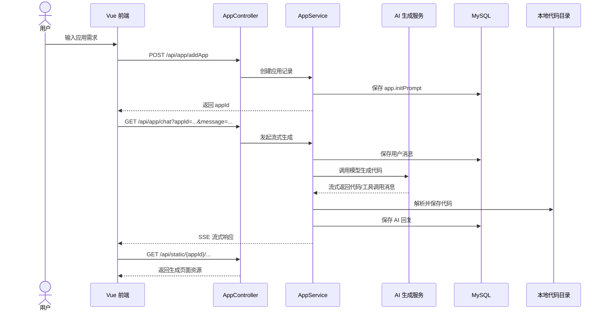
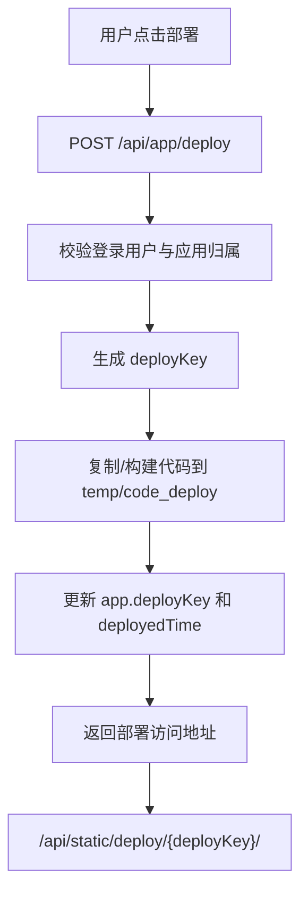
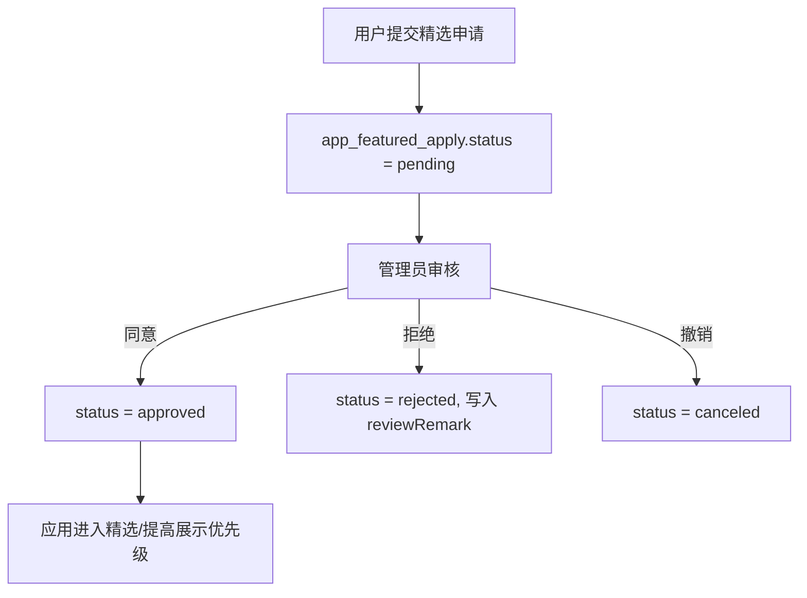

# AI 零代码生成平台

> 基于大模型的零代码应用生成平台。用户输入自然语言需求后，系统可以自动生成 HTML、多文件原生前端或 Vue 工程代码，并提供实时对话、在线预览、应用部署、源码下载、精选应用展示和后台审核管理能力。

本仓库同时包含两套后端形态：

- **单体项目**：`backend`，适合本地开发、课程演示、快速部署和功能验证。
- **微服务项目**：`backend/ai-zero-code-platform-microservice`，由公共模块、用户服务、应用服务组成，适合服务拆分、网关路由、Dubbo RPC 和 Nacos 注册中心场景。

前端项目位于 `frontend`，基于 Vue 3 + Vite + Ant Design Vue 构建，单体和微服务后端都可以复用同一套前端。

---

## 目录

- [项目简介](#项目简介)
- [核心能力](#核心能力)
- [技术栈](#技术栈)
- [项目结构](#项目结构)
- [整体架构](#整体架构)
- [单体后端说明](#单体后端说明)
- [微服务后端说明](#微服务后端说明)
- [前端说明](#前端说明)
- [数据库设计](#数据库设计)
- [核心业务流程](#核心业务流程)
- [接口概览](#接口概览)
- [本地运行指南](#本地运行指南)
- [配置说明](#配置说明)
- [构建与测试](#构建与测试)
- [部署建议](#部署建议)
- [常见问题](#常见问题)
- [后续优化方向](#后续优化方向)

---

## 项目简介

AI 零代码生成平台面向“不会写代码或想快速搭建页面/应用”的用户，提供从需求描述到可运行前端项目的自动化生成链路。

用户可以在首页输入应用需求，系统会创建应用记录并进入生成对话页。后端根据提示词自动选择或执行指定代码生成模式，调用大模型流式生成代码，将代码解析、保存到本地临时目录，并通过静态资源接口提供在线预览。生成结果可以继续通过对话迭代修改，应用可以部署、取消部署、下载源码，也可以提交精选申请，由管理员审核后展示到精选列表。

项目覆盖了一个完整 AI 应用平台常见的工程能力：

- 用户注册、登录、会话保持、权限控制。
- AI 代码生成、流式输出、上下文记忆、工具调用。
- 代码解析、代码落盘、在线预览、部署访问、压缩下载。
- 应用管理、精选申请、后台审核。
- Redis Session、限流、监控指标、Prometheus 暴露。
- 单体架构到微服务架构的拆分实践。

---

## 核心能力

### 用户侧

- 用户注册、登录、退出登录。
- 获取当前登录用户信息。
- 创建 AI 应用。
- 与 AI 多轮对话生成或修改应用代码。
- 实时查看 AI 流式响应。
- 在线预览生成页面。
- 部署生成应用，获得固定部署访问地址。
- 取消部署。
- 下载生成源码压缩包。
- 修改应用基础信息。
- 删除自己的应用。
- 提交应用精选申请。
- 查看自己的精选申请记录。

### 管理侧

- 用户分页查询、创建、修改、删除。
- 应用分页查询、详情查看、修改、删除。
- 应用置顶、取消置顶。
- 精选申请分页查询。
- 同意精选申请。
- 拒绝精选申请。
- 撤销精选状态。

### AI 生成侧

- 支持多种生成模式：
  - `html`：原生 HTML 单文件模式。
  - `multi_file`：原生多文件模式。
  - `vue_project`：Vue 工程模式。
- 支持普通模型、流式模型、推理流式模型、路由模型。
- 支持基于历史对话的上下文生成。
- 支持 Prompt 安全输入护栏。
- 支持输出重试护栏。
- 支持 LangGraph4j 工作流。
- 支持并发图片素材收集节点。
- 支持代码质量检查节点。
- 支持工具调用消息展示，例如文件读取、写入、修改、删除和退出。
- 支持 AI 模型调用指标采集。

---

## 技术栈

### 前端

| 技术 | 说明 |
| --- | --- |
| Vue 3 | 前端框架 |
| Vite 7 | 开发服务器与构建工具 |
| TypeScript | 类型约束 |
| Vue Router | 前端路由 |
| Pinia | 全局状态管理 |
| Ant Design Vue | UI 组件库 |
| Axios | HTTP 请求 |
| @umijs/openapi | 根据 OpenAPI 文档生成接口代码 |
| ESLint + Prettier | 代码规范与格式化 |

### 单体后端

| 技术 | 说明 |
| --- | --- |
| Java 21 | 后端运行环境 |
| Spring Boot 3.5.8 | 后端基础框架 |
| Spring MVC | REST API |
| Spring AOP | 权限校验、限流切面等 |
| Spring Session Data Redis | 分布式 Session |
| MySQL | 业务数据存储 |
| MyBatis-Flex | ORM 与代码生成 |
| HikariCP | 数据库连接池 |
| Redis | Session、对话记忆、限流等 |
| Redisson | 分布式限流实现 |
| Knife4j / springdoc-openapi | 接口文档 |
| LangChain4j | 大模型接入与 AI Service |
| LangGraph4j | AI 工作流编排 |
| DashScope SDK | 阿里云模型/图片生成接入 |
| Aliyun OSS SDK | 截图/静态资源对象存储 |
| Caffeine | 本地缓存 |
| Actuator + Micrometer + Prometheus | 监控指标 |

### 微服务后端

| 技术 | 说明 |
| --- | --- |
| Spring Boot 3.5.8 | 每个服务独立启动 |
| Dubbo 3.3.4 | 服务间 RPC |
| Nacos | Dubbo 注册中心 |
| Higress Ingress | 网关路由示例 |
| Elasticsearch 7.17.29 | 微服务应用搜索、过滤、排序和分页 |
| Kibana | ES 索引调试、Mapping 管理和数据查看 |
| Canal | 同步 MySQL 应用数据到 Elasticsearch |
| Prometheus + Grafana | 微服务监控指标采集和可视化 |
| ai-zero-code-platform-common | 公共模型、DTO、VO、异常、响应、RPC 契约 |
| ai-zero-code-platform-user-service | 用户服务 |
| ai-zero-code-platform-app-service | 应用、对话、精选、AI 代码生成服务 |

---

## 项目结构

```text
ai_zero_code_platform
├── README.md
├── README.en.md
├── LICENSE
├── AI零代码生成平台-笔记.md
├── backend
│   ├── pom.xml
│   ├── src
│   │   ├── main
│   │   │   ├── java/com/lk/aizerocodeplatform
│   │   │   │   ├── BackendApplication.java
│   │   │   │   ├── ai                 # AI Service、模型路由、工具调用、护栏
│   │   │   │   ├── annotation         # 权限注解
│   │   │   │   ├── aop                # 登录/权限/限流相关切面或拦截器
│   │   │   │   ├── common             # 通用响应、分页、删除请求
│   │   │   │   ├── config             # CORS、Redis、模型、OSS、JSON 等配置
│   │   │   │   ├── constant           # 用户、应用、文件保存等常量
│   │   │   │   ├── controller         # HTTP 接口
│   │   │   │   ├── core               # AI 代码生成门面、工程构建、流处理器
│   │   │   │   ├── enums              # 代码生成类型、消息类型
│   │   │   │   ├── exception          # 业务异常与全局异常处理
│   │   │   │   ├── generate           # MyBatis-Flex 代码生成器
│   │   │   │   ├── langgraph4j        # LangGraph4j 工作流、节点、状态、工具
│   │   │   │   ├── mapper             # MyBatis-Flex Mapper
│   │   │   │   ├── model              # Entity、DTO、VO
│   │   │   │   ├── monitor            # AI 模型指标采集
│   │   │   │   ├── parser             # AI 输出代码解析器
│   │   │   │   ├── ratelimit          # 限流注解、切面、Redisson 配置
│   │   │   │   ├── saver              # 代码保存模板
│   │   │   │   ├── service            # 业务服务
│   │   │   │   ├── task               # 定时任务
│   │   │   │   └── tools              # 截图、Spring 上下文等工具
│   │   │   └── resources
│   │   │       ├── application.yaml
│   │   │       ├── application-local.yaml
│   │   │       ├── mapper
│   │   │       ├── prompts
│   │   │       └── sql/create_table.sql
│   │   └── test
│   └── ai-zero-code-platform-microservice
│       ├── pom.xml
│       ├── README.md
│       ├── higress
│       │   └── ai-zero-code-platform-routes.yaml
│       ├── ai-zero-code-platform-common
│       ├── ai-zero-code-platform-user-service
│       └── ai-zero-code-platform-app-service
└── frontend
    ├── package.json
    ├── vite.config.ts
    ├── openapi2ts.config.ts
    └── src
        ├── api          # OpenAPI 生成的接口请求
        ├── components   # 全局组件
        ├── config       # 菜单配置
        ├── layouts      # 基础布局
        ├── pages        # 页面
        ├── plugins      # Pinia 等插件
        ├── router       # 路由和权限守卫
        ├── stores       # 用户状态
        └── styles       # 全局样式
```

---

## 整体架构

### 单体架构



单体项目将用户、应用、对话、精选申请、AI 生成、静态资源预览等能力全部放在 `backend` 一个 Spring Boot 应用中，启动简单，适合开发调试。

### 微服务架构



微服务项目将公共类型、用户服务和应用服务拆开：

- 用户相关 HTTP 接口由 `ai-zero-code-platform-user-service` 提供。
- 应用、对话、精选、代码生成、静态预览由 `ai-zero-code-platform-app-service` 提供。
- 跨服务共享模型和 Dubbo 契约放在 `ai-zero-code-platform-common`。
- 应用服务需要用户信息时，通过 `UserDubboService` 调用用户服务。
- 用户服务需要应用信息时，可通过 `AppDubboService` 调用应用服务。
- 应用搜索优先走 Elasticsearch，ES 返回应用 ID 后再回查 MySQL 组装业务 VO；ES 不可用时应用服务会降级到原 MySQL 查询。
- Canal 监听 MySQL binlog，将应用表数据同步到 ES 的 `app_index` 索引，Kibana 用于索引创建、Mapping 调试和数据排查。

---

## 单体后端说明

单体项目目录：`backend`

### 启动类

```text
backend/src/main/java/com/lk/aizerocodeplatform/BackendApplication.java
```

### 默认服务信息

| 项 | 值 |
| --- | --- |
| 应用名 | `ai-zero-code-platform` |
| HTTP 端口 | `8123` |
| Context Path | `/api` |
| Knife4j | `http://localhost:8123/api/doc.html` |
| Swagger UI | `http://localhost:8123/api/swagger-ui.html` |
| OpenAPI JSON | `http://localhost:8123/api/v3/api-docs` |
| Actuator Health | `http://localhost:8123/api/actuator/health` |
| Prometheus | `http://localhost:8123/api/actuator/prometheus` |

### 主要职责

- 用户模块：注册、登录、退出、当前用户、用户管理。
- 应用模块：创建应用、更新应用、删除应用、分页查询、详情查询、置顶、部署、取消部署、源码下载。
- 对话模块：分页查看对话历史。
- 精选模块：提交精选申请、修改申请、取消申请、重新申请、管理员审核。
- 静态资源模块：预览生成代码、访问已部署应用。
- AI 生成模块：接入模型、路由生成类型、流式代码生成、解析和保存生成代码。
- 安全与治理：登录态、管理员鉴权、Redis Session、限流、Prompt 护栏。
- 可观测性：Actuator、Prometheus、AI 模型指标采集。

### 关键目录说明

| 目录 | 说明 |
| --- | --- |
| `controller` | HTTP API 入口 |
| `service` | 业务逻辑 |
| `mapper` | MyBatis-Flex 数据访问 |
| `model/entity` | 数据库实体 |
| `model/dto` | 请求参数对象 |
| `model/vo` | 返回给前端的视图对象 |
| `ai` | LangChain4j AI Service、模型工厂、生成类型路由、工具调用 |
| `core` | AI 生成门面、Vue 工程构建、流处理 |
| `parser` | 将 AI 输出解析为 HTML、多文件或 Vue 工程代码 |
| `saver` | 将解析后的代码保存到本地目录 |
| `langgraph4j` | 工作流编排、节点、状态和素材工具 |
| `ratelimit` | 限流注解、切面和 Redisson 配置 |
| `monitor` | AI 模型调用指标 |
| `task` | 临时文件清理等定时任务 |
| `resources/prompts` | 代码生成相关 Prompt |
| `resources/sql/create_table.sql` | 初始化数据库脚本 |

---

## 微服务后端说明

微服务项目目录：`backend/ai-zero-code-platform-microservice`

### 模块划分

| 模块 | 类型 | 职责 |
| --- | --- | --- |
| `ai-zero-code-platform-common` | 普通 Maven 模块 | 公共响应、异常、注解、常量、枚举、Entity、DTO、VO、Dubbo RPC 接口 |
| `ai-zero-code-platform-user-service` | Spring Boot 服务 | 用户注册登录、用户管理、用户信息 RPC Provider |
| `ai-zero-code-platform-app-service` | Spring Boot 服务 | 应用管理、对话历史、精选申请、代码生成、静态资源、ES 应用搜索、应用信息 RPC Provider |
| `higress` | 网关配置示例 | 将外部 `/api/**` 请求路由到不同微服务 |

### 服务端口

| 服务 | HTTP 端口 | Context Path | Dubbo 端口 |
| --- | --- | --- | --- |
| 用户服务 | `8124` | `/api` | `20881` |
| 应用服务 | `8125` | `/api` | `20882` |

### 注册中心

Dubbo 注册中心使用 Nacos：

```yaml
dubbo:
  registry:
    address: nacos://${NACOS_SERVER_ADDR:127.0.0.1:8848}
```

如果没有设置环境变量，默认连接 `127.0.0.1:8848`。

### 基础设施与数据同步

微服务模式下，业务服务启动前建议先准备好下面的第三方服务：

| 服务 | 默认地址 / 端口 | 作用 |
| --- | --- | --- |
| MySQL | `127.0.0.1:3306` | 业务主库，保存用户、应用、对话和精选申请等数据 |
| Redis | `127.0.0.1:6379` | Spring Session、AI 对话记忆、限流 |
| Nacos | `127.0.0.1:8848` | Dubbo 注册中心，用户服务和应用服务都需要注册到这里 |
| Higress / Nginx | 建议统一暴露 `8080` | 将前端 `/api/**` 请求路由到不同微服务 |
| Prometheus | `9090` | 抓取用户服务和应用服务的 Actuator 指标 |
| Grafana | `3000` | 展示 Prometheus 采集到的服务监控面板 |
| Elasticsearch | `127.0.0.1:9200` | 承载应用搜索索引，应用服务优先通过 ES 查询应用 ID |
| Kibana | `5601` | 创建和调试 ES 索引、Mapping、查询语句 |
| Canal | 按本地配置 | 监听 MySQL binlog，将应用数据同步到 ES 的 `app_index` |

应用服务中的 ES 配置位于：

```text
backend/ai-zero-code-platform-microservice/ai-zero-code-platform-app-service/src/main/resources/application-local.yaml
```

默认配置项：

```yaml
elasticsearch:
  host: 127.0.0.1
  port: 9200
  scheme: http
```

`app_index` 的索引名需要和 Kibana 中创建的索引、Canal Adapter 写入的索引保持一致。MySQL 仍然是业务主库，ES 只负责搜索、过滤、排序和分页。

### 服务职责边界

#### common 模块

`ai-zero-code-platform-common` 只承载跨服务共享内容：

- `common`：统一响应、分页请求、删除请求。
- `exception`：异常码、业务异常、全局异常处理。
- `annotation`：权限注解。
- `constant`：用户、应用、精选申请、代码文件保存常量。
- `enums`：代码生成类型、聊天消息类型。
- `model/entity`：数据库实体。
- `model/dto`：接口请求对象。
- `model/vo`：前端视图对象。
- `rpc`：Dubbo 服务接口契约。

#### user-service

用户服务保留：

- `UserController`
- `UserService`
- `UserServiceImpl`
- `UserMapper`
- `UserDubboServiceImpl`
- 用户登录态、权限拦截和用户 Session 相关逻辑

用户服务不包含应用、对话、代码生成、精选申请等业务实现。

#### app-service

应用服务保留：

- `AppController`
- `ChatHistoryController`
- `AppFeaturedApplyController`
- `StaticResourceController`
- 应用、对话、精选申请 Mapper 和 Service
- AI 代码生成、模型工厂、生成模式路由
- LangGraph4j 工作流
- 静态资源预览和部署访问
- OSS 上传、源码下载
- ES 应用搜索：`AppEsSearchService` 负责从 `app_index` 搜索应用 ID，再由应用服务回查 MySQL 组装完整数据
- `AppDubboServiceImpl`
- `UserDubboAdapterServiceImpl`

应用服务不再包含用户 Controller、用户 Mapper 和用户业务实现。需要读取当前用户或用户详情时，通过 `UserDubboService` 访问用户服务。

### Higress 路由

示例配置位于：

```text
backend/ai-zero-code-platform-microservice/higress/ai-zero-code-platform-routes.yaml
```

路由关系：

| 外部路径 | 目标服务 |
| --- | --- |
| `/api/user/**` | `ai-zero-code-platform-user-service:8124` |
| `/api/app/**` | `ai-zero-code-platform-app-service:8125` |
| `/api/appFeaturedApply/**` | `ai-zero-code-platform-app-service:8125` |
| `/api/chatHistory/**` | `ai-zero-code-platform-app-service:8125` |
| `/api/static/**` | `ai-zero-code-platform-app-service:8125` |

通过网关暴露后，前端仍然只需要请求 `/api/**`，不需要感知后端服务拆分。

### 微服务请求链路

一个前端请求在微服务模式下的大致流转过程如下：



按请求类型可以理解为：

- 用户登录、注册、当前用户、用户管理等 `/api/user/**` 请求由网关转发到用户服务。
- 应用创建、应用列表、精选申请、对话历史、AI 生成和静态预览等请求由网关转发到应用服务。
- 应用服务需要当前用户或用户详情时，不直接访问用户表，而是通过 Dubbo 从 Nacos 发现并调用用户服务。
- 应用列表和精选应用查询优先使用 ES 做全文检索、过滤、排序和分页；ES 返回应用 ID 后，应用服务再从 MySQL 读取完整应用数据并封装成前端 VO。
- 应用新增、修改、删除等写操作以 MySQL 为准，Canal 监听 MySQL binlog 后同步到 ES，保证搜索索引最终一致。
- Prometheus 定时抓取两个微服务暴露的指标，Grafana 负责展示监控面板，不参与业务请求主链路。

---

## 前端说明

前端目录：`frontend`

### 页面路由

| 路由 | 页面 | 权限 |
| --- | --- | --- |
| `/` | 首页 / 应用广场 / 创建应用入口 | 公开 |
| `/user/login` | 用户登录 | 公开 |
| `/user/register` | 用户注册 | 公开 |
| `/app/chat/:id` | 应用生成对话页 | 登录用户 |
| `/app/detail/:id` | 应用详情页 | 公开 |
| `/app/edit/:id` | 应用信息编辑页 | 登录用户 |
| `/app/featured/apply` | 精选申请页 | 登录用户 |
| `/admin/userManage` | 用户管理 | 管理员 |
| `/admin/appManage` | 应用管理 | 管理员 |
| `/admin/appFeaturedApplyManage` | 精选申请审核 | 管理员 |

### 请求封装

前端请求入口：

```text
frontend/src/request.ts
```

默认配置：

- `baseURL: /api`
- `timeout: 60000`
- `withCredentials: true`

响应拦截器会处理后端 `40100` 未登录状态，并跳转到登录页。

### 开发代理

当前 `frontend/vite.config.ts` 中代理配置为：

```ts
server: {
  proxy: {
    '/api': {
      target: 'http://localhost:8080',
      changeOrigin: true,
    },
  },
}
```

如果直接启动单体后端默认端口 `8123`，需要将 `target` 改为 `http://localhost:8123`；或者启动后端时覆盖端口为 `8080`。

如果通过 Higress、Nginx 或本地网关统一暴露 `8080`，则可以保持当前配置。

### OpenAPI 接口生成

配置文件：

```text
frontend/openapi2ts.config.ts
```

脚本：

```bash
npm run openapi2ts
```

当前 `schemaPath` 指向 `http://localhost:8080/api/v3/api-docs`。如果直接访问单体后端默认端口，可调整为：

```text
http://localhost:8123/api/v3/api-docs
```

如果访问微服务，需要分别从用户服务和应用服务获取 OpenAPI，或通过网关聚合后再生成。

---

## 数据库设计

初始化脚本：

```text
backend/src/main/resources/sql/create_table.sql
backend/ai-zero-code-platform-microservice/ai-zero-code-platform-user-service/src/main/resources/sql/create_table.sql
backend/ai-zero-code-platform-microservice/ai-zero-code-platform-app-service/src/main/resources/sql/create_table.sql
```

默认数据库名：

```sql
ai_zero_code_platform
```

### user 表

用户表，存储账号、密码、昵称、头像、简介和角色。

| 字段 | 类型 | 说明 |
| --- | --- | --- |
| `id` | bigint | 主键 |
| `userAccount` | varchar(256) | 账号，唯一索引 |
| `userPassword` | varchar(512) | 加密后的密码 |
| `userName` | varchar(256) | 用户昵称 |
| `userAvatar` | varchar(1024) | 用户头像 |
| `userProfile` | varchar(512) | 用户简介 |
| `userRole` | varchar(256) | 用户角色，默认 `user`，管理员为 `admin` |
| `editTime` | datetime | 编辑时间 |
| `createTime` | datetime | 创建时间 |
| `updateTime` | datetime | 更新时间 |
| `isDelete` | tinyint | 逻辑删除标记 |

索引：

- `uk_userAccount`
- `idx_userName`

### app 表

应用表，记录用户创建的 AI 应用。

| 字段 | 类型 | 说明 |
| --- | --- | --- |
| `id` | bigint | 主键 |
| `appName` | varchar(256) | 应用名称 |
| `cover` | varchar(512) | 应用封面 |
| `initPrompt` | text | 初始化 Prompt |
| `codeGenType` | varchar(64) | 代码生成类型 |
| `deployKey` | varchar(64) | 部署标识 |
| `deployedTime` | datetime | 部署时间 |
| `priority` | int | 优先级，用于置顶/精选排序 |
| `userId` | bigint | 创建用户 ID |
| `editTime` | datetime | 编辑时间 |
| `createTime` | datetime | 创建时间 |
| `updateTime` | datetime | 更新时间 |
| `isDelete` | tinyint | 逻辑删除标记 |

索引：

- `uk_deployKey`
- `idx_appName`
- `idx_userId`

### app_featured_apply 表

应用精选申请表。

| 字段 | 类型 | 说明 |
| --- | --- | --- |
| `id` | bigint | 主键 |
| `appId` | bigint | 应用 ID |
| `userId` | bigint | 申请人 ID |
| `applyReason` | varchar(1024) | 申请理由 |
| `status` | varchar(32) | 申请状态 |
| `reviewRemark` | varchar(1024) | 审核备注或拒绝原因 |
| `reviewUserId` | bigint | 审核管理员 ID |
| `reviewTime` | datetime | 审核时间 |
| `createTime` | datetime | 创建时间 |
| `updateTime` | datetime | 更新时间 |
| `isDelete` | tinyint | 逻辑删除标记 |

状态值：

- `pending`：待审核
- `approved`：已通过
- `rejected`：已拒绝
- `canceled`：已撤销

索引：

- `idx_appId`
- `idx_userId`
- `idx_status`
- `idx_reviewUserId`
- `idx_createTime`

### chat_history 表

对话历史表，记录用户与 AI 的消息。

| 字段 | 类型 | 说明 |
| --- | --- | --- |
| `id` | bigint | 主键 |
| `message` | longtext | 消息内容 |
| `messageType` | varchar(32) | 消息类型，`user` 或 `ai` |
| `appId` | bigint | 应用 ID |
| `userId` | bigint | 用户 ID |
| `createTime` | datetime | 创建时间 |
| `updateTime` | datetime | 更新时间 |
| `isDelete` | tinyint | 逻辑删除标记 |

索引：

- `idx_appId`
- `idx_createTime`
- `idx_appId_createTime`

---

## 核心业务流程

### 创建并生成应用



### 应用部署



### 精选申请审核



---

## 接口概览

所有接口统一使用 `/api` 作为上下文路径。

### 用户接口

| 方法 | 路径 | 说明 |
| --- | --- | --- |
| POST | `/api/user/register` | 用户注册 |
| POST | `/api/user/login` | 用户登录 |
| GET | `/api/user/getCurrentUser` | 获取当前登录用户 |
| GET | `/api/user/logout` | 退出登录 |
| POST | `/api/user/save` | 管理员新增用户 |
| POST | `/api/user/update` | 更新用户 |
| POST | `/api/user/delete` | 删除用户 |
| POST | `/api/user/page` | 分页查询用户 |
| GET | `/api/user/get` | 获取用户实体 |
| GET | `/api/user/get/vo` | 获取用户 VO |

### 应用接口

| 方法 | 路径 | 说明 |
| --- | --- | --- |
| POST | `/api/app/addApp` | 创建应用 |
| POST | `/api/app/updateApp` | 更新应用 |
| POST | `/api/app/deleteApp` | 删除应用 |
| GET | `/api/app/getAppById` | 根据 ID 获取应用 |
| POST | `/api/app/getAppVoListByPage` | 分页查询应用 |
| POST | `/api/app/getAppVoListByPageForGood` | 分页查询精选/优质应用 |
| GET | `/api/app/chat` | SSE 流式代码生成对话 |
| POST | `/api/app/deploy` | 部署应用 |
| GET | `/api/app/cancelDeploy` | 取消部署 |
| GET | `/api/app/downloadCode` | 下载源码压缩包 |
| GET | `/api/app/toTop` | 置顶应用 |
| GET | `/api/app/cancelTop` | 取消置顶 |
| POST | `/api/app/admin/delete` | 管理员删除应用 |
| POST | `/api/app/admin/update` | 管理员更新应用 |
| POST | `/api/app/admin/pageQuery` | 管理员分页查询应用 |
| POST | `/api/app/admin/getApp` | 管理员获取应用详情 |

### 对话历史接口

| 方法 | 路径 | 说明 |
| --- | --- | --- |
| POST | `/api/chatHistory/pageQuery` | 分页查询指定应用的对话历史 |

### 精选申请接口

| 方法 | 路径 | 说明 |
| --- | --- | --- |
| POST | `/api/appFeaturedApply/add` | 提交精选申请 |
| POST | `/api/appFeaturedApply/delete` | 删除精选申请 |
| POST | `/api/appFeaturedApply/update` | 更新精选申请 |
| POST | `/api/appFeaturedApply/pageQuery` | 用户分页查询精选申请 |
| POST | `/api/appFeaturedApply/reAdd` | 重新提交精选申请 |
| POST | `/api/appFeaturedApply/admin/agreeApply` | 管理员同意申请 |
| POST | `/api/appFeaturedApply/admin/disagreeApply` | 管理员拒绝申请 |
| POST | `/api/appFeaturedApply/admin/cancelApply` | 管理员撤销申请 |
| POST | `/api/appFeaturedApply/admin/pageQueryApply` | 管理员分页查询申请 |

### 静态资源接口

| 方法 | 路径 | 说明 |
| --- | --- | --- |
| GET | `/api/static/{appId}/**` | 预览某个应用生成的静态资源 |
| GET | `/api/static/deploy/{deployKey}/**` | 访问已部署应用 |

---

## 本地运行指南

### 环境要求

| 环境 | 建议版本 |
| --- | --- |
| JDK | 21 |
| Maven | 3.9+ |
| Node.js | 22+ |
| npm | 10+ |
| MySQL | 8.x |
| Redis | 6.x/7.x |
| Nacos | 2.x，微服务模式需要 |
| Higress / Nginx | 微服务统一网关入口 |
| Prometheus | 微服务监控采集 |
| Grafana | 微服务监控展示 |
| Elasticsearch | 7.17.x，微服务应用搜索需要 |
| Kibana | 与 Elasticsearch 版本保持一致 |
| Canal | 用于 MySQL 到 Elasticsearch 数据同步 |

### 初始化数据库

1. 创建 MySQL 数据库并执行脚本：

```bash
mysql -u root -p < backend/src/main/resources/sql/create_table.sql
```

2. 确认数据库名为：

```text
ai_zero_code_platform
```

3. 如需管理员账号，可以先注册普通用户，再在数据库中将该用户角色改为 `admin`：

```sql
update user set userRole = 'admin' where userAccount = '你的账号';
```

### 启动 Redis

本地默认配置：

```text
host: localhost
port: 6379
database: 0
```

Redis 用于：

- Spring Session 登录态保存。
- AI 对话记忆。
- Redisson 限流。

### 启动单体后端

进入单体后端目录：

```bash
cd backend
```

根据本地环境修改：

```text
src/main/resources/application-local.yaml
```

至少需要配置：

- MySQL 地址、账号、密码。
- Redis 地址、端口、密码。
- DeepSeek / OpenAI 兼容模型 Key。
- DashScope Key。
- Aliyun OSS 配置。
- Pexels API Key。

启动：

```bash
mvn spring-boot:run
```

默认访问：

```text
http://localhost:8123/api
```

如果要兼容前端当前 `vite.config.ts` 里的 `localhost:8080` 代理，可以用下面方式覆盖端口：

```bash
mvn spring-boot:run -Dspring-boot.run.arguments="--server.port=8080"
```

### 启动微服务后端

进入微服务目录：

```bash
cd backend/ai-zero-code-platform-microservice
```

微服务模式建议按下面顺序启动。

1. 启动基础存储服务：MySQL 和 Redis。

MySQL 用于保存业务数据，Redis 用于保存登录态、AI 对话记忆和限流数据。启动后先执行数据库初始化脚本，并确认两个微服务的 `application-local.yaml` 都能连接到同一套 MySQL 和 Redis。

2. 启动注册中心 Nacos，并确保地址可访问：

```text
127.0.0.1:8848
```

如果 Nacos 不在本地，可以设置环境变量。

Windows PowerShell：

```powershell
$env:NACOS_SERVER_ADDR="你的Nacos地址:8848"
```

Windows CMD：

```bash
set NACOS_SERVER_ADDR=你的Nacos地址:8848
```

Linux / macOS：

```bash
export NACOS_SERVER_ADDR=你的Nacos地址:8848
```

3. 启动 Elasticsearch 和 Kibana。

应用服务默认连接本地 ES：

```text
http://127.0.0.1:9200
```

Kibana 默认访问地址通常为：

```text
http://127.0.0.1:5601
```

需要在 ES 中准备应用索引 `app_index`，并保证索引名和应用服务、Canal Adapter 配置一致。ES 未启动时，应用服务的应用列表查询会降级到 MySQL，但搜索体验和数据同步链路无法验证。

4. 启动 Canal。

Canal 负责监听 MySQL binlog，并将应用表数据同步到 Elasticsearch 的 `app_index`。启动前需要确认：

- MySQL 已开启 binlog。
- Canal 连接的 MySQL 账号具备复制权限。
- Canal Adapter 写入的 ES 地址、索引名和 Mapping 与 `app_index` 一致。

5. 启动 Prometheus 和 Grafana。

Prometheus 需要抓取两个微服务的指标端点：

```text
http://localhost:8124/api/actuator/prometheus
http://localhost:8125/api/actuator/prometheus
```

Grafana 连接 Prometheus 数据源后即可配置或导入监控面板。

6. 启动网关 Higress / Nginx。

网关负责把前端统一的 `/api/**` 请求路由到用户服务或应用服务。Higress 示例配置位于：

```text
backend/ai-zero-code-platform-microservice/higress/ai-zero-code-platform-routes.yaml
```

建议统一对外暴露：

```text
http://localhost:8080/api
```

7. 启动用户服务：

```bash
mvn -pl ai-zero-code-platform-user-service spring-boot:run
```

8. 启动应用服务：

```bash
mvn -pl ai-zero-code-platform-app-service spring-boot:run
```

本地服务地址：

```text
用户服务: http://localhost:8124/api
应用服务: http://localhost:8125/api
```

如果通过 Higress 或 Nginx 暴露统一入口，建议对外仍保持：

```text
http://localhost:8080/api
```

这样前端无需改动。

### 启动前端

进入前端目录：

```bash
cd frontend
```

安装依赖：

```bash
npm install
```

启动开发服务器：

```bash
npm run dev
```

默认访问：

```text
http://localhost:5173
```

如果前端请求后端失败，优先检查：

- `frontend/vite.config.ts` 中 `/api` 代理目标是否正确。
- 后端是否启动。
- 后端端口是否和代理目标一致。
- 浏览器请求是否携带 Cookie。
- Redis 是否可用，Session 是否能保存。

---

## 配置说明

### 后端通用配置

主配置：

```text
backend/src/main/resources/application.yaml
```

微服务配置：

```text
backend/ai-zero-code-platform-microservice/ai-zero-code-platform-user-service/src/main/resources/application.yaml
backend/ai-zero-code-platform-microservice/ai-zero-code-platform-app-service/src/main/resources/application.yaml
```

主要配置项：

| 配置 | 说明 |
| --- | --- |
| `server.port` | 服务端口 |
| `server.servlet.context-path` | API 前缀，当前为 `/api` |
| `spring.profiles.active` | 默认激活 `local` |
| `spring.session.store-type` | 使用 Redis 保存 Session |
| `springdoc.swagger-ui.path` | Swagger UI 地址 |
| `knife4j.enable` | 是否开启 Knife4j |
| `mybatis-flex.mapper-locations` | Mapper XML 路径 |
| `management.endpoints.web.exposure.include` | 暴露 health、info、prometheus |

### 本地敏感配置

本地配置文件：

```text
backend/src/main/resources/application-local.yaml
backend/ai-zero-code-platform-microservice/ai-zero-code-platform-user-service/src/main/resources/application-local.yaml
backend/ai-zero-code-platform-microservice/ai-zero-code-platform-app-service/src/main/resources/application-local.yaml
```

这些文件包含本地运行所需配置。真实项目中建议使用环境变量、配置中心或密钥管理服务，不要提交真实密钥。

建议关注以下配置：

| 配置 | 说明 |
| --- | --- |
| `spring.datasource.url` | MySQL JDBC 地址 |
| `spring.datasource.username` | MySQL 用户名 |
| `spring.datasource.password` | MySQL 密码 |
| `spring.data.redis.host` | Redis 地址 |
| `spring.data.redis.port` | Redis 端口 |
| `langchain4j.open-ai.chat-model` | 普通聊天模型 |
| `langchain4j.open-ai.streaming-chat-model` | 流式聊天模型 |
| `langchain4j.open-ai.reasoning-stream-chat-model` | 推理流式模型 |
| `langchain4j.open-ai.routing-chat-model` | 生成类型路由模型 |
| `aliyun.oss` | OSS 截图和资源上传配置 |
| `pexels.api-key` | 图片搜索 API Key |
| `dashscope.api-key` | DashScope API Key |

### 代码输出目录

后端会在运行目录下创建临时代码目录：

```text
temp/code_output
temp/code_deploy
```

含义：

- `temp/code_output`：保存正在生成或预览的应用代码。
- `temp/code_deploy`：保存已部署应用代码。

源码下载、静态预览和部署访问都依赖这些目录。

### AI 生成类型

枚举：

```text
CodeGenTypeEnum
```

取值：

| 值 | 说明 |
| --- | --- |
| `html` | 原生 HTML 单文件模式 |
| `multi_file` | 原生多文件模式 |
| `vue_project` | Vue 工程模式 |

### 用户角色

用户角色常量：

| 值 | 说明 |
| --- | --- |
| `user` | 普通用户 |
| `admin` | 管理员 |

---

## 构建与测试

### 单体后端构建

```bash
cd backend
mvn clean package
```

跳过测试：

```bash
mvn clean package -DskipTests
```

运行测试：

```bash
mvn test
```

### 微服务后端构建

```bash
cd backend/ai-zero-code-platform-microservice
mvn clean package
```

只构建公共模块和用户服务：

```bash
mvn clean package -pl ai-zero-code-platform-user-service -am
```

只构建公共模块和应用服务：

```bash
mvn clean package -pl ai-zero-code-platform-app-service -am
```

### 前端构建

```bash
cd frontend
npm run build
```

类型检查：

```bash
npm run type-check
```

代码格式化：

```bash
npm run format
```

代码检查并自动修复：

```bash
npm run lint
```

---

## 部署建议

### 单体部署

适合小规模部署或演示环境。

推荐拓扑：

```text
Nginx
├── /              -> frontend dist
└── /api/**        -> Spring Boot 单体服务 8123
```

部署步骤：

1. 构建前端：

```bash
cd frontend
npm run build
```

2. 构建后端：

```bash
cd backend
mvn clean package -DskipTests
```

3. 启动后端 Jar：

```bash
java -jar target/ai-zero-code-platform-0.0.1-SNAPSHOT.jar --spring.profiles.active=local
```

4. Nginx 托管前端 `dist`，并将 `/api` 反向代理到后端。

### 微服务部署

适合服务拆分、独立伸缩、网关统一入口场景。

推荐拓扑：

```text
Higress / Nginx / Kubernetes Ingress
├── /api/user/**              -> user-service
├── /api/app/**               -> app-service
├── /api/appFeaturedApply/**  -> app-service
├── /api/chatHistory/**       -> app-service
└── /api/static/**            -> app-service
```

部署注意事项：

- 先部署 MySQL、Redis、Nacos、Elasticsearch、Kibana、Canal、Prometheus、Grafana 等基础服务。
- 确保 Canal 能从 MySQL binlog 同步应用数据到 ES 的 `app_index`。
- 再部署 Higress / Nginx 网关，并按路径转发到不同微服务。
- 先启动 `user-service`，再启动 `app-service`。
- 确保两个服务都能访问同一个 Nacos 注册中心。
- 确保 `app-service` 能通过 Dubbo 调用用户服务。
- 确保 `app-service` 能访问 Elasticsearch；ES 异常时可以降级到 MySQL 查询，但搜索索引同步链路不可用。
- 确保 Prometheus 能抓取两个服务的 `/api/actuator/prometheus` 指标端点，Grafana 能连接 Prometheus 数据源。
- 如果应用服务多实例部署，`temp/code_output` 和 `temp/code_deploy` 需要改造为共享存储、对象存储或挂载持久卷，否则静态预览可能只在生成代码的那台实例上可用。
- Session 已存储在 Redis 中，天然支持多实例共享登录态。

### 静态资源和生成代码目录

当前实现依赖本地文件系统保存生成代码。生产环境建议：

- 使用对象存储保存生成结果。
- 或者将代码输出目录挂载为共享卷。
- 对部署目录做定期清理和容量监控。
- 对用户生成内容做安全扫描，避免恶意脚本风险。

### 安全建议

- 不要在仓库中提交真实 API Key、数据库密码和 OSS 密钥。
- 给模型 API Key 设置额度和 IP 白名单。
- 生产环境关闭模型请求/响应明文日志，或做好脱敏。
- 对 `/api/static/**` 返回内容设置合理的安全响应头。
- 对代码生成、部署、下载接口做频率限制。
- 对管理员接口保留严格鉴权。
- 定期轮换已经暴露过的密钥。

---

## 常见问题

### 1. 前端请求一直 404 或代理失败

检查 `frontend/vite.config.ts`：

```ts
target: 'http://localhost:8080'
```

如果后端是单体默认端口，应改为：

```ts
target: 'http://localhost:8123'
```

如果使用微服务，建议通过网关统一暴露到 `8080`，前端保持 `/api` 即可。

### 2. 登录后刷新又变成未登录

检查 Redis 是否启动，后端是否能连接 Redis。项目使用 Spring Session Data Redis 保存登录态，Redis 不可用会导致 Session 异常。

还需要确认前端 Axios 配置保留：

```ts
withCredentials: true
```

### 3. AI 生成接口没有响应或报错

检查：

- 模型 API Key 是否正确。
- `base-url` 是否可访问。
- 模型名称是否支持。
- 本地网络是否能访问模型服务。
- 账户额度是否足够。
- 后端日志中是否出现限流、超时或鉴权错误。

### 4. 预览页面无法访问

检查：

- `temp/code_output` 目录是否生成了对应应用代码。
- `/api/static/{appId}/**` 路径是否正确。
- 当前运行后端的工作目录是否和生成代码目录一致。
- 微服务多实例时，请求是否被路由到了没有该文件的实例。

### 5. 部署后访问失败

检查：

- `app.deployKey` 是否已生成。
- `temp/code_deploy` 中是否存在部署代码。
- 访问路径是否为 `/api/static/deploy/{deployKey}/`。
- 网关是否转发了 `/api/static/**` 到应用服务。

### 6. 微服务启动后 Dubbo 调用失败

检查：

- Nacos 是否启动。
- `NACOS_SERVER_ADDR` 是否正确。
- 用户服务和应用服务是否都注册成功。
- Dubbo 端口 `20881`、`20882` 是否被占用。
- common 模块版本是否一致。

### 7. OpenAPI 生成接口失败

检查 `frontend/openapi2ts.config.ts` 中的 `schemaPath` 是否和实际后端地址一致。

单体默认：

```text
http://localhost:8123/api/v3/api-docs
```

当前前端配置默认：

```text
http://localhost:8080/api/v3/api-docs
```

---

## 后续优化方向

- 将敏感配置迁移到环境变量、Nacos 配置中心或云厂商密钥管理服务。
- 将生成代码目录迁移到对象存储或共享文件系统，提升多实例部署能力。
- 增加 Docker Compose，一键启动 MySQL、Redis、Nacos、Higress、Prometheus、Grafana、Elasticsearch、Kibana、Canal、后端和前端。
- 增加网关鉴权、流量控制和灰度发布配置。
- 增加生成代码安全沙箱，隔离预览执行环境。
- 增加应用模板市场和模板复用能力。
- 增加用户配额、模型调用额度和成本统计。
- 增加更完整的单元测试、集成测试和端到端测试。
- 增加 CI/CD 流水线，自动构建、测试和部署。
- 增加多租户隔离能力。
- 增加对象存储 CDN 加速。
- 增加应用版本管理和回滚能力。
- 增加生成失败重试、任务队列和异步任务中心。
- 增加更细粒度的管理员审计日志。

---

## License

本项目使用 Apache License 2.0，详见 [LICENSE](LICENSE)。
